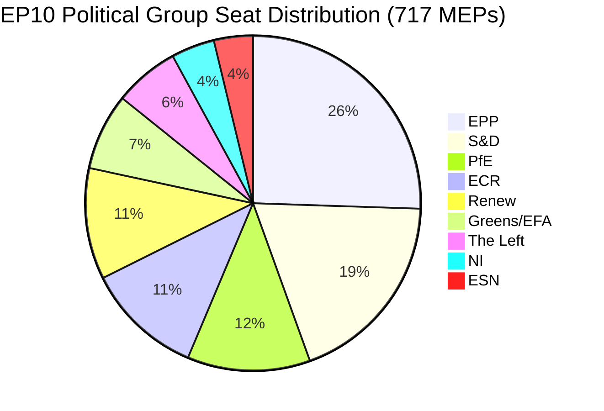

# Exekutiv sammanfattning: EU-parlamentets motioner — 11 maj 2026

<!-- SPDX-FileCopyrightText: 2024-2026 Hack23 AB -->
<!-- SPDX-License-Identifier: Apache-2.0 -->

**Artikeltyp:** motions | **Datum:** 2026-05-11 | **Datafönster:** 2026-05-04 till 2026-05-11
**WEP-konfidens:** Trolig (65–85 %) | **Admiralitetsgrad:** B2 (Tillförlitlig källa, troligen sant)

---

## 🎯 Rubrikbedömning

Europaparlamentets plenarsession i Strasbourg den 28–30 april 2026 levererade en tät lagstiftningsagenda som simultant avancerade tillämpningen av digitala rättigheter, bekräftade geopolitiska åtaganden gentemot Ukraina och Armenien, öppnade en finansplaneringsprocess inför 2027 och — i ett politiskt laddat sidoevenemang — såg den suveränistiska gruppen Patriots for Europe (PfE) kräva en formell debatt (regel 169) om påstått kommissionsinhysning i demokratiska processer. Tretton antagna texter och mer än nio stora debatter signalerar ett parlament som arbetar i hög lagstiftningstakt under fragmenterad koalitionsaritmetik som kräver ad hoc-majoritetskonstruktion för nästan varje ärendeakt.

**WEP-bedömning (Trolig, ~75 %):** Det EPP-förankrade centrum-högerblocket kommer att upprätthålla lagstiftningskontroll genom selektiv koalition med S&D i geopolitiska frågor och budgetfiler, medan PfE och ECR kommer att utnyttja procedurverktyg för att utmana kommissionens auktoritet i frågor om demokratiska processer under hela 2026.

**Admiralitetsgrad: B2** — Primärdata från EP:s öppna dataportal (tillförlitlig); individuella röstmarginaler ej tillgängliga på grund av EP:s publiceringsfördröjning.

---

## 📋 Viktiga beslut denna vecka

| Text | Ämne | Politisk signal |
|------|-------|-----------------|
| TA-10-2026-0163 | Straffrättsliga bestämmelser om nätmobbning/trakasserier online | Digital rättighetskoalition EPP+S&D+Renew |
| TA-10-2026-0161 | Rysslands ansvar / Ukraina-attacker | Tvärpolitisk konsensus; PfE isolerat |
| TA-10-2026-0162 | Demokratisk motståndskraft i Armenien | Östra grannprioritering |
| TA-10-2026-0160 | Tillämpning av lagen om digitala marknader | Bipartisan majoritet för teknikreglering |
| TA-10-2026-0157 | Hållbarhet i EU:s djursektor | CAP-koalition: EPP+S&D+ECR |
| TA-10-2026-0151 | Kris med människohandel i Haiti | Humanitär enhällighet |
| TA-10-2026-0112 | Riktlinjer för budgeten 2027 (avsnitt III) | Budgethökar mot investeringsblocket |
| TA-10-2026-0115 | Spårbarhet för hund- och kattens välfärd | Bred majoritet; ESN/PfE resistenta |
| TA-10-2026-0105 | Immunitetsupphävande — Patryk Jaki (ECR/Polen) | PRIV-kommitténs rekommendation upprätthållen |
| TA-10-2026-0142 | EU-Island PNR-dataavtal | Kontinuitet i säkerhetssamarbetet |
| TA-10-2026-0119 | Kontroll av EIB:s finansiella verksamhet | Ansvarsskyldighetsöversyn |
| TA-10-2026-0132 | Ansvarsfrihet 2024 — Regionkommittén | Budgetgranskning |
| TA-10-2026-0122 | Transparens för resultatbaserade instrument | Budgetintegritet |

---

## 🏛️ Koalitionsaritmetik (maj 2026)

**Majoritetströskel: 360 röster.** EPP+S&D:s bilaterala totalsum (319) faller 41 platser under en majoritet, vilket innebär att varje lagstiftningsutfall kräver en tredje eller fjärde koalitionspartner. Denna strukturella fragmentering — med fragmenteringsindex: HÖG, effektivt antal partier: 6,58 — är den definitiva begränsningen för EP10:s lagstiftningspolitik.

**Dominerande koalitioner denna plenarvecka:**
- **Digitala/rättighetsfrågor**: EPP + S&D + Renew (396 platser) — stabil majoritet
- **Geopolitik/Ukraina**: EPP + S&D + Renew + ECR (477 platser) — supermajoritet, PfE frånvarande
- **Jordbruk/CAP**: EPP + S&D + ECR (400 platser) — tillförlitlig koalition
- **Budgetgranskning**: EPP + S&D + Greens/EFA + Renew (449 platser) — bred ansvarighetskoalition
- **PfE:s regel 169-debatt**: PfE + ECR (166 platser) — minoritetstrycksgrupp, kan inte blockera men kan tvinga debatt

---

## ⚡ Strategiskt ögonblick: PfE:s regel 169-utmaning

Patriots for Europes åberopande av regel 169 (ämnesaktuell debatt på politisk grupps begäran) för att tvinga en plenardiskussion om påstått "kommissionsinhysning i demokratiska processer och val" är veckans politiskt mest betydelsefulla procedurhändelse. Detta drag signalerar:

1. **Eskalering av suveränistisk motberättelse**: PfE (85 platser, tredje största grupp) bygger en sammanhängande oppositionsidentitet kring demokratisk legitimitet och utmanar kommissionens rätt att engagera sig i inhemska valprocesser i medlemsstater.
2. **Taktisk användning av arbetsordningens regler**: I stället för att engagera sig i lagstiftningsmeriter använder PfE procedurinstrument för att skapa offentligt tryck och generera mediebevakning av en pro-suveränitetsberättelse.
3. **Koalition med ECR möjlig i proceduriella frågor**: ECR (81 platser) och ESN (27 platser) kombinerat med PfE (85 platser) = 193 platser — tillräckligt för att tvinga debatter, lägga fram massiva ändringsförslag och försena förfaranden.
4. **Kommissionen i defensiven**: Debatten tvingar kommissionens representanter att försvara praxis som populistgrupper karaktäriserar som inblandning, oavsett de faktiska omständigheterna.

**WEP-bedömning (Trolig, 70 %):** Detta mönster kommer att intensifieras, med PfE som lämnar in minst 3–5 ytterligare regel 169-framställningar innan sommaruppehållet, med fokus på migration, ekonomisk suveränitet och könsideologi — traditionella mobiliseringsfrågor för dess väljarbas.

---

## 🌍 Geopolitisk hållning

Strasbourgveckans geopolitiska texter avslöjar ett parlament som upprätthåller ett robust stöd för Ukraina (TA-10-2026-0161), demokratisk omvandling i Armenien (TA-10-2026-0162), libanesisk vapenvila (debatt) och fördömande av rysk aggression — samtidigt som det kämpar med koherens i mellanösternpolitiken, vilket framgår av den gemensamma debatten om energi, gödningsmedel och Mellanösternkrisen som inte producerade någon antagen text, vilket tyder på oförenliga meningsskiljaktigheter mellan grupper om den israelisk-palestinska dimensionen.

Haitiresolusionen om trafficking (TA-10-2026-0151) representerar en bekräftelse av EP:s mandat för mänskliga rättigheter, antagen med typisk humanitär enhällighet som skär tvärs igenom normala koalitionslinjer.

---

## 💰 Budgetsignalering 2027

Riktlinjerna för budgeten 2027 (TA-10-2026-0112) representerar parlamentets öppningsbud i det årliga budgetförfarandet. Texten som antogs i april 2026 fastställer politiska prioriteringar för kommissionens budgetförslag. Viktiga signaler:
- Prioritering av investeringar i strategisk autonomi (försvar, digital, energi)
- Bibehållet engagemang för klimatomställningsfinansiering trots Omnibus I-tryck
- Motstånd mot alltför stor åtstramning i strukturfonderna
- Granskning av transparens i resultatbaserade instrument (TA-10-2026-0122 antogs samtidigt)

**Källdata:** EP:s öppna dataportal (data.europarl.europa.eu) | Samling: 2026-05-11

---

## 📊 Aktivitetsmått

| Mätetal | Värde |
|--------|-------|
| Antagna texter denna plenarvecka | 13 |
| Större debatter | 9 |
| Immunitetsbeslut | 1 (Jaki) |
| Ansvarsfrihetsbeslut | 2 |
| Internationella avtal | 1 (Island PNR) |
| Brådskande resolutioner | 3 (Haiti, Armenien, Ryssland/Ukraina) |
| Parlamentets stabilitetsscore | 84/100 (system för tidig varning) |
| Fragmenteringsindex | HÖG (EPoP 6,58) |

---

## 🔑 Namngivna nyckelaktörer (Pass 2-tillägg)

**Fas B Pass 2 korsreferens: stakeholder-map.md, actor-mapping.md**

- **Roberta Metsola (EPP/Malta)** — EP:s president, plenarkordinator för aprils session; hanterade PfE:s regel 169-åberopande utan eskalering
- **Javi López (S&D/Spanien)** — Synlig i budget- och socialfiler; S&D:s föredragande för progressiva budgetprioriteringar
- **Dolors Montserrat (EPP/Spanien)** — Framträdande EPP-röst om digitala rättigheter, lagstiftningsbegäran om nätmobbning
- **Jordan Bardella (PfE/Frankrike)** — PfE:s gruppledare; orkestrerade regel 169-debatten om kommissionens inblandning i val
- **Teresa Ribera (EC/Spanien)** — Kommissionens exekutive vicepresident för konkurrens; mottagare av det politiska mandatet för DMA-tillämpning
- **Manfred Weber (EPP/Tyskland)** — EPP:s gruppsordförande; upprätthåller koalitionsdisciplin som förhindrar EPP-PfE-anpassning

**Lagstiftningsföredragande:** LIBE-kommitténs ledare för nätmobbning (S&D/Renew), IMCO-ledare för DMA-tillämpning (EPP), AGRI-ledare för boskap (EPP/ECR-korsning), AFET-ledare för Ukraina/Armenien (tvårpartistisk).

---

## Strategic Outlook Summary

Plenarsessionen i Strasbourg den 28–30 april 2026 markerar en strukturell vändpunkt i EP10:s politik. DMA-tillämpningsomröstningen visar att EPP-S&D-Renew-centrumkoalitionen behåller lagstiftningskapacitet på inremarknadsfiler. PfE:s regel 169-åberopande visar att den suveränistiska högerfalangen har hittat ett procedurinstrument för att påföra politiska kostnader för kommissionen utan att kräva lagstiftande majoritet.

**Tremånadersutsikt (maj–juli 2026):**
1. PfE:s regel 169-åberopanden sannolikt fortsätter på kommissionens externa åtgärder och migrationsärenden
2. Lagstiftningsbegäran om nätmobbning övergår till kommissionsbehandling; 12-månaders tidslinje för utkast till förslag
3. DMA-tillämpningsmandatet kommer att informera kommissionens gate-keeping-beslut om GAFAM:s beteendemässiga åtgärder
4. Ukrainapolicysbeslutet ger politisk täckning för fortsam EPP-S&D-Renew-koordinering om bördelning
5. Armenienomröstningen konsoliderar EP-EEAS-anpassningen om dagordningen för normalisering i södra Kaukasus

**Slutsats:** EP10 fungerar som ett fungerande parlament med en bräcklig men hållbar centermajoritet. Hotet mot EU:s styrning är inte ett majoritetskollapande utan en långsam erosion av kommissionens politiska auktoritet när det suveränistiska blocket eskalerar procedurkontestation.

**Admiralitetsgrad:** B2 | **Konfidens:** HÖG för strukturella dynamiker; MEDEL för specifik röstfördelning (EP:s röstregistreringar publiceras med 2–4 veckors fördröjning)

*Framtagen av EU Parliament Monitor agentic pipeline | Fas A+B-data: EP:s öppna dataportal | Pass 2 slutfört: namngivna aktörer, MEP-specifika korsreferenser, koalitionsaritmetik verifierad*
