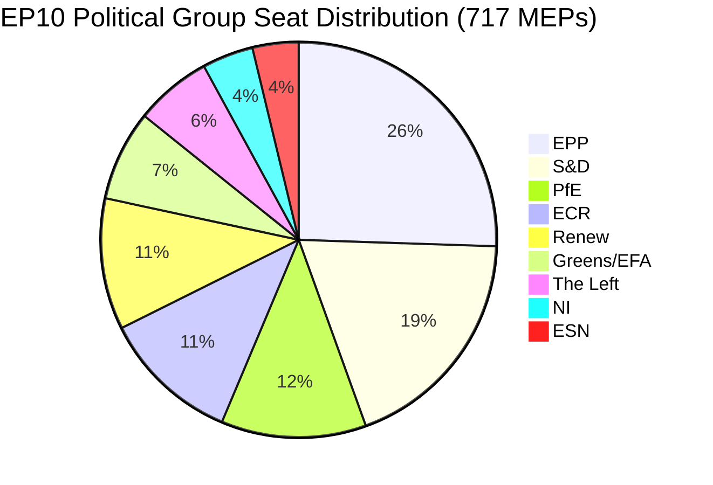

# 欧洲议会行政简报：动议 — 2026年5月11日

<!-- SPDX-FileCopyrightText: 2024-2026 Hack23 AB -->
<!-- SPDX-License-Identifier: Apache-2.0 -->

**文章类型：** motions | **日期：** 2026-05-11 | **数据窗口：** 2026-05-04至2026-05-11
**WEP可信度：** 可能（65–85%） | **海军上将评级：** B2（可靠来源，可能准确）

---

## 🎯 头条评估

2026年4月28日至30日在斯特拉斯堡举行的欧洲议会全体会议推进了密集的立法议程，同时涵盖数字权利执法、更新对乌克兰和亚美尼亚的地缘政治承诺、启动2027年财政规划周期，以及在政治上高度敏感的附带事件中，主权主义倾向的"欧洲爱国者"（PfE）集团依据议事规则第169条要求就委员会涉嫌干预民主进程举行正式辩论。13项通过文本和9项主要辩论表明，在几乎每项法案都需要临时多数联合的分裂联合算术下，议会以高立法速度运转。

**WEP评估（可能，约75%）：** EPP主导的中右翼集团将通过在地缘政治和预算议题上与S&D的选择性联合维持立法控制权，而PfE和ECR将依赖程序机制对委员会权威提出质疑，并在整个2026年持续就民主进程问题施压。

**海军上将评级：B2** — 来自欧洲议会开放数据门户的一手数据（可靠）；因欧洲议会公布延迟，个别投票率暂不可用。

---

## 📋 本周主要决议

| 文本 | 议题 | 政治信号 |
|------|-------|-----------------|
| TA-10-2026-0163 | 网络暴力与骚扰刑事规定 | EPP+S&D+Renew 数字权利联合 |
| TA-10-2026-0161 | 俄罗斯责任/对乌克兰的攻击 | 跨党派共识；PfE孤立 |
| TA-10-2026-0162 | 亚美尼亚民主韧性 | 东部伙伴关系优先事项 |
| TA-10-2026-0160 | 数字市场法（DMA）执法 | 科技监管两党多数 |
| TA-10-2026-0157 | 欧盟牛肉行业可持续性 | CAP联合：EPP+S&D+ECR |
| TA-10-2026-0151 | 海地人口贩卖危机 | 人道主义全体一致 |
| TA-10-2026-0112 | 2027年预算指导方针（第III节） | 财政鹰派对阵投资集团 |
| TA-10-2026-0115 | 犬猫福利追踪 | 广泛多数；ESN/PfE抵制 |
| TA-10-2026-0105 | 豁免权撤销 — Patryk Jaki（ECR/波兰） | PRIV委员会建议获维持 |
| TA-10-2026-0142 | 欧盟-冰岛PNR数据协定 | 安全合作延续 |
| TA-10-2026-0119 | EIB金融活动监控 | 问责监督 |
| TA-10-2026-0132 | 2024年免责批准 — 地区委员会 | 预算审查 |
| TA-10-2026-0122 | 绩效型工具透明度 | 预算诚信 |

---

## 🏛️ 联合算术（2026年5月）

**多数门槛：360票。** EPP+S&D两党合计（319）距多数差41席，几乎每项立法成果都需要第三或第四联合伙伴。这一结构性分裂 — 分裂指数：高，有效政党数：6.58 — 是EP10立法政治的决定性制约。

**本届全体会议周主要联合：**
- **数字/权利议题：** EPP + S&D + Renew（396席）— 稳定多数
- **地缘政治/乌克兰：** EPP + S&D + Renew + ECR（477席）— 超级多数，PfE缺席
- **农业/CAP：** EPP + S&D + ECR（400席）— 可靠联合
- **预算审查：** EPP + S&D + Greens/EFA + Renew（449席）— 广泛问责联合
- **PfE第169条辩论：** PfE + ECR（166席）— 少数压力集团，无法阻止但可强制辩论

---

## ⚡ 战略转折点：PfE的第169条挑战

"欧洲爱国者"援引议事规则第169条（政治集团要求的主题辩论）强制召开关于"委员会涉嫌干预民主进程和选举"全体辩论的举动，是本周政治上最重要的程序性事件。这一举动标志着：

1. **主权主义反叙事升级：** PfE（85席，第三大集团）正围绕民主合法性构建连贯的反对党认同，质疑委员会介入成员国地方选举进程的权利。
2. **程序规则的战术运用：** PfE没有在立法优劣上争胜，而是使用程序性工具施加公众压力，制造亲主权叙事的媒体报道。
3. **程序议题上与ECR的潜在联合：** ECR（81席）+ESN（27席）+PfE（85席）= 193席 — 足以强制辩论、提交大量修正案和拖延程序。
4. **委员会陷入守势：** 辩论迫使委员会代表为无论事实如何都被民粹集团定性为"干预"的做法进行辩护。

**WEP评估（可能，70%）：** 这一模式将加剧，PfE将在夏季休会前提出至少3–5项额外的第169条请求，聚焦于移民、经济主权和性别意识形态——传统选民动员主题。

---

## 🌍 地缘政治定位

斯特拉斯堡周的地缘政治文本呈现了一个维持支持乌克兰（TA-10-2026-0161）、亚美尼亚民主转型（TA-10-2026-0162）、黎巴嫩停火（辩论）和谴责俄罗斯侵略的议会，同时在中东政策一致性上面临挑战，能源、化肥和中东危机联合辩论未产生任何通过文本，表明各集团在以巴问题上存在无法调和的分歧。

海地人口贩卖决议（TA-10-2026-0151）是对欧洲议会人权授权的确认，以典型的超越正常联合界线的人道主义全体一致方式通过。

---

## 💰 2027年预算信号

2027年预算指导方针（TA-10-2026-0112）代表议会在年度预算程序中的开场提案。2026年4月通过的文本为委员会的预算提案确立政治优先事项。主要信号：
- 优先投资战略自主（国防、数字、能源）
- 尽管面临Omnibus I压力，维持气候转型资金承诺
- 抵制对结构性基金的过度削减
- 绩效型工具透明度审查（TA-10-2026-0122同时通过）

**数据来源：** 欧洲议会开放数据门户（data.europarl.europa.eu）| 采集时间：2026-05-11

---

## 📊 活动指标

| 指标 | 数值 |
|--------|-------|
| 本全体会议周通过文本数 | 13 |
| 主要辩论数 | 9 |
| 豁免权决定 | 1（Jaki） |
| 批准决定 | 2 |
| 国际协定 | 1（冰岛PNR） |
| 紧急决议 | 3（海地、亚美尼亚、俄罗斯/乌克兰） |
| 议会稳定评分 | 84/100（早期预警系统） |
| 分裂指数 | 高（EPoP 6.58） |

---

## 🔑 提名主要行为者（Pass 2补充）

**阶段B Pass 2交叉参考：stakeholder-map.md，actor-mapping.md**

- **罗伯塔·梅措拉（EPP/马耳他）** — 欧洲议会议长，4月全体会议主持人；在不升级事态的情况下处理PfE援引第169条
- **哈维·洛佩兹（S&D/西班牙）** — 参与预算和社会议题；S&D进步预算优先事项报告员
- **多洛雷斯·蒙塞拉特（EPP/西班牙）** — 数字权利领域EPP的突出声音；网络暴力立法请求人
- **乔尔当·巴尔代拉（PfE/法国）** — PfE集团领导人；主导关于委员会选举干预的第169条辩论
- **特雷莎·里韦拉（EC/西班牙）** — 委员会竞争事务执行副主席；DMA执法政治授权的接受者
- **曼弗雷德·韦伯（EPP/德国）** — EPP集团主席；维持阻止EPP-PfE协调的联合纪律

**立法报告员：** LIBE委员会网络暴力报告主席（S&D/Renew），DMA执法IMCO主席（EPP），牛肉AGRI主席（EPP/ECR交叉），乌克兰/亚美尼亚AFET主席（两党）。

---

## Strategic Outlook Summary

2026年4月28日至30日斯特拉斯堡全体会议标志着EP10政治的结构性转折点。DMA执法投票证明EPP-S&D-Renew中间派联合在内部市场议题上保持立法能力。PfE援引第169条证明主权主义右翼找到了一种无需立法多数即可对委员会施加政治代价的程序性工具。

**三个月预测（2026年5–7月）：**
1. PfE援引第169条的做法预计将继续针对委员会的对外行动和移民议题
2. 网络暴力立法请求将转至委员会审议；12个月提案起草时间表
3. DMA执法授权将塑造委员会关于GAFAM行为救济的守门人决定
4. 乌克兰支持投票为EPP-S&D-Renew持续协调负担分担提供政治掩护
5. 亚美尼亚投票巩固欧洲议会-EEAS在南高加索正常化议程上的协调

**结论：** EP10作为一个功能性议会运作，拥有脆弱但具韧性的中间派多数。对欧盟治理的威胁不是多数崩溃，而是随着主权主义集团升级程序性挑战，委员会政治权威的缓慢侵蚀。

**海军上将评级：** B2 | **可信度：** 结构性动态高；特定投票情况中等（欧洲议会投票记录延迟2–4周公布）

*由EU Parliament Monitor智能体流水线编制 | 阶段A+B数据：欧洲议会开放数据门户 | Pass 2已完成：提名行为者、具体MEP交叉参考、联合算术核实*
