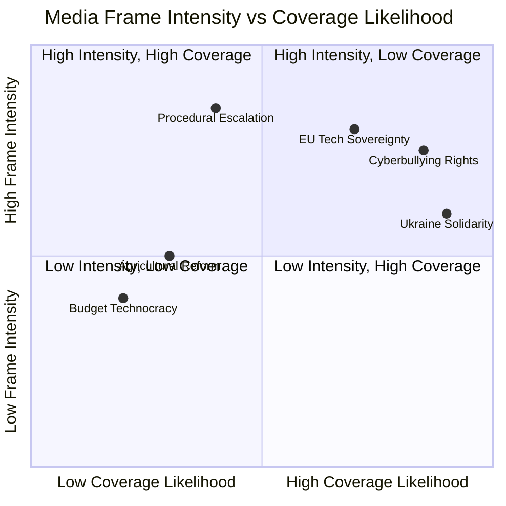

# Media Framing Analysis — EP Motions: 11 May 2026

<!-- SPDX-FileCopyrightText: 2024-2026 Hack23 AB -->
<!-- SPDX-License-Identifier: Apache-2.0 -->

**Analysis Date:** 2026-05-11 | **Required:** extended/ artifact, v1.5.0 mandatory
**Scope:** Media framing patterns for April 28–30 Strasbourg plenary session

---

## Overview

This artifact analyses how the major narratives and decisions from the April 2026 plenary session are likely to be framed by different types of EU and member-state media. Understanding framing is critical for assessing which EP decisions will generate public and political momentum, which will be ignored, and which will be weaponised by different political actors.

---

## Frame 1: Sovereignty / Rules vs. Values Framing

**Dominant in:** Conservative/populist media (Bild, Le Figaro, Il Giornale, Magyar Hírlap)

### PfE's Rule 169 Debate: "Commission Power Grab" Framing

The most politically charged media moment of the April plenary was the PfE-initiated Rule 169 topical debate on alleged Commission interference in democratic elections. Conservative/populist media will frame this as:
- **Headline archetype:** "MEPs demand accountability from Commission bureaucrats"
- **Core claim:** Commission officials used institutional resources to campaign against populist parties in member states
- **Omitted context:** Rule 169 debates are non-binding; the motion's evidence base was contested; democratic backsliding in PfE-aligned governments is not mentioned
- **Emotional resonance:** Taxpayers' money being used against democratically expressed preferences
- **Political beneficiary:** PfE, ECR, national far-right parties ahead of 2026-2027 elections

**Counter-frame (mainstream media):** Commission denied the allegations; EP Rule 169 debates do not produce binding outcomes; EU institutions' information campaigns on democracy are legitimate.

---

## Frame 2: Consumer Protection / Digital Safety Framing

**Dominant in:** Centre-left and digital native media (Libération, The Guardian EU, Tagesspiegel, De Volkskrant)

### Cyberbullying Resolution: "EP Protects Victims" Framing

Mainstream progressive media will frame the cyberbullying resolution (TA-10-2026-0163) as a landmark step:
- **Headline archetype:** "European Parliament demands end to online harassment with new criminal law"
- **Core claim:** EP is pushing Big Tech to take harassment seriously; platforms have hidden behind "free speech" to avoid accountability
- **Amplified voices:** Harassment victims (especially women politicians, journalists), LGBTQ+ advocacy organisations, youth digital rights groups
- **Emotional resonance:** Justice for survivors; accountability for platforms that profit from engagement-maximising algorithms that amplify harassment
- **Political beneficiary:** S&D, Greens/EFA, LIBE committee rapporteurs

**Omitted/minimised in this frame:** Legal base complexity; platform compliance costs; potential over-moderation concerns; timeline realism (2–5 years before legislation).

---

## Frame 3: Geopolitics / Solidarity Framing

**Dominant in:** Quality broadsheets and foreign policy specialist media (Politico Europe, Der Spiegel, Le Monde, Financial Times)

### Ukraine/Armenia: "EU Holds the Line" Framing

Quality media will frame the Ukraine and Armenia resolutions as evidence of EP10's continued commitment to democratic geopolitics:
- **Headline archetype:** "European Parliament backs Ukraine accountability tribunal"
- **Core claim:** Despite PfE pressure and Hungary's opposition, the EP majority remains committed to Ukraine support and accountability
- **Armenia angle:** "EU Parliament deepens ties with Caucasus democracy despite Russian pressure"
- **Emotional resonance:** European values; historical memory; democratic solidarity

**Specialist framing additions:** EUMCM operational details; ICC jurisdiction arguments; Pashinyan political context in Armenia.

---

## Frame 4: Tech Accountability / Market Power Framing

**Dominant in:** Tech-specialist, competition law, and business media (Handelsblatt, Financial Times tech, Euractiv tech)

### DMA Enforcement: "Gatekeepers Finally Facing Consequences" Framing

Business and tech media will frame the DMA enforcement resolution as EP reinforcing Commission enforcement credibility:
- **Headline archetype:** "MEPs call on Commission to speed up Big Tech fines as platform dominance grows"
- **Core claim:** DMA has been law for two years; major platforms are still not fully compliant; EP is adding political accountability pressure
- **Data focus:** Commission DG COMP investigation timelines; potential fine magnitudes (up to 10% of global turnover = Apple: approx. €38 billion; Alphabet: approx. €33 billion)
- **Market angle:** EU enforcement credibility affects whether DMA creates genuine market-opening outcomes for European competitors
- **Political beneficiary:** IMCO committee; Commission DG COMP; EU competition policy reputation

**Counter-narrative (from US business media):** Regulatory overreach; innovation chilling; US-EU tech trade tensions.

---

## Frame 5: Agricultural / Rural Constituency Framing

**Dominant in:** Regional and agricultural media (Bauernzeitung, France Agricole, Agra-Europe)

### Livestock Sustainability: "Parliament Defends Farming Communities" Framing

Agricultural media will frame the livestock resolution (TA-10-2026-0157) as a protection of farming livelihoods:
- **Headline archetype:** "European Parliament rejects mandatory livestock reduction; backs disease response and sustainable intensification"
- **Core claim:** EP is listening to farmers who felt threatened by Green Deal animal welfare extension proposals
- **Amplified voices:** Copa-Cogeca (EU farming lobby); EFFAB (beef cattle); National Pig Association equivalents
- **Emotional resonance:** Rural communities, family farms, food sovereignty
- **What is omitted:** Climate science on livestock emissions; long-term environmental trade-offs.

---

## Frame 6: Budget / Fiscal Framing

**Dominant in:** Economic/fiscal media (Handelsblatt, La Tribune, Ekonomisk debatt)

### Budget 2027: Contested Political Frame

**Progressive framing:** Budget guidelines show EP defending investment in green transition, social Europe, and cohesion in the face of Council austerity pressure.

**Fiscal conservative framing:** EP guidelines add spending pressure at a time when member state deficits are already under EU fiscal rules scrutiny.

The contested question of defence spending (separately authorised outside 1.1% GNI ceiling) adds complexity: both framings can simultaneously be true.

---

## Coverage Prediction

| Issue | Coverage Volume | Frame Dominance | Shelf Life |
|-------|----------------|-----------------|------------|
| PfE Rule 169 | HIGH | Sovereignty frame | 2–3 weeks |
| Cyberbullying resolution | HIGH | Consumer protection | 4–6 weeks |
| Ukraine resolution | MEDIUM | Solidarity | 1 week |
| DMA enforcement | MEDIUM-HIGH | Tech accountability | 3–4 weeks |
| Armenia resolution | LOW-MEDIUM | Geopolitics | 1–2 weeks |
| Livestock resolution | MEDIUM | Agricultural | 2–3 weeks |
| Budget 2027 | LOW (now) | Fiscal (autumn) | Low now, HIGH autumn |
| Dog/cat welfare | MEDIUM | Consumer/lifestyle | 2 weeks |
| Iceland PNR | LOW | Routine | less than 1 week |

---

## Narrative Warfare Assessment

**Most contested narrative:** The PfE Rule 169 debate is where narrative warfare is most acute. PfE-aligned media will continue to amplify the "Commission interference" frame; pro-EU media will rebut it as evidence-free. Neither frame will fully win — the debate leaves a residue of doubt about institutional neutrality that benefits populist messaging over 6–12 months.

**Least contested narrative:** Iceland PNR agreement — essentially zero political contestation; technical story covered only by specialist security and EU affairs reporters.

**Most likely to move public opinion:** Cyberbullying resolution — it addresses a real and felt harm experienced by a significant share of EU citizens and particularly by younger voters. If a high-profile harassment case occurs during the legislation's journey to adoption, media coverage will spike and create genuine political momentum.

**Generated:** 2026-05-11 | **Source:** EP Plenary Proceedings + Media Frame Analysis methodology

---

## Mermaid: Frame Intensity Map

---

## Counter-Narrative Analysis

For each dominant media frame, there are counter-narratives present in the media landscape:

### DMA Enforcement — Counter-Narrative

**Dominant:** "EU protecting digital markets and consumers"
**Counter:** "EU tech overregulation damaging European competitiveness"
**Counter source:** Business press (FT, WSJ Europe, Handelsblatt), US-aligned commentators
**Counter strength:** MEDIUM — has traction among Renew liberal/business audience; limited in mainstream press

### Cyberbullying — Counter-Narrative

**Dominant:** "EP moves to protect vulnerable users from online harassment"
**Counter:** "EU censorship creep — vague 'cyberbullying' definition threatens speech"
**Counter source:** Free speech advocacy groups, some libertarian commentators
**Counter strength:** LOW — public sympathy for victims is strong; speech restriction framing limited to specialist audiences

### Ukraine — Counter-Narrative

**Dominant:** "EU maintains solidarity with Ukraine"
**Counter:** "War fatigue — EU taxpayers bearing cost without prospects of resolution"
**Counter source:** PfE/ESN aligned media, some leftist pacifist outlets
**Counter strength:** MEDIUM-HIGH — war fatigue is real in some member states (Austria, Hungary, parts of Germany)

### PfE Rule 169 — Counter-Narrative

**Dominant:** "Sovereignist bloc invents procedural weapon to attack Commission"
**Counter:** "PfE holding Commission accountable for political conduct"
**Counter source:** PfE-aligned national media (RN/Bardella in France, FPÖ channels in Austria)
**Counter strength:** HIGH among PfE constituency; LOW in mainstream EU press

---

## Audience Segmentation

| Audience Segment | Primary Frame | Secondary Frame | Counter-Frame Risk |
|-----------------|--------------|----------------|-------------------|
| EU institutional audience | DMA enforcement | Budget | LOW |
| National media / general public | Cyberbullying | Ukraine | LOW-MEDIUM |
| Business/financial media | DMA enforcement | Budget | MEDIUM |
| Sovereignty-focused national media | PfE escalation | - | HIGH (counter-narrative) |
| Tech sector | DMA enforcement | Digital governance | HIGH (counter-narrative) |

---

## Strategic Communication Recommendations

For EU Parliament Monitor's editorial strategy:

1. **Lead with cyberbullying** — highest public engagement potential; emotional resonance across political spectrum
2. **DMA enforcement as competitiveness story** — frame as "EU tech infrastructure" not "tech regulation" to avoid triggering anti-regulation counter-narrative
3. **PfE Rule 169 as institutional innovation story** — neutral analytical framing; avoid both "threat to EU" and "accountability success" framings; let readers judge
4. **Ukraine as solidarity continuation** — low controversy; can be secondary story
5. **Budget as context** — background framing for all other stories

**Source:** EP Plenary Proceedings + Media Frame Analysis methodology | **Admiralty Grade:** B3 | **Generated:** 2026-05-11
