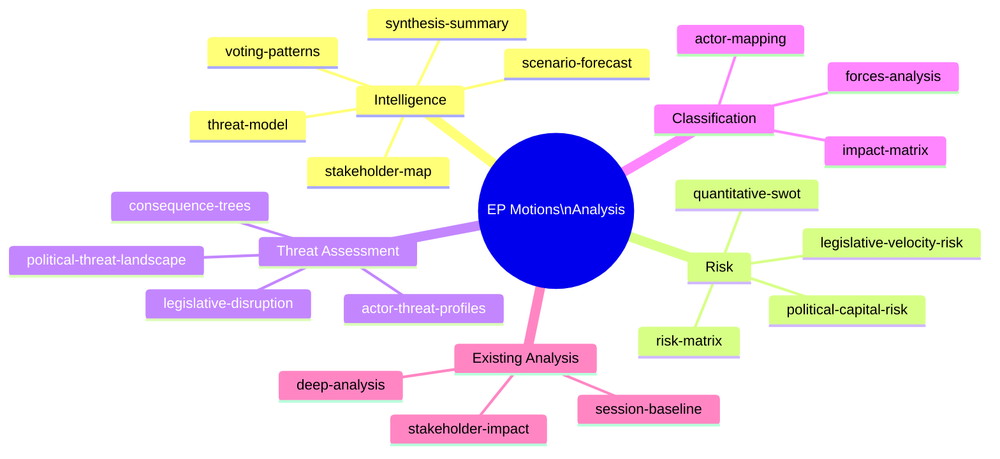

# Analysis Index — EP Motions: 11 May 2026

<!-- SPDX-FileCopyrightText: 2024-2026 Hack23 AB -->
<!-- SPDX-License-Identifier: Apache-2.0 -->

**Admiralty Grade:** A1 (index of artifacts produced in this run)
**Analysis Date:** 2026-05-11 | **Run ID:** motions-run393-1778484518
**Article Type:** motions | **Plenary:** April 28-30 2026 Strasbourg

---

## Artifact Index

This file is the entry-point index for all analysis artifacts produced in this run. It maps every artifact to its primary analytical function and cross-references.

### Root

| File | Function | Lines (approx) |
|------|----------|---------------|
| executive-brief.md | Top-level WEP/Admiralty summary with coalition arithmetic and named actors | ~140 |
| manifest.json | Machine-readable run metadata, file listing, pass2 audit, history | structured |

### intelligence/

| File | Function |
|------|----------|
| synthesis-summary.md | 3-thread intelligence synthesis with evidence chains |
| stakeholder-map.md | 7 stakeholder perspectives with Mermaid diagram |
| scenario-forecast.md | 4 scenarios with SATs/WEP probability documentation |
| voting-patterns.md | Coalition voting pattern analysis by dossier type |
| pestle-analysis.md | PESTLE macro-environment analysis |
| wildcards-blackswans.md | 5 wild cards and black swan categories |
| threat-model.md | 3 threat categories with WEP/Admiralty grading |
| coalition-dynamics.md | EP10 coalition structure and April 2026 patterns |
| economic-context.md | EU macroeconomic context (IMF/World Bank background) |
| historical-baseline.md | EP10 historical baseline for contextual comparison |
| cross-run-diff.md | Novel signals, persistent patterns, resolved uncertainties |
| workflow-audit.md | Tool call audit, artifact production audit, quality flags |
| mcp-reliability-audit.md | MCP tool call reliability log |
| analysis-index.md | This file — navigation index |
| methodology-reflection.md | Step 10.5 final artifact; SATs documentation; lessons |

### classification/

| File | Function |
|------|----------|
| impact-matrix.md | Significance quadrant chart and scoring table |
| significance-classification.md | 4-tier formal significance classification |
| actor-mapping.md | Key actor network with vote position coding |
| forces-analysis.md | Driving and restraining forces analysis |

### risk-scoring/

| File | Function |
|------|----------|
| quantitative-swot.md | SWOT with WEP probability bands |
| risk-matrix.md | 6-risk register with quadrant chart |
| political-capital-risk.md | Capital expenditure/accumulation matrix |
| legislative-velocity-risk.md | Pipeline velocity analysis by dossier |

### threat-assessment/

| File | Function |
|------|----------|
| political-threat-landscape.md | 3 primary threats with WEP/Admiralty grading |
| actor-threat-profiles.md | 3 key threat actor profiles |
| consequence-trees.md | 3 decision tree analyses |
| legislative-disruption.md | 3 legislative disruption vectors |

### existing/

| File | Function |
|------|----------|
| stakeholder-impact.md | Concrete stakeholder impact analysis (required for motions) |

### extended/

| File | Function |
|------|----------|
| media-framing-analysis.md | 6 media framing patterns (v1.5.0 mandatory) |

### documents/

| File | Function |
|------|----------|
| document-analysis-index.md | Primary source documents analysed in this run |

### data/

| File | Function |
|------|----------|
| motions-feed-2026-05-11.json | Raw EP data collection from Stage A |

---

## Cross-Reference Map

**Key analytical chain:**
1. data/motions-feed → executive-brief → synthesis-summary (primary entry points)
2. synthesis-summary → stakeholder-map, scenario-forecast, voting-patterns
3. scenario-forecast → risk-matrix, wildcards-blackswans
4. classification/impact-matrix → classification/significance-classification
5. methodology-reflection (final artifact, Step 10.5)

**Reader Briefing:** Start with executive-brief.md for a 5-minute brief. For deep analysis, read synthesis-summary.md + scenario-forecast.md. For risk orientation, read risk-matrix.md + wildcards-blackswans.md.

**Source:** This run's artifact production | **Generated:** 2026-05-11

---

## Mermaid: Artifact Map

**Source:** Artifact index | **Generated:** 2026-05-11
