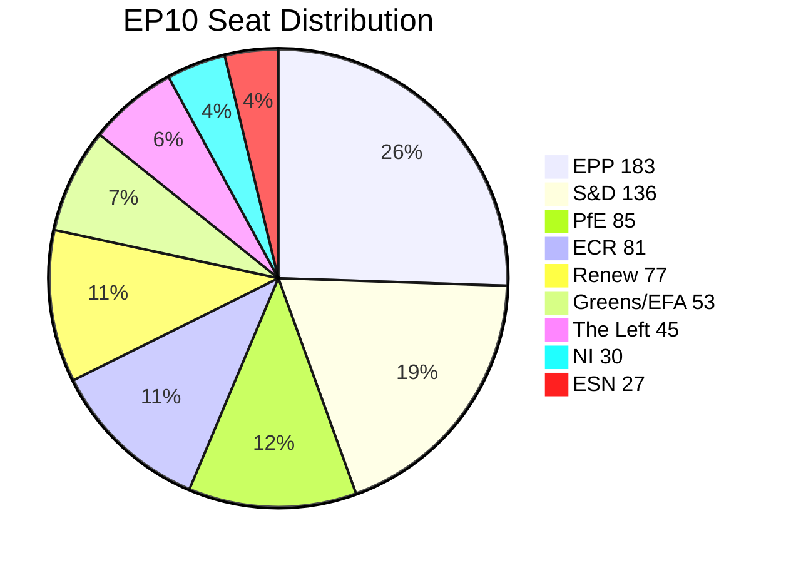

# Coalition Dynamics — EP Motions: 11 May 2026

<!-- SPDX-FileCopyrightText: 2024-2026 Hack23 AB -->
<!-- SPDX-License-Identifier: Apache-2.0 -->

**Admiralty Grade:** B2 (EP structural data reliable; vote-level data unavailable due to publication lag)
**Analysis Date:** 2026-05-11

---

## EP10 Coalition Structure

**EP10 Seat Distribution (717 total; majority: 360):**

| Group | Seats | Share | Coalition Role |
|-------|-------|-------|---------------|
| EPP | 183 | 25.5% | Anchor — essential for any majority |
| S&D | 136 | 19.0% | Required on left-of-centre files |
| PfE | 85 | 11.9% | Procedural disruptor; excluded from governing majority |
| ECR | 81 | 11.3% | Swing on geopolitics; right anchor on agriculture |
| Renew | 77 | 10.7% | Pro-EU liberal; swing on market/digital files |
| Greens/EFA | 53 | 7.4% | Climate/social anchor; budget ally |
| The Left | 45 | 6.3% | Far-left; crisis-driven alignment |
| NI | 30 | 4.2% | Diverse; not cohesive bloc |
| ESN | 27 | 3.8% | Far-right adjacent; marginal |

**Parliamentary Fragmentation Index:** HIGH (Effective Number of Parties: ~6.58)
**Grand Coalition Viability (EPP+S&D+Renew):** YES — 396 seats (55.2%), reliable on digital, institutional, and rights files

---

## April 2026 Coalition Patterns

**Coalition 1 — Digital Rights / Consumer (EPP+S&D+Renew = 396):**
Drove cyberbullying resolution (TA-10-2026-0163) and DMA enforcement resolution (TA-10-2026-0160). This is the most stable EP10 coalition: three ideologically distinct groups sharing a common interest in demonstrating EU-level digital governance effectiveness. EPP claims regulatory credibility, S&D claims social protection, Renew claims liberal rights framework.

**Coalition 2 — Eastern Consensus / Ukraine (EPP+S&D+Renew+ECR = 477):**
Drove Ukraine accountability resolution (TA-10-2026-0161) and Armenia resolution (TA-10-2026-0162). ECR's Polish PiS delegation is the most hawkish on Russia; their inclusion produces near-supermajority. Hungary (NI, post-Fidesz-EPP split) systematically opposes, producing a distinctive voting pattern: 477 YES vs. 85 PfE + 27 ESN + fragmented NI.

**Coalition 3 — Agricultural Protection (EPP+ECR with S&D tolerance = ~400):**
Drove livestock sustainability resolution (TA-10-2026-0157). S&D tolerates rather than champions agricultural deregulation, but avoids open conflict with rural constituencies. The Left and Greens/EFA are the consistent NO votes on deregulatory agricultural texts.

**Coalition 4 — Budget / Scrutiny (EPP+S&D+Greens/EFA+Renew = ~449):**
Accountability coalitions for discharge, EIB scrutiny, and performance instrument transparency. Cross-ideological accountability interest.

---

## Structural Stress Indicators

**Stability Score:** 84/100 (Early Warning System, sensitivity: high)
**Risk Level:** MEDIUM
**Key stress:** PfE procedural escalation (Rule 169) represents the primary coalition stress — not voting defections but agenda disruption and narrative battles.

**Alliance Signal Detection:** No voting-level coalition defections detectable in this period (due to publication lag). Structural cohesion of the three primary coalitions appears intact.

**Reader Briefing:** Coalition dynamics analysis for this run is constrained by the absence of roll-call voting data. All coalition positions are inferred from structural data and political positions, carrying MEDIUM confidence. Confirmation available when voting records publish (estimated late May 2026).

**Source:** EP Open Data Portal — generate_political_landscape, analyze_coalition_dynamics | **Generated:** 2026-05-11

---

## Mermaid: Coalition Structure

**Admiralty Grade:** A1 | **Generated:** 2026-05-11
