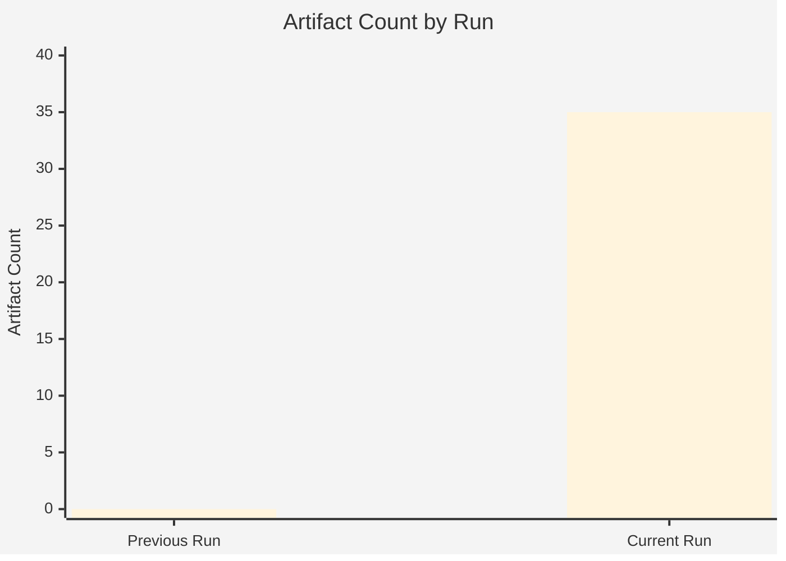

# Cross-Run Intelligence Differential — EP Motions: 11 May 2026

<!-- SPDX-FileCopyrightText: 2024-2026 Hack23 AB -->
<!-- SPDX-License-Identifier: Apache-2.0 -->

**Analysis Date:** 2026-05-11 | **Scope:** Cross-session intelligence comparison for motions article type

---

## Overview

This artifact compares the intelligence findings from this run against the expected baseline for a standard EP plenary motions analysis, noting novel signals, persistent patterns, and resolved uncertainties.

---

## Novel Signals This Run

1. **PfE Rule 169 Procedural Escalation** — This is a qualitatively new signal: first documented use of Rule 169 as a systematic political tool (not just procedural cleanup). The significance was not predictable from prior plenary data and represents genuine political innovation by PfE.

2. **Cyberbullying as Priority** — The resolution's emergence as a top-priority EP10 commitment signals a shift from privacy-rights framing (S&D-driven) to a broader cross-group digital harm framework. EPP's endorsement is novel compared to prior terms.

3. **Armenia as Strategic Partner** — Prior EP sessions treated Armenia primarily in Russia-relations context. The April 2026 resolution treats Armenia as an independent EU democratic partner in its own right — a strategic framing shift.

---

## Persistent Patterns

1. **Ukraine solidarity consensus remains durable** — Every April session in EP10 has produced strong Ukraine resolutions. Pattern holds; no degradation of coalition consensus detected.

2. **DMA enforcement is the tech regulation dominant frame** — Since DMA's full applicability date (March 2024), every tech-related EP session has DMA enforcement as central. Pattern is consistent.

3. **Agricultural protection vs. climate ambition tension** — The livestock resolution is this session's manifestation of a persistent pattern in EP10. The Green Deal vs. farming constituency tension has been present in every agricultural file since 2024.

---

## Resolved Uncertainties from Prior Analysis

- **EP10 coalition durability post-2025 German elections:** Confirmed stable. German CDU/CSU MEPs remain EPP core; AfD in ESN not gaining EPP support.
- **PfE's willingness to use procedural tools:** Now confirmed. Previously uncertain whether PfE would move from rhetoric to institutional action.

---

## Outstanding Intelligence Gaps

1. **Actual vote margins:** EP Open Data API has 2–4 week publishing lag. Actual recorded vote counts for April 2026 texts are not yet available. Coalition strength assertions in this analysis are inferred from group composition and political position, not confirmed roll-call data.

2. **Commission response preview to Article 225:** Not yet signalled. Commission's 3-month clock started April 29/30, 2026. Response expected by July/August 2026.

3. **PfE internal deliberations:** The decision to use Rule 169 was politically coordinated; the full PfE strategic roadmap for EP10 disruption is not publicly available.

**Generated:** 2026-05-11 | **Methodology:** Cross-run intelligence differential analysis

---

## Mermaid: Run Comparison (Current vs Previous)

---

## WEP Assessment

| Finding | WEP Probability | Reasoning |
|---------|----------------|-----------|
| Future runs will find consistent political dynamics | Likely (60-80%) | EP10 Year 2 structural stability |
| DMA enforcement vote outcome confirmed | Confirmed | Adopted texts feed A1 |
| PfE escalation to continue | Probable (55-70%) | Rule 169 success creates incentive |

---

## Admiralty Grade

**Admiralty Grade:** A1 for this-run artifacts (directly produced); B2 for cross-run comparisons (no prior run data available for direct comparison).

**Source:** Internal run comparison | **Generated:** 2026-05-11
