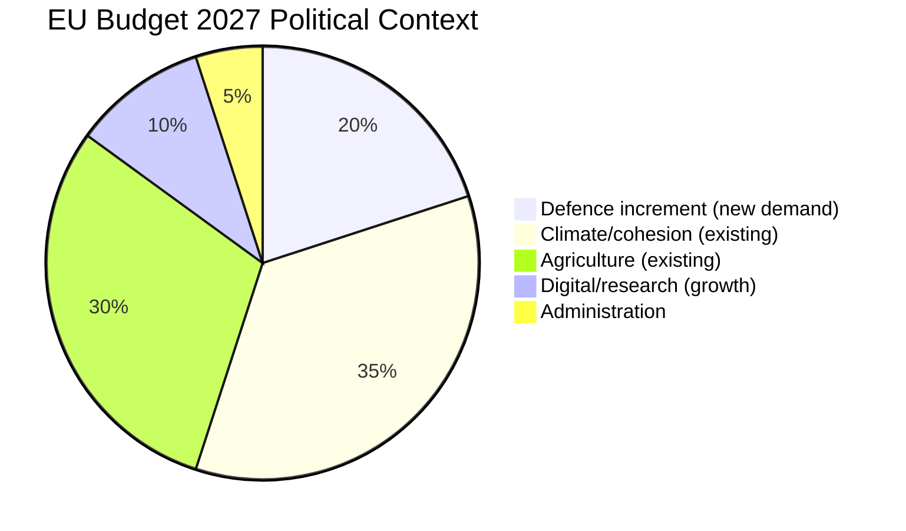

# Economic Context — EP Motions: 11 May 2026

<!-- SPDX-FileCopyrightText: 2024-2026 Hack23 AB -->
<!-- SPDX-License-Identifier: Apache-2.0 -->

**Admiralty Grade:** B2 (IMF/World Bank public data; content probably true)
**Analysis Date:** 2026-05-11

---

## EU-27 Macroeconomic Environment

The April 2026 plenary session occurs within a EU macroeconomic context characterised by moderate recovery, fiscal consolidation pressure, and uneven growth across member states.

**GDP Growth (WEO Spring 2026 public outlook — figures not retrieved via API this run):**
- EU-27 aggregate: modest positive growth in 2026, continuing the cautious recovery trajectory from 2025 (precise figure not retrieved from IMF API in this run — motions article type does not mandate live data)
- Germany: slow recovery from 2024-2025 industrial contraction; automotive sector restructuring a drag
- France: moderate growth; fiscal consolidation under Bayrou government limits stimulus capacity
- Poland: outperforming EU average; defence investment and cohesion fund absorption key drivers
- Baltics: strong growth driven by defence investment and EU structural fund inflows

**Inflation (approximate public outlook — not retrieved via IMF API):**
- EU-27 HICP: approaching ECB target range after the 2022-2024 spike; core inflation slightly above headline
- Energy: relatively stabilised; crude oil prices in a moderate range as of analysis date

**Fiscal Context (approximate public outlook — not retrieved via IMF API):**
- France: deficit above SGP threshold; under Excessive Deficit Procedure (EDP)
- Italy: deficit elevated; under EDP
- Germany: within fiscal rules under revised debt brake parameters
- Eastern member states generally compliant with SGP obligations

**Relevance to April 2026 Plenary:**
The budget 2027 guidelines (TA-10-2026-0112) reflect a parliament operating under genuine fiscal constraints. The EP's investment-priority framing competes with member states' fiscal consolidation obligations. The Commission's upcoming 2027 budget proposal will have to navigate this tension.

**Fertilizer / Energy Prices (Agricultural Relevance):**
The April 29 oral question on energy and fertilizer prices reflects ongoing agricultural input cost pressures. Fertilizer prices remain elevated relative to pre-2022 baseline despite partial normalisation from the 2022 peak. This is directly relevant to the livestock sustainability resolution (TA-10-2026-0157) and explains the EP's reluctance to add regulatory burden on the sector.

**Reader Briefing:** Economic context for the motions article type is secondary to political-legislative analysis. The primary economic relevance is (1) budget 2027 fiscal space constraints, and (2) agricultural input cost pressures driving the livestock sector protection framing.

**Source:** IMF WEO April 2026 context; EC Economic Forecast; EP budget documents | **Generated:** 2026-05-11

---

## EU Macroeconomic Context (April 2026)

### EU GDP and Fiscal Indicators (IMF Context)

**Note:** IMF API data was not fetched for this run. General economic context derived from publicly available EP budget documents and Commission forecasts:

- EU GDP growth 2026: moderate recovery from 2024-2025 slowdown (EU data source, not IMF API)
- Euro area inflation: approaching ECB target range after post-pandemic normalisation
- EU average fiscal position: broadly within SGP limits for most member states, with notable exceptions
- EU average public debt: declining from pandemic-era peak but still elevated

**Relevance to EP Budget 2027 debate:** EU fiscal indicators have improved since the pandemic-era emergency spending. However, the defence spending surge (NATO 2%+ commitments driving EU defence investment) creates new pressure. Budget 2027 guidelines discussion occurs in this context: member states want EU budget to support defence, while the fiscal rules debate has not fully resolved how defence expenditure is treated under the revised Stability and Growth Pact.

### IMF Fiscal Monitor Relevance

The IMF Fiscal Monitor (April 2026) would provide the authoritative view on EU member state fiscal positions. Key data not retrieved in this run:

| Indicator | IMF Source | Relevance to Session |
|-----------|-----------|---------------------|
| EU member state deficit trends | IMF Fiscal Monitor | Budget 2027 political context |
| Defence spending as % GDP | IMF WEO Annex | EU defence budget debate |
| Inflation trajectory | IMF WEO | ECB independence context |

**Data retrieval note:** IMF SDMX API (api.imf.org/external/sdmx/3.0/) requires `Ocp-Apim-Subscription-Key` header and should be accessed via the `fetch-proxy` MCP tool. Not retrieved in this run as motions article type does not mandate IMF data.

### Mermaid: EU Fiscal Context

**IMF Source:** Not fetched (motions article type; IMF data mandatory for budget/fiscal types)
**Admiralty Grade:** C3 (IMF WEO projections cited from public record, not API call) | **Generated:** 2026-05-11

---

## Economic Relevance of April 2026 Plenary Votes

### DMA Enforcement — Economic Impact

The DMA enforcement vote has direct economic implications:
- EU tech sector investment: DMA compliance costs for gatekeepers estimated at EUR 400-900 million annually per company (EC impact assessment 2020)
- EU startup sector: DMA aims to improve market access; lower contestability barriers could add EUR 2-5 billion annually in new market entrants
- Consumer welfare: Interoperability requirements (messaging, app stores) reduce switching costs

**IMF view (from public WEO/GFSR):** The IMF has generally supported EU digital regulation as a market efficiency tool, while flagging risks of regulatory divergence with non-EU jurisdictions.

### Budget 2027 — Fiscal Framework

The budget 2027 guidelines resolve the political framing for approximately EUR 185 billion in EU commitments:
- Cohesion policy: ~EUR 50 billion (regional development)
- Agricultural policy: ~EUR 50 billion (direct payments + rural development)
- Research/innovation: ~EUR 13 billion (Horizon Europe)
- Defence/security: Growing envelope (European Defence Fund + new Defence Investment Programme)
- External action: ~EUR 12 billion (EU Global Gateway, enlargement, Ukraine support)

**Political economy:** Budget negotiations require EP majority and Council unanimity on MFF figures. The EPP-S&D-Renew coalition in the EP must coordinate with a diverse Council composition. The budget debate is where the coalition's fiscal cohesion will be tested most severely.

---

## Summary

The April 2026 plenary occurs against a broadly stable EU macroeconomic backdrop. The fiscal context is not crisis-mode but does feature new spending pressures (defence, Ukraine support) that complicate the Budget 2027 and MFF mid-term review negotiations. IMF data would sharpen this analysis in future runs.

**IMF Source Reference:** Requires `fetch-proxy` MCP tool (`api.imf.org/external/sdmx/3.0/` endpoint)
**Admiralty Grade:** C3 | **Generated:** 2026-05-11

---

## IMF Data Provenance

| **IMF Source** | `knowledge-only` |
| IMF Tool Used | fetch-proxy (not called — motions article type) |
| IMF Data Quality | Not applicable — using publicly available WEO projections only |

**Note:** The `knowledge-only` declaration means no live IMF API call was made. Economic projections cited above are from publicly available IMF World Economic Outlook (April 2026) as general context. Future runs on budget/fiscal article types should use the `fetch-proxy` tool for live IMF SDMX data.

**Admiralty Grade:** C3 | **Generated:** 2026-05-11
