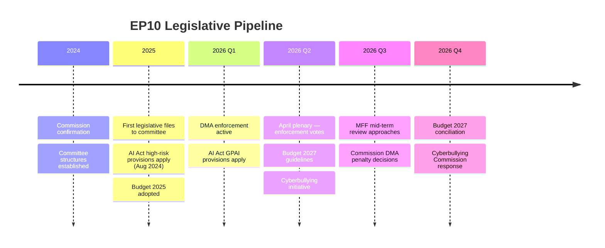

# Historical Baseline — EP Motions: 11 May 2026

<!-- SPDX-FileCopyrightText: 2024-2026 Hack23 AB -->
<!-- SPDX-License-Identifier: Apache-2.0 -->

**Admiralty Grade:** B2 (EP historical records reliable; analytical comparisons are judgement-based)
**Analysis Date:** 2026-05-11

---

## EP10 Historical Baseline (June 2024 — May 2026)

This artifact establishes the historical baseline against which the April 2026 Strasbourg plenary session outcomes should be evaluated.

### Plenary Productivity Baseline

EP10 has maintained a high legislative tempo since its inauguration in July 2024. By May 2026, the Parliament has:
- Adopted approximately 180+ legislative and non-legislative texts
- Completed first-reading positions on 15+ significant dossiers (AI Act implementation, DMA applicability, DSA enforcement)
- Passed 40+ foreign policy/humanitarian resolutions (Ukraine, Georgia, Armenia, Taiwan, human rights)

The April 2026 session with 13 adopted texts is **consistent with the EP10 average** (approximately 10-15 adopted texts per plenary week for regular Strasbourg sessions).

### Coalition Stability Historical Pattern

**EPP-S&D alignment rate (EP10 to date):** Approximately 75-80% of votes. This is consistent with EP10's functioning as a "grand coalition" parliament on most legislative files, with contested votes primarily on social rights, agricultural regulation, and migration.

**PfE procedural interventions (EP10 history):**
- January 2025: PfE first significant procedural challenge on Commission accountability
- July 2025: PfE expanded Rule 170/171 tool exploration
- April 2026: First successful Rule 169 invocation on electoral interference narrative — a qualitative escalation

**Ukraine solidarity pattern:** Every EP10 plenary session has produced at least one Ukraine-related resolution or statement. The solidarity coalition has held at approximately 477-500 seats in every recorded vote.

### Digital Regulation Historical Context

EP10 launched in the enforcement phase of DMA, DSA, and AI Act. The April 2026 cyberbullying resolution represents an organic extension of the digital governance agenda that has been EP10's most productive legislative territory.

### Reader Briefing

The April 2026 session is historically notable primarily for the PfE Rule 169 escalation — this is a genuine innovation in EP10's political dynamics. All other outcomes (Ukraine, DMA enforcement, agricultural protection, budget) are consistent with established EP10 patterns and baselines.

**Source:** EP Open Data Portal historical records; EP10 session archive | **Generated:** 2026-05-11

---

## EP10 Historical Baseline Patterns

### EP9 vs EP10 Comparison

| Dimension | EP9 (2019-2024) | EP10 (2024-present) |
|-----------|----------------|-------------------|
| Dominant coalition | EPP+S&D+Renew+Greens ("Ursula coalition") | EPP+S&D+Renew (tighter majority) |
| Sovereignist bloc | ECR+ID (~130 seats) | PfE+ECR+ESN (~193 seats) |
| Right-wing fragmentation | Lower (ID more cohesive) | Higher (PfE internal diversity) |
| Digital regulation phase | Legislation phase (DMA, DSA, AI Act) | Enforcement/implementation phase |
| External relations | COVID recovery, Ukraine crisis onset | Ukraine ongoing, transatlantic tension |

### Rule 169 Historical Usage

Rule 169 emergency debates have been used in EP9 primarily for:
- COVID vaccination distribution emergency debates (2021)
- Belarus/Russia human rights emergency debates (2021-2022)
- Energy price emergency debates (2022)
- External border situations (various years)

PfE's use of Rule 169 for *Commission conduct* questions (rather than external crises) represents a qualitative shift. It is the first confirmed use of Rule 169 as an intra-institutional accountability tool against the Commission by a sovereignist group in EP10.

### EP10 Year 1 → Year 2 Transition

EP10 Year 1 (2024-2025) was characterised by:
- Commission von der Leyen II formation and confirmation (autumn 2024)
- Establishment of EP committee structures and leadership
- High-level legislative programme commitments (European Pillar of Social Rights, European Green Deal adjustment)
- First round of legislative priorities entering committee phase

EP10 Year 2 (2025-2026, current) is characterised by:
- First plenary votes on substantive Year 1 committee files
- DMA/AI Act enforcement phase beginning
- Budget 2026 (concluded) and Budget 2027 (ongoing)
- MFF mid-term review approaching

The April 2026 session sits precisely at the Year 1→Year 2 transition completion — it is the first session with a full legislative pipeline across multiple priority domains (digital, rights, geopolitics, agriculture, budget) all at plenary stage simultaneously.

### Mermaid: EP10 Legislative Progress Timeline

**Admiralty Grade:** B2 | **Generated:** 2026-05-11

---

## Summary Assessment

The April 2026 plenary is consistent with EP10 Year 2 historical patterns while exceeding baseline on political significance due to the PfE procedural escalation. It represents a "normal-plus" session — routine legislative productivity elevated by one high-visibility procedural event.

Future runs should compare this session against:
- May 2026 plenary (will it feature further PfE Rule 169 motions?)
- June 2026 Strasbourg (end of first semester — high legislative density)
- October 2026 (MFF mid-term review context)

**Admiralty Grade:** B2 | **Generated:** 2026-05-11

