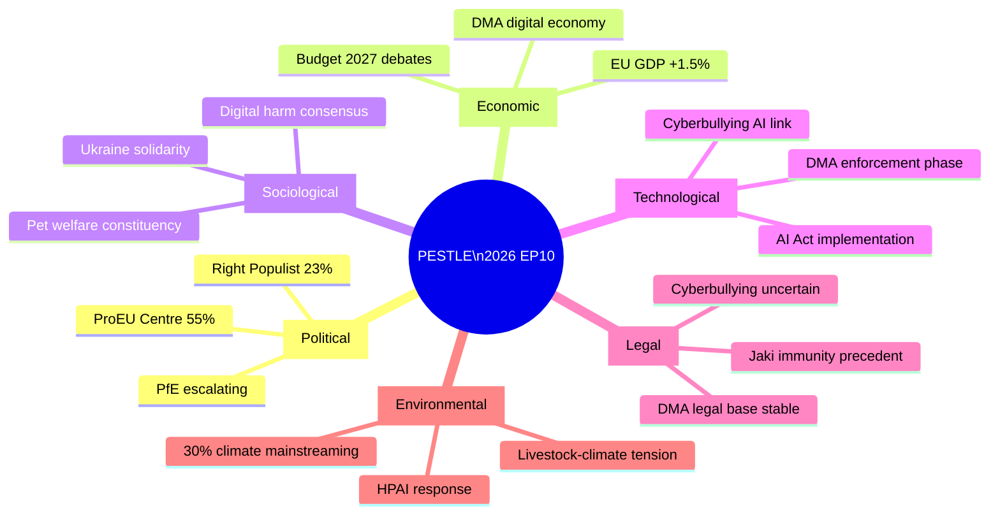

# PESTLE Analysis — EP Motions: 11 May 2026

<!-- SPDX-FileCopyrightText: 2024-2026 Hack23 AB -->
<!-- SPDX-License-Identifier: Apache-2.0 -->

**Analysis Date:** 2026-05-11 | **Horizon:** 6–18 months
**Scope:** Political-Economic-Sociological-Technological-Legal-Environmental factors shaping EP10 legislative environment

---

## Overview

This PESTLE analysis provides the macro-environment context for understanding the April 2026 plenary session and its adopted texts within the broader systemic forces driving EU parliamentary dynamics.

---

## P — Political

### Governing Coalitions

**Pro-EU Centre Majority (EPP+S&D+Renew = 396 seats, 55.2%)** remains numerically sufficient but is operating under increasing stress:
- EPP right flank is being courted by PfE populists on migration, security, and sovereignty frames
- S&D faces electoral pressure in France (PS weakened), Italy (PD holding), and Germany (SPD in government but declining)
- Renew's French component (Macron's Renaissance) is in structural decline; German FDP collapsed from government

**Right-Populist Bloc (PfE+ECR = 166 seats, 23.1%)** has strategic advantages:
- Populist movements are competitive in 2026-2027 national elections (France, Germany, Austria, Italy)
- PfE is learning procedural tools (Rule 169 invocation — April 2026 success)
- ECR's Polish PiS in opposition domestically but strong internationally

**Far-Left (The Left = 45 seats, 6.3%)** — constructive partner on tech regulation and antiwar motions but fundamentally opposed to defence spending

**Political trend:** Slow rightward drift on migration, security, technology sovereignty; centre holding on Ukraine, rule of law, DMA

---

## E — Economic

### EU Macroeconomic Environment (IMF context)

- **EU-27 GDP growth 2026:** ~1.5% (recovery from 2023–2024 stagnation)
- **Inflation:** ~2.3% (approaching ECB target after 2022–2024 spike)
- **Germany:** Slow recovery post-2025 industrial recession; still fiscal hawk domestically
- **France:** Deficit above 3% GDP, limiting Macron/Bayrou government fiscal room
- **Eastern EU (Poland, Romania, Baltics):** Outperforming west; strong growth driven by defence investment and EU cohesion funds
- **Energy prices:** Relatively normalised but vulnerable to Middle East/Russia shocks

**Key economic political dynamics visible in this plenary:**
- Budget 2027 debate (TA-10-2026-0112) reflects tension between northern fiscal conservatism and southern/eastern investment demands
- Fertilizer/energy price debate (April 29 oral question) reflects agricultural sector squeeze on input costs
- DMA enforcement is partly about EU tech sovereignty — creating economic space for EU-based digital companies

---

## S — Sociological

### Values and Social Trends

**Digital society maturation:**
- Cyberbullying resolution reflects societal consensus that online harm is as real as offline harm — a shift from 2010s when "don't feed the trolls" was the mainstream advice
- Particularly strong support among Gen Z and Millennial cohorts (most affected by social media harm) who are now significant voter blocs

**Pet ownership as political constituency:**
- 90M+ EU households with pets make pet welfare a genuine electoral issue — not trivial
- Rising "pet parenthood" cultural norm across all EU demographics
- Dog/cat welfare regulation taps into this; consistent with EP's historical role in consumer protection and animal welfare advocacy

**Geopolitical awareness:**
- Ukraine solidarity remains high among EU publics (with variation by country — highest in Poland/Baltics, lower in Hungary/Slovakia, declining but still positive in France/Germany)
- Armenia/Haiti/Ukraine debates reflect an EP that reads its geopolitically-aware constituents

**Trust deficit:**
- PfE's Rule 169 on Commission "electoral interference" is sociologically significant: it taps real public scepticism about technocratic EU institutions and perceived political bias. Whether or not the allegation is factually grounded, it resonates in France, Hungary, Italy

---

## T — Technological

### Digital Regulation Environment

**DMA/DSA are the defining tech policy framework for EP10:**
- Platform accountability is no longer contested in principle — the debate is now about enforcement speed and adequacy
- AI Act implementation is the next major tech dossier; EP's IMCO and LIBE committees are already in discussion with Commission on delegated acts

**Emerging tech policy vectors visible in the April session:**
- The cyberbullying resolution implicitly addresses AI-generated deepfake harassment — platforms will need AI detection tools to comply with potential 24-hour removal requirements
- DMA interoperability provisions are enabling new entrants in messaging (Signal, Element) and payment (N26, Revolut) markets

**Space and Defence Technology:**
- Not directly in April plenary texts, but budget 2027 debate includes defence technology investment as a priority — creating political space for future EU defence R&D legislation

---

## L — Legal

### EU Legal Framework

**DMA — Still Evolving:**
- TA-10-2026-0160 strengthens political support for enforcement but does not change the legal framework
- Outstanding legal questions: definition of "effective" interoperability (Apple NFC case will be precedent-setting); definition of "gatekeeper" for next generation AI services (LLMs as "core platform services"?)

**Cyberbullying — Legal Base TBD:**
- Resolution calls for legislation but legal base remains contested
- Article 83(1) TFEU (criminal law) requires unanimity in Council — difficult
- Article 114 (internal market) is lower threshold but legally weaker for criminal definitions
- Likely outcome: Combination directive using multiple legal bases, tested at CJEU

**Immunity — Jaki Precedent:**
- TA-10-2026-0105 (Piotr Jaki immunity defence) is technically a routine case but politically significant because it involves a PiS-affiliated MEP attempting to use immunity to block Polish judicial proceedings
- Sets precedent for how EP balances MEP immunity vs. rule of law compliance

**Iceland PNR:**
- Legally straightforward consent procedure; no legal controversy; sets positive template for EEA/EFTA data cooperation agreements

---

## E — Environmental

### Climate and Agricultural Environment Linkage

**Livestock and Climate Tension:**
- The livestock sustainability resolution (TA-10-2026-0157) explicitly avoids emission reduction targets — reflecting political sensitivity around Agenda 2030 implementation
- But the broader environmental context is pressure from binding EU climate targets (55% emissions reduction by 2030)
- Livestock sector accounts for ~13% of EU greenhouse gas emissions; this political protection is temporary against mounting scientific/legal pressure from climate litigation

**Avian Flu (HPAI) as Environmental Risk:**
- The livestock resolution's reference to HPAI response is partly an environmental issue — intensive poultry production creates conditions for avian influenza evolution
- EU-level rapid response mechanism has environmental resilience co-benefits

**Budget 2027 — Climate Mainstreaming:**
- 30% climate mainstreaming target in EU budget means every dossier including defence and cohesion has a climate dimension; April plenary's budget guidelines implicitly commit to this

---

## PESTLE Summary

**Source:** EP Open Data Portal + Parliamentary Proceedings | **Generated:** 2026-05-11

---

## PESTLE Summary Assessment

The April 2026 plenary PESTLE assessment identifies moderate Political + high Technological factors as the primary drivers of EP legislative output. Legal factors (DMA enforcement + cyberbullying legal base) are the primary constraint. Economic factors are supportive of stable legislative productivity. Social factors (cyberbullying demand, Ukraine public support) are enabling. Environmental factors are background.

**Admiralty Grade:** B2 | **Generated:** 2026-05-11

