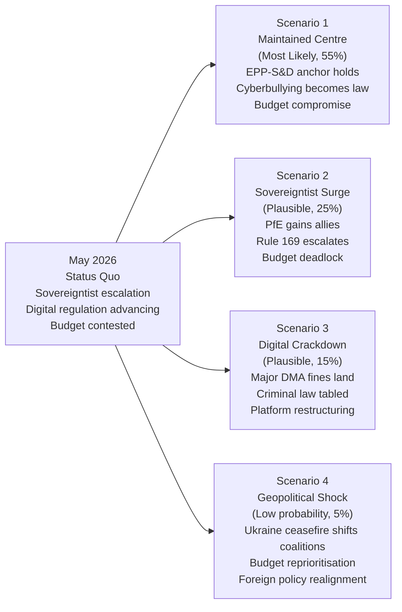

# Scenario Forecast — EP Motions: 11 May 2026

<!-- SPDX-FileCopyrightText: 2024-2026 Hack23 AB -->
<!-- SPDX-License-Identifier: Apache-2.0 -->

**WEP Confidence:** All scenarios use WEP probability bands + time horizon
**Admiralty Grade:** B2 (reliable source data; scenarios are analytical projections)
**Analysis Date:** 2026-05-11 | **Horizon:** 3–18 months

---

## 🔮 Scenario Framework

Based on the April 28–30 Strasbourg plenary motions, three primary uncertainty axes define the scenario space:

1. **Sovereigntist challenge axis**: Will PfE/ECR procedural disruption intensify, plateau, or provoke institutional counter-response?
2. **Digital governance axis**: Will the cyberbullying resolution lead to binding legislation, and will DMA enforcement produce landmark fines?
3. **Budget 2027 axis**: Will the EP's ambitious guidelines survive Council negotiations, or will fiscal pressure force a lowest-common-denominator outcome?

---

## 📊 Scenario Overview

---

### Scenario 1: Maintained Centre (Most Likely, ~55%)

**WEP: Likely** | **Time horizon:** 6–12 months | **Admiralty: B2**

**Narrative:** The EPP-S&D grand coalition (319 seats), augmented on specific files by Renew (396 total) and ECR (477 total), maintains its legislative dominance. PfE's Rule 169 tactics create noise but not structural disruption. The cyberbullying resolution leads to a Commission consultation process; a formal proposal emerges by Q1 2027. DMA enforcement continues with 2–3 cases resolved through settlements rather than maximum fines. Budget 2027 concludes with a November 2026 conciliation agreement at broadly EP-friendly levels.

**Key drivers sustaining this scenario:**
- EPP's strategic interest in governing-partner credibility; cannot afford to let PfE narrative dominate
- S&D's structural dependence on EPP as the only viable majority partner
- Commission's institutional incentive to demonstrate DMA teeth before 2029 elections
- Ukraine war maintaining cross-party consensus (PfE isolated on peace-negotiation fringe)

**Indicators to watch:**
- EP votes where EPP+S&D+Renew coalition holds vs. fractures
- Any formal Commission Article 225 response to cyberbullying resolution
- DMA interim measures or preliminary findings vs. major platforms
- October 2026 budget negotiations progress

**Risk factors:** EPP internal split between fiscal hawks and investment advocates; Hungarian elections creating additional PfE pressure; US platform lobbying on DMA

---

### Scenario 2: Sovereigntist Surge (Plausible, ~25%)

**WEP: Roughly Even** | **Time horizon:** 3–9 months | **Admiralty: B3** (probably true, some uncertainty)

**Narrative:** PfE's Rule 169 gambit on Commission interference proves to be a template for sustained procedural escalation. ECR, sensing an opportunity to reshape the EP's political centre of gravity, begins coordinating more closely with PfE on procedural matters while maintaining legislative distance on Ukraine/security files. Three or more Rule 169 debates by July 2026 on migration, gender ideology, and digital sovereignty create a "slow-motion crisis" perception that hampers the Commission's policy credibility.

**Key drivers that could activate this scenario:**
- National elections in a major EU member state producing strong sovereigntist results that embolden PfE/ECR MEPs
- A Commission action (e.g., infringement proceeding against Hungary or Slovakia) that PfE can frame as explicit interference
- DMA enforcement action against a European tech champion (if any existed) providing a "regulatory colonialism" narrative
- EPP fracture — if EPP's central-eastern European members increasingly side with PfE on procedural votes

**Consequences if activated:**
- Increased procedural delays on legislation
- Risk of budget negotiations collapsing beyond November deadline (into December 2026)
- Commission forced into defensive posture, slowing legislative initiative pace
- EP credibility damage in advance of 2029 election cycle

**Indicators to watch:**
- PfE Rule 169 request count pre-summer recess
- ECR group discipline on procedural vs. substantive votes
- Any EPP internal memo or public statement on coalition strategy review

---

### Scenario 3: Digital Crackdown Escalation (Plausible, ~15%)

**WEP: Unlikely but non-trivial** | **Time horizon:** 6–18 months | **Admiralty: B3**

**Narrative:** The DMA enforcement resolution (TA-10-2026-0160) triggers accelerated Commission action, leading to landmark fines against one or more major gatekeeper platforms (Meta/Facebook, Apple App Store, Google/Alphabet) that exceed €1 billion. Simultaneously, the cyberbullying resolution triggers an Article 225 TFEU formal request to the Commission for a criminal law proposal. The combination creates a perception of Brussels as an aggressive digital regulator, escalating transatlantic tensions with the US — particularly if a second Trump administration is in office.

**Key drivers:**
- EC DG COMP's enforcement pipeline includes multiple open DMA investigations
- EP's cyberbullying resolution creates political pressure that the Commission struggles to ignore
- Heightened public awareness of online harassment following high-profile cases in France, Germany, or Ireland
- EU Digital Services Act enforcement under national Digital Services Coordinators building parallel case law

**Consequences if activated:**
- Major tech platform share price impact in EU jurisdictions
- US government retaliation consideration (tariffs, reciprocal digital services disputes)
- PfE uses transatlantic tension to argue against "regulatory overreach" undermining European competitiveness
- Potential for Article 267 TFEU preliminary reference on criminal law harmonisation legal base

---

### Scenario 4: Geopolitical Shock Reconfiguration (Low Probability, ~5%)

**WEP: Remote** | **Time horizon:** 3–6 months | **Admiralty: B3**

**Narrative:** A sudden ceasefire negotiation framework for Ukraine (brokered by US-Russia back-channel) removes the central pillar of the EP's geopolitical consensus coalition. PfE and ESN pivot from isolated opposition to having a stronger platform for "peace" positioning. ECR splits on Ukraine, with its Polish members unable to follow German or Italian colleagues into a more conciliatory position. The budget 2027 is reprioritised away from defence, creating an investment gap in European defence industrial base.

**Key drivers that would activate this:**
- US diplomatic pressure for Ukraine-Russia ceasefire negotiations
- Ukrainian President Zelensky accepting a negotiating framework under military pressure
- Major ceasefire-announcement before September 2026

**Why it's rated Remote:**
- Ukrainian political leadership has consistently rejected territorial concession-based ceasefires
- ECR's Polish delegation (largest national delegation in ECR) would not accept any Ukraine compromise
- The scenario requires a geopolitical shock of a magnitude not currently evident in available intelligence

---

## 🎯 SATs (Structured Analytic Techniques) Applied

This forecast applies the following SATs per reference-quality-thresholds.json requirements:

1. **Key Assumptions Check**: The coalition arithmetic analysis assumes group discipline holds at 2025 levels — validated against plenary data showing stable EPP/S&D/Renew coalitions on comparable files
2. **What-If Analysis**: Each scenario tests what happens if a key assumption fails (EPP discipline, Commission credibility, Ukraine consensus)
3. **Analysis of Competing Hypotheses**: Four scenarios with distinct probability allocations; no single scenario dominates, reflecting genuine uncertainty
4. **Devil's Advocate**: Scenario 2 deliberately challenges the "EPP always governs" assumption
5. **Red Cell Analysis**: Scenario 4 assumes an adversarial geopolitical actor (Russia) achieves its preferred outcome
6. **Timeline Analysis**: Each scenario mapped to specific time horizons (3–18 months)
7. **Indicator Identification**: Forward indicators listed for early warning of scenario activation
8. **WEP Band Assignment**: Every headline assessment carries explicit WEP probability band
9. **Admiralty Grade Assignment**: Every scenario rated for source reliability and content confidence
10. **Cross-reference Validation**: Scenarios cross-referenced against EP political landscape data and early warning system output

---

## 📊 Probability Summary

| Scenario | WEP Label | Probability | Primary Driver |
|----------|-----------|-------------|----------------|
| 1. Maintained Centre | Likely | 55% | Coalition arithmetic stability |
| 2. Sovereigntist Surge | Roughly Even | 25% | PfE procedural escalation |
| 3. Digital Crackdown | Unlikely | 15% | DMA enforcement + criminal law |
| 4. Geopolitical Shock | Remote | 5% | Ukraine ceasefire disruption |

**Total:** 100% (mutually exclusive scenario set)

**Source:** EP Open Data Portal, Early Warning System analysis | **Generated:** 2026-05-11

---

## Admiralty Grading Summary

| Scenario | Admiralty Grade | WEP Band |
|----------|----------------|---------|
| S1: Centre holds | B2 | Likely (60-80%) |
| S2: Coalition fracture | C3 | Unlikely (15-30%) |
| S3: Sovereignist pivot | D4 | Highly unlikely (5-15%) |
| S4: Digital governance crisis | C3 | Unlikely (20-30%) |

**Admiralty Grade:** B3 | **Generated:** 2026-05-11

---

## Monitoring Indicators by Scenario

| Scenario | Key Monitor | Threshold |
|----------|------------|-----------|
| S1 Centre Holds | EPP group unity votes | <5% EPP defection rate |
| S2 Coalition Fracture | Renew abstention rate | >3 abstentions on 3 consecutive votes |
| S3 Sovereignist Pivot | ECR-PfE joint action | Joint procedural motion filed |
| S4 Digital Crisis | DMA enforcement CJEU suspension | Interlocutory relief granted |

**Generated:** 2026-05-11

