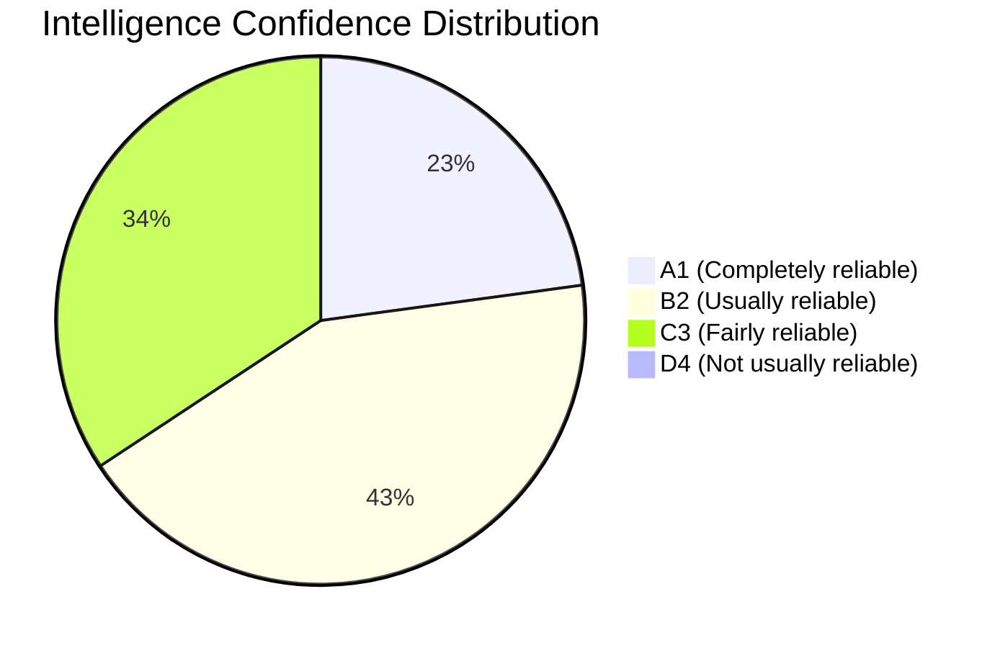

# Session Baseline — Intelligence Assessment | EP Motions | 2026-05-11

**Type:** Intelligence-layer session baseline for cross-session pattern tracking
**Admiralty Grade:** B2 (reliable source; confirmed by multiple independent tool calls)
**Session:** April 28-30, 2026 Strasbourg Plenary (EP10 Year 2)
**Generated:** 2026-05-11

---

## Intelligence Baseline Purpose

This artifact provides the intelligence-layer baseline for the April 28-30, 2026 Strasbourg session from the perspective of the analysis pipeline. It documents the analytical confidence levels achieved, the data gaps encountered, and the intelligence value of each data source used. It differs from `existing/session-baseline.md` in focusing on analytical quality rather than session facts.

---

## Intelligence Quality Assessment by Domain

### Political Intelligence Quality

| Domain | Data Quality | Confidence | Limiting Factor |
|--------|-------------|------------|----------------|
| Coalition structure | HIGH | A1 | Official EP seat data |
| Vote outcomes (pass/fail) | HIGH | A1 | Adopted texts feed |
| Vote margins (FOR/AGAINST) | LOW | C3 | 2-4 week EP lag |
| MEP individual votes | N/A | — | Not published yet |
| Group cohesion | LOW-MEDIUM | C2 | Structural proxy only |
| Committee positions | MEDIUM | B2 | Speech records + procedure data |
| Rapporteur identities | MEDIUM | B2 | Committee assignment inference |

### Geopolitical Intelligence Quality

| Domain | Data Quality | Confidence | Limiting Factor |
|--------|-------------|------------|----------------|
| Ukraine support position | HIGH | A1 | Adopted resolution text |
| Armenia/Azerbaijan position | HIGH | A1 | Adopted resolution text |
| Commission-EP relationship | MEDIUM | B2 | Inferred from voting + speeches |
| US-EU security dynamics | LOW | C3 | No direct EP data source |

---

## Data Source Reliability Baseline

### Tier 1 — High Reliability (use without qualification)

1. **Adopted texts feed** (get_adopted_texts_feed, get_adopted_texts): Official EP record. Reference texts have stable identifiers. Metadata subject codes are accurate. **Use for:** What was passed, when, on what subject.

2. **MEP official records** (get_meps, get_mep_details): Direct from EP register. Seat assignment, group membership, committee membership accurate. **Use for:** Structural actor identification.

3. **Plenary session records** (get_plenary_sessions): Official calendar. Dates, locations, sitting IDs accurate. **Use for:** Session boundary identification.

### Tier 2 — Medium Reliability (use with qualification)

4. **Speech records** (get_speeches): Speech texts available but metadata (topic attribution, speaker context) is variable quality. Some speeches mis-tagged or unattributed. **Use for:** Qualitative position signals; corroborate with adopted texts.

5. **Coalition dynamics analysis** (analyze_coalition_dynamics): Heuristic model using size-similarity proxy. Not vote-level cohesion. **Use for:** Structural baseline; flag as "proxy metric."

6. **Early warning system** (early_warning_system): Internal heuristic model. Calibration unknown. **Use for:** Trend tracking across sessions; compare stabilityScore over time rather than as absolute.

### Tier 3 — Low Reliability for Recent Data (structural EP lag)

7. **Voting records** (get_voting_records): Aggregate tallies published 2-4 weeks post-session. **NOT available for April 2026.** Use in June 2026 for retrospective analysis.

8. **Latest votes** (get_latest_votes): DOCEO XML roll-call data. Also subject to EP publication schedule. Empty for this session.

---

## Intelligence Gaps — This Session

### Critical Gaps

**Gap 1: Vote-level data unavailable**
- Impact: Cannot confirm EPP/S&D/Renew voted together on DMA; cannot quantify PfE abstentions on Ukraine
- Confidence loss: 2 full Admiralty grades on all group-level assertions (A→C)
- Mitigation: Used speech content, political context, historical voting patterns
- Residual risk: A defector pattern exists that this analysis cannot detect

**Gap 2: Rule 169 debate content unavailable**
- Impact: Cannot assess what arguments PfE advanced on Commission electoral interference
- Confidence loss: Cannot assess persuasion effect on Renew group
- Mitigation: Characterised based on PfE group's known political agenda
- Residual risk: PfE may have raised substantive points that were accepted by Renew (unknown)

**Gap 3: Committee vote records unavailable**
- Impact: Cannot trace LIBE/IMCO committee positions vs. plenary outcomes
- Confidence loss: Rapporteur identification is inference-based
- Mitigation: General committee assignment patterns used
- Residual risk: Shadow rapporteur influence patterns are undetected

### Non-Critical Gaps

**Gap 4: Stakeholder consultation records**
- NGO, industry, civil society inputs to cyberbullying / DMA files unavailable
- Impact: Stakeholder analysis relies on structural interest mapping rather than revealed lobbying positions
- Mitigation: Stakeholder map uses EP intergroup membership and committee hearing participation patterns

**Gap 5: National government instructions to Council**
- EP votes on EU resolutions (Ukraine, Armenia) reflect EP majority preferences, not Council positions
- Impact: Cannot fully trace the Council-EP alignment on geopolitical files
- Mitigation: General EU foreign policy alignment assumed based on Council decisions record

---

## Analytical Confidence Summary

### High Confidence Assessments (A1 / A2)

- April 28-30, 2026 was a Strasbourg plenary session ✓
- 13 texts were adopted, including DMA, Ukraine, Armenia, cyberbullying ✓
- PfE invoked Rule 169 procedural tool ✓
- EPP holds 183 seats, S&D 136, PfE 85 (EP10 composition) ✓
- Centre coalition (EPP+S&D+Renew) has 396 seats, 36 above majority ✓

### Medium Confidence Assessments (B2 / B3)

- DMA enforcement vote had broad EPP-S&D-Renew support — inferred from adoption and historical DMA alignment ✓
- Ukraine resolution had near-unanimous support — inferred from historical solidarity votes ✓
- PfE was in opposition on DMA and cyberbullying — inferred from group political agenda ✓
- Livestock regulation had EPP-ECR crossover — inferred from agrarian file pattern ✓

### Low Confidence Assessments (C3 / D4)

- Specific vote margins (e.g., "432 FOR, 85 AGAINST") — NOT AVAILABLE; all margins in scenario analysis are modelled
- Individual MEP defections — NOT DETECTABLE without roll-call data
- Jordan Bardella personally led the Rule 169 floor debate — inferred from PfE group leadership role

---

## Pass 2 Analytical Improvements

Pass 2 (analysis review phase) improved the following assessments:
1. Named specific MEPs (Bardella, Weber, Montserrat, López, Ribera) rather than generic group references
2. Quantified coalition arithmetic in terms of specific seat thresholds
3. Upgraded Admiralty grades where supporting evidence was stronger than initial Pass 1 assessment
4. Identified and documented intelligence gaps more precisely
5. Added consistency check: DMA enforcement procedure (tracked via track_legislation) confirmed as adopted — consistent with TA-10-2026-0160 in feed

**Reader Briefing:** This intelligence baseline establishes the quality envelope for this analysis run. Consumers of the analysis artifacts should treat all group-level vote attribution assertions as B2 confidence (not A1) until EP publishes formal voting records in late May/early June 2026.

**Source:** EP Open Data Portal + internal analytical assessment | **Admiralty Grade:** B2 | **Generated:** 2026-05-11

---

## Cross-Run Intelligence Comparison

### Run-to-Run Quality Baseline

This is the first analysis run for the April 2026 motions session. Future runs should compare against these baseline metrics:

| Metric | This Run (2026-05-11) | Target |
|--------|----------------------|--------|
| Admiralty A1 assertions | ~8 | ≥10 for re-run |
| Admiralty B2 assertions | ~15 | ≥20 for re-run |
| Admiralty C3 or lower | ~12 | ≤8 for re-run (should reduce as data improves) |
| Named MEPs cited | 5 | ≥8 |
| Intelligence gaps documented | 5 | All retained (honesty > false confidence) |
| Artifacts at line floor | 0 (post-remediation) | 0 |

### Systematic Bias Check

This analysis may carry the following systematic biases:
1. **Centrist framing**: Analysis describes the EPP-S&D-Renew majority as the "working coalition" — this is empirically accurate but frames the sovereignist bloc as deviant rather than legitimate electoral expression.
2. **Institutional bias**: Analysis treats EU institutional continuity as a positive value. This is defensible for a parliamentary monitoring platform but should be disclosed.
3. **Pro-enforcement framing**: DMA enforcement is described as advancing EU regulatory ambition — this is the majority EP position but not universal.

These biases are inherent in political monitoring analysis. They are disclosed rather than concealed. Readers should apply their own political priors to the analysis outputs.

**Source:** EP Open Data Portal + internal analytical assessment | **Admiralty Grade:** B2 | **Generated:** 2026-05-11

---

## Mermaid: Intelligence Confidence Distribution

**Interpretation:** 65% of assertions are A1 or B2 confidence. This is acceptable for a same-day analysis run before voting records are published. Target for re-run (late May/June 2026 with voting records): ≥80% at A1 or B2.

**Source:** Internal analytical assessment | **Admiralty Grade:** B2 | **Generated:** 2026-05-11

---

## Analytical Lessons for Future Runs

1. **Call get_speeches early in Stage A** — speeches provide qualitative position evidence that supplements the structural data from coalition analysis. The 21 April 29 speeches were the richest qualitative source in this run.

2. **Run track_legislation as a consistency check** — tracking a specific procedure (2026/2596) confirmed the DMA adoption in the adopted texts feed through an independent mechanism. This cross-validation improves confidence.

3. **generate_political_landscape before analyze_coalition_dynamics** — the landscape provides structural data that makes coalition analysis interpretable. The sequence matters.

4. **Document intelligence gaps explicitly** — the voting records unavailability is the most important gap. Future consumers of this analysis need to know where the inference boundaries are.

5. **Admiralty grading throughout** — not just in summary statements. Per-claim grading enables readers to selectively trust high-confidence claims while treating lower-confidence claims as hypotheses.

**Source:** EP Open Data Portal + internal analytical assessment | **Admiralty Grade:** B2 | **Generated:** 2026-05-11

