# Stakeholder Map — EP Motions: 11 May 2026

<!-- SPDX-FileCopyrightText: 2024-2026 Hack23 AB -->
<!-- SPDX-License-Identifier: Apache-2.0 -->

**Analysis Date:** 2026-05-11 | **Plenary Week:** April 28–30, 2026 Strasbourg

---

## 🗺️ Overview

This stakeholder map identifies the key actors — political groups, national delegations, institutional players, civil society, and third-party states — whose interests are implicated in the adopted texts and debates of the April 28–30, 2026 Strasbourg plenary.

```mermaid
graph TD
    subgraph EP_GROUPS["EP Political Groups"]
        EPP["EPP 183 seats\nManfred Weber, chair\nDominant coalition driver"]
        SND["S&D 136 seats\nNicolás González, chair\nProgressive partner"]
        PFE["PfE 85 seats\nJordan Bardella circle\nSovereigntist challenger"]
        ECR["ECR 81 seats\nECR coordination\nSelective partner"]
        RNW["Renew 77 seats\nLiberal bridge-builder"]
        GRN["Greens/EFA 53 seats\nClimate/rights anchor"]
        LFT["The Left 45 seats\nCritical opposition"]
        NI["NI 30 seats\nUnattached bloc"]
        ESN["ESN 27 seats\nFar-right fringe"]
    end
    subgraph INSTITUTIONS["EU Institutions"]
        COM["European Commission\nTarget of PfE challenge\nDMA enforcer"]
        EUCO["European Council\nBudget gatekeeper"]
        ECB["European Central Bank\nMonetary backdrop"]
    end
    subgraph STATES["Key Member States"]
        PL["Poland\nJaki immunity; Tusk-PiS tensions"]
        HU["Hungary\nPfE co-anchor; budget conditionality"]
        FR["France\nRN (PfE); DMA tech pressure"]
        DE["Germany\nEPP/S&D anchor; budget creditor"]
        IT["Italy\nECR/PfE hybrid; livestock interests"]
    end
    subgraph CIVIL["Civil Society & Industry"]
        PLAT["Tech Platforms\nMeta, TikTok, Google\nDMA+cyberbullying targets"]
        FARM["Farmers/Agricultural Lobby\nCOPA-COGECA\nLivestock interests"]
        HRC["Human Rights Orgs\nHRW, Amnesty\nArmenia, Haiti, Ukraine"]
        MEDIA["Media Groups\nEBU, journalism NGOs\nPress freedom angle"]
    end
    EPP --> COM
    PFE --> COM
    PL --> EPP
    PL --> ECR
    HU --> PFE
    FR --> PFE
    DE --> EPP
    DE --> SND
    IT --> ECR
    IT --> PFE
    PLAT --> COM
    FARM --> EPP
    FARM --> ECR
```

---

## 🎭 Key Stakeholder Perspectives

### 1. EPP (European People's Party) — 183 seats

**Position:** Centre-right dominant; managing the legislative agenda while balancing internal tensions between its pro-rule-of-law wing (Nordic/German delegations) and its central-eastern European members who align more closely with PiS/Fidesz on sovereignty questions.

**Interests at stake this week:**
- **Cyberbullying resolution**: EPP backed criminal law approach as part of its "safe internet for children" campaign, aligning with its family values positioning
- **Budget 2027**: EPP wants strategic investment (defence, digital) but resists revenue-raising instruments; internal tension between fiscal hawks (German CDU/CSU) and investment advocates (Polish EPP, Romanian EPP)
- **Livestock sector**: EPP anchors this coalition, serving its rural and agricultural base; opposes any livestock reduction mandates
- **Armenia/Ukraine**: EPP strongly pro-Ukraine and pro-Armenia's democratic transition; uses these resolutions to differentiate from PfE

**Influence score: 9/10** — Controls committee chairs, EP leadership, and legislative agenda-setting

**Perspective depth:** EPP's internal diversity (27 countries) creates perpetual centrifugal pressure. Weber's leadership challenge is to maintain group discipline while accommodating the Orbán-adjacent members of Fidesz (now in NI) and their allies' pressure from PfE. The budget week exposed this: EPP's German delegation pushed for fiscal discipline while Romanian and Polish EPP members demanded maintained structural fund levels.

---

### 2. PfE (Patriots for Europe) — 85 seats

**Position:** Sovereigntist right opposition; elected mandate focused on national sovereignty, immigration control, and resistance to "Brussels overreach." Third-largest group, exercising influence primarily through procedural disruption and media narrative rather than legislative majority-building.

**Interests at stake this week:**
- **Rule 169 debate on Commission interference**: PfE's signature move — forces a plenary debate that creates optics of Brussels accountability, generates national media coverage
- **Budget 2027**: PfE opposes EU-level fiscal instruments; prefers repatriation of competences
- **Livestock/DMA**: PfE supports farmers but opposes regulatory expansion of DMA
- **Ukraine resolution**: Most PfE members (especially French RN, Hungarian Fidesz-aligned) avoid explicit support for Ukraine resolutions; some abstain

**Influence score: 6/10** — Cannot build majority but can force debates, tablé amendments, delay proceedings

**Perspective depth:** PfE's Rule 169 request on "Commission interference in elections" reflects a sophisticated communications operation rather than a legislative strategy. The group knows it cannot block the Commission from its normal activities, but the debate creates a parliamentary record that can be used in national campaign materials. For RN (France), this is particularly valuable in post-Macron political context. For Fidesz-aligned members, it resonates with ongoing EU-Hungary tensions over rule-of-law conditionality.

---

### 3. S&D (Socialists & Democrats) — 136 seats

**Position:** Centre-left anchor of the progressive coalition; co-governing partner with EPP on major files while maintaining distinct identity on social rights, anti-austerity, and anti-discrimination.

**Interests at stake this week:**
- **Cyberbullying**: Strong supporter; aligns with digital rights and women's safety agenda
- **Ukraine/Russia**: Consistent strong supporter; uses it to differentiate from PfE
- **Armenia**: Backs democratic transition; Armenia resolution links to S&D's values-based foreign policy
- **Budget 2027**: Pushes for social cohesion, anti-poverty programmes; resists defence-heavy reallocation
- **Livestock**: Supports environmental standards alongside economic sustainability
- **Roma inclusion (debate)**: S&D's traditional constituency — pushes for binding equality frameworks

**Influence score: 8/10** — Essential for any progressive majority; has genuine agenda-setting power on social files

**Perspective depth:** S&D's challenge is managing the tension between its Nordic members (who prioritise climate and social standards) and its southern European members (who prioritise economic recovery and agricultural interests). On the livestock sustainability file (TA-10-2026-0157), this tension was visible: Danish and Dutch S&D members wanted stronger environmental conditionality, while Spanish and Italian members prioritised farmer income security.

---

### 4. ECR (European Conservatives and Reformists) — 81 seats

**Position:** National conservative, euro-sceptic but not anti-EU; occupies the space between EPP and PfE, enabling selective legislative partnerships on agriculture, defence, and security files.

**Interests at stake this week:**
- **Livestock**: Strong supporter alongside EPP; rural conservative base
- **PNR/Iceland agreement**: Security-hawk support for surveillance tools
- **Immunity — Patryk Jaki**: ECR's complex position — Jaki is ECR (Polish), but the immunity waiver reflects legal proceedings brought by the Tusk government; ECR protested the waiver but failed to block it
- **Ukraine**: ECR strongly pro-Ukraine (especially Polish members); creates tension with PfE alignment on other files
- **DMA enforcement**: ECR wary of expanding regulatory burden; abstained or opposed

**Influence score: 7/10** — Kingmaker on agricultural, security, and conservative social files

**Perspective depth:** Jaki's immunity case is ECR's most sensitive domestic Polish politics moment of the week. ECR MEPs (particularly its Polish PiS contingent) see the immunity waiver as politically motivated persecution by the Tusk government; however, the PRIV committee recommendation — supported by EPP, S&D, and Renew — was legally clean and ECR could not muster an effective counter-argument within the committee process. The waiver passed, but ECR issued a strong political statement condemning what it termed "judicial weaponisation."

---

### 5. European Commission

**Position:** Institutional executor of legislative mandates; simultaneously the target of PfE's democratic legitimacy challenge and the body that must follow up on the cyberbullying and DMA enforcement resolutions.

**Interests at stake this week:**
- **DMA enforcement** (TA-10-2026-0160): EP resolution calls for accelerated enforcement action against major tech platforms; Commission DG COMP under pressure to deliver visible results before next elections
- **Cyberbullying** (TA-10-2026-0163): EP calls for legislative proposal; Commission must assess if it has a suitable legal base or must use Article 225 TFEU mechanism
- **PfE Rule 169 debate**: Commission representatives obliged to attend and defend their activities on elections; Commission's political management of this is closely watched by member states

**Influence score: 8/10** — Controls legislative initiative; can delay follow-up to EP resolutions

**Perspective depth:** Commissioner-level response to the PfE Rule 169 debate is a test case for how the 2024-elected Commission handles the populist challenge to its legitimacy. The Commission's standard response — presenting its activities as technical/neutral — increasingly fails to land with PfE's communicators, who reframe everything as political interference. The Commission's strategic communications team will need a sharper counter-narrative.

---

### 6. Tech Platforms (Meta, TikTok, Google, X/Twitter)

**Position:** Subject to both DMA enforcement (TA-10-2026-0160) and proposed cyberbullying criminal provisions (TA-10-2026-0163); industry lobbying is intense around both files.

**Interests at stake this week:**
- **DMA enforcement**: Each major platform is subject to ongoing DMA investigations; EP resolution amplifies political pressure for faster Commission action, which could trigger more fines, remedies, and structural changes
- **Cyberbullying criminal law**: Industry's nightmare scenario — criminal liability for platform operators if they "enable systematic harassment"; platforms have lobbied heavily for safe harbour provisions and human review requirements before any criminal referral

**Influence score: 6/10 (outside parliament)** — Heavy lobbying presence; but EP's legislative independence limits direct influence

---

### 7. Agricultural Sector — COPA-COGECA

**Position:** EU farmers' umbrella lobby; engaged on TA-10-2026-0157 (livestock sustainability).

**Interests at stake this week:**
- Livestock sustainability text: Successfully avoided any mandatory livestock reduction targets; text focuses on "support" and "resilience" framing rather than "reduction"
- CAP reform context: Uses this resolution as a political signal against further regulatory burden pre-MFF 2028 negotiations
- Animal disease references in text: Supports EU-level funding for disease response (HPAI avian flu; African swine fever)

**Influence score: 7/10 (agricultural files)** — Strong rural member state lobbying; EPP and ECR champions

---

## 🌍 Third-Party States

| State | Key Text | Position | Stakes |
|-------|---------|----------|--------|
| Ukraine | TA-10-2026-0161 | Beneficiary | EP's continued political support signal |
| Armenia | TA-10-2026-0162 | Beneficiary | EU association trajectory validation |
| Russia | TA-10-2026-0161 | Target of accountability call | Diplomatic isolation reinforced |
| Haiti | TA-10-2026-0151 | Beneficiary | Humanitarian attention |
| Iceland | TA-10-2026-0142 | Partner state | PNR cooperation agreement |
| USA | DMA enforcement (TA-10-2026-0160) | Indirectly affected | All major DMA-designated gatekeepers are US-based |

---

## 🔗 Stakeholder Network Interaction Model

| Stakeholder | Allies This Week | Adversaries This Week | Key File |
|-------------|-----------------|----------------------|----------|
| EPP | S&D, Renew, ECR (selective) | PfE on budget | Budget 2027, Cyberbullying, Livestock |
| S&D | EPP, Renew, Greens/EFA | PfE, ECR on social files | Cyberbullying, Roma, Ukraine |
| PfE | ECR (partially) | EPP, S&D, Commission | Rule 169, Budget |
| ECR | EPP (agricultural), PfE (procedural) | S&D on Jaki immunity | Livestock, Jaki waiver |
| Commission | EPP, Renew, S&D | PfE | DMA enforcement, Cyberbullying follow-up |
| Tech platforms | None (institutional) | Commission, EP majority | DMA, Cyberbullying |
| Farmers/COPA | EPP, ECR | Greens/EFA | Livestock sustainability |

**Source:** EP Open Data Portal | **Methodology:** Stakeholder Network Analysis with WEP confidence bands

**Admiralty Grade:** B2 | **Generated:** 2026-05-11 | **Pass 2 completed:** yes

