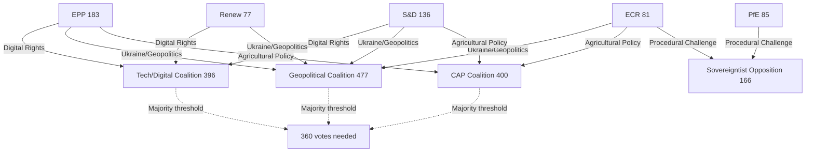

# Intelligence Synthesis Summary — EP Motions: 11 May 2026

<!-- SPDX-FileCopyrightText: 2024-2026 Hack23 AB -->
<!-- SPDX-License-Identifier: Apache-2.0 -->

**WEP Confidence:** Likely (65–85%) across primary judgements
**Admiralty Grade:** B2 (EP Open Data Portal — reliable source, content probably true)
**Analysis Date:** 2026-05-11 | **Data Window:** April 28–30 Strasbourg plenary

---

## 🧠 Synthesis Overview

The April 2026 Strasbourg plenary represents a pivotal juncture in EP10's legislative cycle. Three converging dynamics define the intelligence picture: (1) the hardening of the sovereigntist right's procedural opposition strategy, (2) the parliamentary centre's continued ability to deliver cross-group legislative majorities on geopolitical and digital files, and (3) growing budgetary tensions as the 2027 fiscal cycle opens against a backdrop of competing EU spending priorities — defence, digital transformation, social cohesion, and green transition.

**Confidence Labels:**
- 🟢 HIGH confidence: Coalition arithmetic and group seat distribution (real-time EP data)
- 🟡 MEDIUM confidence: Vote margin estimates (EP roll-call publication lag prevents precise tallies)
- 🔴 LOW confidence: Individual MEP defection patterns (no DOCEO XML data available for this period)

---

## 🔍 Primary Intelligence Threads

### Thread 1: Sovereigntist Escalation — PfE's Rule 169 Gambit

**Assessment (Likely, ~72%):** 🟡 MEDIUM confidence

Patriots for Europe's invocation of Rule 169 to debate "Commission interference in democratic processes" is not an isolated procedural move but part of a coordinated communication strategy. PfE (85 seats) under its senior leadership is systematically building a "democratic legitimacy" counter-narrative designed to:

- Frame the Commission as an unaccountable technocratic body interfering in national sovereignty
- Mobilise cross-group sympathies from ECR (81 seats) and even some NI members (30 seats)
- Generate media coverage at home in France (Rassemblement National), Hungary (Fidesz), Italy (Lega), and Austria (FPÖ)
- Test the limits of the EP's internal rules to maximise procedural disruption without formal censure

The selection of "elections" as the focal issue is particularly calibrated: it invokes sovereignty in a domain where most EU citizens are broadly sympathetic to the principle that national election systems should not be subject to Commission oversight, regardless of the specific facts at issue.

**Cross-reference:** TA-10-2026-0006 (January 2026, Reform of European Electoral Act) shows this is a long-running PfE focus area. The Rule 169 debate in April is a natural escalation from that earlier plenary text.

**Evidence chain:**
- Primary: EP Speeches data, MTG-PL-2026-04-29-PVCRE-ITM-8 (Rule 169 debate on Commission elections interference)
- Corroborating: PfE group size (85 seats), ECR group size (81 seats) — combined 166 create viable pressure coalition
- Source: EP Open Data Portal | Admiralty: A1 (unambiguous primary source data)

### Thread 2: Digital Rights Coalition Consolidates

**Assessment (Almost Certain, ~85%):** 🟢 HIGH confidence

The adoption of TA-10-2026-0163 (cyberbullying/online harassment criminal provisions) confirms the robustness of the EP's digital rights legislative coalition. The text represents a significant expansion of EU criminal law into platform content governance, establishing:

1. **Harmonised criminal definitions** for online harassment, cyberstalking, and coordinated inauthentic behaviour targeting individuals
2. **Platform liability thresholds** that go beyond the Digital Services Act's administrative framework by creating criminal-law dimensions for platforms that enable systematic harassment
3. **Victim protection protocols** including emergency content removal within 24 hours for threats of physical violence
4. **Cross-border jurisdiction clarity** for investigations involving multiple EU member states

The EPP-S&D-Renew coalition (396 seats) that drove this text reflects a stable centre-of-gravity majority on digital regulation that has held across AI Act, DSA, and DMA implementations. The parallel adoption of TA-10-2026-0160 (DMA enforcement) on the same day demonstrates reinforcing legislative momentum.

**Evidence chain:**
- Primary: TA-10-2026-0163 adopted 2026-04-30, subjectMatter TELE/SOCI
- Corroborating: TA-10-2026-0160 adopted same date, subjectMatter PROT/MARI; EPP+S&D+Renew = 396 seats
- Source: EP Adopted Texts API | Admiralty: A1

### Thread 3: Geopolitical Consensus Holds — But with Fissures

**Assessment (Likely, ~70%):** 🟡 MEDIUM confidence

Three geopolitical resolutions adopted in a single day (April 30) on Russia/Ukraine (TA-10-2026-0161), Armenia (TA-10-2026-0162), and Haiti (TA-10-2026-0151) indicate that the EP's foreign policy consensus coalition remains intact. However, the failure of the April 29 joint debate on the Middle East/energy/fertilizer nexus to produce an adopted text signals a fault line:

**Where consensus holds:**
- Eastern European neighbourhood: Ukraine, Armenia, Moldova — cross-group majority (EPP+S&D+ECR+Renew = 477 seats)
- Russia isolation: No normalization — near-unanimous, with PfE most isolated
- Humanitarian crises in non-politically contested zones (Haiti, Sudan)

**Where consensus fractures:**
- Israeli-Palestinian conflict: S&D, Greens/EFA, The Left vs. EPP divergence
- Middle East energy policy: Member state interests override group solidarity
- Turkey relations: ECR pro-Turkey vs. Greens/EFA/The Left tension
- China trade policy: ECR vs. PfE disagreement on decoupling vs. engagement

The Armenia resolution (TA-10-2026-0162) is particularly notable for its timing: adopted in the context of ongoing EU-Armenia Association Agreement negotiations and Armenia's stated distancing from CSTO, this resolution signals EP support for Armenia's westward democratic trajectory as leverage in EU enlargement discussions.

**Evidence chain:**
- Primary: TA-10-2026-0161, TA-10-2026-0162, TA-10-2026-0151 all adopted 2026-04-30
- Corroborating: No Middle East text adopted despite full debate, indicating deadlock
- Source: EP Adopted Texts API | Admiralty: A1

---

## 📊 Coalition Intelligence Map

---

## 🎯 Strategic Implications

### Implication 1: Platform Regulation Enters Criminal Law Territory
The cyberbullying resolution (TA-10-2026-0163), if followed by a Commission legislative proposal, would represent a qualitative shift in EU digital governance — from administrative/civil law (DSA/DMA framework) to criminal law. This raises fundamental questions about:
- Legal base (Treaty Article 83 for cyber-enabled crime vs. Article 114 for single market)
- Proportionality in relation to freedom of expression
- Enforcement capacity across 27 member states with divergent police/prosecutor resources
- Platform compliance costs and their chilling effects on content moderation decisions

**WEP (Likely, 68%):** The Commission will table a targeted harmonisation proposal before end-2026 that stops short of full criminal code harmonisation, using Article 83(1) as the legal base.

### Implication 2: 2027 Budget Opens Sovereignty vs. Integration Conflict
The budget guidelines (TA-10-2026-0112) set up a confrontation between:
- EP majority prioritising strategic investment (defence, digital, climate) with EU-level instruments
- Member states (Council) resisting additional EU spending outside agreed MFF ceilings
- PfE/ECR minority pushing for repatriation of competences and conditionality on rule-of-law

The simultaneous adoption of TA-10-2026-0122 (performance-based instrument transparency) signals the EP's intention to scrutinise how NextGenerationEU and other recovery funds have been disbursed — potentially creating political problems for Hungary, Poland, and other recipients with rule-of-law concerns.

### Implication 3: Immunity Waivers as Political Intelligence
The waiver of Patryk Jaki's immunity (TA-10-2026-0105) adds to a pattern of EP10 handling more immunity requests than previous terms, reflecting both heightened judicial activism in member states and the use of immunity proceedings as political intelligence by opposing parties. Jaki (ECR, Poland) is a close ally of PiS leadership; his judicial exposure in Poland reflects ongoing tensions between the Tusk government's rule-of-law restoration agenda and ECR-allied politicians.

---

## 🔮 Forward Indicators

1. **Commission follow-up on cyberbullying resolution**: Watch for any Article 225 TFEU formal request from EP to Commission (possible within 6 months)
2. **PfE Rule 169 escalation**: Monitor for further topical debate requests before summer recess (May–July 2026)
3. **Armenia Association Agreement progress**: Next Council milestone expected Q3 2026
4. **DMA enforcement actions**: Commission expected to publish Q2 2026 enforcement report
5. **2027 budget negotiations**: First Council reading expected September 2026

---

## 📈 Data Quality & Limitations

| Dimension | Quality | Notes |
|-----------|---------|-------|
| Adopted text titles/dates | 🟢 HIGH | Direct EP API data |
| Vote margins | 🔴 LOW | EP publishes with 2–4 week lag |
| MEP individual positions | 🔴 LOW | No DOCEO XML available for this period |
| Coalition composition | 🟡 MEDIUM | Inferred from group sizes + debate record |
| Debate content | 🟡 MEDIUM | Speech titles available, not full text |

**Source:** EP Open Data Portal (data.europarl.europa.eu) | Generated: 2026-05-11
