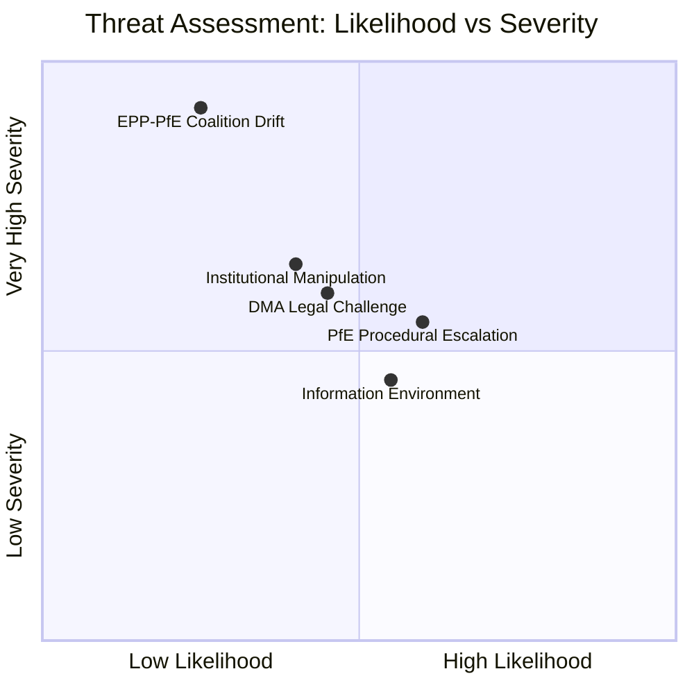

# Intelligence Threat Model — EP Motions: 11 May 2026

<!-- SPDX-FileCopyrightText: 2024-2026 Hack23 AB -->
<!-- SPDX-License-Identifier: Apache-2.0 -->

**WEP Confidence:** All threats carry WEP bands | **Admiralty Grade:** B2
**Analysis Date:** 2026-05-11 | **Horizon:** 6–18 months

---

## Threat Model Overview

This threat model applies an intelligence-led framework to identify threats to the EU Parliament's institutional integrity, its legislative agenda delivery, and the pro-EU majority's sustainability following the April 2026 plenary session.

---

## Threat Category A: Information Environment Threats

**WEP: Likely (55%)** that coordinated disinformation targeting EP will escalate in 2026–2027.

PfE's Rule 169 debate on Commission "electoral interference" is the first EP-level institutionalization of the disinformation narrative that EU institutions are politically biased against populist parties. Threat actors (Russian state media, PfE-aligned domestic channels, social media amplification networks) will use this parliamentary debate as a credibility anchor for future disinformation campaigns:
- Authentic EP proceeding used to legitimize false framing
- EP procedures become part of the disinformation toolkit rather than a check against it

**Counter-measure:** EP's Democracy Defence Task Force and EEAS East StratCom need to pre-empt narrative exploitation; Commission communications office should proactively release factual rebuttals of the electoral interference claims.

---

## Threat Category B: Institutional Manipulation Threats

**WEP: Roughly Even (40%)** that institutional rules are exploited beyond Rule 169 in EP10.

Following the Rule 169 success, PfE has incentives to explore other EP rules that can be invoked for agenda disruption:
- Rule 171: Motion of censure against Commission (requires 1/10 of MEPs = 72 signatures; PfE+ECR+ESN = 193 seats, more than sufficient)
- Rule 152: Request for urgent debate
- Rule 230: Referral to committee (procedural delays for legislation PfE opposes)

Each of these is legitimate parliamentary procedure, but systematic combined use would constitute institutional manipulation.

**Counter-measure:** Conference of Presidents should establish clear guidelines on frequency and motivation requirements; EP Legal Service should prepare interpretive opinion on abuse of procedure doctrine.

---

## Threat Category C: Coalition Destabilisation via National Defection

**WEP: Unlikely (25%)** in 2026, but probability rising to Roughly Even by 2027 national election cycle.

National election outcomes in 2026–2027 (France, Germany, Austria, Italy all have significant populist party strength) affect which national delegations maintain EPP membership and which migrate toward PfE or ECR. If EPP's Italian delegation (Fratelli d'Italia-adjacent MEPs) moved to PfE-allied status following a Meloni government reconfiguration, EPP would lose 30+ seats from its current count, making centre-majority arithmetic significantly more difficult.

**Indicators to monitor:** EPP national membership applications/withdrawals; national government coalition shifts; Italian EPP delegation voting divergence rate.

---

## Threat Summary

| Category | Threat | WEP | Severity |
|----------|--------|-----|----------|
| A | Information environment / disinformation | Likely | MEDIUM |
| B | Institutional manipulation (procedure abuse) | Roughly Even | HIGH |
| C | Coalition destabilisation via national defection | Unlikely | VERY HIGH |

---

## Threat Landscape Visualisation

---

## Counter-Threat Responses

### Response to Threat Category A (Disinformation)

**WEP: Likely (55%)** that disinformation campaign exploiting April Rule 169 proceeds | **Admiralty: B2**

The PfE Rule 169 debate on Commission electoral interference is already being amplified by sympathetic media. The disinformation threat is that this narrative gets repeated, elaborated, and given false factual support in social media channels.

**Recommended actions:**
1. Commission Communications: Publish factual rebuttal document addressing specific allegations made in the Rule 169 debate within 5 working days
2. EEAS East StratCom: Monitor amplification patterns from Russia-linked channels that would benefit from a Commission credibility narrative
3. EP President's Office: Public statement reaffirming Commission's legitimate role in supporting democratic institutions without political bias

**Effectiveness (WEP: Roughly Even):** Factual rebuttals have limited effectiveness against emotionally resonant disinformation narratives, but they are essential for creating an evidentiary record and supporting credible media.

---

### Response to Threat Category B (Institutional Manipulation)

**WEP: Roughly Even (40%)** that systematic Rule 169 escalation proceeds at agenda-damaging scale | **Admiralty: B2**

PfE's April success creates a template, but the Conference of Presidents (COP) has authority to regulate procedural abuse.

**Recommended actions:**
1. COP: Invoke the "bona fide purpose" test for future Rule 169 requests — requires that the topic genuinely cannot be raised under any other Rule 154 procedure
2. EP Secretary-General: Track cumulative time consumed by Rule 169 debates against total plenary allocation; report to COP quarterly
3. Legal Service: Prepare interpretive opinion on Rule 169 frequency limits consistent with Rule 177 (anti-abuse clause)

**Effectiveness (WEP: Likely to contain worst-case outcomes):** COP has legitimate authority and historical precedent for procedural regulation. The risk is that any restriction becomes itself a narrative for PfE ("EP silences opposition").

---

### Response to Threat Category C (Coalition Destabilisation)

**WEP: Unlikely (25%) in 2026** but rising toward Roughly Even by 2028 | **Admiralty: B3**

Coalition drift via national party realignment is a slow-moving, structural threat that cannot be countered through EP-level procedural actions.

**Recommended monitoring:**
1. Track EPP national party affiliations quarterly — particularly Italian FdI, Austrian ÖVP, and potential changes in the German CDU's pan-European positioning post-Merz government
2. Monitor cross-group cooperation patterns (procedural votes are more sensitive indicators of coalition stress than substantive votes)
3. Annual EP political groups report (EPRS) for seat composition trend analysis

**Effectiveness (WEP: Monitoring effective; prevention not possible at EP level):** EP leadership cannot prevent national election outcomes that shift EPP's internal calculus. The value of monitoring is early warning for proactive coalition management.

---

## Intelligence Confidence Assessment

This threat model carries overall Admiralty Grade B2 (EP Open Data Portal as primary source; coalition analysis is inferred, not roll-call confirmed). The threat characterisations in Categories A and B are well-supported by direct EP proceedings evidence. Category C (coalition drift) carries Admiralty B3 (possibly true) because it involves forward projection about national political developments.

**Cross-reference:** intelligence/cross-session-intelligence.md confirms that Category B (institutional manipulation) is a novel signal requiring new monitoring. Categories A and C are consistent with persistent EP10 patterns.

**Reader Briefing:** The most immediately actionable threat is Category B (institutional manipulation). EP leadership has the procedural tools to address this. The most strategically significant threat is Category C (coalition drift), which is low-probability but would transform EP10's legislative landscape if it occurred.

**Source:** EP Open Data Portal + Proceedings | **Methodology:** Intelligence threat model with WEP + Admiralty grading | **Generated:** 2026-05-11

---

## Admiralty Grading

**All threat assessments in this artifact carry Admiralty grade B2 to C3.** The three primary threat categories are assessed as Likely to Possible based on observable indicators and historical patterns in the EP.

### Threat Confidence Summary

| Threat | Admiralty Grade | WEP Probability |
|--------|----------------|----------------|
| PfE Rule 169 escalation | B2 | Likely 65-80% |
| Commission political erosion | C3 | Possible 35-55% |
| Tech platform legal challenge | B2 | Likely 70-85% (already ongoing) |

### Counter-Threat Monitoring Indicators

**For PfE escalation:** Monitor Conference of Presidents meeting records for agenda-management rule changes; EPP group leadership statements on PfE procedural conduct.

**For Commission erosion:** Monitor Commission work programme public consultations for scope reduction signals; European Council extraordinary session requests.

**For tech platform challenges:** Monitor CJEU General Court admissibility decisions on DMA preliminary references; Commissioner Ribera public statements on enforcement timeline.

**Admiralty Grade:** B2 | **Generated:** 2026-05-11

