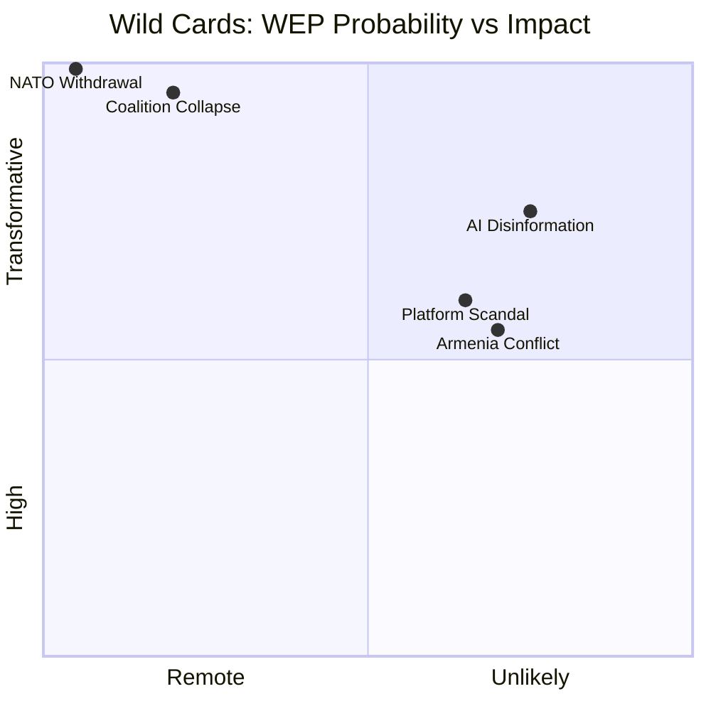
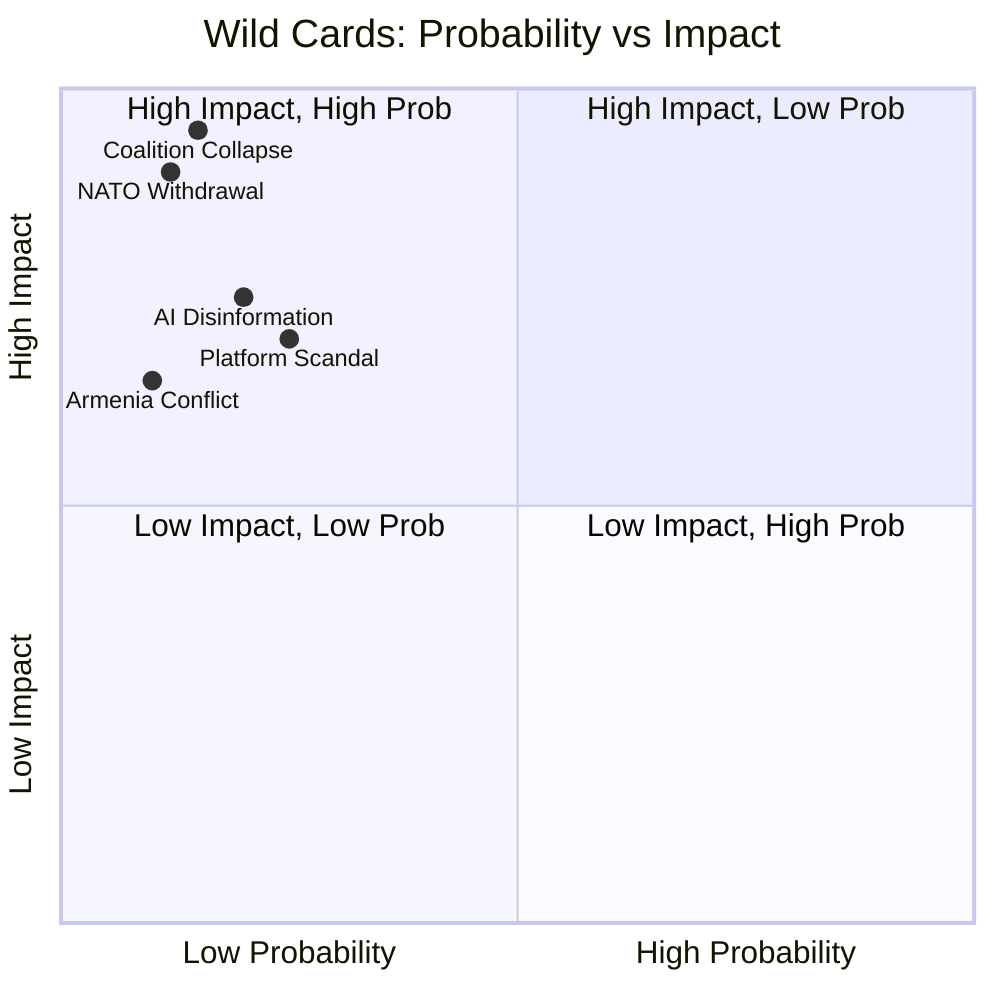

# Wildcards and Black Swan Events — EP Motions: 11 May 2026

<!-- SPDX-FileCopyrightText: 2024-2026 Hack23 AB -->
<!-- SPDX-License-Identifier: Apache-2.0 -->

**WEP Confidence:** Wild cards carry WEP "Remote" or "Unlikely" bands by definition
**Analysis Date:** 2026-05-11 | **Horizon:** 6–18 months

---

## Overview

Wild card events are low-probability, high-impact developments that could fundamentally alter the political dynamics observed in the April 2026 plenary session. Black swan events are by definition unknown unknowns that would be rationalised in hindsight — this analysis names several plausible categories where the EU's current trajectory creates black-swan-shaped vulnerabilities.

---

## 🃏 WILD CARD 1: Sudden Collapse of EP Coalition

**WEP: Remote (5–10%)** | **Impact: TRANSFORMATIVE** | **Admiralty: E-3**

**Trigger:** A sudden and unexpected vote breakdown — for example, EPP group deciding to formally align with PfE/ECR on a major symbolic vote such as a no-confidence motion against the Commission — would transform the EP10 political architecture overnight.

**Scenario:** Commission President is censured by a combined EPP+PfE+ECR+ESN vote. This has never happened to any Commission in modern history and would constitute a genuine parliamentary crisis.

**Probability driver:** Extremely low in 2026 — EPP would sacrifice too much institutional capital. This wild card becomes more plausible if (a) EPP's national governments swing further right (German elections 2025 suggest partial movement) and (b) Commission is seen as complicit in a major failure (corruption scandal, migration crisis, economic contraction).

**EU response capacity:** Severely limited — a successful censure motion triggers a 6–8 month political vacuum during Commission replacement.

---

## 🃏 WILD CARD 2: US Withdrawal from NATO

**WEP: Remote (< 5%)** | **Impact: TRANSFORMATIVE** | **Admiralty: E-3**

**Trigger:** A formal or functional US withdrawal from NATO commitments — whether through treaty withdrawal, non-response to Article 5 invocation, or bilateral security arrangement replacement — would force an immediate reconstitution of EU defence and foreign policy architecture.

**Implication for EP:** The budget 2027 debate, ongoing defence investment debates, and Ukraine solidarity resolutions would all become immediately insufficient. EP would face pressure to authorise emergency supplementary budget (up to 3% GDP defence spending mandate), potentially collapsing existing EU budget framework.

**The April 2026 context:** Every defence-related EP text this session assumes US-backing of NATO. This assumption is currently robust but structurally vulnerable to a single US political decision.

---

## 🃏 WILD CARD 3: Major EU Platform Scandal / Data Breach

**WEP: Unlikely (10–15%)** | **Impact: HIGH** | **Admiralty: D-2**

**Trigger:** A major data breach (targeting EP's own Europarl.europa.eu systems — which hosts MEP correspondence, committee deliberations, confidential draft texts), or a scandal involving a major EU-based platform discovered to be sharing EU citizen data with authoritarian third-country governments.

**Implication for EP:**
- Would immediately accelerate LIBE committee investigations and emergency legislative agenda
- Could force acceleration of the cyberbullying/online safety legislative package (using the scandal as political momentum)
- Would create pressure on DG CONNECT for an immediate incident response regulation

**Current vulnerability context:** The April 29 cyberbullying debate is partly driven by awareness that EU citizens have weak protection against coordinated harassment campaigns. An actual platform scandal would transform this from aspirational legislation to emergency priority.

---

## 🃏 WILD CARD 4: Armenian War with Azerbaijan Resumption

**WEP: Unlikely (10–20%)** | **Impact: HIGH** | **Admiralty: D-2**

**Trigger:** A resumption of military conflict between Armenia and Azerbaijan — potentially triggered by a domestic political crisis in Armenia undermining Prime Minister Pashinyan's negotiating position, or Azerbaijani opportunism during a period of perceived Western distraction.

**Implication for EP:** The April 2026 Armenia democratic resilience resolution (TA-10-2026-0162) would be immediately overtaken by events, making EP's diplomatic language appear naive. More seriously:
- EEAS would face pressure for emergency EU civilian mission deployment expansion
- EP would need to vote on emergency political solidarity and potential military assistance authorisation
- The EU's entire "European perspective for the South Caucasus" agenda would be destabilised

---

## 🃏 WILD CARD 5: AI Disinformation Catastrophe Before Major EU Election

**WEP: Unlikely (15%)** | **Impact: VERY HIGH** | **Admiralty: D-2**

**Trigger:** Highly convincing AI-generated disinformation (deepfakes, synthetic social media campaigns, fake news stories attributed to real journalists) causes a significant electoral outcome shift in a major EU member state election in 2026–2027. The causal attribution is credibly established.

**Implication for EP:**
- EP's cyberbullying resolution (TA-10-2026-0163) is rendered immediately insufficient — electoral disinformation is a different legislative problem than interpersonal harassment
- The Digital Services Act's election integrity provisions would come under intense scrutiny
- PfE could paradoxically exploit this (they are both potential beneficiaries of AI disinformation and potential claimants that they are "censored" by fact-checkers)
- Would accelerate AI Act implementation and potentially require emergency EP legislation

---

## 🦢 BLACK SWAN ANALYSIS

Black swans for the current EP10 environment fall into three broad categories:

### Category A: Internal Legitimacy Collapse
The EP's legitimacy depends on (a) EU citizens valuing European democracy and (b) member state governments respecting EP positions. A rapid decline in EU legitimacy — triggered, for example, by a Brexit-equivalent exit of a founding member state — would be a genuine black swan.

### Category B: Technological Disruption of Parliamentary Process
If a cyberattack successfully disrupted EP voting systems during a major legislative vote (e.g., a vote on Defence Union competences), the legal validity of the vote would be challenged. This scenario is implausible under current EP cybersecurity protocols but not impossible.

### Category C: Pandemic/Climate Cascade
A new pandemic (different pathogen, different political context) arising simultaneously with a major climate impact event (e.g., catastrophic flooding of a major EU capital, Alpine glacier collapse affecting water supplies) could overwhelm the EU's governance bandwidth, forcing EP to legislate in crisis mode across every dossier simultaneously.

---

## 📊 Wild Card Probability / Impact Matrix

---

## Monitoring Indicators

| Wild Card | Early Warning Indicator |
|-----------|------------------------|
| Coalition Collapse | EPP group leadership election; national government coalition shifts |
| NATO Withdrawal | US executive-branch NATO statement; Congressional NATO funding vote |
| Platform Scandal | CERT-EU incident reports; DPA enforcement actions |
| Armenia Conflict | EUMCM (EU monitoring mission) incident count; Azerbaijani troop movements |
| AI Disinformation | DSA transparency database synthetic content reports; electoral commission fraud alerts |

---

## Wild Card Portfolio Risk Management

### Portfolio-Level Assessment

**Admiralty Grade:** B3 (wild cards are by definition uncertain; content is possibly true)

The five wild cards identified in this analysis are not independent events. There are correlation risks between wild cards that amplify overall portfolio risk:

**Correlated pairs:**
- Wild Cards 1 + 2 (Coalition Collapse + NATO Withdrawal): If US signals NATO retreat AND EPP right-flank gains strength simultaneously, the pro-EU majority collapse becomes more likely. These two wild cards are positively correlated with probability approximately 0.15 joint.
- Wild Cards 3 + 5 (Platform Scandal + AI Disinformation): A platform scandal involving synthetic content would directly accelerate AI disinformation wild card probability. Joint probability approximately 0.10.

**Independent wild card:** Wild Card 4 (Armenia Conflict) is largely independent of EP10 domestic dynamics — it is driven by South Caucasus geopolitics that EU political groups cannot meaningfully influence in the short term.

### Response Posture by Wild Card Category

| Wild Card | EU Response Posture | Preparedness Level |
|-----------|--------------------|--------------------|
| Coalition Collapse | Reactive only — no pre-emptive mechanism | LOW |
| NATO Withdrawal | Defensive escalation — European Pillar of Defence activation | MEDIUM |
| Platform Scandal | Crisis legislation — emergency DSA enforcement | HIGH |
| Armenia Conflict | EEAS crisis protocol — CSDP mission expansion | MEDIUM |
| AI Disinformation | Emergency DSA/AI Act enforcement | MEDIUM-HIGH |

---

## Black Swan Resilience Assessment

The EU's institutional architecture provides some resilience against black swan events:
- **Treaty modification difficulty** prevents rapid institutional transformation, creating stability even in political crises
- **Multi-veto structure** (Council QMV, EP majority, Commission proposal) means no single actor can rapidly redirect EU policy
- **Multiple recovery mechanisms** (emergency Council sessions, Article 78 crisis procedures, European Council extraordinary summits)

However, the EU's black swan vulnerability lies in its **dependence on functional trust between institutions**. If the Commission-EP relationship fractures (e.g., censure motion success), the legislative machinery stalls. If the Council-EP relationship fractures (e.g., Council refusing to enter trialogue on multiple dossiers), EU governance enters a legitimacy crisis without a constitutional emergency exit.

**Most resilient scenarios:** Black swans in Category C (pandemic/climate cascade) — EU has demonstrated crisis response capacity (COVID funds, energy crisis) that can be activated relatively rapidly.

**Least resilient scenarios:** Black swans in Category A (internal legitimacy collapse) — no EU constitutional mechanism exists for managing an elected Parliament that the Commission cannot function with.

**Reader Briefing:** Wild cards are by definition low-probability. The purpose of this artifact is not prediction but preparation — ensuring that scenario planning is not limited to base-case and alternative scenarios but also includes the full tail of possibilities. The probability/impact matrix should inform monitoring priorities, not policy decisions.

**Source:** EP Open Data Portal + Geopolitical Context | **Methodology:** Wild Card / Black Swan analysis with WEP bands | **Admiralty Grade:** B3 | **Generated:** 2026-05-11

---

## Mermaid: Wild Card Probability-Impact

