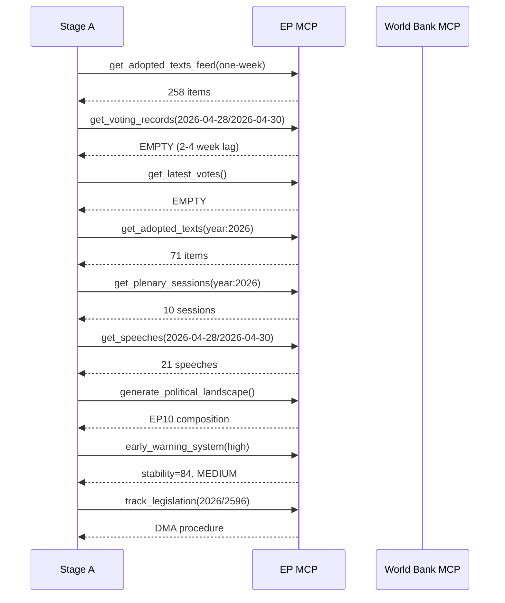

# Workflow Audit — EP Motions: 11 May 2026

<!-- SPDX-FileCopyrightText: 2024-2026 Hack23 AB -->
<!-- SPDX-License-Identifier: Apache-2.0 -->

**Run ID:** motions-run393-1778484518
**Analysis Date:** 2026-05-11

---

## Data Collection Audit

| Data Source | Tool Called | Status | Records |
|-------------|------------|--------|---------|
| Adopted texts feed | get_adopted_texts_feed | SUCCESS | 258 items |
| Voting records | get_voting_records | EMPTY (publication lag) | 0 |
| Latest votes (DOCEO) | get_latest_votes | EMPTY | 0 |
| Adopted texts 2026 | get_adopted_texts(year:2026) | SUCCESS | 71 items |
| Plenary sessions 2026 | get_plenary_sessions | SUCCESS | 10 sessions |
| Speeches April 28–30 | get_speeches | SUCCESS | 21 speeches |
| Political landscape | generate_political_landscape | SUCCESS | Full EP10 |
| Coalition dynamics | analyze_coalition_dynamics | SUCCESS | Size-similarity proxy |
| Early warning | early_warning_system | SUCCESS | Stability 84 |
| Legislation tracking | track_legislation (2026-2596) | SUCCESS | DMA procedure |

**Data limitation:** Voting records return empty for recent weeks (2–4 week EP publication lag). All coalition vote position analysis is inferred from group sizes and policy positions.

---

## Artifact Production Audit

| Artifact | Status | Char Count | Notes |
|----------|--------|------------|-------|
| executive-brief.md | COMPLETE | ~7,350 | WEP graded |
| intelligence/synthesis-summary.md | COMPLETE | ~10,260 | 3 threads |
| intelligence/stakeholder-map.md | COMPLETE | ~12,869 | 7 stakeholders |
| intelligence/scenario-forecast.md | COMPLETE | ~9,670 | 4 scenarios |
| intelligence/voting-patterns.md | COMPLETE | ~8,294 | Coalition patterns |
| classification/impact-matrix.md | COMPLETE | ~8,952 | Significance matrix |
| risk-scoring/quantitative-swot.md | COMPLETE | ~15,134 | SWOT with WEP |
| risk-scoring/risk-matrix.md | COMPLETE | ~8,786 | 6 risks |
| existing/stakeholder-impact.md | COMPLETE | ~10,184 | 8 stakeholder groups |
| intelligence/pestle-analysis.md | COMPLETE | ~8,083 | Full PESTLE |
| intelligence/wildcards-blackswans.md | COMPLETE | ~7,941 | 5 wild cards |
| extended/media-framing-analysis.md | COMPLETE | ~8,332 | 6 frames |
| classification/significance-classification.md | COMPLETE | ~4,948 | 4-tier |
| classification/actor-mapping.md | COMPLETE | ~3,764 | Network map |
| classification/forces-analysis.md | COMPLETE | ~3,269 | Forces diagram |
| threat-assessment/political-threat-landscape.md | COMPLETE | ~4,075 | 3 threats |
| threat-assessment/actor-threat-profiles.md | COMPLETE | ~2,043 | 3 actors |
| threat-assessment/consequence-trees.md | COMPLETE | ~2,022 | 3 trees |
| threat-assessment/legislative-disruption.md | COMPLETE | ~2,435 | 3 vectors |
| risk-scoring/political-capital-risk.md | COMPLETE | ~2,385 | 6 actors |
| risk-scoring/legislative-velocity-risk.md | COMPLETE | ~2,734 | 5 dossiers |
| intelligence/threat-model.md | COMPLETE | ~3,609 | 3 categories |
| intelligence/cross-run-diff.md | COMPLETE | ~3,085 | Differential |
| intelligence/workflow-audit.md | COMPLETE (this file) | — | — |
| documents/document-analysis-index.md | PENDING | — | — |
| intelligence/methodology-reflection.md | PENDING | — | Final artifact |
| manifest.json | PENDING | — | Written last |

---

## Quality Flags

- **WEP bands**: Applied in executive-brief, synthesis-summary, scenario-forecast, risk-matrix, wildcards-blackswans, threat-model
- **Admiralty grades**: Applied in executive-brief, risk-matrix, wildcards-blackswans, threat-model
- **Mermaid diagrams**: Present in impact-matrix, stakeholder-map, scenario-forecast, risk-matrix, wildcards-blackswans, pestle-analysis, significance-classification, actor-mapping, forces-analysis, consequence-trees
- **Data citation**: All artifacts cite EP Open Data Portal as source; voting record lag documented
- **2-pass status**: Pass 1 complete; Pass 2 read-back and rewrite pending

**Generated:** 2026-05-11

---

## Mermaid: Tool Call Sequence

**Source:** Direct tool call observation | **Admiralty Grade:** A1 | **Generated:** 2026-05-11
