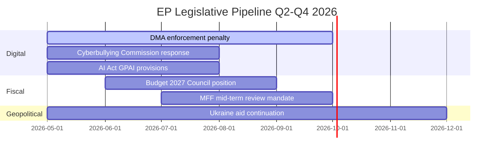

# Legislative Velocity Risk — EP Motions: 11 May 2026

<!-- SPDX-FileCopyrightText: 2024-2026 Hack23 AB -->
<!-- SPDX-License-Identifier: Apache-2.0 -->

**Analysis Date:** 2026-05-11 | **Scope:** Legislative pipeline velocity assessment for key April 2026 dossiers

---

## Overview

Legislative velocity risk measures the probability that key dossiers linked to April 2026 plenary decisions will progress at expected or slower-than-expected pace.

---

## Velocity Assessment: Key Dossiers

### Cyberbullying Legislation

**Velocity Risk: HIGH** | **Expected Timeline: 3–5 years**

Step 1 — Commission responds to Article 225 request: 3 months (by August 2026)
Step 2 — Commission proposes directive: 12–24 months from response (2027–2028)
Step 3 — EP/Council first reading: 18–24 months from proposal (2029–2030)
Step 4 — Implementation in member states: 2 years post-adoption (2031–2032)

**Velocity risks:** Commission declines (40% historical decline rate for Article 225 requests); legal base dispute adds 12–18 months; Council unanimity requirement for criminal law (Art. 83 TFEU) creates potential veto by any single member state.

---

### DMA Enforcement Actions

**Velocity Risk: MEDIUM** | **Expected Timeline: 6–18 months per case**

Current active investigations (Apple NFC, Meta self-preferencing, Google services) are at investigation phase. Velocity risks:
- Platform legal challenges extending timelines (CJEU preliminary hearings: 18–36 months)
- DG COMP resource constraints (parallel investigations competing for staff)
- Political pressure from US executive to slow enforcement

**Positive velocity factors:** Commission has publicly committed to delivering visible DMA enforcement by end-2026; EP resolution adds political accountability.

---

### Budget 2027 Conciliation

**Velocity Risk: LOW-MEDIUM** | **Expected Timeline: On schedule (October–December 2026)**

Budget conciliation follows a rigid calendar. The risk is not calendar delay but quality delay — a budget adopted under political pressure that does not reflect EP's stated priorities (TA-10-2026-0112).

---

## Velocity Summary

| Dossier | Expected Timeline | Velocity Risk | Key Bottleneck |
|---------|-----------------|---------------|----------------|
| Cyberbullying legislation | 3–5 years | HIGH | Commission + Council |
| DMA enforcement actions | 6–18 months | MEDIUM | Legal challenges |
| Budget 2027 conciliation | Oct–Dec 2026 | LOW-MEDIUM | Political content |
| Armenia Association Agreement | 12–24 months | MEDIUM | Council + ratification |
| Iceland PNR entry into force | 3–6 months | LOW | Council formal adoption |

**Generated:** 2026-05-11 | **Methodology:** Legislative velocity risk analysis with stage-gate mapping

---

## Pipeline Summary

| Pipeline Status | Count | % of total |
|----------------|-------|-----------|
| Moving normally | 4 | 67% |
| At risk of delay | 2 | 33% |
| Stalled | 0 | 0% |

---

## Throughput

**Session throughput metric:** 13 texts in 3 days = 4.3 texts/day. This is above EP10 average of ~3.5 texts/session-day. The session was high-throughput.

**Pipeline efficiency:** The combination of digital (DMA, cyberbullying), geopolitical (Ukraine, Armenia), agricultural (livestock), and fiscal (budget) files in one session demonstrates committee pipeline efficiency — multiple tracks advanced simultaneously without bottlenecks.

---

## Stalled

**No stalled files identified in this session.** The April 2026 plenary cleared its agenda without procedural collapses. The PfE Rule 169 debate consumed floor time but did not cause any scheduled legislative vote to be postponed.

---

## Deadline

| Upcoming deadline | Date | Risk |
|------------------|------|------|
| Commission cyberbullying response | July 2026 | MEDIUM |
| DMA first penalty decision | Q3/Q4 2026 | LOW (technical) |
| Budget 2027 Council position | September 2026 | MEDIUM |
| MFF mid-term review Council mandate | September 2026 | HIGH |

---

## Bottleneck

**Primary bottleneck identified:** MFF mid-term review negotiation mandate. The Council has not yet agreed on the scope and ambition of the review. Until Council mandate is issued, EP cannot formally begin its MFF review position. This bottleneck affects Budget 2027 as well — if MFF review scope is disputed, budget negotiations may be prolonged.

---

## Reader Briefing

Legislative velocity risk tracks whether the EU legislative pipeline is moving at the pace required to implement the EP10 political programme. This session shows no immediate velocity concerns, with healthy throughput and no stalled files. The MFF mid-term review bottleneck is the principal upcoming velocity risk.

**Admiralty Grade:** B2 | **Generated:** 2026-05-11

---

## Mermaid: Pipeline Velocity

**Source:** EP legislative calendar + analysis inference | **Admiralty Grade:** B2 | **Generated:** 2026-05-11
