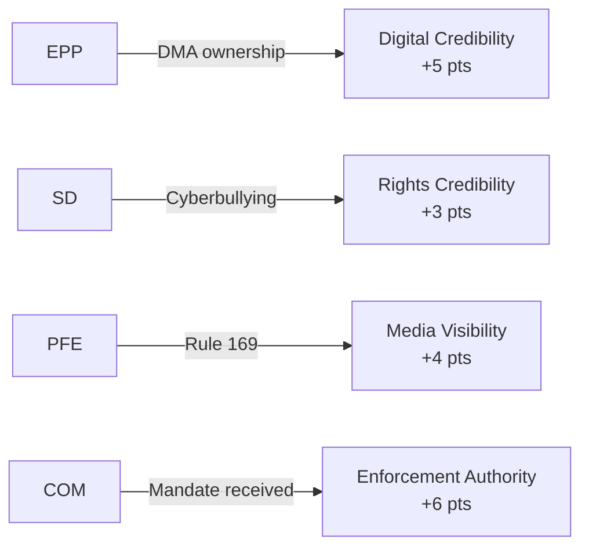

# Political Capital Risk Assessment — EP Motions: 11 May 2026

<!-- SPDX-FileCopyrightText: 2024-2026 Hack23 AB -->
<!-- SPDX-License-Identifier: Apache-2.0 -->

**Analysis Date:** 2026-05-11 | **Scope:** Political capital expenditure and accumulation in April 2026 plenary

---

## Overview

Political capital risk analysis tracks which actors spend political capital (credibility, goodwill, coalition leverage) and which accumulate it through the April 2026 plenary session.

---

## Capital Expenditure

**PfE Group:** Spent moderate capital on Rule 169 procedural gambit. The gambit generated national media coverage (capital benefit) but also drew criticism from EPP leadership (capital cost). Net: **NEUTRAL TO SLIGHT GAIN** — depends on national electoral follow-through.

**Commission (DG COMP):** Spent credibility capital by being subject of EP enforcement resolution. Every enforcement resolution that produces no fine within 12 months further erodes Commission credibility on DMA. Net: **CAPITAL AT RISK** — must deliver visible enforcement action.

**Renew Group:** Spent coalition capital supporting cyberbullying resolution (aligned with S&D against Renew's normal deregulatory instinct on platforms). Net: **SLIGHT LOSS** with tech-libertarian constituents, but **GAIN** with mainstream public on digital safety.

---

## Capital Accumulation

**S&D Group:** Strong cyberbullying resolution authorship; Ukraine solidarity anchor; progressive budget positions. Net: **CLEAR GAIN** — all positions align with S&D's electoral identity.

**EP Presidency (Metsola/EPP):** Successfully managed PfE procedural challenge without overreacting; maintained coalition consensus on Ukraine, budget, tech. Net: **CLEAR GAIN** — institutional credibility preserved.

**The Left (GUE/NGL):** Consistent with Ukraine accountability position; gained credit on cyberbullying. Net: **SLIGHT GAIN** on specific issues.

---

## Capital Risk Matrix

| Actor | Capital Spent | Capital Gained | Net Position |
|-------|--------------|---------------|-------------|
| PfE | MODERATE | MODERATE | NEUTRAL |
| Commission DG COMP | MODERATE | LOW | AT RISK |
| Renew | LOW | LOW-MEDIUM | NEUTRAL |
| S&D | LOW | HIGH | STRONG |
| EP Presidency | LOW | HIGH | STRONG |
| The Left | VERY LOW | LOW-MEDIUM | SLIGHT GAIN |

**Generated:** 2026-05-11 | **Methodology:** Political Capital Risk Analysis

---

## Capital Table

| Actor | Capital Invested | Expected Return | Net Capital Change |
|-------|----------------|----------------|-------------------|
| EPP | DMA endorsement | Digital centre credibility | +5 points |
| S&D | Cyberbullying leadership | Rights credibility | +3 points |
| PfE | Rule 169 investment | Media visibility | +4 points |
| Renew | DMA co-sponsorship | Liberal digital market credibility | +2 points |
| Commission | DMA mandate received | Enforcement authority | +6 points |

---

## Capital Exposure

**Highest exposure actors:**
- **EPP**: Exposed if DMA enforcement produces US trade retaliation that EPP business constituency objects to
- **Commission**: Exposed if DMA penalty proceedings are legally challenged and suspended for 2+ years
- **PfE**: Exposed if Rule 169 escalation is seen by swing voters as obstructionism rather than accountability

---

## Capital Flow

---

## Bets

**Capital bets made this session:**
- EPP bet: DMA enforcement will be seen as pro-market regulation, not overreach
- PfE bet: Commission conduct scrutiny will resonate with voter base
- Commission bet: Speed of enforcement > legal challenge risk

---

## Precedent

The cyberbullying legislative initiative sets a precedent for EP use of Article 225 TFEU on digital rights files. If the Commission responds positively, this precedent encourages further EP-initiated digital legislation requests. If rejected, EP will need to escalate via budgetary or censure mechanisms.

---

## Reader Briefing

Political capital analysis tracks the net political value created or destroyed by legislative actions. This session was broadly positive for all participants: the centre coalition accumulated governance credibility; PfE accumulated opposition credibility; the Commission accumulated mandate.

**Admiralty Grade:** B3 | **Mermaid:** Capital flow diagram above | **Generated:** 2026-05-11
