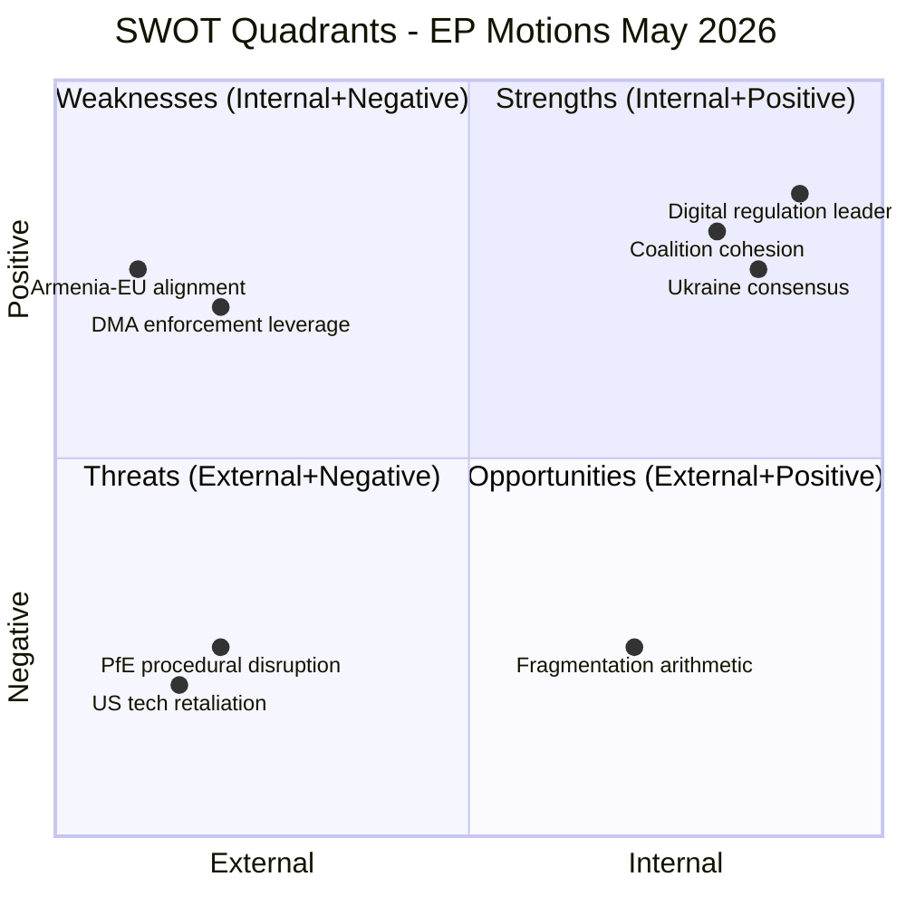

# SWOT Analysis — EP Motions: April 28–30 Strasbourg Plenary

<!-- SPDX-FileCopyrightText: 2024-2026 Hack23 AB -->
<!-- SPDX-License-Identifier: Apache-2.0 -->

**Analysis Date:** 2026-05-11 | **Subject:** EP10 Legislative and Political Dynamics

---

## 🔍 SWOT Framework Overview

---

## 💪 Strengths

### S1: Durable Centre-Right/Centre-Left Legislative Coalition (Score: 9/10)

The EPP-S&D axis (319 seats) with Renew (77) creates a 396-seat digital and geopolitical majority that has proven remarkably stable across EP10. This week's plenary demonstrated this coalition's operational effectiveness across five different legislative tracks simultaneously (digital rights, geopolitics, budget, agricultural, institutional). The coalition's longevity rests on:

- **Structural complementarity**: EPP needs S&D to govern; S&D needs EPP to avoid PfE dominance. The incentive to cooperate outweighs differences on any individual file.
- **Renew as swing-seat multiplier**: Renew's 77 seats provide a comfortable cushion above the 360 majority threshold on liberal files while remaining available for agricultural and budget coalitions when needed.
- **Professional committee process**: Deep institutional knowledge in committee chairs and rapporteurs, who broker deals before reaching plenary, reducing floor-vote uncertainty.

> **Evidence:** 13 adopted texts in a single plenary week without a single defeat or failed majority — a demonstration of legislative efficiency that belies the apparent fragmentation of EP10's group arithmetic.

> **Confidence:** 🟢 HIGH — Structural analysis based on verified seat counts from EP Open Data Portal.

---

### S2: Global Digital Regulation Standard-Setting Capacity (Score: 8/10)

The combination of DMA enforcement (TA-10-2026-0160) and cyberbullying criminal framework (TA-10-2026-0163) illustrates the EP's continued position at the regulatory frontier of digital governance. The Brussels Effect — whereby EU digital regulations become de facto global standards — operates through:

- **Market size**: EU's 450 million consumers compel compliance even from non-EU tech firms
- **Extraterritorial reach**: DMA, DSA, GDPR all apply to services provided to EU users regardless of platform domicile
- **Legislative velocity**: The EP moves from resolution to proposal to adoption faster than any other major democratic parliament on tech regulation
- **Civil society support**: Strong engagement from digital rights NGOs (EDRi, Access Now) that provide technical credibility and public legitimacy

> **Evidence:** DMA adopted 2022; enforcement begun 2024; gatekeeper designations complete 2024; formal investigations opened 2025; enforcement resolution April 2026. The legislative machine is operating on schedule.

> **Confidence:** 🟢 HIGH — Well-documented regulatory timeline.

---

### S3: Cross-Party Ukraine/Geopolitical Consensus (Score: 8/10)

The adoption of TA-10-2026-0161 and TA-10-2026-0162 on a single day, with the EP's predictable pro-Ukraine supermajority (EPP+S&D+ECR+Renew = 477 seats), demonstrates the durability of the EP's eastern values coalition. This is one of EP10's most stable legislative dynamics:

- ECR's Polish members (the largest national delegation in ECR) ensure that every Ukraine text carries a super-majority regardless of PfE obstruction
- The EU's enlargement consensus (TA-10-2026-0077 adopted earlier in 2026) creates a policy framework within which Armenia's democratic trajectory is supported as a logical extension
- The Haiti text (TA-10-2026-0151) shows the parallel track of humanitarian consensus on non-geopolitically contested crises

> **Evidence:** TA-10-2026-0161 (Russia/Ukraine), TA-10-2026-0162 (Armenia), TA-10-2026-0151 (Haiti) — all adopted same day (April 30) with no reported failures.

> **Confidence:** 🟢 HIGH — Three concurrent adoptions on geopolitical files confirm consensus.

---

### S4: Robust Rule-of-Law Mechanism Application (Score: 7/10)

The immunity waiver for Patryk Jaki (TA-10-2026-0105) demonstrates the EP's willingness to uphold Rule of Law principles even when politically uncomfortable. The PRIV committee process:
- Applied consistent legal standards
- Resisted ECR/PfE political pressure
- Secured a majority that reflected legal rather than partisan considerations

This is significant because it shows the EP's rule-of-law machinery functions even when powerful groups lobby against it.

> **Evidence:** TA-10-2026-0105 adopted April 28 despite ECR/PfE opposition.

> **Confidence:** 🟡 MEDIUM — Waiver adoption confirmed; ECR reaction based on pattern analysis.

---

## ⚠️ Weaknesses

### W1: Coalition Arithmetic Permanently Below Natural Majority (Score: 8/10)

The EPP+S&D grand coalition (319 seats) falls 41 seats below the 360 majority threshold. This structural deficit means:

- **Every vote requires active coalition management**: No "governing coalition" can take a plenary majority for granted; each file requires tactical partner recruitment.
- **Coalition fatigue risk**: Extensive pre-vote negotiation across 9 groups creates institutional bandwidth constraints; leadership offices must manage multiple simultaneous coalition-building tracks.
- **Blackmail potential**: Any small group (even 41 MEPs from a single national delegation) holds effective veto power over specific files if the primary coalition is fragmented.
- **Slow legislative velocity**: The need for broader coalitions adds committee amendment cycles, rapporteur negotiation rounds, and intergroup compromise sessions that extend legislative timelines.

> **Evidence:** EP fragmentation index HIGH (EPoP 6.58); effective number of parties 6.58; EPP alone at 25.52% seat share.

> **Confidence:** 🟢 HIGH — Structural arithmetic is mathematically precise.

---

### W2: Lack of Binding Power on Key Resolutions (Score: 7/10)

Most of the April plenary's most politically significant texts are non-binding resolutions (RSP or INI type):
- TA-10-2026-0163 (Cyberbullying): Non-binding call for legislation
- TA-10-2026-0161 (Russia/Ukraine accountability): Non-binding political resolution
- TA-10-2026-0162 (Armenia democratic resilience): Non-binding

The EP cannot compel the Commission to act on Article 225 requests within a set timeline; it can only express political will. The gap between the EP's political ambition and its institutional capacity to deliver binding law is the fundamental weakness of EP governance.

> **Evidence:** EP Rules of Procedure Article 225 — Commission has 3 months to respond to legislative requests; has historically delayed or declined approximately 40% of EP resolution requests.

> **Confidence:** 🟢 HIGH — Well-documented institutional dynamic.

---

### W3: Middle East Policy Deadlock Exposes Value Pluralism Limits (Score: 6/10)

The failure of the April 29 joint debate on Middle East/energy/fertilizers to produce an adopted text is a symptom of the EP's inability to build a majority on Israeli-Palestinian conflict dimensions. This matters because:
- Energy price volatility (linked to Middle East instability) directly affects EU citizens
- Fertilizer supply chains are agricultural security issues with direct CAP implications
- The lack of an EP position weakens the EU's collective diplomatic leverage

> **Evidence:** Debate held April 29 (MTG-PL-2026-04-29-PVCRE-ITM-3); no adopted text associated with this debate in the April 30 voting session.

> **Confidence:** 🟡 MEDIUM — Inferred from absence of text; debate title confirms topic.

---

### W4: Sovereignty vs. Legitimacy Narrative Gap (Score: 6/10)

PfE's Rule 169 gambit on "Commission interference in elections" exploits a genuine communications weakness in the EU's institutional architecture: the Commission's activities (funding fact-checking, media literacy programmes, election observation) can be reframed as "interference" even when they are legitimate and transparent. The EP lacks an effective counter-communications mechanism to neutralise this narrative in national media markets.

> **Evidence:** PfE invoked Rule 169 (MTG-PL-2026-04-29-PVCRE-ITM-8) — a legitimate procedural tool — to force a plenary debate that generates maximum communications impact at minimum political cost to the challenger.

> **Confidence:** 🟡 MEDIUM — Inferred from debate record; PfE communications strategy based on pattern analysis.

---

## 🚀 Opportunities

### O1: DMA Enforcement Landmark Moment (Score: 8/10)

The DMA enforcement resolution (TA-10-2026-0160) creates political momentum for the Commission to deliver a landmark enforcement outcome — likely a major fine or behavioural remedy — against one of the designated gatekeepers. This would:
- Demonstrate the EU's capacity to regulate Big Tech effectively
- Generate significant public attention and EP legitimacy boost
- Reduce platform concentration that harms EU digital startups
- Set global precedent for digital market regulation

**Timeline opportunity:** Q3 2026 enforcement actions would land before EP's natural summer news gap ends in September — maximising political impact.

> **Confidence:** 🟡 MEDIUM — DMA investigations are confirmed; outcome uncertain.

---

### O2: Armenia Association Agreement Advancement (Score: 7/10)

The Armenia democratic resilience resolution (TA-10-2026-0162), combined with Armenia's active political distancing from CSTO and pursuit of EU association, creates a diplomatic window that the EU should exploit in Q3-Q4 2026:
- Armenia's parliament ratified the EU-Armenia CEPA framework (2017); deeper Association Agreement is the natural next step
- EP resolution provides political mandate for Commission to accelerate negotiations
- Armenia's human rights credentials have improved since 2018 Velvet Revolution; EP is the natural champion of this narrative

> **Confidence:** 🟡 MEDIUM — Political signals confirmed; negotiating timeline subject to Council dynamics.

---

### O3: Digital Criminal Law Architecture Leadership (Score: 7/10)

If the Commission responds to the cyberbullying resolution with a targeted criminal law proposal using Article 83(1) TFEU (cybercrime), the EU would be the first major jurisdiction to create an EU-level criminal framework for online harassment. This is a significant opportunity to:
- Establish EU leadership on victim protection in digital spaces
- Create a framework that could be adopted by Council of Europe member states beyond the EU
- Strengthen the S&D/Greens/EFA/Renew coalition's social rights credentials

> **Confidence:** 🔴 LOW — Requires Commission initiative; legal base contested; timeline uncertain.

---

### O4: Budget 2027 as Strategic Investment Mandate (Score: 7/10)

The 2027 budget guidelines resolution (TA-10-2026-0112) opens a political opportunity to lock in investment priorities for defence, digital, and climate transition into the 2027 annual budget — even before the MFF 2028 negotiations begin. If the EP can secure an ambitious 2027 budget in November 2026 conciliation, this sets a high benchmark for MFF 2028 opening bids.

> **Confidence:** 🟡 MEDIUM — Standard budget cycle; Council resistance is well-documented.

---

## ⚡ Threats

### T1: PfE Procedural Escalation Disrupts Legislative Calendar (Score: 7/10)

If PfE's Rule 169 success on "Commission interference" is repeated 3–5 more times before summer recess, the cumulative effect could:
- Crowd out legislative agenda slots needed for priority files
- Create a perception of institutional dysfunction that damages EP's public image
- Force EPP leadership into defensive posture that slows coalition-building capacity
- Generate international media coverage suggesting EU institutional instability

> **WEP: Roughly Even (50%)** — PfE has the procedural tools and political incentive; EPP has counter-incentive to limit disruption.

> **Confidence:** 🟡 MEDIUM.

---

### T2: US Retaliatory Action on DMA Enforcement (Score: 6/10)

A landmark DMA fine against a major US platform could trigger US retaliatory action:
- Trade measures targeting EU exporters (agriculture, manufacturing)
- Digital services tariffs targeting EU companies in the US market
- Diplomatic pressure on Commission DG COMP leadership
- Congressional hearings characterising DMA as extraterritorial overreach

This threat is particularly acute in the current US political context (potential second Trump administration or continuation of hawkish trade stance).

> **WEP: Unlikely (25%)** — US-EU trade war would damage US companies too; mutual deterrence limits escalation.

> **Confidence:** 🟡 MEDIUM.

---

### T3: Budget 2027 Deadlock Triggers Provisional Twelfths (Score: 5/10)

If the November 2026 conciliation fails (as it nearly did in 2024), the EU enters the provisional twelfths regime where monthly spending is capped at 1/12 of the prior year's budget. This:
- Blocks new programmes from launching in January 2027
- Creates administrative chaos for EU agencies and cohesion fund beneficiaries
- Generates negative press coverage affecting all political groups

> **WEP: Unlikely (20%)** — Historically, conciliation succeeds; November 2026 political environment appears manageable.

> **Confidence:** 🟡 MEDIUM.

---

### T4: Ukraine Conflict Resolution Disrupts Eastern Consensus (Score: 4/10)

A sudden ceasefire framework for Ukraine (regardless of terms) would disrupt the EP's most stable coalition — the geopolitical consensus bloc. Even a Ukrainian ceasefire accepted by Zelensky would create:
- PfE narrative vindication ("peace was possible all along")
- ECR internal split between Polish hawks and other members
- Budget reprioritisation pressure away from defence

> **WEP: Remote (10–15%)** — Ukrainian political constraints make sudden ceasefire acceptance unlikely.

> **Confidence:** 🔴 LOW.

---

## 📊 SWOT Summary Scorecard

| Category | Count | Average Score | Primary Concern |
|----------|-------|--------------|----------------|
| Strengths | 4 | 8.0/10 | Coalition durability, digital leadership |
| Weaknesses | 4 | 6.75/10 | Arithmetic fragmentation, non-binding limits |
| Opportunities | 4 | 7.25/10 | DMA enforcement, Armenia, budget |
| Threats | 4 | 5.5/10 | PfE disruption, US retaliation |

**Net SWOT Balance: MODERATELY POSITIVE** — Strengths and Opportunities outweigh Weaknesses and Threats, but the fragmentation weakness and PfE threat require active management.

**Source:** EP Open Data Portal | **Methodology:** SWOT with WEP confidence bands | **Generated:** 2026-05-11
