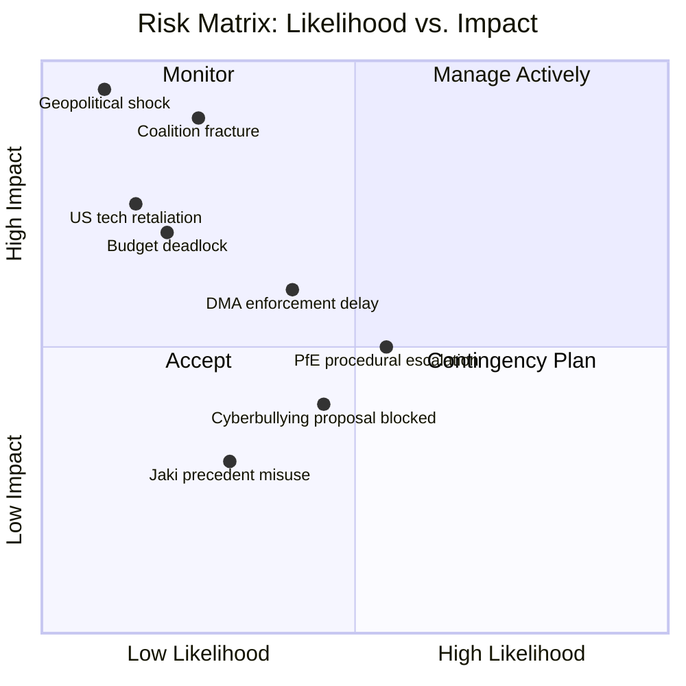
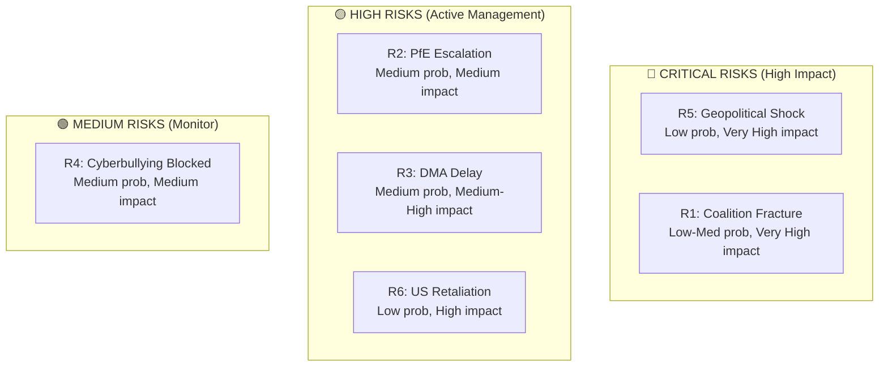

# Risk Matrix — EP Motions: 11 May 2026

<!-- SPDX-FileCopyrightText: 2024-2026 Hack23 AB -->
<!-- SPDX-License-Identifier: Apache-2.0 -->

**WEP Confidence:** All risks carry WEP bands | **Admiralty Grade:** B2
**Analysis Date:** 2026-05-11 | **Horizon:** 6–18 months

---

## 🎯 Risk Overview

---

## 📋 Risk Register

### RISK-001: Coalition Fracture on Budget 2027

**Likelihood:** 🔴 Low-Medium (25%) | **Impact:** 🔴 VERY HIGH | **WEP: Unlikely**
**Admiralty:** B3 (probably true with caveats)

**Description:** The 2027 budget guidelines (TA-10-2026-0112) open an autumn negotiation where the EPP's internal divisions (German fiscal hawks vs. southern/eastern investment advocates) could be exploited by the Council to block EP budget ambitions. A coalition fracture within EPP during October–November 2026 conciliation would:
- Prevent EP from defending its budget priorities
- Trigger provisional twelfths (1/12 of prior year spending monthly)
- Create political crisis heading into 2027 MFF negotiating position

**Mitigation:**
1. S&D rapporteur engagement to lock in progressive investment language early in committee
2. EPP internal consultation mechanism to pre-agree red lines before Council trialogue
3. Renew as swing vote on budget — secure early

**Residual Risk:** 🟡 MEDIUM — EPP historically resolves internal budget differences under leadership pressure; budget deadlock is rare.

---

### RISK-002: PfE Rule 169 Escalation Disrupts Autumn Legislative Agenda

**Likelihood:** 🟡 Medium (55%) | **Impact:** 🟡 MEDIUM | **WEP: Likely**
**Admiralty:** B2 (reliable pattern analysis)

**Description:** PfE's successful Rule 169 invocation on "Commission interference in elections" creates a template for further procedural disruption. Five additional Rule 169 requests in May–July 2026 on topics including gender ideology, migration quotas, digital sovereignty, and NATO policy could:
- Consume plenary agenda slots reserved for legislative priority files
- Force EPP leadership to engage on PfE's preferred narrative terrain
- Create a summer 2026 news cycle dominated by PfE messaging

**Mitigation:**
1. Conference of Presidents (EP leadership body) to invoke Rule 169 limitations if requests exceed threshold
2. EPP communications counter-offensive positioning sovereignty debates as distractions from delivering for citizens
3. S&D/Renew coordination to avoid elevating PfE debates in national media

**Residual Risk:** 🟡 MEDIUM — PfE will continue; the question is whether disruption rises to agenda-threatening levels.

---

### RISK-003: DMA Enforcement Delay Undermines EP Resolution Impact

**Likelihood:** 🟡 Medium (40%) | **Impact:** 🟡 MEDIUM-HIGH | **WEP: Roughly Even**
**Admiralty:** B2

**Description:** Despite the EP's enforcement resolution (TA-10-2026-0160), DG COMP faces legal challenges from platforms that could delay enforcement outcomes:
- Apple's App Store NFC payment case: Apple has filed legal challenges in EU courts
- Meta/Instagram self-preferencing: Complex economic analysis extends investigation timeline
- Google: Multiple parallel investigations create resource competition within DG COMP

If no major DMA outcome by end-2026, the EP resolution loses credibility and PfE/ECR use this as evidence that EP resolutions are meaningless.

**Mitigation:**
1. EP Budget Committee scrutiny of DG COMP resources allocation
2. EP IMCO committee oversight hearings with DG COMP Commissioner
3. Procedural acceleration options within DG COMP (interim measures)

**Residual Risk:** 🟡 MEDIUM — DMA investigation timelines are beyond EP's direct control.

---

### RISK-004: Cyberbullying Proposal Blocked on Legal Base Dispute

**Likelihood:** 🟡 Medium (45%) | **Impact:** 🟡 MEDIUM | **WEP: Roughly Even**
**Admiralty:** B3

**Description:** The Commission's response to the cyberbullying resolution (TA-10-2026-0163) may be blocked or significantly delayed by a legal base dispute. Using Article 83(1) TFEU (criminal law harmonisation) requires Council unanimity for extension to new crime areas; using Article 114 (internal market) would be challenged by member states that see criminal law as core national competence. The legal complexity could:
- Lead to Commission declining the legislative request (historically ~40% of EP Article 225 requests are declined)
- Result in a watered-down administrative measure rather than criminal law
- Become a 2027 or 2028 legislative file rather than 2026

**Mitigation:**
1. EP Legal Affairs Committee (JURI) pre-opinion on legal base to build Commission's confidence
2. Coalition-building with LIBE committee for human rights legitimation
3. Platform voluntary commitments as interim measure while formal proposal developed

**Residual Risk:** 🟡 MEDIUM — Legal base is genuinely uncertain; outcome depends on Commission's risk appetite.

---

### RISK-005: Geopolitical Shock — Ukraine Ceasefire Disrupts Eastern Consensus

**Likelihood:** 🔴 Low (10%) | **Impact:** 🔴 VERY HIGH | **WEP: Remote**
**Admiralty:** B3 (uncertain)

**Description:** A sudden Ukraine-Russia ceasefire framework (regardless of terms) would be the highest-impact geopolitical risk for EP10's most stable coalition. The Eastern Consensus (EPP+S&D+ECR+Renew at 477 seats on Ukraine files) would fracture if:
- Ukrainian President accepts a negotiated framework under military pressure
- US-brokered ceasefire terms include temporary territorial concessions
- PfE "peace narrative" receives mainstream validation

Consequences: PfE would claim political vindication, gaining polling momentum in France, Hungary, and potentially Germany; ECR's Polish members would face an impossible position.

**Mitigation:**
- EP has no mitigation lever; it is a geopolitical contingency
- Pre-position EP resolution language on conditionality (no recognition of Russian-occupied territory) to maintain leverage even in ceasefire scenario

**Residual Risk:** 🔴 LOW — Ukraine's political constraints make sudden ceasefire unlikely in 6–12 month horizon.

---

### RISK-006: US Digital Services Retaliation on DMA Enforcement

**Likelihood:** 🔴 Low (15%) | **Impact:** 🔴 HIGH | **WEP: Unlikely**
**Admiralty:** B3

**Description:** A landmark DMA fine exceeding €2 billion against a US-based gatekeeper (Apple, Meta, Google/Alphabet) could trigger US executive-branch retaliation:
- Section 301 USTR investigation into EU digital regulation
- Tariffs on EU goods (agriculture, vehicles, luxury goods)
- Congressional pressure on US platforms to exit EU market (threat only — economically irrational)

**Mitigation:**
1. Commission diplomatic pre-notification to US authorities before major DMA enforcement actions
2. EU-US Tech Trade Council dialogue channel
3. EP Trade Committee (INTA) engagement with US Congressional caucuses

**Residual Risk:** 🟡 LOW-MEDIUM — US-EU mutual economic dependence limits escalation to manageable level.

---

## 📊 Risk Heat Map Summary

---

## 📈 Risk Trend Analysis

| Risk | 3-Month Trend | Direction | Driver |
|------|--------------|-----------|--------|
| Coalition Fracture | STABLE | ➡️ | EPP internal tensions unchanged |
| PfE Escalation | INCREASING | ⬆️ | Rule 169 success creates template |
| DMA Delay | DECREASING | ⬇️ | Investigations maturing |
| Cyberbullying Blocked | STABLE | ➡️ | No Commission signal yet |
| Geopolitical Shock | STABLE | ➡️ | Ukraine political constraints unchanged |
| US Retaliation | INCREASING | ⬆️ | US political environment more hawkish |

**Source:** EP Open Data Portal | **Methodology:** Risk Matrix with WEP + Admiralty grading | **Generated:** 2026-05-11
