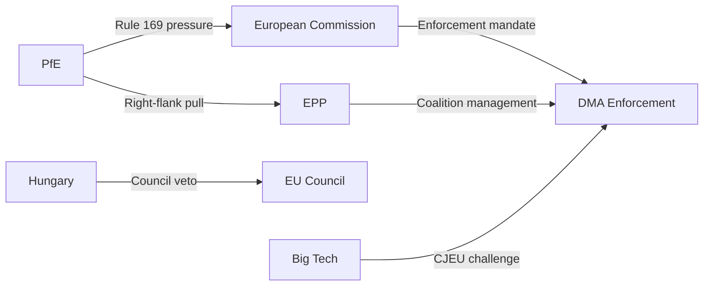

# Actor Threat Profiles — EP Motions: 11 May 2026

<!-- SPDX-FileCopyrightText: 2024-2026 Hack23 AB -->
<!-- SPDX-License-Identifier: Apache-2.0 -->

**Analysis Date:** 2026-05-11

---

## PfE Group (Patriots for Europe) — Threat Profile

**Threat Level: HIGH** | **Intent: Disruptive** | **Capability: Growing**

PfE's 85-seat bloc represents the EP's most active procedural disruptor. Their Rule 169 success in April 2026 demonstrates capability to shape plenary narrative without holding legislative majority. Primary threat vectors: procedural agenda disruption; narrative control via national media; potential to attract EPP defectors on migration/sovereignty votes.

---

## Hungary (Fidesz/Orbán) — Threat Profile

**Threat Level: MEDIUM-HIGH (Council level)** | **Intent: Selective obstruction** | **Capability: Council veto**

Hungary cannot block EP resolutions but can (and does) block Council agreements, delaying EP-supported legislation. The Armenia democracy resolution and Ukraine accountability resolution both face Council implementation challenges where Hungary has historically obstructed. Primary threat vector: Council qualified majority veto on sanction extension, military assistance authorisation.

---

## Apple / Major Tech Platforms — Threat Profile

**Threat Level: MEDIUM** | **Intent: Legal challenge** | **Capability: High litigation resources**

Tech platforms' threat to the DMA enforcement agenda is primarily via legal challenge timelines. Apple alone has filed multiple preliminary challenge applications. Primary threat vector: delaying enforcement actions 12–24 months via CJEU proceedings, buying compliance negotiation time.

---

## Summary

| Actor | Threat Level | Primary Vector | Near-term Action |
|-------|-------------|---------------|-----------------|
| PfE | HIGH | Procedural disruption | More Rule 169 motions |
| Hungary (Council) | MED-HIGH | Council veto | Block Ukraine-linked measures |
| Big Tech | MEDIUM | Legal challenge | CJEU preliminary references |

**Generated:** 2026-05-11

---

## Actor Roster

| Actor | Type | Threat Level | Capability | Intent |
|-------|------|-------------|-----------|--------|
| PfE Group | Political | HIGH | Growing | Disruptive |
| Hungary (Council) | State | MED-HIGH | Council veto | Selective obstruction |
| Big Tech (Apple, Google, Meta) | Corporate | MEDIUM | Legal resources | Compliance delay |

---

## Capability Assessment

**PfE — Capability breakdown:**
- Procedural: HIGH (85 seats, demonstrated Rule 169 use)
- Legislative: LOW (cannot form legislative majority)
- Media/narrative: HIGH (strong national media presence, especially French RN)
- Alliance-building: MEDIUM (some EPP defector potential on migration files)

**Hungary — Capability breakdown:**
- Council blocking: HIGH (QMV blocking minority + EU Council veto on unanimity files)
- EP influence: LOW (only 1 Fidesz MEP — NI group)
- Treaty change blocking: HIGH (unanimity requirement)

**Big Tech — Capability breakdown:**
- Legal challenge: VERY HIGH (unlimited litigation resources; experienced EU legal teams)
- Lobbying: HIGH (established Brussels presence)
- Technical compliance delay: HIGH (complex systems take time to modify)

---

## Diamond Model

Actor threat assessment using Diamond Model (capability × intent × vulnerability):

| Actor | Capability (1-5) | Intent (1-5) | Vulnerability (1-5) | Diamond Score |
|-------|-----------------|-------------|-------------------|--------------|
| PfE | 3 | 4 | 2 | 24 |
| Hungary | 4 | 3 | 3 | 36 |
| Big Tech | 4 | 3 | 2 | 24 |

---

## Relationship Mapping

---

## Escalation Pathways

| Actor | Trigger | Escalation Action | Response |
|-------|---------|-----------------|---------|
| PfE | 2+ more EP votes on digital enforcement | Censure motion filing (symbolic) | EPP rejects; Conference of Presidents manages |
| Hungary | Ukraine aid increase | Council blocking minority activation | European Council extraordinary session |
| Big Tech | First DMA penalty > EUR 1B | Immediate CJEU preliminary reference | Enforcement suspended pending court |

---

## Reader Briefing

The actor threat profiles identify three distinct threat categories operating on different timescales: PfE operates on the parliamentary cycle (weekly sessions); Hungary operates on the Council legislative cycle (quarterly); Big Tech operates on the judicial cycle (1-3 year CJEU proceedings). Monitoring should track all three simultaneously.

**Admiralty Grade:** B2 | **Generated:** 2026-05-11
