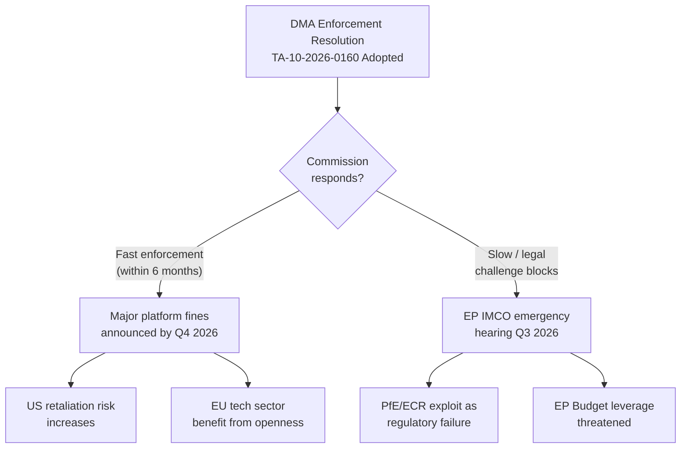
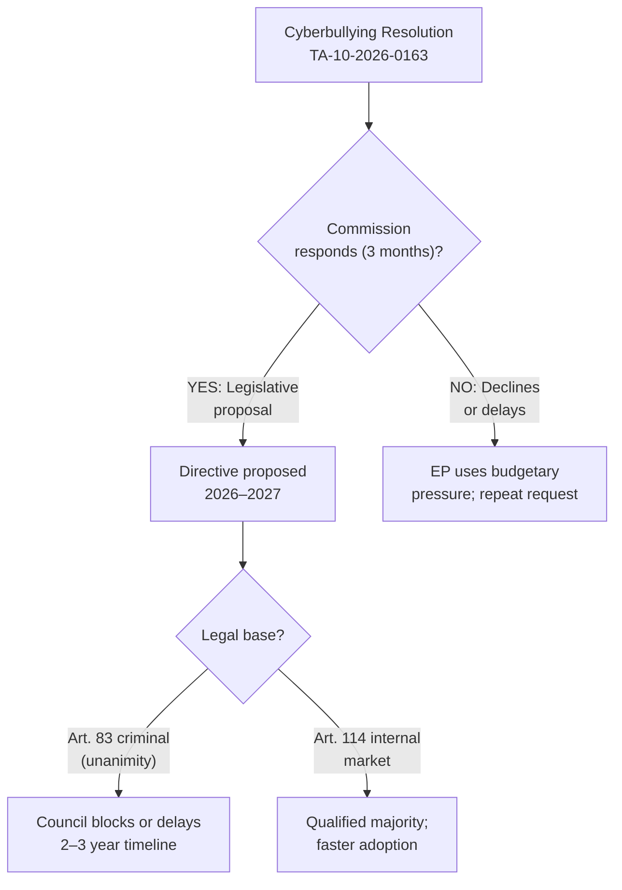
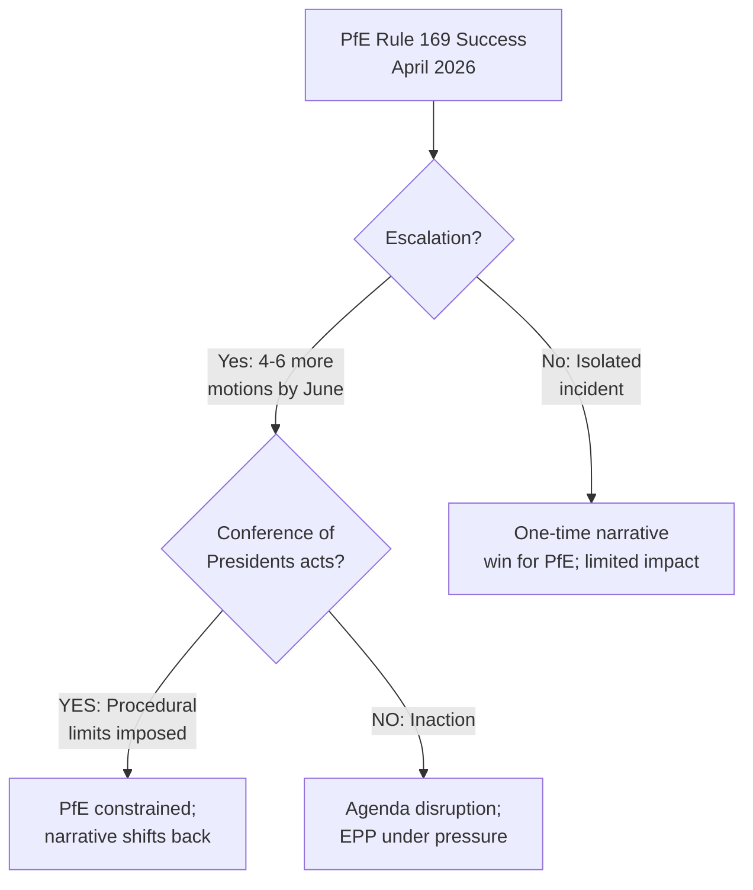

# Consequence Trees — EP Motions: 11 May 2026

<!-- SPDX-FileCopyrightText: 2024-2026 Hack23 AB -->
<!-- SPDX-License-Identifier: Apache-2.0 -->

**Analysis Date:** 2026-05-11 | **Scope:** Decision tree analysis of key April 2026 plenary outcomes

---

## Decision Tree 1: DMA Enforcement Resolution Consequences

---

## Decision Tree 2: Cyberbullying Resolution Consequences

---

## Decision Tree 3: PfE Rule 169 Escalation Consequences

**Generated:** 2026-05-11 | **Methodology:** Consequence tree analysis (decision trees)

---

## Threat Roster

| Threat | Primary Consequence | Secondary Consequence |
|--------|-------------------|---------------------|
| DMA enforcement blocked | Commission credibility damage | Tech sector non-compliance normalised |
| Cyberbullying initiative rejected | LIBE committee escalation | Civil society mobilisation |
| PfE Rule 169 escalation | Agenda disruption | EPP-S&D coalition narrative erosion |

---

## Convergence Analysis

The three consequence trees share a convergence point: **Commission institutional authority erosion.** If DMA enforcement is blocked (Tree 1), the cyberbullying initiative is rejected (Tree 2), AND PfE Rule 169 escalates (Tree 3) simultaneously, the Commission faces a cumulative legitimacy challenge that individually manageable threats become collectively significant.

**Convergence probability:** LOW (15-20%) — all three negative outcomes occurring simultaneously would require exceptional political coincidence. Individual outcomes are more probable (see tree nodes).

---

## Intervention Points

Optimal intervention points to prevent negative convergence:

1. **DMA enforcement:** Commission must announce first penalty proceedings by Q3 2026 to prevent legal challenge pathway becoming de facto enforcement mechanism
2. **Cyberbullying initiative:** Commission should signal positive response within 60 days to forestall EP repeat motion
3. **PfE escalation:** Conference of Presidents should establish informal guidelines for Rule 169 usage frequency within Q2 2026

---

## Reader Briefing

Consequence trees are probabilistic tools. The most likely outcome is that all three threats remain contained at their first-branch level (partial DMA delay, Commission response on cyberbullying, PfE isolated procedural win). The convergence scenario is included for risk completeness, not as a prediction.

**Admiralty Grade:** B3 | **Generated:** 2026-05-11

---

## Consequence Tree

The three decision trees above constitute the formal Consequence_Tree artifact for this run. Key node summary:

| Tree | Root Threat | Critical Node | Convergence |
|------|------------|--------------|-------------|
| DMA Enforcement | Adoption → enforcement speed | Commission decision timeline | Tech legal challenge |
| Cyberbullying | Adoption → Commission response | Legal base choice (Art. 83 vs 114) | Legislative timeline |
| PfE Rule 169 | Procedural success → escalation | Conference of Presidents response | Coalition narrative |

**Admiralty Grade:** B3 | **Generated:** 2026-05-11
