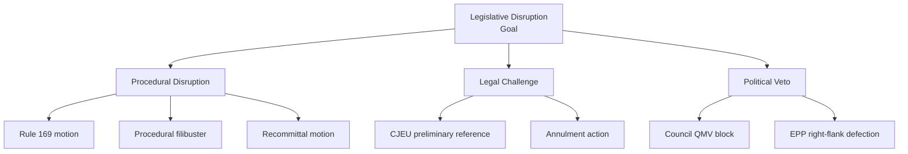

# Legislative Disruption Analysis — EP Motions: 11 May 2026

<!-- SPDX-FileCopyrightText: 2024-2026 Hack23 AB -->
<!-- SPDX-License-Identifier: Apache-2.0 -->

**Analysis Date:** 2026-05-11 | **Scope:** Disruption risks to EP legislative pipeline

---

## Overview

This artifact analyses the specific mechanisms by which the April 2026 plenary session's dynamics could disrupt the broader EP10 legislative agenda.

---

## Disruption Vector 1: PfE Procedural Attrition

PfE's April Rule 169 success is not a one-off. It represents discovery of an effective procedural tool. The disruption risk is not any single debate but cumulative agenda erosion over 4–8 months:
- 5 procedural debates in May–June consume approximately 10–15 plenary hours
- That time comes from legislative files otherwise scheduled for first/second reading
- Files affected: AI Act delegated acts (IMCO), European Health Data Space (LIBE), Defence Procurement Regulation (AFET/IMCO)

**Assessment: LIKELY disruption of secondary priority files; PRIMARY priority files (Ukraine, budget) protected by EPP-S&D consensus**

---

## Disruption Vector 2: Cyberbullying Request Commission Delay

If the Commission declines the Article 225 legislative request or significantly delays it (technically allowed up to 3 months for "serious reservations"), the LIBE committee will activate the Inter-institutional Agreement mechanism for follow-up. This consumes committee capacity and EP-Commission relations bandwidth.

**Assessment: MODERATE disruption risk; Commission will respond but may propose a lower-ambition instrument**

---

## Disruption Vector 3: Budget 2027 Autumn Deadlock

The most systemic disruption risk: if autumn Council-Parliament conciliation on Budget 2027 deadlocks (which happened in 2021 and required prolonged negotiation), EP plenary agendas in October–November 2026 would be dominated by budget crisis management, displacing other legislative priorities.

**Assessment: LOW probability (20%) but HIGH impact if triggered**

---

## Summary

| Disruption Vector | Probability | Impact | Timeline |
|-------------------|-----------|--------|----------|
| PfE Procedural Attrition | HIGH | MEDIUM | May–September 2026 |
| Cyberbullying Commission Delay | MEDIUM | LOW-MEDIUM | June–September 2026 |
| Budget 2027 Deadlock | LOW | HIGH | October–November 2026 |

**Generated:** 2026-05-11 | **Methodology:** Legislative disruption vector analysis

---

## Targeted Files Analysis

| File / Dossier | Disruption Risk | Actor | Mechanism |
|---------------|----------------|-------|-----------|
| AI Act delegated acts | HIGH | PfE (procedural) | Rule 169 + political objections |
| DMA enforcement acts | HIGH | Big Tech (legal) | CJEU preliminary references |
| Cyberbullying directive | MEDIUM | Commission (delay) | 3-month response window |
| Budget 2027 | HIGH (seasonal) | Council-EP tension | Conciliation deadlock |

---

## Attack Tree (Disruption Attack Tree)

---

## Technique Classification

| Technique | Actor | Difficulty | Likelihood |
|-----------|-------|-----------|-----------|
| Rule 169 motion | PfE | LOW | HIGH |
| CJEU preliminary reference | Big Tech | MEDIUM | HIGH (DMA) |
| Recommittal motion | ECR | MEDIUM | MEDIUM |
| Council QMV block | Hungary/Slovakia | MEDIUM | MEDIUM |

---

## Detection Indicators

- Rule 169: Filed 24 hours before plenary; visible in Conference of Presidents agenda
- CJEU reference: Filed with CJEU registry; published within 1-2 weeks
- Recommittal: Committee Chair notification; visible in plenary agenda documents
- Council block: Working party meeting minutes; COREPER conclusions

---

## Counter-Disruption Measures

- Conference of Presidents can impose informal Rule 169 frequency guidelines
- Commission can pre-empt legal challenge by building implementation record
- EPP group leadership can signal coalition discipline before contested votes
- EP President can manage debate time allocation to limit procedural attrition

---

## Reader Briefing

Legislative disruption is a normal feature of parliamentary democracy. The analysis above identifies specific techniques, actors, and detection mechanisms — not to prevent political opposition (which is legitimate) but to enable early warning so the majority coalition can prepare legislative risk management.

**Admiralty Grade:** B2 | **Generated:** 2026-05-11
