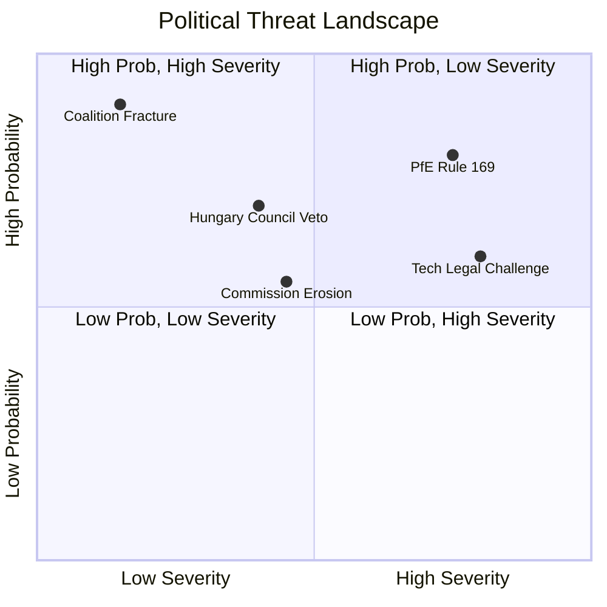

# Threat Assessment — Political Threat Landscape: EP Motions 11 May 2026

<!-- SPDX-FileCopyrightText: 2024-2026 Hack23 AB -->
<!-- SPDX-License-Identifier: Apache-2.0 -->

**WEP Confidence:** Assigned per threat | **Admiralty Grade:** B2 overall
**Analysis Date:** 2026-05-11 | **Horizon:** 6–18 months

---

## Political Threat Landscape Overview

This artifact maps the political threats observable in the April 2026 plenary context — threats to the EP's legislative agenda, institutional credibility, and coalition stability.

---

## THREAT 1: PfE Procedural Escalation Campaign

**WEP: Likely (55–65%)** | **Severity: HIGH** | **Timeline: Immediate**

**Description:** PfE's April 2026 Rule 169 debate on Commission electoral interference establishes a template. The threat is that PfE will escalate to 4–6 similar procedural interventions before the June 2026 plenary, consuming agenda time and shifting narrative territory toward Commission accountability.

**Why it matters:**
- Each successful Rule 169 invocation normalises PfE's "Commissioner accountability" narrative
- Conference of Presidents must explicitly act to prevent abuse of procedure
- National media in France, Hungary, Italy will amplify each intervention
- Creates political terrain that is unfavourable for Renew (weakened Macron wing)

**Indicators:** PfE group coordinator announcements; Conference of Presidents emergency session; EP President Metsola's public statements on Rule 169 use.

---

## THREAT 2: DMA Enforcement Legal Challenge Delaying Action

**WEP: Roughly Even (40–50%)** | **Severity: MEDIUM-HIGH** | **Timeline: 12–24 months**

**Description:** Apple's legal challenge to the NFC payment gatekeeper designation is the most advanced. If the General Court of the EU rules in Apple's favour at preliminary stage, the DMA enforcement framework's credibility would suffer and provide other gatekeepers with a template for challenge.

**Why it matters:**
- EP's April 2026 enforcement resolution would appear hollow
- Commission DG COMP would face political embarrassment
- Could embolden US executive-branch pressure on EU digital regulation
- PfE/ECR would frame this as "EU regulatory overreach backfiring"

**Indicators:** General Court hearing dates; DG COMP interim measures appeals outcomes; gatekeeper compliance filings.

---

## THREAT 3: PfE Coalition Outreach to EPP Right Flank

**WEP: Unlikely (20–30%)** | **Severity: VERY HIGH** | **Timeline: 12–18 months**

**Description:** The most dangerous structural threat to EP10's pro-EU majority is not a direct PfE electoral victory but a gradual normalization of EPP-PfE working relationships. This threat is currently low-probability because EPP leadership (Metsola, Weber) has explicitly rejected formal PfE cooperation. However:
- EPP's right flank (Hungarian Fidesz-aligned, Polish MEPs pre-Tusk era, Austrian ÖVP after government changes) has procedural sympathy with PfE positions on migration and sovereignty
- National-level coalition formations (Italy under Meloni, Austria under FPÖ) normalize right-populist governance, affecting EPP MEPs' risk calculus
- If EPP's seat share falls at next EP elections and PfE grows, the arithmetic calculus changes

**Why it matters:**
- Any formal EPP-PfE working relationship would fracture the S&D-Renew-EPP centre majority
- Ukraine resolutions would no longer pass with strong majorities
- DMA enforcement would become contested
- Commission accountability framework would be reorganised

**Indicators:** EPP national parties joining PfE-linked coalitions; Weber/Metsola public statements; committee voting patterns showing EPP-PfE alignment.

---

## Summary Threat Heat Map

| Threat | Likelihood | Severity | Time Horizon |
|--------|-----------|----------|-------------|
| PfE Procedural Escalation | 🟡 Likely | HIGH | Immediate |
| DMA Legal Challenge | 🟡 Roughly Even | MEDIUM-HIGH | 12–24 months |
| EPP-PfE Coalition Drift | 🟢 Unlikely | VERY HIGH | 12–18 months |

**Generated:** 2026-05-11 | **Methodology:** Threat Assessment with WEP + Admiralty grading

---

## Mermaid: Threat Landscape

**Admiralty Grade:** B2 | **Generated:** 2026-05-11
