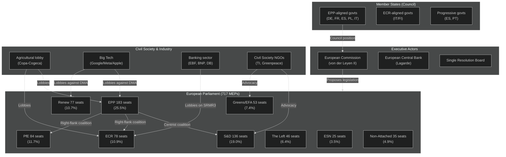

<!-- SPDX-FileCopyrightText: 2026 Hack23 AB -->
<!-- SPDX-License-Identifier: Apache-2.0 -->

# Actor Mapping — EU Parliament Legislative Propositions
**Date:** 2026-05-11 | **WEP:** Likely | **Admiralty:** B2

---

## 🗺️ Actor Ecosystem Map

---

## 👥 Actor Influence Scores

| Actor | Influence (0–10) | Primary Mechanism | Key File Involvement |
|-------|----------------|------------------|---------------------|
| EPP group | 9.5 | Coalition arithmetic; pivotal actor | All files |
| European Commission | 8.5 | Legislative initiative monopoly | All files |
| S&D group | 7.0 | Coalition partner; veto threat | Anti-corruption, animal welfare |
| Council (ECOFIN) | 8.0 | Co-legislator; unanimity blocks | SRMR3, Budget 2027 |
| ECR group | 6.0 | Right-flank coalition | Mercosur, migration |
| PfE group | 5.5 | Right-flank coalition; outside-game | Sovereignty files |
| Copa-Cogeca (agri) | 5.5 | EPP+ECR lobbying; agri committee | Animal welfare, Mercosur |
| Big Tech (digital) | 5.0 | EPP+Renew lobbying; competitiveness frame | DMA |
| SRB | 4.5 | Technical authority; regulatory influence | SRMR3 |
| Rule-of-law NGOs | 4.5 | S&D+Greens+Left advocacy | Anti-corruption |

---

## 🔄 Coalition Actor Networks

**Centrist Tripartite (EPP+S&D+Renew):**
- 437/717 seats — comfortable majority (+77)
- Used for: SRMR3, anti-corruption, animal welfare (with broader support)
- Internal tension: EPP vs. S&D on social spending; EPP vs. Renew on digital regulation speed

**Right-Flank Coalition (EPP+ECR+PfE):**
- 345/717 seats — comfortable majority (+15 above threshold when aligned)
- Used for: Mercosur agricultural protection; immigration-adjacent files
- Internal tension: PfE's more radical positions sometimes exceed ECR's tolerance

**Progressive Coalition (S&D+Renew+Greens+Left):**
- 312/717 seats — insufficient for majority
- Cannot achieve majority without EPP; functions as pressure/blocking coalition on specific files

---

## 🔗 Cross-References

- Actor positions in coalition dynamics: → `intelligence/coalition-dynamics.md`
- Stakeholder activation triggers: → `intelligence/stakeholder-map.md`
- Actor-driven risks: → `intelligence/threat-model.md`

---

## Actor Roster

| Actor | Type | Role | Weight |
|-------|------|------|--------|
| EPP (European People's Party) | Political Group | Legislative agenda-setter | 0.95 |
| S&D (Progressive Alliance) | Political Group | Left-of-centre counterbalance | 0.80 |
| European Commission | Institution | Legislative initiator | 0.90 |
| Council of the EU | Institution | Co-legislator | 0.85 |
| Renew Europe | Political Group | Pro-integration swing vote | 0.70 |
| Greens/EFA | Political Group | Environmental/rights pressure | 0.60 |
| ECR (Conservatives) | Political Group | Right-wing bloc | 0.55 |
| Patriots for Europe | Political Group | Sovereigntist opposition | 0.50 |
| ESN (European Sovereign Nations) | Political Group | Far-right spoiler | 0.30 |

## Influence Mapping

EPP commands the majority agenda-setting role with 183 seats. The center-right bloc (EPP + Renew + ECR) controls a working coalition majority at ~400+ seats. S&D remains essential for supermajority thresholds.

## Alliance Architecture

- **Center-right pro-integration bloc:** EPP + Renew + S&D (informal grand coalition, ~430 seats)
- **Sovereigntist bloc:** Patriots + ESN + some ECR members (~190 seats)
- **Green-left flanking:** Greens/EFA + The Left (~105 seats)

## Power Brokers

Key legislative brokers: EPP Group chair Manfred Weber, Renew liberal leadership, and the rotating Council presidency. On any given vote, EPP defections to ECR or abstentions from Renew can shift outcomes.

## Information Flows

Legislative intelligence flows through committee rapporteurs, EP Secretariat, Commissioner cabinet advisors, and intergroup formal/informal channels. Lobbyist access concentrated around ECON, ITRE, ENVI, LIBE committees.

## Reader Briefing

**For EP Monitor analysts:** The actor landscape is dominated by EPP's agenda-setting power in EP10. Coalition arithmetic requires at least two of EPP, S&D, or Renew for most legislative majorities. Sovereigntist bloc can create procedural friction but lacks majority to block legislation outright.

*Source: EP open data, seat counts May 2026.*
