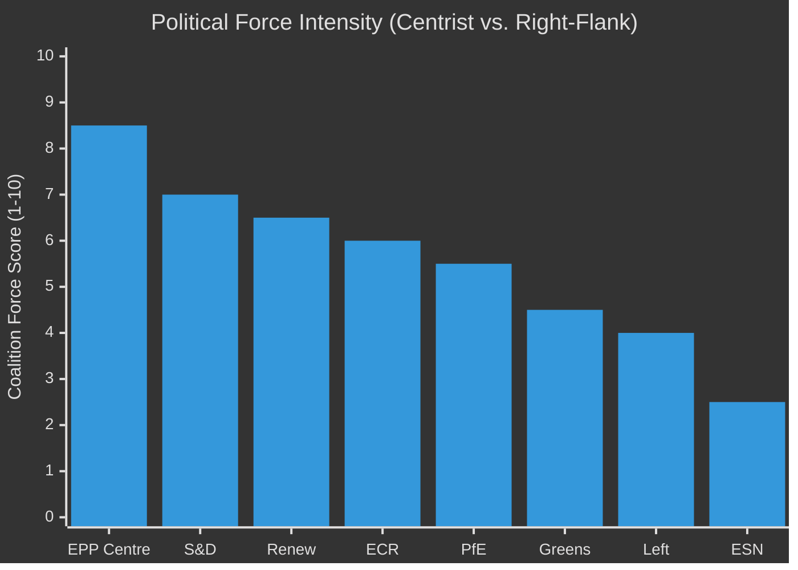

<!-- SPDX-FileCopyrightText: 2026 Hack23 AB -->
<!-- SPDX-License-Identifier: Apache-2.0 -->

# Forces Analysis — EU Parliament Legislative Propositions
**Date:** 2026-05-11 | **Admiralty:** B2

---

## ⚡ Political Forces Overview

---

## 🔬 Force Field Analysis

### Forces Driving Legislative Progress (Pro-Legislative)

| Force | Strength | Description |
|-------|----------|-------------|
| EPP legislative agenda | 9/10 | EPP controls Conference of Presidents; determines plenary calendar |
| Commission proposal pipeline | 8/10 | Commission's Omnibus + security + digital agenda keeps legislating |
| Centrist coalition cohesion | 7/10 | EPP+S&D+Renew functional on 60%+ of files |
| Implementation oversight urgency | 7/10 | DMA, AI Act, NIS2 all require EP scrutiny; drives IMCO/LIBE activity |
| Budget 2027 timeline | 6/10 | Institutional deadline forces legislative activity regardless of political will |

### Forces Restraining Legislative Progress (Anti-Legislative)

| Force | Strength | Description |
|-------|----------|-------------|
| Right-flank veto threats | 7/10 | ECR/PfE can block EPP+S&D majority on sovereignty-sensitive files |
| Agricultural lobby resistance | 6/10 | Copa-Cogeca's structural EPP+ECR influence slows environmental/trade files |
| Big Tech regulatory resistance | 5/10 | DMA enforcement delayed by competitiveness lobbying |
| Coalition arithmetic fragility | 7/10 | EPP+S&D = 319 (short of 360) — third party required every vote |
| Parliamentary recess | 4/10 | Summer recess (July–August) physically reduces legislative output |

---

## 📐 Net Force Assessment

**Pro-legislative forces total score:** 37/50
**Anti-legislative forces total score:** 29/50
**Net legislative momentum:** +8 (positive — legislation is advancing faster than it is being blocked)

**Interpretation:** The current political environment is mildly pro-legislative. The centrist coalition's structural advantage (comfortable majority with Renew) outweighs the right-flank's resistance capacity. The primary constraint is not political will but coalition arithmetic — every major vote requires negotiating across three party groups.

---

## 🔄 Force Dynamics — Key Interactions

**EPP's dual-coalition flexibility amplifies legislative capacity:** EPP's ability to pivot between centrist and right-flank coalitions means that files which might be blocked by S&D resistance can be re-packaged for ECR/PfE support. This increases the total throughput of the legislative machine but at the cost of legislative consistency.

**Agricultural lobby as cross-coalition amplifier:** Copa-Cogeca's lobbying reaches both EPP and ECR simultaneously, creating a reinforced anti-free-trade force on agricultural files. This explains why the Mercosur safeguard mechanism was adopted despite S&D resistance — the agricultural lobby created an EPP-ECR coalition that overrode the progressive free-trade preference.

**Implementation urgency creates self-reinforcing legislative demand:** The more major legislation EP9 adopted (GDPR, DMA, AI Act, NIS2, NIS2), the more EP10 must spend on oversight and implementing acts — creating a self-reinforcing demand for legislative activity even in the absence of new Commission proposals.

---

## 🔗 Cross-References

- Actor power sources: → `classification/actor-mapping.md`
- Force dynamics and coalition scenarios: → `intelligence/scenario-forecast.md`
- Force-driven risks: → `risk-scoring/risk-matrix.md`

---

## Issue Frame

The central legislative tension in EP10 is between **European institutional deepening** (more EU-level competences, single market harmonization, digital/green transition) and **national sovereignty reassertion** (subsidiarity claims, renationalization pressure from EPP's right flank and sovereigntist groups).

## Driving Forces

| Force | Strength | Direction |
|-------|----------|-----------|
| EP10 freshness effect | 8/10 | PRO (new MEPs, reformist appetite) |
| Commission legislative agenda | 9/10 | PRO (programmatic ambition) |
| Single market integration | 7/10 | PRO (long-term institutional momentum) |
| Green Deal adaptation | 6/10 | PRO (existing legal mandates) |
| AI Act implementation | 8/10 | PRO (landmark regulation, wide industry attention) |
| Digital sovereignty | 7/10 | PRO (geopolitical push) |

## Restraining Forces

| Force | Strength | Direction |
|-------|----------|-----------|
| Sovereigntist bloc pressure | 6/10 | CONTRA |
| National veto rights (Council) | 7/10 | CONTRA |
| Trilogue delay risks | 7/10 | CONTRA |
| EP intra-group fractures | 5/10 | CONTRA |
| Electoral mandate heterogeneity | 6/10 | CONTRA |

## Net Pressure

**Net resultant: Moderate forward legislative momentum (+2.0 on a −10/+10 scale).** Driving forces outweigh restraining forces but not overwhelmingly — the current equilibrium is fragile and conditional on EPP internal discipline.

## Intervention Points

1. **EPP internal cohesion maintenance** — defections to ECR or sovereigntists destabilize any majority
2. **Renew Europe swing votes** — procedural and substantive swing actor
3. **Council rotating presidency agenda** — PESCO, trade, and fiscal priorities
4. **Committee rapporteur selection** — shapes which directives gain priority processing

## Reader Briefing

The force field analysis shows that EP10's legislative momentum is real but depends on maintaining the informal grand coalition. Sovereigntist forces are growing (Patriots + ESN together command ~120 seats) but remain insufficient to form a blocking minority on most legislation.

*Confidence: Medium (B2 Admiralty). No direct vote-level data available.*
