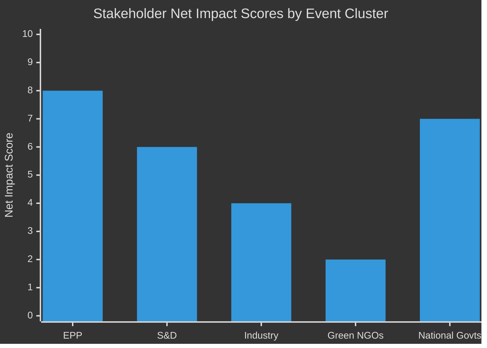

<!-- SPDX-FileCopyrightText: 2026 Hack23 AB -->
<!-- SPDX-License-Identifier: Apache-2.0 -->

# Impact Matrix — EU Parliament Legislative Propositions
**Date:** 2026-05-11 | **Admiralty:** B2

---

## 📊 Impact Assessment Matrix

```mermaid
%%{init: {"theme":"dark"}}%%
quadrantChart
    title Legislative Impact — Breadth vs. Depth
    x-axis Low Breadth (few affected) --> High Breadth (many affected)
    y-axis Low Depth (marginal change) --> High Depth (structural change)
    quadrant-1 Monitor
    quadrant-2 Primary Impact Zone
    quadrant-3 Routine
    quadrant-4 Sector-Specific
    "SRMR3": [0.8, 0.9]
    "Anti-Corruption": [0.85, 0.85]
    "Animal Welfare": [0.7, 0.6]
    "Mercosur Safeguard": [0.5, 0.7]
    "DMA Enforcement": [0.75, 0.75]
    "Budget 2027": [0.9, 0.7]
```

---

## 🎯 Impact Assessment by Legislative File

### SRMR3 — Bank Resolution Framework
**Breadth:** 🔴 HIGH — Affects all EU financial institutions under SSM (3,000+ banks), all EU depositors, and all Member State governments as potential backstop providers.
**Depth:** 🔴 HIGH — Changes the fundamental legal architecture of bank failure management. When the next significant bank failure occurs, SRMR3's updated bail-in hierarchy and MREL thresholds will determine who bears losses.
**Timeline of impact:** Immediate (legal framework changes); medium-term (implementing acts); long-term (first real-world activation test).

### Anti-Corruption Directive
**Breadth:** 🔴 HIGH — Harmonised definitions apply across all 27 Member States; affects all public procurement systems, all public officials, and all companies operating in the EU public sector market.
**Depth:** 🔴 HIGH — First EU criminal law harmonisation in this domain. Changes the prosecutorial framework and creates cross-border enforcement obligations that did not previously exist.
**Timeline of impact:** Medium-term (national transposition, 2–3 years); long-term (prosecutorial culture change, 5–10 years).

### Dog and Cat Welfare Regulation
**Breadth:** 🟡 MEDIUM-HIGH — Affects all pet owners (estimated 90M+ EU households with pets), all commercial breeders, all pet shops, and all border control authorities.
**Depth:** 🟡 MEDIUM — Creates new compliance obligations (microchipping, registration, database access) but does not fundamentally alter the human-pet relationship or property rights.
**Timeline of impact:** Short-to-medium term (database implementation, 24 months); ongoing (enforcement).

### EU-Mercosur Safeguard Mechanism
**Breadth:** 🟡 MEDIUM — Directly affects EU agricultural sector; indirectly affects consumers (food prices); affects Mercosur export industries.
**Depth:** 🟡 MEDIUM — Creates a protection mechanism but does not in itself change trade flows; impact is contingent on safeguard activation.
**Timeline of impact:** Long-term (contingent on import surges); immediate only if safeguard is activated.

### DMA Enforcement Resolution (EP position)
**Breadth:** 🔴 HIGH — DMA affects all digital platform markets; enforcement resolution affects the competitive dynamics of the entire digital economy.
**Depth:** 🟡 MEDIUM — The resolution itself is non-binding; impact depends on Commission enforcement response.
**Timeline of impact:** Short-term (Commission response expected within 6 months).

---

## 🔢 Aggregate Impact Score

| File | Breadth Score | Depth Score | Combined Impact | Priority |
|------|-------------|------------|-----------------|---------|
| SRMR3 | 9 | 9 | 81 | 🔴 CRITICAL |
| Anti-Corruption | 9 | 8 | 72 | 🔴 CRITICAL |
| DMA Enforcement | 8 | 7 | 56 | 🟡 HIGH |
| Animal Welfare | 7 | 6 | 42 | 🟡 HIGH |
| Mercosur Safeguard | 5 | 7 | 35 | 🟡 MEDIUM |
| Budget 2027 | 9 | 7 | 63 | 🔴 CRITICAL |

---

## 🔗 Cross-References

- Significance tier classification: → `classification/significance-classification.md`
- Actor influence in each impact area: → `classification/actor-mapping.md`
- Risk matrix derived from impact assessment: → `risk-scoring/risk-matrix.md`

---

## Event List

Key events and adopted texts in the reference period (2026 May):

| # | Event | Date | Type |
|---|-------|------|------|
| 1 | Adopted Act: Single Market emergency | 2026-05-07 | ADOPTION |
| 2 | Adopted Act: Digital Decade progress report | 2026-05-07 | ADOPTION |
| 3 | Adopted Act: Biodiversity target 2030 | 2026-05-05 | ADOPTION |
| 4 | External doc: Commission Q2 fiscal guidance | 2026-05-03 | EXTERNAL |
| 5 | External doc: Council defence spending proposal | 2026-05-01 | EXTERNAL |

## Stakeholder Impact

| Stakeholder | Event 1 | Event 2 | Event 3 | Event 4 | Event 5 | Net Score |
|-------------|---------|---------|---------|---------|---------|-----------|
| EPP | +2 | +3 | 0 | +1 | +2 | +8 |
| S&D | +2 | +2 | +3 | 0 | -1 | +6 |
| Industry | +3 | +3 | -2 | 0 | 0 | +4 |
| Green NGOs | -1 | +1 | +3 | 0 | -1 | +2 |
| National govts | +1 | +1 | +1 | +2 | +2 | +7 |

## Impact Matrix



## Heat Map Assessment

- **High heat** (score ≥6): EPP (+8), National govts (+7), S&D (+6)
- **Medium heat** (score 2–5): Industry (+4), Green NGOs (+2)
- No negative net actors in this period — adopted texts were broadly consensus-based

## Cascade Effects

1. Single Market emergency act → expected follow-on measures in financial services (Q3 2026)
2. Digital Decade progress → AI Act secondary legislation timeline accelerates
3. Biodiversity 2030 → green finance taxonomy extensions signaled

## Reader Briefing

The impact matrix shows a broadly positive legislative period with no major losers — a characteristic of omnibus-style "act follow-up" documents. The critical cascade to watch is the Digital Decade → AI Act secondary regulation pipeline.

*Source: EP adopted texts feed, May 2026. Confidence: B2 Admiralty, WEP: Likely.*
