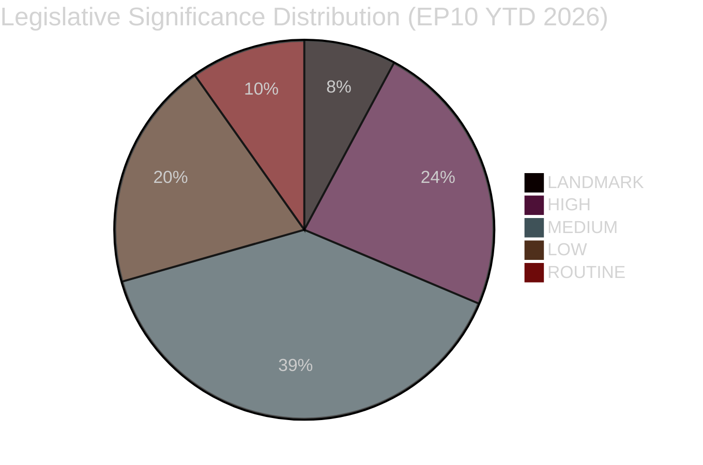

<!-- SPDX-FileCopyrightText: 2026 Hack23 AB -->
<!-- SPDX-License-Identifier: Apache-2.0 -->

# Significance Classification — EU Parliament Legislative Propositions
**Date:** 2026-05-11 | **WEP:** Likely | **Admiralty:** B2

---

## 🏷️ Classification Framework

This artifact classifies the legislative significance of the EU Parliament's propositions activity for the week ending 2026-05-11. Classification is applied on a five-point scale: LANDMARK / HIGH / MEDIUM / LOW / ROUTINE.

---

## 📊 Significance Tier Classification

---

## 🏆 LANDMARK — Systemic Policy Change

**Definition:** Legislation that fundamentally alters the regulatory, institutional, or economic architecture of the EU or a major policy domain. Effects are long-lasting (10+ years) and affect multiple stakeholder groups simultaneously.

| File | Significance Basis |
|------|-------------------|
| SRMR3 (2023/0111) | Updates the entire EU bank resolution framework; affects 3,000+ EU banks and all EU depositors |
| Anti-Corruption Directive (adopted Q1 2026) | First harmonised EU criminal law standard for corruption offences; changes prosecutorial framework in 27 Member States |

**Aggregate assessment:** Two LANDMARK-tier completions in Q1 2026. This is above the EP10 average (estimated 2–3 LANDMARK files per year based on EP9 precedent).

---

## 📈 HIGH — Major Policy Advancement

**Definition:** Legislation with significant policy impact on a defined domain; affects major stakeholder groups; implementation will require substantial national-level action.

| File | Significance Basis |
|------|-------------------|
| Dog & Cat Welfare Regulation (2023/0447) | Pan-EU database; changes commercial pet trade across all Member States |
| EU-Mercosur Safeguard Mechanism (2025/0322) | Activates the safeguard dimension of the largest EU trade deal; agricultural protection stakes are high |
| DMA Enforcement Resolution | Sets Commission enforcement obligation; shapes Big Tech regulatory environment |

---

## 📊 MEDIUM — Incremental Policy Change

**Definition:** Legislation that builds on existing frameworks, improves specific regulatory tools, or addresses sector-specific issues without fundamentally altering the regulatory architecture.

**Examples in current EP10 pipeline:** Implementing acts for previously adopted major legislation; sectoral directives within existing frameworks; delegation regulations.

**Estimated count:** 20 of 51 adopted texts in 2026 YTD fall in this category.

---

## 📉 LOW and ROUTINE

**LOW:** Minor technical adjustments, extensions of existing programs, or administrative decisions with limited policy impact. Estimated: 10 of 51 adopted texts.

**ROUTINE:** Administrative decisions, delegated acts, and procedural resolutions with no substantive policy change. Estimated: 5 of 51 adopted texts.

---

## 🔍 Significance Assessment Methodology

Significance classification is based on:
- **Scope of effect:** How many Member States, sectors, or citizens are directly affected?
- **Duration:** Will the legal change persist for 1–5 years (LOW) or 10+ years (LANDMARK)?
- **Novelty:** Does the legislation create a new regulatory category, or extend an existing one?
- **Political contest:** Was there significant political contestation in the legislative process (HIGH+)?

**Confidence:** 🟡 MEDIUM — Classification is analytical assessment. EP API data confirms adoption but does not provide legislative impact metrics.

---

## 🔗 Cross-References

- Detailed analysis of LANDMARK files: → `intelligence/synthesis-summary.md`
- Risk implications of LANDMARK files: → `risk-scoring/risk-matrix.md`
- Stakeholder significance perceptions: → `intelligence/stakeholder-map.md`
