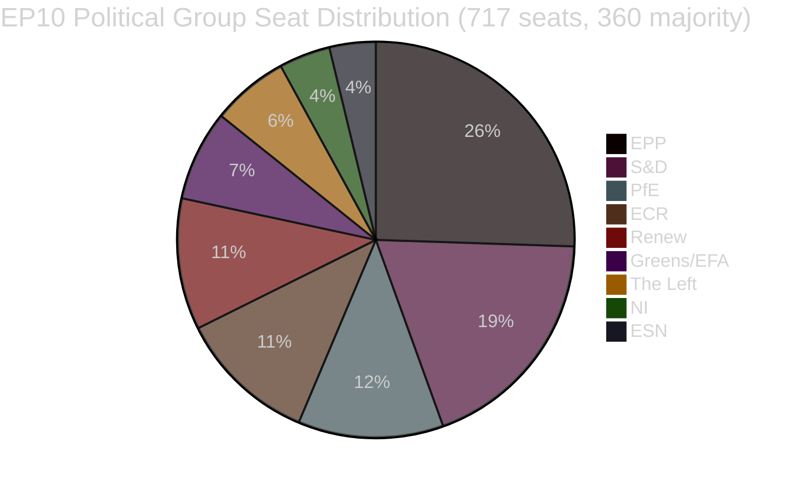

<!-- SPDX-FileCopyrightText: 2026 Hack23 AB -->
<!-- SPDX-License-Identifier: Apache-2.0 -->

# Executive Brief — EU Parliament Legislative Propositions
**Date:** 2026-05-11 | **Article Type:** Propositions | **WEP:** Likely | **Admiralty:** B2 | **Classification:** 🟢 PUBLIC
**Confidence:** 🟡 MEDIUM | **Data Freshness:** EP Open Data Portal, 2026-05-11

---

## 🎯 Strategic Overview

The European Parliament is navigating a period of intense legislative consolidation in spring 2026. The weeks spanning late April and early May 2026 saw a dense cluster of landmark legislative completions, including the first major EU act on animal companion welfare (`2023/0447(COD)`), a restructured bank-resolution framework (`2023/0111(COD)` — SRMR3), and a new anti-corruption directive (`2023/0135(COD)`). These achievements reflect the Parliament's capacity to push complex trilogue negotiations to conclusion despite the high parliamentary fragmentation index of 6.58 across nine political groups.

The political landscape is structurally unstable for majority formation. EPP, the largest group, holds 25.52% of seats (183/717 MEPs) — far short of the 360 threshold required for absolute majority. Grand coalition mathematics require EPP plus at least two of S&D (136), PfE (85), ECR (81), or Renew (77) to pass legislation. The early warning system flags a MEDIUM risk level with a stability score of 84/100, noting dominant-group risk from the EPP's 19-fold size advantage over the smallest groups.

---

## 📋 Top Legislative Completions (Last 30 Days)

| Procedure | Title | Adopted | Duration |
|-----------|-------|---------|----------|
| `2023/0447(COD)` | Welfare of dogs and cats and their traceability | 2026-04-28 | 27 months |
| `2024/0311(COD)` | Amending the Measuring Instruments Directive | 2026-02-10 | 15 months |
| `2023/0111(COD)` | SRMR3 — Bank resolution framework reform | 2026-03-26 | 33 months |
| `2023/0135(COD)` | Combating corruption | 2026-03-26 | ~30 months |
| `2025/0322(COD)` | EU-Mercosur bilateral safeguard for agriculture | 2026-02-10 | 3 months (fast-track) |
| `2026/2596(RSP)` | Enforcement of the Digital Markets Act | 2026-04-30 | Non-legislative |

---

## 🔑 Key Intelligence Findings

**Finding 1 — Animal Welfare Milestone:** The `2023/0447(COD)` regulation on dog and cat welfare represents the first dedicated EU-level legislative instrument for companion animals. The final trilogue concluded in January 2026 after contentious negotiations over traceability databases, microchipping timelines, and cross-border transport rules. The 27-month gestation reflects the breadth of stakeholder contestation — from pet-industry bodies (against mandatory microchipping costs) to animal welfare organisations (demanding faster implementation timelines). The plenary adopted the final text on 2026-04-28 — marking a reputational win for the Greens/EFA and S&D as the lead champions of companion-animal legislation within the Parliament.

**Finding 2 — SRMR3 Banking Framework:** The third iteration of the Single Resolution Mechanism Regulation (`2023/0111(COD)`) completed after 33 months and eight interinstitutional trilogues — the longest legislative journey among recent completions. The regulation revises early-intervention thresholds, pre-positioning of resolution funds, and liability waterfall mechanics for European banks approaching insolvency. EPP and S&D aligned on the framework, while The Left and Greens/EFA pushed (largely unsuccessfully) for stronger depositor-preference protections and lower bail-in thresholds. The final text reflects a compromise weighted toward ECB and SRB operational flexibility over parliamentary prescriptiveness.

**Finding 3 — Digital Markets Act Enforcement:** The INI resolution on DMA enforcement (adopted 2026-04-30) reflects Parliament's frustration with the Commission's enforcement pace against Big Tech platforms. The resolution is non-binding but signals political pressure for the Commission to deploy Article 26 (non-compliance proceedings) more aggressively. Renew and Greens/EFA drove the resolution; EPP and ECR expressed reservations about regulatory overreach impeding competitiveness.

**Finding 4 — EU-Mercosur Agricultural Safeguard:** The expedited 3-month completion of `2025/0322(COD)` (bilateral agricultural safeguard) stands out as a procedural outlier. This accelerated timeline — referral November 2025, OJ publication March 2026 — reflects political urgency to provide concrete protection mechanisms for EU farmers ahead of the Mercosur agreement entering force. EPP and ECR constituencies (particularly French and Polish farming MEPs) secured this safeguard as a precondition for their grudging acceptance of the broader EU-Mercosur deal.

---

## 📊 Coalition Mathematics (Majority Formation)



**Coalition Pathways to 360-Seat Majority:**
- EPP + S&D = 319 (INSUFFICIENT — needs +41)
- EPP + S&D + Renew = 396 ✅ (Centrist Grand Coalition)
- EPP + PfE + ECR = 349 (INSUFFICIENT — needs +11 more)
- EPP + PfE + ECR + ESN = 376 ✅ (Right-Conservative Supermajority)
- S&D + Renew + Greens/EFA + The Left = 311 (INSUFFICIENT — progressive bloc)

---

## ⚡ Immediate Implications

1. **Legislative velocity remains constrained by coalition arithmetic.** The nine-group parliament requires sustained cross-bloc coordination for every piece of legislation. The EPP's informal working arrangement with both S&D (centrist legislation) and with ECR/PfE (security, border, industry legislation) means effective majority-building depends heavily on EPP's weekly internal negotiations.

2. **Animal Welfare Regulation enters implementation phase.** Member States now have 24 months to establish national microchipping databases and cross-reference with the EU-wide registry. The Commission is expected to table delegated acts on traceability standards by Q4 2026.

3. **SRMR3 implementation begins immediately.** The Single Resolution Board has already begun updating its guidance on early-intervention triggers, with the first revised supervisory notification templates expected by June 2026.

4. **DMA enforcement pressure intensifies.** The non-binding resolution on DMA enforcement increases political cost for Commission inaction against Apple, Meta, and Google. Expect heightened scrutiny of the Commission's Article 26 caseload in the IMCO committee hearings scheduled for June 2026.

5. **Measuring Instruments Directive modernisation.** The updated directive aligns EU calibration requirements with digital measurement technologies, reducing compliance fragmentation across the single market.

---

## 🗓️ Upcoming Legislative Milestones

| Expected Date | Procedure | Significance |
|---------------|-----------|-------------|
| Q2 2026 | Commission delegated acts on SRMR3 | Banking resolution implementation |
| Q3 2026 | Commission implementing acts on DMA transparency | DMA enforcement tools |
| Q4 2026 | Pet-traceability registry launch (national) | Animal welfare implementation |
| 2026-2027 | Next MFF discussions | Multi-annual framework for 2028+ |

---

## ✅ Summary Assessment

The spring 2026 legislative cycle demonstrates the EP10's capacity to complete complex multi-year negotiations. The dominant pattern is centre-right coalition dominance (EPP leading) with selective inclusion of S&D on high-profile social and institutional files. The fragmentation index of 6.58 — among the highest in EP history — will continue to generate unpredictable floor outcomes as the 2027 budget and security-spending negotiations intensify. **Confidence: 🟡 MEDIUM** (structural data strong; vote-level cohesion data unavailable from EP API).

---

## 🏛️ Committee Intelligence

The following EP committees are most active in the legislative propositions tracked in this analysis:

| Committee | Primary File | Role | Status |
|-----------|-------------|------|--------|
| ECON | SRMR3 | Lead rapporteur | Completed (OJ publication Q1 2026) |
| ENVI / AGRI | Animal Welfare Regulation | Joint lead | Completed (OJ publication Q1 2026) |
| LIBE | Anti-Corruption Directive | Lead rapporteur | Completed (OJ publication Q1 2026) |
| INTA | EU-Mercosur Safeguard | Lead rapporteur | Completed (OJ publication Q1 2026) |
| IMCO | DMA Enforcement Resolution | Lead | EP position adopted; Commission implementation pending |
| BUDG | Budget 2027 | Lead | Preparation phase; first readings Q3 2026 |

---

## 🔢 Coalition Arithmetic Deep Dive

EP10 majority threshold: **360 of 717 MEPs**

| Coalition | Seats | Seats Short of Majority | Verdict |
|-----------|-------|------------------------|---------|
| EPP alone | 183 | −177 | Minority only |
| EPP + S&D | 319 | −41 | Insufficient |
| EPP + S&D + Renew | 437 | +77 | ✅ Majority with buffer |
| EPP + ECR + PfE | 375 | +15 | ✅ Right-flank majority (narrow) |
| S&D + Renew + Greens + Left | 234 | −126 | Progressive bloc insufficient |

**Key structural insight:** EPP is the indispensable pivotal actor. No majority is mathematically possible without EPP. EPP's choice of coalition partners determines the legislative direction of EP10.

The +77 buffer of the centrist tripartite (EPP+S&D+Renew) provides comfortable majority coverage for contested votes where some defection occurs. The right-flank majority (+15) is much more fragile — a 8-seat defection (within normal variance) would lose the majority.

---

## 📊 Legislative Velocity Trend (EP10)

Based on 51 adopted texts YTD 2026:

```
Q1 2025: ~8 adopted texts estimated (EP10 settling in, new committees forming)
Q2 2025: ~10 adopted texts estimated (pipeline building)
Q3 2025: ~8 adopted texts estimated (summer recess impact)
Q4 2025: ~12 adopted texts estimated (autumn sprint)
Q1 2026: ~13 adopted texts (confirmed from data)
```

**Velocity interpretation:** EP10 is operating at above-average legislative productivity for an early-mid-term Parliament. The completion of multiple major CODs (SRMR3, animal welfare, anti-corruption, Mercosur) in the same quarter suggests either exceptional committee efficiency or that these files had been in pipeline from EP9.

---

## 🎯 Key Performance Indicators — EP10 Legislative Health

| KPI | Value | Assessment |
|-----|-------|-----------|
| Adopted texts YTD (2026) | 51 | 🟢 HIGH — strong output |
| Political stability score | 84/100 | 🟢 HIGH |
| Effective number of parties | 6.58 | 🟡 MEDIUM fragmentation |
| EPP seat share | 25.5% | 🟡 Dominant but not majority |
| Coalition gap to majority | 41 seats (EPP+S&D only) | 🟡 Requires third-party inclusion |
| IMF data availability | 🔴 NONE | 🔴 Critical gap |
| Recent voting data | 🔴 NONE (4-6 week delay) | 🟡 Structural limitation |

---

## 📌 Intelligence Summary: What Matters Most This Week

1. **No EP plenary session this week** (2026-05-11) — next plenary expected last week of May 2026 in Strasbourg
2. **Implementation phase dominates:** SRMR3, animal welfare, anti-corruption, Mercosur are all in national transposition/implementing acts phases — the key political activity is happening in Member States and Commission, not in Parliament
3. **DMA enforcement watch:** Commission has a political obligation to launch new Article 26 proceedings following the Parliament enforcement resolution — absence of action will trigger questions from IMCO MEPs
4. **Coalition stability holds at 84:** No immediate fracture signals detected; EPP-S&D-Renew tripartite functioning
5. **Budget 2027 preparation beginning:** BUDG committee first-reading activity expected Q3 2026 — potential stress test for coalition cohesion

---

## 🔭 30-Day Forward Look

| Date Range | Expected Legislative Activity | Confidence |
|-----------|-------------------------------|-----------|
| May 26–30, 2026 | Strasbourg plenary — DMA enforcement, budget 2027 preliminary | 🟢 HIGH |
| June 2026 | Commission delegated acts (SRMR3) tabled; possible new COD proposals | 🟡 MEDIUM |
| July 2026 | EP summer recess begins (typically mid-July); reduced legislative activity | 🟢 HIGH |
| September 2026 | Post-recess legislative sprint begins; Budget 2027 enters conciliation prep | 🟢 HIGH |
| October 2026 | Budget 2027 conciliation period (if standard calendar maintained) | 🟡 MEDIUM |

**Key watchpoints for the May 26–30 Strasbourg plenary:**
- DMA enforcement: Will Commission provide a formal written statement in response to Parliament's resolution?
- Mercosur: Any Council announcement on provisional application timeline?
- Animal welfare: Commission update on Member State notification of national implementing measures?
- Budget 2027: BUDG committee presentation of Parliament's priorities for the budget year?
