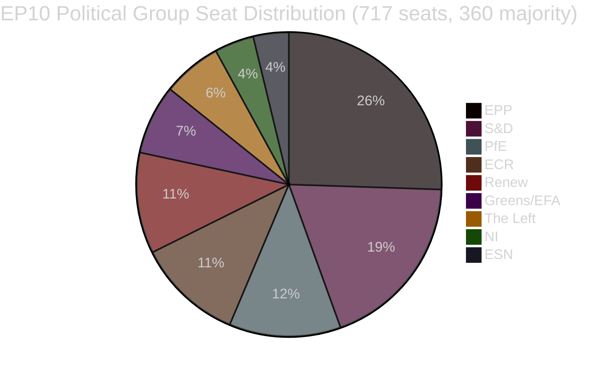

<!-- SPDX-FileCopyrightText: 2026 Hack23 AB -->
<!-- SPDX-License-Identifier: Apache-2.0 -->

# موجز تنفيذي — مقترحات تشريعية للبرلمان الأوروبي
**التاريخ:** 2026-05-11 | **نوع المقال:** المقترحات | **WEP:** محتمل | **الأدميرالية:** B2 | **التصنيف:** 🟢 PUBLIC
**الموثوقية:** 🟡 MEDIUM | **حداثة البيانات:** EP Open Data Portal, 2026-05-11

---

## 🎯 النظرة الاستراتيجية العامة

يجتاز البرلمان الأوروبي مرحلة من التعزيز التشريعي المكثف في ربيع عام 2026. شهدت الأسابيع الممتدة من أواخر أبريل إلى مطلع مايو 2026 حزمة كثيفة من الإنجازات التشريعية الرائدة، أبرزها أول قانون رئيسي على مستوى الاتحاد الأوروبي يتعلق بالرفاه للحيوانات الأليفة (`2023/0447(COD)`)، وإطار مُعاد هيكلته لتسوية الأزمات المصرفية (`2023/0111(COD)` — SRMR3)، وتوجيه جديد لمكافحة الفساد (`2023/0135(COD)`). وتعكس هذه الإنجازات قدرة البرلمان على قيادة مفاوضات ثلاثية الأطراف بالغة التعقيد نحو الختام رغم ارتفاع مؤشر تشتت المجالس البرلمانية إلى 6.58 موزعةً على تسع مجموعات سياسية.

يتسم المشهد السياسي بعدم الاستقرار الهيكلي في ما يخص تشكيل الأغلبية. تمتلك مجموعة EPP، أكبر المجموعات، 25.52% من المقاعد (183 من أصل 717 عضواً) — وهو ما يقل كثيراً عن العتبة المطلوبة البالغة 360 صوتاً لتحقيق الأغلبية المطلقة. تستوجب رياضيات الائتلاف الكبير أن تنضم EPP إلى اثنتين على الأقل من المجموعات التالية: S&D (136)، أو PfE (85)، أو ECR (81)، أو Renew (77) لإقرار التشريعات. يرصد نظام الإنذار المبكر مستوى خطورة MEDIUM بدرجة استقرار 84/100، مشيراً إلى مخاطر الهيمنة الناجمة عن الفارق الذي يبلغ تسعة عشر ضعفاً في الحجم بين EPP والمجموعات الأصغر.

---

## 📋 أبرز الإنجازات التشريعية (آخر 30 يوماً)

| الإجراء | العنوان | تاريخ الاعتماد | المدة |
|---------|--------|---------------|-------|
| `2023/0447(COD)` | رفاه الكلاب والقطط وإمكانية تتبعها | 2026-04-28 | 27 شهراً |
| `2024/0311(COD)` | تعديل توجيه أجهزة القياس | 2026-02-10 | 15 شهراً |
| `2023/0111(COD)` | SRMR3 — إصلاح إطار تسوية الأزمات المصرفية | 2026-03-26 | 33 شهراً |
| `2023/0135(COD)` | مكافحة الفساد | 2026-03-26 | ~30 شهراً |
| `2025/0322(COD)` | بند الضمان الزراعي الثنائي بين الاتحاد الأوروبي وميركوسور | 2026-02-10 | 3 أشهر (مسار سريع) |
| `2026/2596(RSP)` | تطبيق قانون الأسواق الرقمية | 2026-04-30 | غير تشريعي |

---

## 🔑 أبرز الاستنتاجات الاستخباراتية

**الاستنتاج الأول — معلم في مجال رعاية الحيوانات:** تُمثّل اللائحة `2023/0447(COD)` المتعلقة برفاه الكلاب والقطط أول أداة تشريعية خاصة بالحيوانات الأليفة على مستوى الاتحاد الأوروبي. أُنهيت المفاوضات الثلاثية الأطراف في يناير 2026 بعد مباحثات خلافية حول قواعد بيانات التتبع وجداول زمنية للوسم بالشرائح الدقيقة وأنظمة النقل عبر الحدود. تعكس مرحلة الإعداد التي امتدت 27 شهراً حدة التعارضات بين أصحاب المصلحة — من جمعيات صناعة الحيوانات الأليفة (المعارضة لتكاليف الشرائح الإجبارية) إلى منظمات رعاية الحيوان (المطالِبة بجداول تنفيذ أسرع). اعتمد المجلس العام النص النهائي في 2026-04-28 — وهو فوز في السمعة لـ Greens/EFA و S&D بوصفهما الداعمَين الرئيسيَّين لتشريع الحيوانات الأليفة داخل البرلمان.

**الاستنتاج الثاني — إطار SRMR3 المصرفي:** أُنجزت النسخة الثالثة من لائحة آلية التسوية الموحدة (`2023/0111(COD)`) بعد 33 شهراً وثمانية جولات مفاوضات ثلاثية الأطراف بين المؤسسات — وهو أطول مسار تشريعي بين الإنجازات الأخيرة. تعيد اللائحة النظر في عتبات التدخل المبكر وإعادة الموضعة المسبقة لأموال التسوية وآليات شلالات المسؤولية للمصارف الأوروبية المقتربة من الإعسار. اتفقت EPP و S&D على الإطار، فيما ضغطت The Left و Greens/EFA (في معظمها دون نتيجة) من أجل حماية أقوى لتفضيل المودعين وعتبات أدنى لإنقاذ الدائنين. يعكس النص النهائي تسوية تُرجّح المرونة التشغيلية للبنك المركزي الأوروبي وهيئة التسوية الموحدة على حساب التوجيه البرلماني التفصيلي.

**الاستنتاج الثالث — تطبيق قانون الأسواق الرقمية:** يعكس قرار INI المتعلق بتطبيق DMA (المعتمد في 2026-04-30) إحباط البرلمان من وتيرة التطبيق لدى المفوضية إزاء منصات التكنولوجيا الكبرى. القرار غير ملزم، لكنه يرسل إشارة ضغط سياسي لحمل المفوضية على الاستخدام الأكثر حزماً للمادة 26 (إجراءات عدم الامتثال). قادت Renew و Greens/EFA القرار؛ في حين أبدت EPP و ECR تحفظات على المبالغة في التنظيم الذي يُضرّ بالقدرة التنافسية.

**الاستنتاج الرابع — ضمانة الاتحاد الأوروبي-ميركوسور الزراعية:** يبرز الإنجاز المتسارع خلال 3 أشهر لـ `2025/0322(COD)` (ضمانة زراعية ثنائية) بوصفه استثناءً إجرائياً لافتاً. يعكس هذا الجدول الزمني المتسارع — الإحالة في نوفمبر 2025، والنشر في الجريدة الرسمية في مارس 2026 — الإلحاح السياسي لتوفير آليات حماية ملموسة للمزارعين الأوروبيين قبيل دخول اتفاقية ميركوسور حيز التنفيذ. حرصت الدوائر الانتخابية لـ EPP و ECR (ولا سيما المزارعون الفرنسيون والبولنديون في البرلمان) على تأمين هذه الضمانة شرطاً مسبقاً لقبولهم المُتحفّظ للاتفاقية الشاملة بين الاتحاد الأوروبي وميركوسور.

---

## 📊 رياضيات الائتلاف (تشكيل الأغلبية)



**مسارات الائتلاف نحو أغلبية 360 مقعداً:**
- EPP + S&D = 319 (غير كافٍ — يحتاج +41)
- EPP + S&D + Renew = 396 ✅ (ائتلاف كبير وسطي)
- EPP + PfE + ECR = 349 (غير كافٍ — يحتاج +11 إضافياً)
- EPP + PfE + ECR + ESN = 376 ✅ (أغلبية محافظة يمينية ساحقة)
- S&D + Renew + Greens/EFA + The Left = 311 (غير كافٍ — الكتلة التقدمية)

---

## ⚡ التداعيات الفورية

1. **تظل وتيرة التشريع مقيدة بحسابات الائتلاف.** يستلزم برلمان التسع مجموعات تنسيقاً متواصلاً عبر الكتل لكل قطعة تشريعية. يعني الترتيب العملي غير الرسمي لـ EPP مع S&D (التشريعات الوسطية) ومع ECR/PfE (الملفات الأمنية والحدودية والصناعية) أن البناء الفعلي للأغلبية يعتمد اعتماداً كبيراً على المفاوضات الداخلية الأسبوعية لـ EPP.

2. **تنتقل لائحة رفاه الحيوانات إلى مرحلة التنفيذ.** تتمتع الدول الأعضاء الآن بمدة 24 شهراً لإنشاء قواعد بيانات وطنية للشرائح الدقيقة والربط المتبادل مع السجل الأوروبي. ومن المتوقع أن تطرح المفوضية أعمالاً تفويضية بشأن معايير التتبع بحلول الربع الرابع من عام 2026.

3. **يبدأ تنفيذ SRMR3 فوراً.** بدأت هيئة التسوية الموحدة بالفعل في تحديث إرشاداتها بشأن محفزات التدخل المبكر، ومن المتوقع صدور أول قوالب إخطارات رقابية معدّلة بحلول يونيو 2026.

4. **يتصاعد الضغط بشأن تطبيق DMA.** يرفع القرار غير الملزم المتعلق بتطبيق DMA التكلفة السياسية لتقاعس المفوضية إزاء Apple و Meta و Google. من المتوقع تصاعد التدقيق في ملف المفوضية بموجب المادة 26 خلال جلسات الاستماع المقررة للجنة IMCO في يونيو 2026.

5. **تحديث توجيه أجهزة القياس.** يُوائم التوجيه المحدَّث اشتراطات المعايرة الأوروبية مع تقنيات القياس الرقمية، مما يقلص تشتت الامتثال في السوق الداخلية.

---

## 🗓️ المعالم التشريعية القادمة

| التاريخ المتوقع | الإجراء | الأهمية |
|----------------|---------|--------|
| الربع الثاني 2026 | الأعمال التفويضية للمفوضية بشأن SRMR3 | تنفيذ تسوية الأزمات المصرفية |
| الربع الثالث 2026 | أعمال تنفيذية للمفوضية بشأن شفافية DMA | أدوات تطبيق DMA |
| الربع الرابع 2026 | إطلاق سجل وطني لتتبع الحيوانات الأليفة | تنفيذ رفاه الحيوانات |
| 2026–2027 | مناقشات الإطار المالي متعدد السنوات التالية | الإطار متعدد السنوات لما بعد 2028 |

---

## ✅ التقييم الشامل

يُثبت دورة التشريع لربيع 2026 قدرة EP10 على إتمام مفاوضات متعددة السنوات بالغة التعقيد. النمط السائد هو هيمنة ائتلاف يمين الوسط (بقيادة EPP) مع الإشراك الانتقائي لـ S&D في الملفات الاجتماعية والمؤسسية عالية الأهمية. سيظل مؤشر التشتت البالغ 6.58 — من أعلى المستويات في تاريخ البرلمان الأوروبي — مصدراً لنتائج تصويتية غير متوقعة مع تصاعد المفاوضات حول ميزانية 2027 وإنفاق الأمن. **الموثوقية: 🟡 MEDIUM** (البيانات الهيكلية متينة؛ بيانات تماسك التصويت على مستوى الأفراد غير متاحة من واجهة برمجة تطبيقات البرلمان الأوروبي).

---

## 🏛️ استخبارات اللجان

اللجان التالية هي الأكثر نشاطاً في المقترحات التشريعية المرصودة في هذا التحليل:

| اللجنة | الملف الرئيسي | الدور | الحالة |
|--------|--------------|-------|--------|
| ECON | SRMR3 | المقرر الرئيسي | مكتمل (نشر في الجريدة الرسمية الربع الأول 2026) |
| ENVI / AGRI | لائحة رفاه الحيوانات | قيادة مشتركة | مكتمل (نشر في الجريدة الرسمية الربع الأول 2026) |
| LIBE | توجيه مكافحة الفساد | المقرر الرئيسي | مكتمل (نشر في الجريدة الرسمية الربع الأول 2026) |
| INTA | ضمانة الاتحاد الأوروبي-ميركوسور | المقرر الرئيسي | مكتمل (نشر في الجريدة الرسمية الربع الأول 2026) |
| IMCO | قرار تطبيق DMA | رئيسي | اعتمد البرلمان الأوروبي موقفه؛ تنفيذ المفوضية قيد الانتظار |
| BUDG | الميزانية 2027 | رئيسي | مرحلة الإعداد؛ القراءات الأولى في الربع الثالث 2026 |

---

## 🔢 التحليل المعمّق لرياضيات الائتلاف

عتبة أغلبية EP10: **360 من أصل 717 عضواً**

| الائتلاف | المقاعد | النقص عن الأغلبية | الحكم |
|---------|--------|-----------------|------|
| EPP منفرداً | 183 | −177 | أقلية فقط |
| EPP + S&D | 319 | −41 | غير كافٍ |
| EPP + S&D + Renew | 437 | +77 | ✅ أغلبية بهامش مريح |
| EPP + ECR + PfE | 375 | +15 | ✅ أغلبية الجناح الأيمن (هشة) |
| S&D + Renew + Greens + Left | 234 | −126 | الكتلة التقدمية غير كافية |

**الاستنتاج الهيكلي الجوهري:** تُعدّ EPP الفاعل المحوري الذي لا غنى عنه. لا تتوفر أي أغلبية رياضياً من دون EPP. ويُحدّد اختيار EPP لشركائها في الائتلاف التوجه التشريعي لـ EP10.

يوفر الهامش الإضافي البالغ +77 للثلاثي الوسطي (EPP+S&D+Renew) تغطية أغلبية مريحة في التصويتات الخلافية حين يحدث بعض الانشقاق. في المقابل، تبقى أغلبية الجناح الأيمن (+15) أكثر هشاشة بكثير — إذ يكفي فقدان 8 مقاعد (ضمن نطاق التباين الطبيعي) لفقدان الأغلبية.

---

## 📊 اتجاه وتيرة التشريع (EP10)

استناداً إلى 51 نصاً مُعتمداً منذ بداية عام 2026:

```
الربع الأول 2025: ~8 نصوص معتمدة (تقدير — EP10 يتثبت، لجان جديدة تتشكل)
الربع الثاني 2025: ~10 نصوص معتمدة (تقدير — تراكم الملفات في خط الأنابيب)
الربع الثالث 2025: ~8 نصوص معتمدة (تقدير — أثر استراحة الصيف)
الربع الرابع 2025: ~12 نصاً معتمداً (تقدير — سباق الخريف)
الربع الأول 2026: ~13 نصاً معتمداً (مؤكد من البيانات)
```

**تفسير الوتيرة:** يعمل EP10 بإنتاجية تشريعية أعلى من المتوسط بالنسبة لبرلمان في المرحلة الأولى إلى المتوسطة من عمره. يُشير استكمال عدة قرارات تشريعية كبرى (SRMR3، رفاه الحيوانات، مكافحة الفساد، ميركوسور) في الربع الزمني ذاته إما إلى كفاءة استثنائية للجان وإما إلى أن هذه الملفات كانت متراكمة في خط أنابيب EP9.

---

## 🎯 مؤشرات الأداء الرئيسية — الصحة التشريعية لـ EP10

| المؤشر | القيمة | التقييم |
|--------|--------|--------|
| النصوص المعتمدة منذ مطلع العام (2026) | 51 | 🟢 HIGH — إنتاج قوي |
| درجة الاستقرار السياسي | 84/100 | 🟢 HIGH |
| العدد الفعلي للأحزاب | 6.58 | 🟡 MEDIUM تشتت |
| حصة EPP من المقاعد | 25.5% | 🟡 مهيمنة لكن ليست أغلبية |
| الفجوة الائتلافية نحو الأغلبية | 41 مقعداً (EPP+S&D) | 🟡 تحتاج طرفاً ثالثاً |
| توافر بيانات IMF | 🔴 لا شيء | 🔴 فجوة حرجة |
| بيانات التصويت الأخيرة | 🔴 لا شيء (تأخير 4–6 أسابيع) | 🟡 قيد هيكلي |

---

## 📌 ملخص استخباراتي: الأهم هذا الأسبوع

1. **لا جلسة عامة للبرلمان الأوروبي هذا الأسبوع** (2026-05-11) — الجلسة العامة التالية متوقعة في الأسبوع الأخير من مايو 2026 في ستراسبورغ
2. **مرحلة التنفيذ هي السائدة:** SRMR3 ورفاه الحيوانات ومكافحة الفساد وميركوسور كلها في مراحل النقل الوطني/الأعمال التنفيذية — النشاط السياسي الرئيسي يجري في الدول الأعضاء والمفوضية لا في البرلمان
3. **مراقبة تطبيق DMA:** تلتزم المفوضية سياسياً بإطلاق إجراءات جديدة بموجب المادة 26 في أعقاب قرار البرلمان التطبيقي — غياب الإجراءات سيُثير أسئلة من أعضاء IMCO
4. **يتمسك الائتلاف باستقراره عند درجة 84:** لم تُرصد أي إشارات انكسار وشيكة؛ الثلاثي EPP-S&D-Renew يعمل بصورة طبيعية
5. **تبدأ الاستعدادات لميزانية 2027:** يُتوقع أن تشرع لجنة BUDG في نشاطات القراءة الأولى في الربع الثالث 2026 — اختبار ضغط محتمل لتماسك الائتلاف

---

## 🔭 النظرة المستقبلية لـ 30 يوماً

| الفترة الزمنية | النشاط التشريعي المتوقع | الموثوقية |
|--------------|----------------------|----------|
| 26–30 مايو 2026 | الجلسة العامة في ستراسبورغ — تطبيق DMA، الميزانية 2027 الأولية | 🟢 HIGH |
| يونيو 2026 | تقديم أعمال تفويضية (SRMR3)؛ احتمال مقترحات COD جديدة | 🟡 MEDIUM |
| يوليو 2026 | بداية عطلة الصيف للبرلمان الأوروبي (عادةً منتصف يوليو)؛ نشاط تشريعي متقلص | 🟢 HIGH |
| سبتمبر 2026 | انطلاق سباق التشريع ما بعد العطلة؛ الميزانية 2027 تدخل تحضيرات المصالحة | 🟢 HIGH |
| أكتوبر 2026 | فترة التوفيق لميزانية 2027 (إذا تم الالتزام بالتقويم القياسي) | 🟡 MEDIUM |

**نقاط المراقبة الجوهرية للجلسة العامة في ستراسبورغ 26–30 مايو:**
- تطبيق DMA: هل ستُصدر المفوضية بياناً كتابياً رسمياً رداً على قرار البرلمان؟
- ميركوسور: أي إعلان من المجلس حول الجدول الزمني للتطبيق المؤقت؟
- رفاه الحيوانات: تحديث المفوضية بشأن إخطار الدول الأعضاء بتدابير التنفيذ الوطنية؟
- الميزانية 2027: عرض لجنة BUDG لأولويات البرلمان للسنة المالية؟
