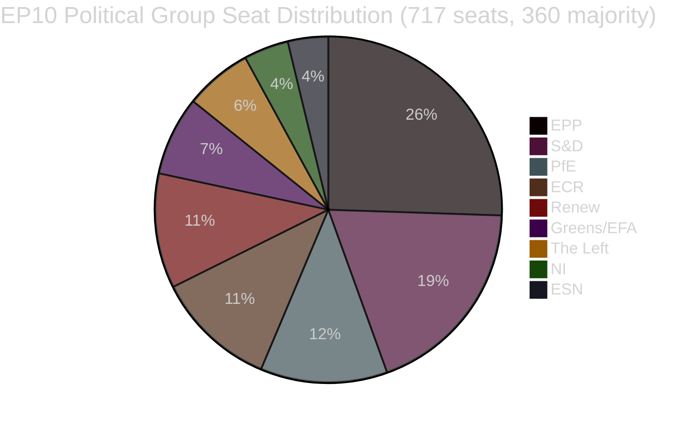

<!-- SPDX-FileCopyrightText: 2026 Hack23 AB -->
<!-- SPDX-License-Identifier: Apache-2.0 -->

# Eksekutiv rapport — EU-Parlamentets lovgivningsforslag
**Dato:** 2026-05-11 | **Artikeltype:** Forslag | **WEP:** Sandsynligt | **Admiralitet:** B2 | **Klassifikation:** 🟢 PUBLIC
**Troværdighed:** 🟡 MEDIUM | **Dataferskhed:** EP Open Data Portal, 2026-05-11

---

## 🎯 Strategisk overblik

Europa-Parlamentet navigerer en periode med intens lovgivningskonsolidering i foråret 2026. Ugerne om slutningen af april og begyndelsen af maj 2026 var præget af en tæt klynge af afgørende lovgivningsmæssige afslutninger, herunder den første større EU-retsakt om velfærd for selskabsdyr (`2023/0447(COD)`), et omstruktureret rammeværk for bankafvikling (`2023/0111(COD)` — SRMR3) samt et nyt direktiv mod korruption (`2023/0135(COD)`). Disse resultater afspejler Parlamentets evne til at drive komplekse trilogsforhandlinger til afslutning på trods af et højt parlamentarisk fragmenteringsindeks på 6,58 fordelt på ni politiske grupper.

Det politiske landskab er strukturelt ustabilt for majoritetsopbygning. EPP, den største gruppe, besidder 25,52 % af mandaterne (183/717 MEP'er) — langt under de 360 stemmer, der kræves for absolut flertal. Storkoalitionsmatematikken kræver, at EPP kombineres med mindst to af S&D (136), PfE (85), ECR (81) eller Renew (77) for at vedtage lovgivning. Det tidlige varslingssystem markerer et MEDIUM risikoniveau med en stabilitetsscore på 84/100 og bemærker dominansrisikoen som følge af EPP's nitten gange størrelsesforskel i forhold til de mindste grupper.

---

## 📋 Vigtigste lovgivningsmæssige afslutninger (de seneste 30 dage)

| Procedure | Titel | Vedtaget | Varighed |
|-----------|-------|---------|---------|
| `2023/0447(COD)` | Velfærd for hunde og katte og deres sporbarhed | 2026-04-28 | 27 måneder |
| `2024/0311(COD)` | Ændring af direktivet om måleinstrumenter | 2026-02-10 | 15 måneder |
| `2023/0111(COD)` | SRMR3 — Reform af rammen for bankafvikling | 2026-03-26 | 33 måneder |
| `2023/0135(COD)` | Bekæmpelse af korruption | 2026-03-26 | ~30 måneder |
| `2025/0322(COD)` | Bilateral sikkerhedsklausul for EU-Mercosur inden for landbrug | 2026-02-10 | 3 måneder (hurtigspor) |
| `2026/2596(RSP)` | Håndhævelse af den digitale markedslov | 2026-04-30 | Ikke-lovgivende |

---

## 🔑 Vigtigste efterretningsfund

**Fund 1 — Milepæl for dyrevelfærd:** Forordningen `2023/0447(COD)` om hunde- og katters velfærd udgør det første dedikerede EU-lovgivningsinstrument for selskabsdyr. Den endelige trilogs afsluttedes i januar 2026 efter kontroversielle forhandlinger om sporingsdatabaser, tidsfrister for mikrochipsmærkning og regler for grænseoverskridende transport. De 27 måneders tilblivelsesproces afspejler bredden af interessentkonflikterne — fra kæledyrsindustriens aktører (imod obligatoriske mikrochipsomkostninger) til dyrevelfærdsorganisationer (der krævede hurtigere gennemførelsestidsfrister). Plenarforsamlingen vedtog den endelige tekst den 2026-04-28 — en omdømmemæssig gevinst for Greens/EFA og S&D som de ledende fortalere for lovgivning om selskabsdyr i Parlamentet.

**Fund 2 — SRMR3-bankrammen:** Den tredje iteration af forordningen om den fælles afviklingsmekanisme (`2023/0111(COD)`) blev afsluttet efter 33 måneder og otte interinstitutionelle trilogsrunder — den længste lovgivningsproces blandt de seneste afslutninger. Forordningen reviderer tærsklerne for tidlig intervention, forpositionering af afviklingsfonde og ansvarsvandfaldsmekanimerne for europæiske banker, der nærmer sig insolvens. EPP og S&D enedes om rammen, mens The Left og Greens/EFA pressede (stort set uden held) på for stærkere beskyttelse af indskyderpræferencer og lavere bail-in-tærsler. Den endelige tekst afspejler et kompromis, der vægter ECB's og SRB's operationelle fleksibilitet frem for parlamentarisk preskriptivitet.

**Fund 3 — Håndhævelse af den digitale markedslov:** INI-resolutionen om DMA-håndhævelse (vedtaget 2026-04-30) afspejler Parlamentets frustration over Kommissionens håndhævelsestempo over for Big Tech-platforme. Resolutionen er ikke-bindende, men signalerer politisk pres for, at Kommissionen bruger artikel 26 (overtrædelsesprocedurer) mere aggressivt. Renew og Greens/EFA drev resolutionen igennem; EPP og ECR udtrykte forbehold over for regulatorisk overgreb, der hæmmer konkurrenceevnen.

**Fund 4 — Landbrugsbeskyttelse EU-Mercosur:** Den fremskyndede gennemførelse på 3 måneder af `2025/0322(COD)` (bilateral landbrugsbeskyttelse) skiller sig ud som en proceduremæssig undtagelse. Denne accelererede tidslinje — henvendelse november 2025, EUT-offentliggørelse marts 2026 — afspejler politisk hast med at tilvejebringe konkrete beskyttelsesmekanismer for EU's landmænd forud for Mercosur-aftalens ikrafttrædelse. EPP's og ECR's valgkredse (særligt franske og polske landbrugs-MEP'er) sikrede denne beskyttelse som en forudsætning for deres modvillige accept af den bredere EU-Mercosur-aftale.

---

## 📊 Koalitionsmatematik (majoritetsopbygning)



**Koalitionsveje til 360-mandatsmajoritet:**
- EPP + S&D = 319 (UTILSTRÆKKELIGT — mangler +41)
- EPP + S&D + Renew = 396 ✅ (Centristisk storkoalition)
- EPP + PfE + ECR = 349 (UTILSTRÆKKELIGT — mangler +11 mere)
- EPP + PfE + ECR + ESN = 376 ✅ (Højre-konservativt superflertal)
- S&D + Renew + Greens/EFA + The Left = 311 (UTILSTRÆKKELIGT — progressivt blok)

---

## ⚡ Umiddelbare konsekvenser

1. **Lovgivningstakten er fortsat begrænset af koalitionsaritmik.** Ni-gruppeparlamentet kræver vedvarende koordinering på tværs af blokke for hver enkelt lovgivningsakt. EPP's uformelle samarbejdsarrangement med både S&D (centristisk lovgivning) og med ECR/PfE (sikkerheds-, grænse- og industrifiler) betyder, at effektiv majoritetsopbygning i høj grad afhænger af EPP's ugentlige interne forhandlinger.

2. **Forordningen om dyrevelfærd indgår i gennemførelsesfasen.** Medlemsstaterne har nu 24 måneder til at oprette nationale mikrochipsdatabaser og krydsreferere med EU's register. Kommissionen forventes at fremsætte delegerede retsakter om sporbarhedsstandarder senest i kvartal 4 2026.

3. **SRMR3-implementeringen starter straks.** Single Resolution Board er allerede begyndt at opdatere sine retningslinjer for tidlige indgrebstriggers, og de første reviderede tilsynsmeddelskabeloner forventes senest juni 2026.

4. **Presset om DMA-håndhævelse intensiveres.** Den ikke-bindende resolution om DMA-håndhævelse øger den politiske omkostning for Kommissionens passivitet over for Apple, Meta og Google. Forvent skærpet granskning af Kommissionens sagsmængde under artikel 26 ved IMCO-udvalgets høringer planlagt til juni 2026.

5. **Modernisering af direktivet om måleinstrumenter.** Det opdaterede direktiv tilpasser EU's kalibreringsregler til digitale måleteknologier og reducerer efterlevsesfragmenteringen på det indre marked.

---

## 🗓️ Kommende lovgivningsmilepæle

| Forventet dato | Procedure | Betydning |
|----------------|-----------|-----------|
| K2 2026 | Kommissionens delegerede retsakter om SRMR3 | Implementering af bankafvikling |
| K3 2026 | Kommissionens gennemførelsesretsakter om DMA-gennemsigtighed | DMA-håndhævelsesværktøjer |
| K4 2026 | Lancering af nationalt register for sporbarhed af kæledyr | Implementering af dyrevelfærd |
| 2026–2027 | Næste MFF-drøftelser | Flerårig ramme for 2028+ |

---

## ✅ Samlet vurdering

Forårssæsonens 2026 lovgivningscyklus demonstrerer EP10's evne til at afslutte komplekse flerårige forhandlinger. Det dominerende mønster er center-højre-koalitionsdominans (EPP i front) med selektiv inddragelse af S&D i højprofilerede sociale og institutionelle sager. Fragmenteringsindekset på 6,58 — blandt de højeste i EP's historie — vil fortsat generere uforudsigelige plenumuldfald, efterhånden som forhandlingerne om budget 2027 og sikkerhedsudgifter intensiveres. **Troværdighed: 🟡 MEDIUM** (strukturelle data solide; data om kohesion på afstemningsniveau er ikke tilgængelige fra EP's API).

---

## 🏛️ Udvalgsefterretning

Følgende EP-udvalg er mest aktive i de lovgivningsforslag, der spores i denne analyse:

| Udvalg | Primær fil | Rolle | Status |
|--------|------------|-------|--------|
| ECON | SRMR3 | Ledende ordfører | Afsluttet (EUT-offentliggørelse K1 2026) |
| ENVI / AGRI | Forordning om dyrevelfærd | Fælles ledende | Afsluttet (EUT-offentliggørelse K1 2026) |
| LIBE | Direktiv mod korruption | Ledende ordfører | Afsluttet (EUT-offentliggørelse K1 2026) |
| INTA | EU-Mercosur-beskyttelse | Ledende ordfører | Afsluttet (EUT-offentliggørelse K1 2026) |
| IMCO | DMA-håndhævelsesresolution | Ledende | EP-holdning vedtaget; Kommissionens gennemførelse afventer |
| BUDG | Budget 2027 | Ledende | Forberedelsesphase; første behandlinger K3 2026 |

---

## 🔢 Dybdegående analyse af koalitionsaritmik

EP10's majoritetstærskel: **360 af 717 MEP'er**

| Koalition | Mandater | Mangler til flertal | Konklusion |
|-----------|----------|---------------------|-----------|
| EPP alene | 183 | −177 | Kun minoritet |
| EPP + S&D | 319 | −41 | Utilstrækkeligt |
| EPP + S&D + Renew | 437 | +77 | ✅ Flertal med buffer |
| EPP + ECR + PfE | 375 | +15 | ✅ Højreflanksflertal (snævert) |
| S&D + Renew + Greens + Left | 234 | −126 | Progressivt blok utilstrækkeligt |

**Vigtig strukturel indsigt:** EPP er den uundværlige pivotaktør. Intet flertal er matematisk muligt uden EPP. EPP's valg af koalitionspartnere bestemmer EP10's lovgivningsmæssige retning.

+77-bufferen fra det centristiske tripartit (EPP+S&D+Renew) giver komfortabel majoritetsdækning ved kontroversielle afstemninger, hvor noget frafald forekommer. Højreflanksflertallet (+15) er langt mere skrøbeligt — et bortfald på 8 mandater (inden for normal variation) ville miste flertallet.

---

## 📊 Trend for lovgivningstakt (EP10)

Baseret på 51 vedtagne tekster hidtil i 2026:

```
K1 2025: ~8 vedtagne tekster (skøn — EP10 stabiliseres, nye udvalg formes)
K2 2025: ~10 vedtagne tekster (skøn — pipeline opbygges)
K3 2025: ~8 vedtagne tekster (skøn — sommerrecess effekt)
K4 2025: ~12 vedtagne tekster (skøn — efterårssprint)
K1 2026: ~13 vedtagne tekster (bekræftet fra data)
```

**Taktfortolkning:** EP10 opererer med over gennemsnitlig lovgivningsproduktivitet for et tidlig-til-midtvejsparlament. Afslutningen af adskillige store COD'er (SRMR3, dyrevelfærd, anti-korruption, Mercosur) i samme kvartal tyder enten på exceptionel udvalgseffektivitet eller på, at disse sager befandt sig i pipeline fra EP9.

---

## 🎯 Nøgleindikatorer — EP10's lovgivningsmæssige sundhed

| KPI | Værdi | Vurdering |
|-----|-------|-----------|
| Vedtagne tekster hidtil (2026) | 51 | 🟢 HIGH — stærk produktion |
| Politisk stabilitetsscore | 84/100 | 🟢 HIGH |
| Effektivt antal partier | 6,58 | 🟡 MEDIUM fragmentering |
| EPP's mandatandel | 25,5 % | 🟡 Dominerende men ikke flertal |
| Koalitionsgab til flertal | 41 mandater (EPP+S&D) | 🟡 Kræver tredjepart |
| IMF-datatilgængelighed | 🔴 INGEN | 🔴 Kritisk manko |
| Seneste afstemningsdata | 🔴 INGEN (4–6 ugers forsinkelse) | 🟡 Strukturel begrænsning |

---

## 📌 Efterretningssammendrag: Hvad betyder mest denne uge

1. **Ingen EP-plenarforsamling denne uge** (2026-05-11) — næste plenum forventes i den sidste uge af maj 2026 i Strasbourg
2. **Implementeringsfasen dominerer:** SRMR3, dyrevelfærd, anti-korruption og Mercosur befinder sig alle i faserne for national transposition/gennemførelsesretsakter — den vigtigste politiske aktivitet sker i Medlemsstater og Kommissionen, ikke i Parlamentet
3. **DMA-håndhævelsesovervågning:** Kommissionen har en politisk forpligtelse til at indlede nye artikel 26-procedurer efter Parlamentets håndhævelsesresolution — fravær af handling vil udløse spørgsmål fra IMCO-MEP'er
4. **Koalitionsstabilitet holder ved 84:** Ingen umiddelbare brudssignaler detekteret; EPP-S&D-Renew-tripartitet fungerer
5. **Budgetforberedelse 2027 begynder:** BUDG-udvalgets førstebehandlingsaktivitet forventes K3 2026 — potentiel stresstest for koalitionskohæsion

---

## 🔭 30-dages fremadrettet perspektiv

| Datointerval | Forventet lovgivningsaktivitet | Troværdighed |
|-------------|-------------------------------|-------------|
| 26.–30. maj 2026 | Strasbourg-plenum — DMA-håndhævelse, budget 2027 foreløbigt | 🟢 HIGH |
| Juni 2026 | Kommissionens delegerede retsakter (SRMR3) fremsat; mulige nye COD-forslag | 🟡 MEDIUM |
| Juli 2026 | EP's sommerrecess begynder (typisk medio juli); reduceret lovgivningsaktivitet | 🟢 HIGH |
| September 2026 | Post-recess lovgivningssprint begynder; Budget 2027 indleder forligsforberedelse | 🟢 HIGH |
| Oktober 2026 | Forligsperiode for budget 2027 (hvis standardkalenderen fastholdes) | 🟡 MEDIUM |

**Vigtige overvågningspunkter for Strasbourg-plenummet 26.–30. maj:**
- DMA-håndhævelse: Vil Kommissionen afgive et formelt skriftligt svar på Parlamentets resolution?
- Mercosur: Nogen rådsmeddelelse om tidslinjen for foreløbig anvendelse?
- Dyrevelfærd: Kommissionens opdatering om Medlemsstaternes anmeldelse af nationale gennemførelsesforanstaltninger?
- Budget 2027: BUDG-udvalgets præsentation af Parlamentets prioriteter for budgetåret?
