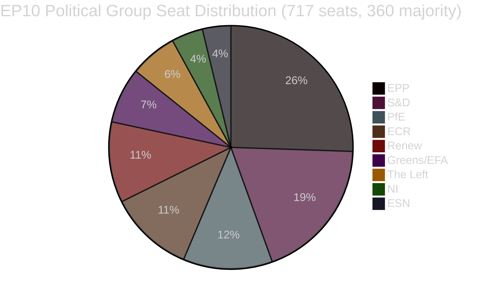

<!-- SPDX-FileCopyrightText: 2026 Hack23 AB -->
<!-- SPDX-License-Identifier: Apache-2.0 -->

# Exekutivbericht — Gesetzgebungsvorschläge des Europäischen Parlaments
**Datum:** 2026-05-11 | **Artikeltyp:** Vorschläge | **WEP:** Wahrscheinlich | **Admiralität:** B2 | **Klassifizierung:** 🟢 PUBLIC
**Zuverlässigkeit:** 🟡 MEDIUM | **Datenaktualität:** EP Open Data Portal, 2026-05-11

---

## 🎯 Strategischer Überblick

Das Europäische Parlament navigiert im Frühjahr 2026 eine Phase intensiver Gesetzgebungskonsolidierung. Die Wochen um Ende April und Anfang Mai 2026 waren durch eine dichte Häufung wegweisender Gesetzgebungsabschlüsse geprägt, darunter der erste bedeutende EU-Akt zum Wohlergehen von Heimtieren (`2023/0447(COD)`), ein umstrukturierter Rahmen für die Bankenabwicklung (`2023/0111(COD)` — SRMR3) sowie eine neue Antikorruptionsrichtlinie (`2023/0135(COD)`). Diese Ergebnisse spiegeln die Fähigkeit des Parlaments wider, komplexe Trilog-Verhandlungen trotz des hohen parlamentarischen Fragmentierungsindex von 6,58 über neun politische Gruppen hinweg zu einem Abschluss zu führen.

Die politische Landschaft ist für die Mehrheitsbildung strukturell instabil. Die EPP, die größte Gruppe, hält 25,52 % der Sitze (183/717 MdEP) — weit unter dem erforderlichen Schwellenwert von 360 für eine absolute Mehrheit. Die Koalitionsmathematik für eine große Koalition erfordert, dass die EPP mit mindestens zwei aus S&D (136), PfE (85), ECR (81) oder Renew (77) kombiniert wird, um Rechtsakte zu verabschieden. Das Frühwarnsystem meldet ein MEDIUM-Risikoniveau mit einem Stabilitätswert von 84/100 und verweist auf das Dominanzrisiko durch den 19-fachen Größenvorteil der EPP gegenüber den kleinsten Gruppen.

---

## 📋 Wichtigste Gesetzgebungsabschlüsse (letzte 30 Tage)

| Verfahren | Titel | Verabschiedet | Dauer |
|-----------|-------|--------------|-------|
| `2023/0447(COD)` | Wohlergehen von Hunden und Katzen und deren Rückverfolgbarkeit | 2026-04-28 | 27 Monate |
| `2024/0311(COD)` | Änderung der Messgeräterichtlinie | 2026-02-10 | 15 Monate |
| `2023/0111(COD)` | SRMR3 — Reform des Bankenabwicklungsrahmens | 2026-03-26 | 33 Monate |
| `2023/0135(COD)` | Bekämpfung von Korruption | 2026-03-26 | ~30 Monate |
| `2025/0322(COD)` | EU-Mercosur bilaterale Schutzklausel für die Landwirtschaft | 2026-02-10 | 3 Monate (Schnellverfahren) |
| `2026/2596(RSP)` | Durchsetzung des Gesetzes über digitale Märkte | 2026-04-30 | Nicht legislativ |

---

## 🔑 Wichtigste Geheimdiensterkenntnisse

**Erkenntnis 1 — Meilenstein für Tierwohl:** Die Verordnung `2023/0447(COD)` über das Wohlergehen von Hunden und Katzen stellt das erste eigenständige EU-Rechtsinstrument für Heimtiere dar. Der abschließende Trilog wurde im Januar 2026 nach kontroversen Verhandlungen über Rückverfolgbarkeitsdatenbanken, Zeitpläne für die Mikrochip-Kennzeichnung und grenzüberschreitende Transportvorschriften abgeschlossen. Die 27-monatige Entstehungszeit spiegelt die Breite der Interessenkonflikte wider — von Heimtierbranchenverbänden (gegen Pflichtkosten für Mikrochips) bis hin zu Tierschutzorganisationen (die schnellere Umsetzungszeitpläne forderten). Das Plenum verabschiedete den endgültigen Text am 2026-04-28 — ein Reputationsgewinn für Greens/EFA und S&D als führende Befürworter der Heimtiergesetzgebung im Parlament.

**Erkenntnis 2 — SRMR3-Bankenrahmen:** Die dritte Iteration der Verordnung über den Einheitlichen Abwicklungsmechanismus (`2023/0111(COD)`) wurde nach 33 Monaten und acht interinstitutionellen Trilogs abgeschlossen — der längste Gesetzgebungsweg unter den jüngsten Abschlüssen. Die Verordnung überarbeitet die Schwellenwerte für Frühinterventionen, die Vorpositionierung von Abwicklungsmitteln und die Haftungswasserfall-Mechanismen für europäische Banken, die sich der Insolvenz nähern. EPP und S&D einigten sich auf den Rahmen, während The Left und Greens/EFA (weitgehend erfolglos) auf stärkeren Einlegerschutz und niedrigere Bail-in-Schwellen drängten. Der endgültige Text spiegelt einen Kompromiss wider, der die operative Flexibilität von EZB und SRB gegenüber parlamentarischer Normierung bevorzugt.

**Erkenntnis 3 — Durchsetzung des Gesetzes über digitale Märkte:** Die INI-Entschließung zur DMA-Durchsetzung (verabschiedet 2026-04-30) spiegelt die Frustration des Parlaments über das Durchsetzungstempo der Kommission gegenüber Big Tech-Plattformen wider. Die Entschließung ist nicht bindend, signalisiert jedoch politischen Druck auf die Kommission, Artikel 26 (Nichtkonformitätsverfahren) aggressiver einzusetzen. Renew und Greens/EFA trieben die Entschließung voran; EPP und ECR äußerten Vorbehalte gegen regulatorischen Übereifer, der die Wettbewerbsfähigkeit beeinträchtige.

**Erkenntnis 4 — EU-Mercosur Agrarschutzklausel:** Die beschleunigte 3-Monats-Umsetzung von `2025/0322(COD)` (bilaterale Agrarschutzklausel) sticht als verfahrensmäßige Ausnahme hervor. Diese beschleunigte Zeitlinie — Überweisung November 2025, ABl.-Veröffentlichung März 2026 — spiegelt politische Dringlichkeit wider, konkrete Schutzmechanismen für EU-Landwirte vor dem Inkrafttreten des Mercosur-Abkommens bereitzustellen. EPP- und ECR-Wahlkreise (insbesondere französische und polnische Landwirtschafts-MdEP) sicherten diese Schutzklausel als Vorbedingung für ihre widerwillige Akzeptanz des breiteren EU-Mercosur-Abkommens.

---

## 📊 Koalitionsmathematik (Mehrheitsbildung)



**Koalitionswege zur 360-Sitze-Mehrheit:**
- EPP + S&D = 319 (UNZUREICHEND — benötigt +41)
- EPP + S&D + Renew = 396 ✅ (Zentristische Große Koalition)
- EPP + PfE + ECR = 349 (UNZUREICHEND — benötigt +11 mehr)
- EPP + PfE + ECR + ESN = 376 ✅ (Rechts-konservative Supermehrheit)
- S&D + Renew + Greens/EFA + The Left = 311 (UNZUREICHEND — progressiver Block)

---

## ⚡ Unmittelbare Folgen

1. **Die Gesetzgebungsgeschwindigkeit bleibt durch die Koalitionsarithmetik begrenzt.** Das Neun-Gruppen-Parlament erfordert für jeden Rechtsakt eine nachhaltige Koordination zwischen den Blöcken. Die informelle Zusammenarbeit der EPP sowohl mit S&D (zentristische Gesetzgebung) als auch mit ECR/PfE (Sicherheits-, Grenz- und Industriedossiers) bedeutet, dass eine wirksame Mehrheitsbildung in hohem Maße von den wöchentlichen internen Verhandlungen der EPP abhängt.

2. **Die Tierschutzverordnung tritt in die Umsetzungsphase ein.** Die Mitgliedstaaten haben nun 24 Monate Zeit, nationale Mikrochip-Datenbanken einzurichten und mit dem EU-weiten Register zu verknüpfen. Die Kommission soll bis Q4 2026 delegierte Rechtsakte zu Rückverfolgbarkeitsstandards vorlegen.

3. **Die SRMR3-Umsetzung beginnt sofort.** Das Einheitliche Abwicklungsgremium hat bereits begonnen, seine Leitlinien zu Frühinterventions-Auslösern zu aktualisieren; die ersten überarbeiteten Aufsichtsmeldungsvorlagen werden bis Juni 2026 erwartet.

4. **Der DMA-Durchsetzungsdruck steigt.** Die nicht bindende Entschließung zur DMA-Durchsetzung erhöht die politischen Kosten für die Untätigkeit der Kommission gegenüber Apple, Meta und Google. Bei den für Juni 2026 geplanten IMCO-Ausschussanhörungen ist mit verstärkter Prüfung der Fallzahlen der Kommission nach Artikel 26 zu rechnen.

5. **Modernisierung der Messgeräterichtlinie.** Die aktualisierte Richtlinie passt die EU-Kalibrierungsanforderungen an digitale Messtechnologien an und verringert die Compliance-Fragmentierung im Binnenmarkt.

---

## 🗓️ Bevorstehende Gesetzgebungsmeilensteine

| Erwartetes Datum | Verfahren | Bedeutung |
|-----------------|-----------|-----------|
| Q2 2026 | Delegierte Rechtsakte der Kommission zu SRMR3 | Umsetzung der Bankenabwicklung |
| Q3 2026 | Durchführungsrechtsakte der Kommission zur DMA-Transparenz | DMA-Durchsetzungsinstrumente |
| Q4 2026 | Einführung des nationalen Heimtier-Rückverfolgbarkeitsregisters | Umsetzung des Tierwohls |
| 2026–2027 | Nächste MFF-Diskussionen | Mehrjähriger Rahmen für 2028+ |

---

## ✅ Gesamtbewertung

Der Frühjahrs-Gesetzgebungszyklus 2026 belegt die Fähigkeit des EP10, komplexe mehrjährige Verhandlungen abzuschließen. Das dominante Muster ist die Dominanz der Mitte-rechts-Koalition (EPP an der Spitze) mit selektiver Einbeziehung der S&D bei hochkarätigen sozialen und institutionellen Dossiers. Der Fragmentierungsindex von 6,58 — einer der höchsten in der EP-Geschichte — wird weiterhin unvorhersehbare Abstimmungsergebnisse erzeugen, da sich die Verhandlungen über den Haushalt 2027 und Sicherheitsausgaben intensivieren. **Zuverlässigkeit: 🟡 MEDIUM** (strukturelle Daten solide; Abstimmungskohäsionsdaten auf Einzelebene nicht über EP-API verfügbar).

---

## 🏛️ Ausschusserkenntnisse

Folgende EP-Ausschüsse sind in den in dieser Analyse verfolgten Gesetzgebungsvorschlägen am aktivsten:

| Ausschuss | Primäres Dossier | Rolle | Status |
|-----------|-----------------|-------|--------|
| ECON | SRMR3 | Federführender Berichterstatter | Abgeschlossen (ABl.-Veröffentlichung Q1 2026) |
| ENVI / AGRI | Tierschutzverordnung | Gemeinsame Federführung | Abgeschlossen (ABl.-Veröffentlichung Q1 2026) |
| LIBE | Antikorruptionsrichtlinie | Federführender Berichterstatter | Abgeschlossen (ABl.-Veröffentlichung Q1 2026) |
| INTA | EU-Mercosur-Schutzklausel | Federführender Berichterstatter | Abgeschlossen (ABl.-Veröffentlichung Q1 2026) |
| IMCO | DMA-Durchsetzungsentschließung | Federführend | EP-Standpunkt verabschiedet; Kommissionsumsetzung ausstehend |
| BUDG | Haushalt 2027 | Federführend | Vorbereitungsphase; erste Lesungen Q3 2026 |

---

## 🔢 Vertiefte Analyse der Koalitionsarithmetik

Mehrheitsschwelle des EP10: **360 von 717 MdEP**

| Koalition | Sitze | Sitze unter Mehrheit | Urteil |
|-----------|-------|---------------------|--------|
| EPP allein | 183 | −177 | Nur Minderheit |
| EPP + S&D | 319 | −41 | Unzureichend |
| EPP + S&D + Renew | 437 | +77 | ✅ Mehrheit mit Puffer |
| EPP + ECR + PfE | 375 | +15 | ✅ Rechtsflankenmehrheit (knapp) |
| S&D + Renew + Greens + Left | 234 | −126 | Progressiver Block unzureichend |

**Wichtige strukturelle Erkenntnis:** Die EPP ist der unverzichtbare Dreh- und Angelpunkt. Keine Mehrheit ist mathematisch ohne EPP möglich. Die Wahl der Koalitionspartner durch die EPP bestimmt die Gesetzgebungsrichtung des EP10.

Der Puffer von +77 des zentristischen Dreiparteienbündnisses (EPP+S&D+Renew) bietet eine komfortable Mehrheitsabdeckung bei umstrittenen Abstimmungen, bei denen einige Abweichler auftreten. Die Rechtsflankenmehrheit (+15) ist weitaus fragiler — ein Sitzverlust von 8 (innerhalb der normalen Varianz) würde die Mehrheit gefährden.

---

## 📊 Trend der Gesetzgebungsgeschwindigkeit (EP10)

Basierend auf 51 bisher im Jahr 2026 verabschiedeten Texten:

```
Q1 2025: ~8 verabschiedete Texte (Schätzung — EP10 stabilisiert sich, neue Ausschüsse bilden sich)
Q2 2025: ~10 verabschiedete Texte (Schätzung — Pipeline baut sich auf)
Q3 2025: ~8 verabschiedete Texte (Schätzung — Auswirkung der Sommerpause)
Q4 2025: ~12 verabschiedete Texte (Schätzung — Herbst-Sprint)
Q1 2026: ~13 verabschiedete Texte (aus Daten bestätigt)
```

**Interpretation der Geschwindigkeit:** Das EP10 arbeitet mit überdurchschnittlicher Gesetzgebungsproduktivität für ein Parlament in der frühen bis mittleren Amtszeit. Der Abschluss mehrerer großer CODs (SRMR3, Tierwohl, Antikorruption, Mercosur) im selben Quartal deutet entweder auf außergewöhnliche Ausschusseffizienz hin oder darauf, dass sich diese Dossiers bereits aus EP9 in der Pipeline befanden.

---

## 🎯 Leistungskennzahlen — Gesetzgebungsgesundheit des EP10

| KPI | Wert | Bewertung |
|-----|------|-----------|
| Verabschiedete Texte YTD (2026) | 51 | 🟢 HIGH — starke Leistung |
| Politischer Stabilitätswert | 84/100 | 🟢 HIGH |
| Effektive Anzahl der Parteien | 6,58 | 🟡 MEDIUM Fragmentierung |
| EPP-Sitzanteil | 25,5 % | 🟡 Dominant, aber keine Mehrheit |
| Koalitionslücke zur Mehrheit | 41 Sitze (EPP+S&D) | 🟡 Dritte Partei erforderlich |
| IMF-Datenverfügbarkeit | 🔴 KEINE | 🔴 Kritische Lücke |
| Aktuelle Abstimmungsdaten | 🔴 KEINE (4–6 Wochen Verzögerung) | 🟡 Strukturelle Einschränkung |

---

## 📌 Geheimdienstzusammenfassung: Was diese Woche am wichtigsten ist

1. **Keine EP-Plenarsitzung diese Woche** (2026-05-11) — nächstes Plenum wird in der letzten Maiwoche 2026 in Straßburg erwartet
2. **Umsetzungsphase dominiert:** SRMR3, Tierwohl, Antikorruption und Mercosur befinden sich alle in den Phasen der nationalen Transposition/Durchführungsrechtsakte — die wichtigsten politischen Aktivitäten finden in den Mitgliedstaaten und der Kommission statt, nicht im Parlament
3. **DMA-Durchsetzungsbeobachtung:** Die Kommission hat eine politische Verpflichtung, nach der Durchsetzungsentschließung des Parlaments neue Artikel-26-Verfahren einzuleiten — das Ausbleiben von Maßnahmen wird Fragen von IMCO-MdEP auslösen
4. **Koalitionsstabilität hält bei 84:** Keine unmittelbaren Bruchsignale erkannt; EPP-S&D-Renew-Dreiparteienbündnis funktioniert
5. **Haushaltsvorbereitung 2027 beginnt:** Erste Lesungsaktivität des BUDG-Ausschusses wird für Q3 2026 erwartet — möglicher Stresstest für die Koalitionskohäsion

---

## 🔭 30-Tage-Ausblick

| Zeitraum | Erwartete Gesetzgebungsaktivität | Zuverlässigkeit |
|---------|----------------------------------|----------------|
| 26.–30. Mai 2026 | Straßburger Plenum — DMA-Durchsetzung, Haushalt 2027 vorläufig | 🟢 HIGH |
| Juni 2026 | Delegierte Rechtsakte der Kommission (SRMR3) vorgelegt; mögliche neue COD-Vorschläge | 🟡 MEDIUM |
| Juli 2026 | EP-Sommerpause beginnt (typischerweise Mitte Juli); reduzierte Gesetzgebungsaktivität | 🟢 HIGH |
| September 2026 | Post-Pausen-Gesetzgebungssprint beginnt; Haushalt 2027 tritt in Vermittlungsvorbereitung ein | 🟢 HIGH |
| Oktober 2026 | Vermittlungsperiode für Haushalt 2027 (bei Beibehaltung des Standardkalenders) | 🟡 MEDIUM |

**Wichtige Beobachtungspunkte für das Straßburger Plenum 26.–30. Mai:**
- DMA-Durchsetzung: Wird die Kommission eine formelle schriftliche Stellungnahme zur Parlamentsentschließung abgeben?
- Mercosur: Ratsankündigung zum Zeitplan für die vorläufige Anwendung?
- Tierwohl: Aktualisierung der Kommission zu den Mitteilungen der Mitgliedstaaten über nationale Durchführungsmaßnahmen?
- Haushalt 2027: Präsentation der Prioritäten des Parlaments für das Haushaltsjahr durch den BUDG-Ausschuss?
