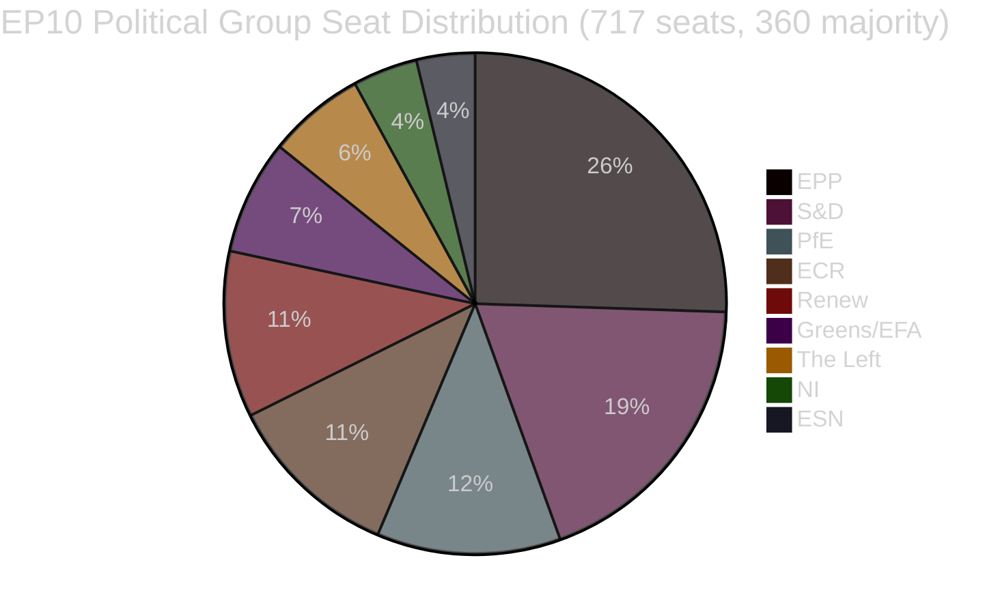

<!-- SPDX-FileCopyrightText: 2026 Hack23 AB -->
<!-- SPDX-License-Identifier: Apache-2.0 -->

# Informe ejecutivo — Propuestas legislativas del Parlamento Europeo
**Fecha:** 2026-05-11 | **Tipo de artículo:** Propuestas | **WEP:** Probable | **Almirante:** B2 | **Clasificación:** 🟢 PUBLIC
**Fiabilidad:** 🟡 MEDIUM | **Actualidad de los datos:** EP Open Data Portal, 2026-05-11

---

## 🎯 Visión estratégica

El Parlamento Europeo atraviesa un período de intensa consolidación legislativa en la primavera de 2026. Las semanas que abarcan finales de abril y principios de mayo de 2026 presenciaron un denso cúmulo de conclusiones legislativas emblemáticas, entre ellas el primer gran acto de la UE sobre el bienestar de los animales de compañía (`2023/0447(COD)`), un marco reestructurado para la resolución bancaria (`2023/0111(COD)` — SRMR3) y una nueva directiva anticorrupción (`2023/0135(COD)`). Estos logros reflejan la capacidad del Parlamento para llevar a término complejas negociaciones en trílogo a pesar del elevado índice de fragmentación parlamentaria de 6,58 repartido en nueve grupos políticos.

El panorama político es estructuralmente inestable para la formación de mayorías. El PPE, el grupo más numeroso, cuenta con el 25,52 % de los escaños (183/717 eurodiputados) — muy por debajo del umbral de 360 requerido para la mayoría absoluta. La matemática de la gran coalición exige que el PPE se asocie con al menos dos de S&D (136), PfE (85), ECR (81) o Renew (77) para aprobar legislación. El sistema de alerta temprana señala un nivel de riesgo MEDIUM con una puntuación de estabilidad de 84/100, advirtiendo del riesgo de dominancia derivado de la ventaja de tamaño diecinueve veces superior del PPE sobre los grupos más pequeños.

---

## 📋 Principales conclusiones legislativas (últimos 30 días)

| Procedimiento | Título | Adoptado | Duración |
|--------------|--------|---------|---------|
| `2023/0447(COD)` | Bienestar de perros y gatos y su trazabilidad | 2026-04-28 | 27 meses |
| `2024/0311(COD)` | Modificación de la Directiva sobre instrumentos de medición | 2026-02-10 | 15 meses |
| `2023/0111(COD)` | SRMR3 — Reforma del marco de resolución bancaria | 2026-03-26 | 33 meses |
| `2023/0135(COD)` | Lucha contra la corrupción | 2026-03-26 | ~30 meses |
| `2025/0322(COD)` | Cláusula de salvaguardia bilateral UE-Mercosur para la agricultura | 2026-02-10 | 3 meses (tramitación acelerada) |
| `2026/2596(RSP)` | Aplicación del Reglamento de Mercados Digitales | 2026-04-30 | No legislativo |

---

## 🔑 Principales hallazgos de inteligencia

**Hallazgo 1 — Hito para el bienestar animal:** El reglamento `2023/0447(COD)` sobre el bienestar de perros y gatos constituye el primer instrumento legislativo de la UE dedicado específicamente a los animales de compañía. El trílogo final concluyó en enero de 2026 tras controvertidas negociaciones sobre bases de datos de trazabilidad, plazos para el microchipado y normas de transporte transfronterizo. La gestación de 27 meses refleja la amplitud de los conflictos entre partes interesadas — desde asociaciones del sector de las mascotas (en contra de los costes obligatorios del microchipado) hasta organizaciones de bienestar animal (que exigían plazos de aplicación más rápidos). El pleno adoptó el texto definitivo el 2026-04-28 — un éxito reputacional para Greens/EFA y S&D como principales defensores de la legislación sobre animales de compañía en el Parlamento.

**Hallazgo 2 — Marco bancario SRMR3:** La tercera iteración del Reglamento sobre el Mecanismo Único de Resolución (`2023/0111(COD)`) se completó tras 33 meses y ocho trílogos interinstitucionales — el proceso legislativo más largo entre las conclusiones recientes. El reglamento revisa los umbrales de intervención temprana, el preposicionamiento de los fondos de resolución y los mecanismos de cascada de responsabilidad para los bancos europeos que se aproximan a la insolvencia. El PPE y S&D acordaron el marco, mientras que The Left y Greens/EFA presionaron (en gran medida sin éxito) a favor de una mayor protección de los preferentes de depositantes y umbrales de bail-in más bajos. El texto definitivo refleja un compromiso que favorece la flexibilidad operativa del BCE y la JUR frente a la prescriptividad parlamentaria.

**Hallazgo 3 — Aplicación del Reglamento de Mercados Digitales:** La resolución INI sobre la aplicación del DMA (adoptada el 2026-04-30) refleja la frustración del Parlamento ante el ritmo de aplicación de la Comisión frente a las grandes plataformas tecnológicas. La resolución no es vinculante, pero señala la presión política para que la Comisión utilice el artículo 26 (procedimientos de incumplimiento) de forma más agresiva. Renew y Greens/EFA impulsaron la resolución; el PPE y el ECR expresaron reservas sobre la regulación excesiva que podría perjudicar la competitividad.

**Hallazgo 4 — Salvaguardia agrícola UE-Mercosur:** La rápida tramitación en 3 meses de `2025/0322(COD)` (salvaguardia agrícola bilateral) destaca como una excepción procedimental. Este calendario acelerado — remisión en noviembre de 2025, publicación en el DO en marzo de 2026 — refleja la urgencia política de proporcionar mecanismos de protección concretos a los agricultores de la UE antes de la entrada en vigor del acuerdo Mercosur. Las circunscripciones del PPE y el ECR (especialmente los eurodiputados agrícolas franceses y polacos) aseguraron esta salvaguardia como condición previa para su reticente aceptación del acuerdo UE-Mercosur en su conjunto.

---

## 📊 Matemáticas de coalición (formación de mayoría)



**Vías de coalición hacia la mayoría de 360 escaños:**
- PPE + S&D = 319 (INSUFICIENTE — necesita +41)
- PPE + S&D + Renew = 396 ✅ (Gran coalición centrista)
- PPE + PfE + ECR = 349 (INSUFICIENTE — necesita +11 más)
- PPE + PfE + ECR + ESN = 376 ✅ (Supermayoría conservadora de derechas)
- S&D + Renew + Greens/EFA + The Left = 311 (INSUFICIENTE — bloque progresista)

---

## ⚡ Implicaciones inmediatas

1. **La velocidad legislativa sigue estando restringida por la aritmética de coalición.** El parlamento de nueve grupos requiere una coordinación sostenida entre bloques para cada pieza legislativa. El acuerdo de trabajo informal del PPE tanto con S&D (legislación centrista) como con ECR/PfE (seguridad, fronteras, industria) significa que la formación efectiva de mayorías depende en gran medida de las negociaciones internas semanales del PPE.

2. **El reglamento de bienestar animal entra en fase de aplicación.** Los Estados miembros disponen ahora de 24 meses para establecer bases de datos nacionales de microchipado y cruzarlas con el registro europeo. Se espera que la Comisión presente actos delegados sobre normas de trazabilidad antes del cuarto trimestre de 2026.

3. **La aplicación del SRMR3 comienza de inmediato.** La Junta Única de Resolución ya ha comenzado a actualizar sus orientaciones sobre los desencadenantes de intervención temprana; las primeras plantillas revisadas de notificación de supervisión se esperan antes de junio de 2026.

4. **La presión sobre la aplicación del DMA se intensifica.** La resolución no vinculante sobre la aplicación del DMA incrementa el coste político de la inacción de la Comisión frente a Apple, Meta y Google. Se prevé un escrutinio reforzado de la cartera de asuntos de la Comisión en virtud del artículo 26 en las audiencias de la comisión IMCO previstas para junio de 2026.

5. **Modernización de la Directiva sobre instrumentos de medición.** La directiva actualizada alinea los requisitos de calibración de la UE con las tecnologías de medición digitales, reduciendo la fragmentación del cumplimiento en el mercado único.

---

## 🗓️ Próximos hitos legislativos

| Fecha prevista | Procedimiento | Importancia |
|---------------|--------------|------------|
| T2 2026 | Actos delegados de la Comisión sobre el SRMR3 | Aplicación de la resolución bancaria |
| T3 2026 | Actos de ejecución de la Comisión sobre transparencia DMA | Herramientas de aplicación del DMA |
| T4 2026 | Lanzamiento del registro nacional de trazabilidad de mascotas | Aplicación del bienestar animal |
| 2026–2027 | Próximas discusiones sobre el MFP | Marco plurianual para 2028+ |

---

## ✅ Evaluación general

El ciclo legislativo de la primavera de 2026 demuestra la capacidad del PE10 para concluir negociaciones plurianuales complejas. El patrón dominante es la dominancia de la coalición de centro-derecha (PPE a la cabeza) con la inclusión selectiva de S&D en los expedientes sociales e institucionales de alto perfil. El índice de fragmentación de 6,58 — uno de los más altos de la historia del PE — continuará generando resultados plenarios impredecibles a medida que se intensifiquen las negociaciones sobre el presupuesto de 2027 y los gastos de seguridad. **Fiabilidad: 🟡 MEDIUM** (datos estructurales sólidos; datos de cohesión a nivel de voto no disponibles en la API del PE).

---

## 🏛️ Inteligencia de comisiones

Las siguientes comisiones del PE son las más activas en las propuestas legislativas analizadas en este informe:

| Comisión | Expediente principal | Función | Estado |
|---------|---------------------|---------|--------|
| ECON | SRMR3 | Ponente principal | Concluido (publicación DO T1 2026) |
| ENVI / AGRI | Reglamento de bienestar animal | Codirección | Concluido (publicación DO T1 2026) |
| LIBE | Directiva anticorrupción | Ponente principal | Concluido (publicación DO T1 2026) |
| INTA | Salvaguardia UE-Mercosur | Ponente principal | Concluido (publicación DO T1 2026) |
| IMCO | Resolución de aplicación del DMA | Principal | Posición del PE adoptada; aplicación por la Comisión pendiente |
| BUDG | Presupuesto 2027 | Principal | Fase preparatoria; primeras lecturas T3 2026 |

---

## 🔢 Análisis en profundidad de la aritmética de coalición

Umbral de mayoría del PE10: **360 de 717 eurodiputados**

| Coalición | Escaños | Escaños bajo mayoría | Veredicto |
|-----------|---------|---------------------|----------|
| PPE solo | 183 | −177 | Solo minoría |
| PPE + S&D | 319 | −41 | Insuficiente |
| PPE + S&D + Renew | 437 | +77 | ✅ Mayoría con margen |
| PPE + ECR + PfE | 375 | +15 | ✅ Mayoría de flanco derecho (estrecha) |
| S&D + Renew + Greens + Left | 234 | −126 | Bloque progresista insuficiente |

**Clave estructural:** El PPE es el actor pivote indispensable. Ninguna mayoría es matemáticamente posible sin el PPE. La elección de socios de coalición por parte del PPE determina la dirección legislativa del PE10.

El margen de +77 del tripartito centrista (PPE+S&D+Renew) proporciona una cómoda cobertura de mayoría en las votaciones controvertidas donde se producen algunas defecciones. La mayoría de flanco derecho (+15) es mucho más frágil — una defección de 8 escaños (dentro de la varianza normal) haría perder la mayoría.

---

## 📊 Tendencia de la velocidad legislativa (PE10)

Basada en 51 textos adoptados hasta la fecha en 2026:

```
T1 2025: ~8 textos adoptados (estimación — PE10 estabilizándose, nuevas comisiones formándose)
T2 2025: ~10 textos adoptados (estimación — construcción del canal de tramitación)
T3 2025: ~8 textos adoptados (estimación — impacto del receso veraniego)
T4 2025: ~12 textos adoptados (estimación — sprint otoñal)
T1 2026: ~13 textos adoptados (confirmado por datos)
```

**Interpretación de la velocidad:** El PE10 opera con una productividad legislativa superior a la media para un parlamento en etapa inicial a intermedia. La conclusión de varios grandes COD (SRMR3, bienestar animal, anticorrupción, Mercosur) en el mismo trimestre sugiere o bien una eficiencia excepcional de las comisiones o que estos expedientes provenían del canal de tramitación del PE9.

---

## 🎯 Indicadores clave de rendimiento — Salud legislativa del PE10

| KPI | Valor | Evaluación |
|-----|-------|-----------|
| Textos adoptados en lo que va de año (2026) | 51 | 🟢 HIGH — producción sólida |
| Puntuación de estabilidad política | 84/100 | 🟢 HIGH |
| Número efectivo de partidos | 6,58 | 🟡 MEDIUM fragmentación |
| Cuota de escaños del PPE | 25,5 % | 🟡 Dominante pero sin mayoría |
| Brecha de coalición hasta la mayoría | 41 escaños (PPE+S&D) | 🟡 Requiere tercera fuerza |
| Disponibilidad de datos IMF | 🔴 NINGUNA | 🔴 Brecha crítica |
| Datos de votación recientes | 🔴 NINGUNA (retraso de 4–6 semanas) | 🟡 Limitación estructural |

---

## 📌 Síntesis de inteligencia: Lo más importante esta semana

1. **Sin sesión plenaria del PE esta semana** (2026-05-11) — la próxima plenaria se espera en la última semana de mayo de 2026 en Estrasburgo
2. **La fase de aplicación domina:** SRMR3, bienestar animal, anticorrupción y Mercosur se encuentran todos en fases de transposición nacional / actos de ejecución — la actividad política clave tiene lugar en los Estados miembros y la Comisión, no en el Parlamento
3. **Vigilancia de la aplicación del DMA:** La Comisión tiene la obligación política de iniciar nuevos procedimientos del artículo 26 tras la resolución de aplicación del Parlamento — la ausencia de acción suscitará preguntas de los eurodiputados de IMCO
4. **La estabilidad de la coalición se mantiene en 84:** No se detectan señales de ruptura inmediata; el tripartito PPE-S&D-Renew funciona
5. **Comienza la preparación del presupuesto 2027:** Se espera actividad en primera lectura de la comisión BUDG en T3 2026 — posible prueba de resistencia para la cohesión de la coalición

---

## 🔭 Perspectiva a 30 días

| Rango de fechas | Actividad legislativa esperada | Fiabilidad |
|----------------|-------------------------------|-----------|
| 26–30 mayo 2026 | Plenaria de Estrasburgo — aplicación del DMA, presupuesto 2027 preliminar | 🟢 HIGH |
| Junio 2026 | Actos delegados de la Comisión (SRMR3) presentados; posibles nuevas propuestas COD | 🟡 MEDIUM |
| Julio 2026 | Comienza el receso veraniego del PE (típicamente a mediados de julio); actividad legislativa reducida | 🟢 HIGH |
| Septiembre 2026 | Comienza el sprint legislativo post-receso; el presupuesto 2027 entra en preparación de conciliación | 🟢 HIGH |
| Octubre 2026 | Período de conciliación del presupuesto 2027 (si se mantiene el calendario estándar) | 🟡 MEDIUM |

**Puntos de seguimiento clave para la plenaria de Estrasburgo del 26 al 30 de mayo:**
- Aplicación del DMA: ¿Proporcionará la Comisión una declaración escrita formal en respuesta a la resolución del Parlamento?
- Mercosur: ¿Algún anuncio del Consejo sobre el calendario de aplicación provisional?
- Bienestar animal: ¿Actualización de la Comisión sobre la notificación de medidas nacionales de aplicación por parte de los Estados miembros?
- Presupuesto 2027: ¿Presentación por parte de la comisión BUDG de las prioridades del Parlamento para el ejercicio presupuestario?
