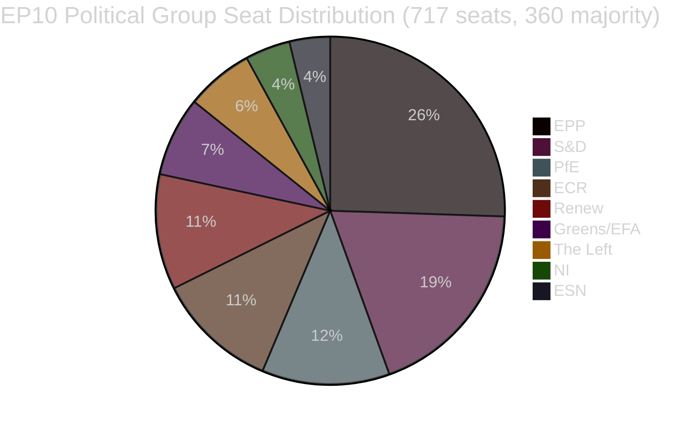

<!-- SPDX-FileCopyrightText: 2026 Hack23 AB -->
<!-- SPDX-License-Identifier: Apache-2.0 -->

# Toimeenpaneva raportti — EU-parlamentin lainsäädäntöehdotukset
**Päivämäärä:** 2026-05-11 | **Artikkelityyppi:** Ehdotukset | **WEP:** Todennäköinen | **Admiraliteetti:** B2 | **Luokittelu:** 🟢 PUBLIC
**Luotettavuus:** 🟡 MEDIUM | **Tietojen tuoreus:** EP Open Data Portal, 2026-05-11

---

## 🎯 Strateginen yleiskatsaus

Euroopan parlamentti navigoi intensiivisen lainsäädäntökonsolidoinnin kautta keväällä 2026. Huhtikuun lopun ja toukokuun alun 2026 viikot leimattiin tiheällä ryppäällä merkittäviä lainsäädäntöprosessien päätöksiä, mukaan lukien ensimmäinen suuri EU-asetus lemmikkieläinten hyvinvoinnista (`2023/0447(COD)`), uudistettu pankin kriisinratkaisukehys (`2023/0111(COD)` — SRMR3) sekä uusi korruption vastainen direktiivi (`2023/0135(COD)`). Nämä saavutukset heijastavat parlamentin kykyä viedä monimutkaiset trilogineuvottelut päätökseen huolimatta korkeasta parlamentaarisesta pirstoutumisindeksistä 6,58 jakautuen yhdeksälle poliittiselle ryhmälle.

Poliittinen maisema on rakenteellisesti epävakaa enemmistömuodostuksen kannalta. EPP, suurin ryhmä, pitää hallussaan 25,52 % paikoista (183/717 MEP:tä) — kaukana absoluuttisen enemmistön vaatimasta 360 paikan kynnyksestä. Suuren koalition matematiikka edellyttää, että EPP yhdistetään vähintään kahteen seuraavista: S&D (136), PfE (85), ECR (81) tai Renew (77) lainsäädännön hyväksymiseksi. Varhaisen varoituksen järjestelmä merkitsee MEDIUM-riskitasoa vakauspisteytyksellaä 84/100, huomioiden hallitsevuusriskin EPP:n 19-kertaisesta kokoedusta pienimpiin ryhmiin nähden.

---

## 📋 Tärkeimmät lainsäädännölliset päätökset (viimeiset 30 päivää)

| Menettely | Otsikko | Hyväksytty | Kesto |
|-----------|---------|------------|-------|
| `2023/0447(COD)` | Koirien ja kissojen hyvinvointi ja jäljitettävyys | 2026-04-28 | 27 kuukautta |
| `2024/0311(COD)` | Mittauslaitedirektiivin muuttaminen | 2026-02-10 | 15 kuukautta |
| `2023/0111(COD)` | SRMR3 — Pankin kriisinratkaisukehyksen uudistus | 2026-03-26 | 33 kuukautta |
| `2023/0135(COD)` | Korruption torjuminen | 2026-03-26 | ~30 kuukautta |
| `2025/0322(COD)` | EU-Mercosur-kahdenvälinen maatalouden suojalauseke | 2026-02-10 | 3 kuukautta (pikakaista) |
| `2026/2596(RSP)` | Digitaalisten markkinoiden lain täytäntöönpano | 2026-04-30 | Ei-lainsäädännöllinen |

---

## 🔑 Tärkeimmät tiedustelulöydökset

**Löydös 1 — Eläinten hyvinvoinnin merkkipaalu:** Asetus `2023/0447(COD)` koirien ja kissojen hyvinvoinnista edustaa ensimmäistä omistettua EU-tason lainsäädäntövälinettä lemmikkieläimille. Lopullinen trilogi päätettiin tammikuussa 2026 kontroversiaalisien neuvottelujen jälkeen jäljitettävyystietokannoista, mikrosirutusmärkkäyksen aikatauluista ja rajat ylittävän kuljetuksen sääntelystä. 27 kuukauden kypsymisaika heijastaa sidosryhmäristiriitojen laajuutta — lemmikkiteollisuuden toimijoista (pakollisia mikrosirukustannuksia vastaan) eläinten hyvinvointijärjestöihin (jotka vaativat nopeampaa täytäntöönpanoaikataulua). Täysistunto hyväksyi lopullisen tekstin 2026-04-28 — maineen voitto Greens/EFA:lle ja S&D:lle parlamentin lemmikkieläinlainsäädännön johtavina puolestapuhujina.

**Löydös 2 — SRMR3-pankkikehys:** Yhteistä kriisinratkaisumekanismia koskevan asetuksen kolmas iteraatio (`2023/0111(COD)`) valmistui 33 kuukauden ja kahdeksan toimielinten välisen trilogin jälkeen — pisin lainsäädäntömatka viimeaikaisista päätöksistä. Asetus tarkistaa varhaisen puuttumisen kynnysarvoja, kriisinratkaisurahastojen esiasemointia ja eurooppalaisten pankkien lähestymässä maksukyvyttömyyttä koskevia vastuun vesiputousmekanismeja. EPP ja S&D sopivat kehyksestä, kun taas The Left ja Greens/EFA ajoivat (pääasiassa tuloksetta) vahvempaa talletusten etusijaa ja alhaisempaa bail-in-kynnystä. Lopullinen teksti heijastaa kompromissia, joka painottaa EKP:n ja SRB:n operatiivista joustavuutta parlamentaarisen normittavuuden sijaan.

**Löydös 3 — Digitaalisten markkinoiden lain täytäntöönpano:** INI-päätöslauselma DMA:n täytäntöönpanosta (hyväksytty 2026-04-30) heijastaa parlamentin turhautumista komission täytäntöönpanotahtiin Big Tech -alustoja kohtaan. Päätöslauselma on sitomaton, mutta merkitsee poliittista painetta sille, että komissio käyttää 26 artiklaa (rikkomusmenettelyt) aggressiivisemmin. Renew ja Greens/EFA ajoivat päätöslauselman; EPP ja ECR ilmaisivat varauksia sääntelyn ylilyönnistä kilpailukykyyn.

**Löydös 4 — EU-Mercosur-maataloussuo jaus:** `2025/0322(COD)`:n (kahdenvälinen maataloussuojaus) nopeutettu 3 kuukauden toteutus erottuu menettelyllisesti poikkeustapauksena. Tämä nopeutettu aikataulu — lähettäminen marraskuussa 2025, EUVL-julkaisu maaliskuussa 2026 — heijastaa poliittista kiirettä tarjota konkreettisia suojamekanismeja EU-viljelijöille ennen Mercosur-sopimuksen voimaantuloa. EPP:n ja ECR:n vaalipiirit (erityisesti ranskalaiset ja puolalaiset maatalous-MEP:t) turvasivat tämän suojauksen ehtona epäröivään hyväksyntäänsä laajemmalle EU-Mercosur-sopimukselle.

---

## 📊 Koalitiotematiikka (enemmistömuodostus)



**Koalitiopolut 360 paikan enemmistöön:**
- EPP + S&D = 319 (RIITTÄMÄTÖN — tarvitaan +41)
- EPP + S&D + Renew = 396 ✅ (Sentristinen suurkoalitio)
- EPP + PfE + ECR = 349 (RIITTÄMÄTÖN — tarvitaan +11 lisää)
- EPP + PfE + ECR + ESN = 376 ✅ (Oikeisto-konservatiivinen superenemmistö)
- S&D + Renew + Greens/EFA + The Left = 311 (RIITTÄMÄTÖN — progressiivinen blokki)

---

## ⚡ Välittömät seuraukset

1. **Lainsäädäntötahti on edelleen koalitioaritmetiikan rajoittama.** Yhdeksän ryhmän parlamentti vaatii kestävää koordinaatiota blokkien välillä jokaiselle lainsäädäntöhankkeelle. EPP:n epävirallinen yhteistyöjärjestely sekä S&D:n (sentristinen lainsäädäntö) että ECR/PfE:n (turvallisuus-, raja- ja teollisuustiedostot) kanssa tarkoittaa, että tehokas enemmistönmuodostus on pitkälti riippuvainen EPP:n viikoittaisista sisäisistä neuvotteluista.

2. **Eläinten hyvinvointiasetus siirtyy täytäntöönpanovaiheeseen.** Jäsenvaltioilla on nyt 24 kuukautta aikaa perustaa kansalliset mikrosiru tietokannat ja ristiviitata EU:n laajuiseen rekisteriin. Komission odotetaan esittävän delegoidut säädökset jäljitettävyysstandardeista viimeistään neljännellä vuosineljänneksellä 2026.

3. **SRMR3-täytäntöönpano alkaa välittömästi.** Single Resolution Board on jo alkanut päivittää ohjeistustaan varhaisen puuttumisen laukaisimista, ja ensimmäiset tarkistetut valvontailmoitusten mallipohjat odotetaan viimeistään kesäkuussa 2026.

4. **DMA:n täytäntöönpanopaine kiristyy.** Sitomaton päätöslauselma DMA:n täytäntöönpanosta lisää poliittisia kustannuksia komission passiivisuudelle Applea, Metaa ja Googlea kohtaan. Odotettavissa on tiivistetty tarkastelu komission 26 artiklan mukaisen asiamäärän osalta IMCO-valiokunnan kesäkuulle 2026 suunnitelluissa kuulemisissa.

5. **Mittauslaitedirektiivin modernisaatio.** Päivitetty direktiivi yhdenmukaistaa EU:n kalibrointivaatimukset digitaalisiin mittausteknologioihin, vähentäen vaatimustenmukaisuuden pirstoutumista sisämarkkinoilla.

---

## 🗓️ Tulevat lainsäädäntövirstanpylväät

| Odotettu päivämäärä | Menettely | Merkitys |
|--------------------|-----------|---------|
| Q2 2026 | Komission delegoidut säädökset SRMR3:sta | Pankin kriisinratkaisun täytäntöönpano |
| Q3 2026 | Komission täytäntöönpanosäädökset DMA-läpinäkyvyydestä | DMA-täytäntöönpanovälineet |
| Q4 2026 | Kansallisen lemmikkijäljitettävyysrekisterin käynnistys | Eläinten hyvinvoinnin täytäntöönpano |
| 2026–2027 | Seuraavat MFF-neuvottelut | Monivuotinen kehys 2028+ |

---

## ✅ Yhteenveto

Kevään 2026 lainsäädäntösykli osoittaa EP10:n kyvyn saattaa päätökseen monimutkaiset monivuotiset neuvottelut. Hallitseva kaava on oikeistokeskustalainen koalitio-dominanssi (EPP johdossa) ja valikoiva S&D:n sisällyttäminen korkean profiilin sosiaalisiin ja institutionaalisiin tiedostoihin. Pirstoutumisindeksi 6,58 — yksi EP:n historian korkeimmista — jatkaa ennakoimattomien täysistuntopäätösten generoimista, kun vuoden 2027 budjetti- ja turvallisuusmenoihin liittyvät neuvottelut kiihtyvät. **Luotettavuus: 🟡 MEDIUM** (rakenteelliset tiedot vahvat; äänestystasoinen koheesiodata ei ole saatavilla EP:n API:sta).

---

## 🏛️ Valiokuntien tiedustelu

Seuraavat EP-valiokunnat ovat aktiivisimpia tässä analyysissä seurattujen lainsäädäntöehdotusten osalta:

| Valiokunta | Ensisijainen tiedosto | Rooli | Tila |
|-----------|--------------------|-------|------|
| ECON | SRMR3 | Johtava esittelijä | Valmis (EUVL-julkaisu Q1 2026) |
| ENVI / AGRI | Eläinten hyvinvointiasetus | Yhteinen johto | Valmis (EUVL-julkaisu Q1 2026) |
| LIBE | Korruption vastainen direktiivi | Johtava esittelijä | Valmis (EUVL-julkaisu Q1 2026) |
| INTA | EU-Mercosur-suoja | Johtava esittelijä | Valmis (EUVL-julkaisu Q1 2026) |
| IMCO | DMA-täytäntöönpanopäätöslauselma | Johtava | EP-kanta hyväksytty; komission täytäntöönpano odottaa |
| BUDG | Budjetti 2027 | Johtava | Valmisteluvaihe; ensimmäiset käsittelyt Q3 2026 |

---

## 🔢 Koalitioaritmetiikan syväanalyysi

EP10:n enemmistökynnys: **360 / 717 MEP:stä**

| Koalitio | Paikat | Vajaus enemmistöön | Tuomio |
|---------|--------|-------------------|--------|
| EPP yksin | 183 | −177 | Vähemmistö |
| EPP + S&D | 319 | −41 | Riittämätön |
| EPP + S&D + Renew | 437 | +77 | ✅ Enemmistö puskurilla |
| EPP + ECR + PfE | 375 | +15 | ✅ Oikeistosiiven enemmistö (niukka) |
| S&D + Renew + Greens + Left | 234 | −126 | Progressiivinen blokki riittämätön |

**Tärkeä rakenteellinen havainto:** EPP on korvaamaton keskeinen toimija. Mikään enemmistö ei ole matemaattisesti mahdollinen ilman EPP:tä. EPP:n valinta koalitiokumppaneista määrittää EP10:n lainsäädäntösuunnan.

Sentristisen tripartiitin (EPP+S&D+Renew) +77 puskuri tarjoaa mukavan enemmistöpeittavuuden kiistanalaisissa äänestyksissä, joissa jonkin verran poikkeamia tapahtuu. Oikeistosiipi enemmistö (+15) on huomattavasti hauraampi — 8 paikan menetys (normaalin vaihteluvälin sisällä) menettäisi enemmistön.

---

## 📊 Lainsäädäntötahdin trendi (EP10)

Perustuu 51:een vuoden 2026 alusta lähtien hyväksyttyyn tekstiin:

```
Q1 2025: ~8 hyväksyttyä tekstiä (arvio — EP10 vakiintuu, uudet valiokunnat muodostuvat)
Q2 2025: ~10 hyväksyttyä tekstiä (arvio — putki rakentuu)
Q3 2025: ~8 hyväksyttyä tekstiä (arvio — kesätauon vaikutus)
Q4 2025: ~12 hyväksyttyä tekstiä (arvio — syksyn spurtti)
Q1 2026: ~13 hyväksyttyä tekstiä (vahvistettu datasta)
```

**Tahdin tulkinta:** EP10 toimii keskimääräistä korkeammalla lainsäädäntötuottavuudella aikaisen ja keski-kauden parlamentille. Useiden suurten COD:ien (SRMR3, eläinten hyvinvointi, korruption vastainen, Mercosur) valmistuminen samalla neljänneksellä viittaa joko poikkeukselliseen valiokuntatehokkuuteen tai siihen, että nämä tiedostot olivat EP9:n putkessa.

---

## 🎯 Avainsuoritusindikaattorit — EP10:n lainsäädäntöllinen terveys

| KPI | Arvo | Arviointi |
|-----|------|-----------|
| Hyväksytyt tekstit YTD (2026) | 51 | 🟢 HIGH — vahva tuotanto |
| Poliittinen vakauspistemäärä | 84/100 | 🟢 HIGH |
| Puolueiden efektiivinen lukumäärä | 6,58 | 🟡 MEDIUM pirstoutuminen |
| EPP:n osuus paikoista | 25,5 % | 🟡 Hallitseva, muttei enemmistö |
| Koalitiokuilu enemmistöön | 41 paikkaa (EPP+S&D) | 🟡 Vaatii kolmannen osapuolen |
| IMF-datan saatavuus | 🔴 EI MITÄÄN | 🔴 Kriittinen aukko |
| Viimeisin äänestysdata | 🔴 EI MITÄÄN (4–6 viikon viive) | 🟡 Rakenteellinen rajoitus |

---

## 📌 Tiedusteluyhteenveto: Mikä on tärkeintä tällä viikolla

1. **Ei EP:n täysistuntoa tällä viikolla** (2026-05-11) — seuraava täysistunto odotetaan toukokuun 2026 viimeisellä viikolla Strasbourgissa
2. **Täytäntöönpanovaihe dominoi:** SRMR3, eläinten hyvinvointi, korruption vastainen ja Mercosur ovat kaikki kansallisen transposition/täytäntöönpanosäädösten vaiheissa — keskeinen poliittinen toiminta tapahtuu jäsenvaltioissa ja komissiossa, ei parlamentissa
3. **DMA:n täytäntöönpanon seuranta:** Komissiolla on poliittinen velvollisuus käynnistää uudet 26 artiklan mukaiset menettelyt parlamentin täytäntöönpanopäätöslauselman jälkeen — toimien puuttuminen laukaisee IMCO-MEP:ien kysymyksiä
4. **Koalitiostabiliteetti pysyy 84:ssä:** Välittömiä murtumissignaaleja ei havaittu; EPP-S&D-Renew-tripartiitta toimii
5. **Budjetin 2027 valmistelu alkaa:** BUDG-valiokunnan ensimmäisen käsittelyn toiminta odotetaan Q3 2026 — mahdollinen stressitesti koalitiokohesioolle

---

## 🔭 30 päivän eteenpäin katsova näkymä

| Aikaväli | Odotettu lainsäädäntöaktiviteetti | Luotettavuus |
|---------|----------------------------------|-------------|
| 26.–30. toukokuuta 2026 | Strasbourgin täysistunto — DMA:n täytäntöönpano, budjetti 2027 alustava | 🟢 HIGH |
| Kesäkuu 2026 | Komission delegoidut säädökset (SRMR3) esitelty; mahdolliset uudet COD-ehdotukset | 🟡 MEDIUM |
| Heinäkuu 2026 | EP:n kesätauko alkaa (tyypillisesti heinäkuun puolivälissä); vähentynyt lainsäädäntöaktiviteetti | 🟢 HIGH |
| Syyskuu 2026 | Tauon jälkeinen lainsäädäntöspurtti alkaa; Budjetti 2027 siirtyy sovitteluvalmistauun | 🟢 HIGH |
| Lokakuu 2026 | Budjetin 2027 sovittelujakso (jos standardikalenteri säilyy) | 🟡 MEDIUM |

**Tärkeimmät seurantapisteet Strasbourgin täysistunnolle 26.–30. toukokuuta:**
- DMA:n täytäntöönpano: Antaako komissio virallisen kirjallisen vastauksen parlamentin päätöslauselmaan?
- Mercosur: Onko neuvoston ilmoitusta väliaikaisen soveltamisen aikataulusta?
- Eläinten hyvinvointi: Komission päivitys jäsenvaltioiden kansallisten täytäntöönpanotoimien ilmoittamisesta?
- Budjetti 2027: BUDG-valiokunnan esittely parlamentin prioriteeteista budjettivuodelle?
