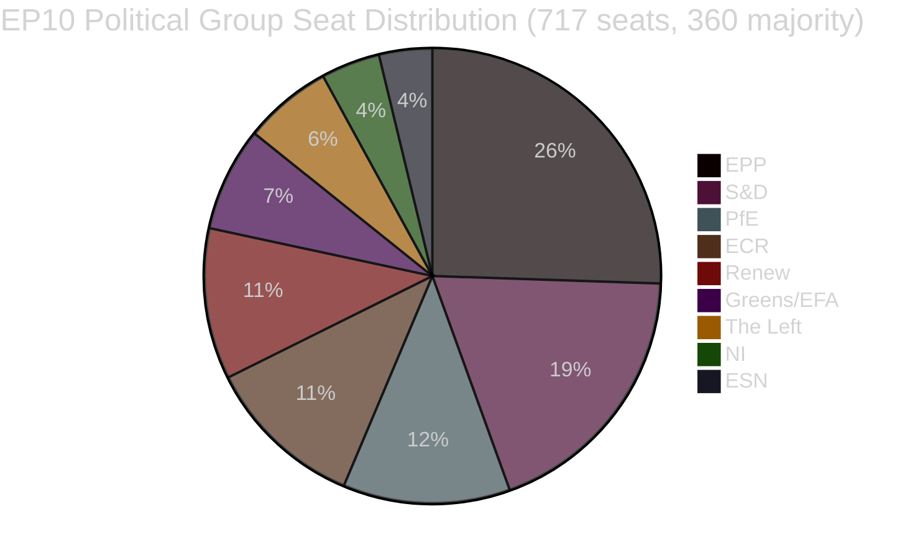

<!-- SPDX-FileCopyrightText: 2026 Hack23 AB -->
<!-- SPDX-License-Identifier: Apache-2.0 -->

# Note de synthèse — Propositions législatives du Parlement européen
**Date :** 2026-05-11 | **Type d'article :** Propositions | **WEP :** Probable | **Amirauté :** B2 | **Classification :** 🟢 PUBLIC
**Fiabilité :** 🟡 MEDIUM | **Fraîcheur des données :** EP Open Data Portal, 2026-05-11

---

## 🎯 Vue d'ensemble stratégique

Le Parlement européen traverse une période de consolidation législative intensive au printemps 2026. Les semaines couvrant la fin avril et le début mai 2026 ont été marquées par un dense faisceau d'achèvements législatifs majeurs, dont le premier acte important de l'UE sur le bien-être des animaux de compagnie (`2023/0447(COD)`), un cadre restructuré pour la résolution bancaire (`2023/0111(COD)` — SRMR3) et une nouvelle directive anticorruption (`2023/0135(COD)`). Ces réalisations témoignent de la capacité du Parlement à mener à terme des négociations trilogues complexes malgré un indice de fragmentation parlementaire élevé de 6,58 réparti sur neuf groupes politiques.

Le paysage politique est structurellement instable pour la formation des majorités. Le PPE, le groupe le plus important, détient 25,52 % des sièges (183/717 députés) — loin du seuil de 360 requis pour une majorité absolue. La mathématique d'une grande coalition exige que le PPE s'associe à au moins deux des groupes suivants : S&D (136), PfE (85), ECR (81) ou Renew (77) pour adopter des textes législatifs. Le système d'alerte précoce signale un niveau de risque MEDIUM avec un score de stabilité de 84/100, notant le risque de dominance dû à l'avantage de taille dix-neuf fois supérieur du PPE par rapport aux plus petits groupes.

---

## 📋 Principaux achèvements législatifs (30 derniers jours)

| Procédure | Titre | Adopté | Durée |
|-----------|-------|--------|-------|
| `2023/0447(COD)` | Bien-être des chiens et des chats et leur traçabilité | 2026-04-28 | 27 mois |
| `2024/0311(COD)` | Modification de la directive sur les instruments de mesure | 2026-02-10 | 15 mois |
| `2023/0111(COD)` | SRMR3 — Réforme du cadre de résolution bancaire | 2026-03-26 | 33 mois |
| `2023/0135(COD)` | Lutte contre la corruption | 2026-03-26 | ~30 mois |
| `2025/0322(COD)` | Clause de sauvegarde bilatérale UE-Mercosur pour l'agriculture | 2026-02-10 | 3 mois (procédure accélérée) |
| `2026/2596(RSP)` | Application du règlement sur les marchés numériques | 2026-04-30 | Non législatif |

---

## 🔑 Principaux constats de renseignement

**Constat 1 — Étape pour le bien-être animal :** Le règlement `2023/0447(COD)` sur le bien-être des chiens et des chats constitue le premier instrument législatif dédié de l'UE aux animaux de compagnie. Le trilogue final s'est achevé en janvier 2026 après des négociations controversées sur les bases de données de traçabilité, les calendriers de microrpuçage et les règles de transport transfrontalier. La gestation de 27 mois reflète l'ampleur des conflits d'intérêts — des associations de l'industrie des animaux de compagnie (opposées aux coûts obligatoires du micropuçage) aux organisations de défense du bien-être animal (réclamant des délais de mise en œuvre plus rapides). La plénière a adopté le texte final le 2026-04-28 — un succès de réputation pour les Greens/EFA et S&D en tant que principaux défenseurs de la législation sur les animaux de compagnie au sein du Parlement.

**Constat 2 — Cadre bancaire SRMR3 :** La troisième itération du règlement relatif au mécanisme de résolution unique (`2023/0111(COD)`) s'est achevée après 33 mois et huit trilogues interinstitutionnels — le plus long parcours législatif parmi les récents achèvements. Le règlement révise les seuils d'intervention précoce, le prépositionnement des fonds de résolution et les mécanismes de cascade de responsabilité pour les banques européennes approchant l'insolvabilité. Le PPE et S&D se sont entendus sur le cadre, tandis que The Left et Greens/EFA ont poussé (en grande partie sans succès) en faveur d'une meilleure protection des déposants et de seuils de renflouement interne plus bas. Le texte final reflète un compromis favorable à la flexibilité opérationnelle de la BCE et du CRU plutôt qu'à l'orientation parlementaire prescriptive.

**Constat 3 — Application du règlement sur les marchés numériques :** La résolution INI sur l'application du DMA (adoptée le 2026-04-30) reflète la frustration du Parlement face au rythme d'application de la Commission à l'égard des plateformes Big Tech. La résolution n'est pas contraignante, mais elle signale une pression politique pour que la Commission utilise l'article 26 (procédures de non-conformité) de manière plus agressive. Renew et Greens/EFA ont porté la résolution ; le PPE et l'ECR ont exprimé des réserves quant au risque de surréglementation nuisant à la compétitivité.

**Constat 4 — Clause de sauvegarde agricole UE-Mercosur :** L'achèvement accéléré en 3 mois de `2025/0322(COD)` (clause de sauvegarde agricole bilatérale) se distingue comme une exception procédurale. Ce calendrier accéléré — renvoi novembre 2025, publication au JO mars 2026 — reflète l'urgence politique de fournir des mécanismes de protection concrets aux agriculteurs de l'UE avant l'entrée en vigueur de l'accord Mercosur. Les circonscriptions du PPE et de l'ECR (notamment les eurodéputés agricoles français et polonais) ont obtenu cette clause de sauvegarde comme condition préalable à leur acceptation réticente de l'accord UE-Mercosur dans son ensemble.

---

## 📊 Mathématiques de coalition (formation de majorité)



**Chemins de coalition vers une majorité de 360 sièges :**
- PPE + S&D = 319 (INSUFFISANT — manque +41)
- PPE + S&D + Renew = 396 ✅ (Grande coalition centriste)
- PPE + PfE + ECR = 349 (INSUFFISANT — manque +11)
- PPE + PfE + ECR + ESN = 376 ✅ (Supermajorité conservatrice de droite)
- S&D + Renew + Greens/EFA + The Left = 311 (INSUFFISANT — bloc progressiste)

---

## ⚡ Implications immédiates

1. **La vélocité législative reste contrainte par l'arithmétique de coalition.** Le parlement à neuf groupes exige une coordination soutenue entre les blocs pour chaque texte législatif. L'arrangement de travail informel du PPE avec S&D (législation centriste) et avec ECR/PfE (sécurité, frontières, industrie) signifie que la formation effective des majorités dépend largement des négociations internes hebdomadaires du PPE.

2. **Le règlement sur le bien-être animal entre en phase de mise en œuvre.** Les États membres disposent désormais de 24 mois pour établir des bases de données nationales de micropuçage et les croiser avec le registre européen. La Commission devrait présenter des actes délégués sur les normes de traçabilité d'ici le quatrième trimestre 2026.

3. **La mise en œuvre du SRMR3 commence immédiatement.** Le Conseil de résolution unique a déjà commencé à actualiser ses orientations sur les déclencheurs d'intervention précoce ; les premiers modèles de notification de surveillance révisés sont attendus d'ici juin 2026.

4. **La pression sur l'application du DMA s'intensifie.** La résolution non contraignante sur l'application du DMA accroît le coût politique de l'inaction de la Commission vis-à-vis d'Apple, Meta et Google. Attendez-vous à un examen renforcé du stock d'affaires de la Commission au titre de l'article 26 lors des auditions de la commission IMCO prévues en juin 2026.

5. **Modernisation de la directive sur les instruments de mesure.** La directive actualisée aligne les exigences d'étalonnage de l'UE sur les technologies de mesure numériques, réduisant la fragmentation de la conformité dans le marché unique.

---

## 🗓️ Prochaines étapes législatives importantes

| Date prévue | Procédure | Portée |
|-------------|-----------|--------|
| T2 2026 | Actes délégués de la Commission sur le SRMR3 | Mise en œuvre de la résolution bancaire |
| T3 2026 | Actes d'exécution de la Commission sur la transparence DMA | Outils d'application du DMA |
| T4 2026 | Lancement du registre national de traçabilité des animaux de compagnie | Mise en œuvre du bien-être animal |
| 2026–2027 | Prochaines discussions sur le CFP | Cadre pluriannuel pour 2028+ |

---

## ✅ Évaluation synthétique

Le cycle législatif du printemps 2026 démontre la capacité du PE10 à conclure des négociations pluriannuelles complexes. Le schéma dominant est la domination de la coalition de centre-droit (PPE en tête) avec une inclusion sélective de S&D sur les dossiers sociaux et institutionnels à haute visibilité. L'indice de fragmentation de 6,58 — parmi les plus élevés de l'histoire du PE — continuera de générer des résultats pléniers imprévisibles à mesure que les négociations sur le budget 2027 et les dépenses de sécurité s'intensifient. **Fiabilité : 🟡 MEDIUM** (données structurelles solides ; données de cohésion au niveau des votes non disponibles via l'API du PE).

---

## 🏛️ Renseignement sur les commissions

Les commissions du PE suivantes sont les plus actives dans les propositions législatives suivies dans cette analyse :

| Commission | Dossier principal | Rôle | Statut |
|-----------|------------------|------|--------|
| ECON | SRMR3 | Rapporteur principal | Achevé (publication JO T1 2026) |
| ENVI / AGRI | Règlement sur le bien-être animal | Co-direction | Achevé (publication JO T1 2026) |
| LIBE | Directive anticorruption | Rapporteur principal | Achevé (publication JO T1 2026) |
| INTA | Clause de sauvegarde UE-Mercosur | Rapporteur principal | Achevé (publication JO T1 2026) |
| IMCO | Résolution sur l'application du DMA | Principal | Position du PE adoptée ; mise en œuvre par la Commission en attente |
| BUDG | Budget 2027 | Principal | Phase préparatoire ; premières lectures T3 2026 |

---

## 🔢 Analyse approfondie de l'arithmétique de coalition

Seuil de majorité du PE10 : **360 sur 717 députés**

| Coalition | Sièges | Sièges manquants | Verdict |
|-----------|--------|------------------|---------|
| PPE seul | 183 | −177 | Minorité uniquement |
| PPE + S&D | 319 | −41 | Insuffisant |
| PPE + S&D + Renew | 437 | +77 | ✅ Majorité avec marge |
| PPE + ECR + PfE | 375 | +15 | ✅ Majorité de flanc droit (étroite) |
| S&D + Renew + Greens + Left | 234 | −126 | Bloc progressiste insuffisant |

**Enseignement structurel clé :** Le PPE est l'acteur pivot incontournable. Aucune majorité n'est mathématiquement possible sans le PPE. Le choix des partenaires de coalition par le PPE détermine l'orientation législative du PE10.

La marge de +77 du tripartite centriste (PPE+S&D+Renew) offre une couverture majoritaire confortable pour les votes contestés où un certain niveau de défections survient. La majorité de flanc droit (+15) est bien plus fragile — une défection de 8 sièges (dans la variance normale) ferait perdre la majorité.

---

## 📊 Tendance de la vélocité législative (PE10)

Sur la base de 51 textes adoptés depuis le début de l'année 2026 :

```
T1 2025 : ~8 textes adoptés (estimation — PE10 se stabilise, nouvelles commissions en formation)
T2 2025 : ~10 textes adoptés (estimation — pipeline en construction)
T3 2025 : ~8 textes adoptés (estimation — impact de la pause estivale)
T4 2025 : ~12 textes adoptés (estimation — sprint automnal)
T1 2026 : ~13 textes adoptés (confirmé par les données)
```

**Interprétation de la vélocité :** Le PE10 opère avec une productivité législative supérieure à la moyenne pour un parlement en début à mi-mandat. L'achèvement de plusieurs COD majeurs (SRMR3, bien-être animal, anticorruption, Mercosur) dans le même trimestre indique soit une efficacité exceptionnelle des commissions, soit que ces dossiers étaient dans le pipeline depuis le PE9.

---

## 🎯 Indicateurs de performance — Santé législative du PE10

| KPI | Valeur | Évaluation |
|-----|--------|-----------|
| Textes adoptés depuis le début de l'année (2026) | 51 | 🟢 HIGH — production solide |
| Score de stabilité politique | 84/100 | 🟢 HIGH |
| Nombre effectif de partis | 6,58 | 🟡 MEDIUM fragmentation |
| Part de sièges du PPE | 25,5 % | 🟡 Dominant mais pas de majorité |
| Écart de coalition à la majorité | 41 sièges (PPE+S&D) | 🟡 Requiert un troisième parti |
| Disponibilité des données IMF | 🔴 AUCUNE | 🔴 Lacune critique |
| Données de vote récentes | 🔴 AUCUNE (délai de 4 à 6 semaines) | 🟡 Limitation structurelle |

---

## 📌 Synthèse de renseignement : Ce qui compte le plus cette semaine

1. **Pas de session plénière du PE cette semaine** (2026-05-11) — prochaine plénière prévue la dernière semaine de mai 2026 à Strasbourg
2. **La phase de mise en œuvre domine :** SRMR3, bien-être animal, anticorruption et Mercosur sont tous en phases de transposition nationale/actes d'exécution — l'activité politique clé se déroule dans les États membres et à la Commission, pas au Parlement
3. **Surveillance de l'application du DMA :** La Commission a l'obligation politique d'engager de nouvelles procédures au titre de l'article 26 à la suite de la résolution d'application du Parlement — l'absence d'action déclenchera des questions de la part des eurodéputés IMCO
4. **La stabilité de la coalition se maintient à 84 :** Aucun signal de rupture immédiat détecté ; le tripartite PPE-S&D-Renew fonctionne
5. **La préparation du budget 2027 commence :** L'activité en première lecture de la commission BUDG est attendue au T3 2026 — test de résistance potentiel pour la cohésion de la coalition

---

## 🔭 Perspective à 30 jours

| Plage de dates | Activité législative prévue | Fiabilité |
|---------------|----------------------------|-----------|
| 26–30 mai 2026 | Plénière de Strasbourg — application du DMA, budget 2027 préliminaire | 🟢 HIGH |
| Juin 2026 | Actes délégués de la Commission (SRMR3) présentés ; possibles nouvelles propositions COD | 🟡 MEDIUM |
| Juillet 2026 | La pause estivale du PE commence (typiquement mi-juillet) ; activité législative réduite | 🟢 HIGH |
| Septembre 2026 | Le sprint législatif post-pause commence ; le budget 2027 entre en préparation de conciliation | 🟢 HIGH |
| Octobre 2026 | Période de conciliation pour le budget 2027 (si le calendrier standard est maintenu) | 🟡 MEDIUM |

**Points de surveillance clés pour la plénière de Strasbourg du 26 au 30 mai :**
- Application du DMA : La Commission fournira-t-elle une déclaration écrite formelle en réponse à la résolution du Parlement ?
- Mercosur : Annonce du Conseil sur le calendrier d'application provisoire ?
- Bien-être animal : Mise à jour de la Commission sur la notification par les États membres des mesures nationales de mise en œuvre ?
- Budget 2027 : Présentation des priorités du Parlement pour l'exercice budgétaire par la commission BUDG ?
