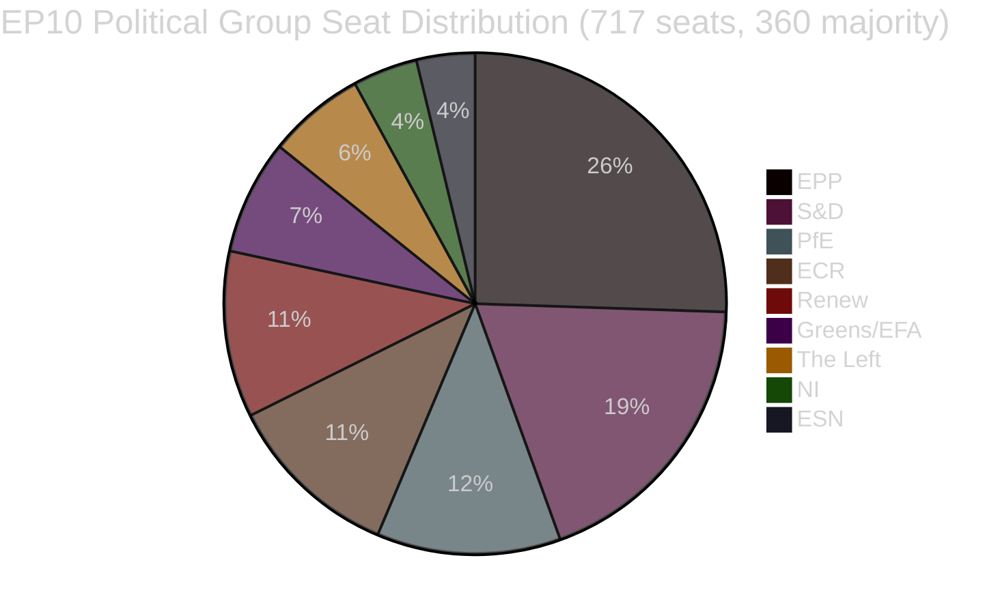

<!-- SPDX-FileCopyrightText: 2026 Hack23 AB -->
<!-- SPDX-License-Identifier: Apache-2.0 -->

# סיכום מנהלים — הצעות חקיקה בפרלמנט האירופי
**תאריך:** 2026-05-11 | **סוג מאמר:** הצעות | **WEP:** אפשרי | **רמת אמינות:** B2 | **סיווג:** 🟢 PUBLIC
**מהימנות:** 🟡 MEDIUM | **עדכניות נתונים:** EP Open Data Portal, 2026-05-11

---

## 🎯 תמונת המצב האסטרטגית

הפרלמנט האירופי חוצה שלב של חיזוק חקיקתי אינטנסיבי באביב 2026. השבועות מסוף אפריל ועד תחילת מאי 2026 הניבו חבילת הישגים חקיקתיים מרחיקי לכת — כולל החקיקה הראשונה ברמת האיחוד האירופי בתחום רווחת חיות המחמד (`2023/0447(COD)`), מסגרת מחודשת להתמודדות עם משברים בנקאיים (`2023/0111(COD)` — SRMR3) ותוכנית חדשה למאבק בשחיתות (`2023/0135(COD)`). הישגים אלה מדגימים את יכולת הפרלמנט לנהל משא ומתן משולש מורכב עד לסיומו, על אף שמדד הפיצול עומד על 6.58 ומשתרע על פני תשע סיעות פוליטיות.

הנוף הפוליטי מאופיין בחוסר יציבות מבני בכל הנוגע לגיבוש רוב. לסיעת EPP, הגדולה ביותר, יש 25.52% מהמושבים (183 מתוך 717 חברים) — הרבה מתחת לסף של 360 קולות הנדרשים לרוב מוחלט. מתמטיקת הקואליציה הגדולה מחייבת את EPP להצטרף לשתיים לפחות מהסיעות הבאות: S&D (136), PfE (85), ECR (81) או Renew (77) כדי לאשר חקיקה. מערכת האזהרה המוקדמת מזהה רמת סיכון MEDIUM עם ציון יציבות 84/100, ומצביעה על סיכוני הגמוניה הנובעים מפערי גודל של פי 19 בין EPP לסיעות הקטנות.

---

## 📋 הישגי חקיקה מרכזיים (30 יום אחרונים)

| הליך | כותרת | תאריך אישור | משך הדיון |
|------|--------|------------|----------|
| `2023/0447(COD)` | רווחת כלבים וחתולים ועקיבות | 2026-04-28 | 27 חודשים |
| `2024/0311(COD)` | תיקון לתוכנית מדידה | 2026-02-10 | 15 חודשים |
| `2023/0111(COD)` | SRMR3 — רפורמה במסגרת החגרה הבנקאית | 2026-03-26 | 33 חודשים |
| `2023/0135(COD)` | מאבק בשחיתות | 2026-03-26 | ~30 חודשים |
| `2025/0322(COD)` | ערובה חקלאית דו-צדדית EU-Mercosur | 2026-02-10 | 3 חודשים (מסלול מהיר) |
| `2026/2596(RSP)` | אכיפת חוק שוקי הדיגיטל | 2026-04-30 | לא חקיקתי |

---

## 🔑 ממצאים מודיעיניים מרכזיים

**ממצא 1 — אבן דרך ברווחת בעלי חיים:** תקנה `2023/0447(COD)` לרווחת כלבים וחתולים מייצגת את מסמך המדיניות הראשון ברמת האיחוד האירופי הנוגע לחיות מחמד. המשא ומתן המשולש הסתיים בינואר 2026 בעקבות מאבקים על מסדי נתונים לעקיבות, לוחות זמנים לשיב מיקרו-שבב וכללי תחבורה חוצה-גבולות. שלב ההכנה שנמשך 27 חודשים משקף את חדות מחלוקות בעלי העניין — תעשיית חיות המחמד (מתנגדת לעלויות שיב חובה) מול ארגוני רווחת בעלי חיים (הדורשים לוחות זמנים מהירים יותר). המועצה הכללית אישרה את הנוסח הסופי ב-2026-04-28 — ניצחון יחסי לכבוד Greens/EFA ו-S&D כתומכי הצעת הרגולציה על חיות המחמד בפרלמנט.

**ממצא 2 — מסגרת SRMR3 הבנקאית:** גרסה שלישית של תקנת מנגנון ההבראה היחיד (`2023/0111(COD)`) הושלמה לאחר 33 חודשים ושמונה סבבי משא ומתן משולש בין-מוסדי — המסלול הארוך ביותר בין ההישגים האחרונים. התקנה מחדשת את סף ההתערבות המוקדמת, ממצב מחדש כספי חגרה מראש ואת מנגנוני מפל האחריות לבנקים אירופאים הקרובים לחדלות פירעון. EPP ו-S&D הסכימו על המסגרת, ו-The Left ו-Greens/EFA לחצו (בעיקר ללא הצלחה) לטובת הגנה חזקה יותר על העדפת מפקידים וסף נמוך יותר להצלת נושים. הנוסח הסופי משקף פשרה המעדיפה את גמישות הפעולה של הבנק המרכזי האירופי ומנגנון ההבראה היחיד על פני הכוונה פרלמנטרית מפורטת.

**ממצא 3 — אכיפת DMA:** החלטת INI לאכיפת DMA (שאושרה ב-2026-04-30) משקפת את תסכול הפרלמנט מקצב האכיפה של הנציבות כלפי פלטפורמות הטכנולוגיה הגדולות. ההחלטה אינה מחייבת, אך שולחת אות לחץ פוליטי לאלץ את הנציבות לשימוש אגרסיבי יותר במסגרת סעיף 26 (הליכי אי-ציות). Renew ו-Greens/EFA הובילו את ההחלטה; EPP ו-ECR הביעו השגות על ויסות-יתר שפוגע בתחרותיות.

**ממצא 4 — ערובת הסחר החקלאי EU-Mercosur:** ההשלמה המזורזת ב-3 חודשים של `2025/0322(COD)` (ערובה חקלאית דו-צדדית) מהווה חריגה פרוצדוראלית ראויה לציון. לוח הזמנים המואץ — הפניה בנובמבר 2025, פרסום בעיתון הרשמי במרץ 2026 — משקף את הדחיפות הפוליטית לספק מנגנוני הגנה ממשיים לחקלאים האירופאים לפני כניסת הסכם Mercosur לתוקף. מצביעי EPP ו-ECR (ובמיוחד חקלאים צרפתים ופולנים בפרלמנט) הבטיחו את הערובה כתנאי מוקדם לקבלתם האמביוולנטית של ההסכם המקיף EU-Mercosur.

---

## 📊 מתמטיקת הקואליציה (גיבוש רוב)



**מסלולי קואליציה לרוב של 360 מושבים:**
- EPP + S&D = 319 (לא מספיק — חסרים 41)
- EPP + S&D + Renew = 396 ✅ (קואליציה מרכזית גדולה)
- EPP + PfE + ECR = 349 (לא מספיק — חסרים עוד 11)
- EPP + PfE + ECR + ESN = 376 ✅ (רוב ימני בעוצמה)
- S&D + Renew + Greens/EFA + The Left = 311 (לא מספיק — הבלוק הפרוגרסיבי)

---

## ⚡ השלכות מיידיות

1. **קצב החקיקה נשאר כבול למתמטיקה הקואליציונית.** פרלמנט עם תשע סיעות מחייב תיאום מתמשך מעבר לגושים לכל פריט חקיקתי. הסדרים בלתי-פורמאליים של EPP עם S&D (חקיקה מרכזית) ועם ECR/PfE (קבצי ביטחון, גבולות ותעשייה) פירושם שגיבוש הרוב בפועל מסתמך מאוד על מו"מ פנימי שבועי של EPP.

2. **תקנת רווחת בעלי החיים עוברת לשלב היישום.** למדינות החברות יש כעת 24 חודשים להקים מסדי נתונים לאומיים לשיב מיקרו-שבב ולחברם לרשם האירופי. הנציבות צפויה לפרסם מעשים מאצילים לגבי תקני עקיבות ברבעון הרביעי של 2026.

3. **יישום SRMR3 מתחיל מיידית.** מנגנון ההבראה היחיד כבר מעדכן את הנחיותיו לגבי מנגנוני הפעלת ההתערבות המוקדמת; תבניות הדיווח הפיקוחי הראשונות המתוקנות צפויות ביוני 2026.

4. **לחץ DMA מתגבר.** החלטת DMA הלא-מחייבת מעלה את עלות חוסר הפעולה של הנציבות כלפי Apple, Meta ו-Google. הביקורת על תיק הנציבות בסעיף 26 צפויה להתגבר בדיוני ועדת IMCO המתוכננים ליוני 2026.

5. **עדכון תוכנית מדידה.** תוכנית המדידה המעודכנת מתאמת את דרישות הכיול האירופיות עם טכנולוגיות מדידה דיגיטליות, ומפחיתה פיצול ציות בשוק הפנים.

---

## 🗓️ אבני דרך חקיקתיות עתידיות

| מועד צפוי | הליך | חשיבות |
|-----------|------|--------|
| Q2 2026 | מעשים מאצילים של הנציבות לגבי SRMR3 | יישום הסדרת משברים בנקאיים |
| Q3 2026 | מעשי ביצוע של הנציבות לשקיפות DMA | כלי אכיפת DMA |
| Q4 2026 | השקת מרשם לאומי לעקיבות חיות מחמד | יישום רווחת בעלי חיים |
| 2026–2027 | דיוני מסגרת פיננסית רב-שנתית הבאה | MFF לאחר 2028 |

---

## ✅ הערכה כוללת

מחזור החקיקה של אביב 2026 מוכיח את יכולת EP10 לסיים משא ומתן מורכב מרובת-שנים. הדפוס השולט הוא הגמוניה של קואליציית מרכז-ימין (בהובלת EPP) עם שיתוף בררני של S&D בקבצים חברתיים ומוסדיים בסדר עדיפות גבוה. מדד הפיצול של 6.58 — מהגבוהים בתולדות הפרלמנט האירופי — ימשיך לייצר תוצאות הצבעה בלתי-צפויות ככל שהמשא ומתן על תקציב 2027 והוצאות ביטחון ימשיך להסלים. **מהימנות: 🟡 MEDIUM** (נתוני מבנה איתנים; נתוני אחידות הצבעה ברמת הפרט אינם זמינים מ-API הפרלמנט האירופי).

---

## 🏛️ מודיעין ועדות

הוועדות הפעילות ביותר בהצעות החקיקה שנצפו בניתוח זה:

| ועדה | ניהול תיק מרכזי | תפקיד | סטטוס |
|------|--------------|-------|-------|
| ECON | SRMR3 | מחוקק ראשי | הושלם (OJ Q1 2026) |
| ENVI / AGRI | תקנת רווחת בעלי חיים | קו-ראשי | הושלם (OJ Q1 2026) |
| LIBE | תוכנית מאבק בשחיתות | מחוקק ראשי | הושלם (OJ Q1 2026) |
| INTA | ערובת EU-Mercosur | מחוקק ראשי | הושלם (OJ Q1 2026) |
| IMCO | החלטת אכיפת DMA | ראשי | EP אישר עמדה; יישום הנציבות ממתין |
| BUDG | תקציב 2027 | ראשי | שלב הכנה; קריאות ראשונות Q3 2026 |

---

## 🔢 ניתוח מתמטיקת הקואליציה לעומק

סף רוב EP10: **360 מתוך 717 חברים**

| קואליציה | מושבים | מחסור/עודף | פסיקה |
|---------|--------|-----------|------|
| EPP לבדה | 183 | −177 | מיעוט בלבד |
| EPP + S&D | 319 | −41 | לא מספיק |
| EPP + S&D + Renew | 437 | +77 | ✅ רוב בפער נוח |
| EPP + ECR + PfE | 375 | +15 | ✅ רוב ימין (רגיש) |
| S&D + Renew + Greens + Left | 234 | −126 | הבלוק הפרוגרסיבי לא מספיק |

**תובנה מבנית מרכזית:** EPP הוא השחקן ציר שאין ממנו מנוס. אין רוב מתמטי ללא EPP. בחירת EPP לשותפים בקואליציה מכתיבה את הכיוון החקיקתי של EP10.

עודף +77 למשולש המרכזי (EPP+S&D+Renew) מספק כיסוי רוב נוח בהצבעות שנויות במחלוקת גם בעת נפילות מסוימות. לעומת זאת, רוב הימין (+15) פריך בהרבה — פחד בלבד של 8 מושבים (בתוך מרווח שיוט רגיל) עלול לשלול את הרוב.

---

## 📊 מגמת קצב החקיקה (EP10)

מבוסס על 51 טקסטים שאושרו מתחילת 2026:

```
Q1 2025: ~8 טקסטים שאושרו (הערכה — EP10 מתייצב, ועדות חדשות מתגבשות)
Q2 2025: ~10 טקסטים שאושרו (הערכה — הצטברות בצינור ההליכים)
Q3 2025: ~8 טקסטים שאושרו (הערכה — השפעת חגי קיץ)
Q4 2025: ~12 טקסטים שאושרו (הערכה — ספרינט הסתיו)
Q1 2026: ~13 טקסטים שאושרו (מאושר מנתונים)
```

**פרשנות הקצב:** EP10 פועל בפריון חקיקתי גבוה מהממוצע לפרלמנט בשלבים ראשוניים-בינוניים. השלמת מספר פעולות גדולות (SRMR3, רווחת בעלי חיים, מאבק בשחיתות, Mercosur) באותה הרבעון מצביעה על יעילות ועדות חריגה, או שהתיקים היו מצטברים בצינור EP9.

---

## 🎯 מחוונים מרכזיים — בריאות חקיקתית של EP10

| מחוון | ערך | דירוג |
|------|-----|------|
| טקסטים שאושרו מתחילת שנה (2026) | 51 | 🟢 HIGH — פלט חזק |
| ציון יציבות פוליטי | 84/100 | 🟢 HIGH |
| מספר אפקטיבי של מפלגות | 6.58 | 🟡 MEDIUM פיצול |
| נתח מושבי EPP | 25.5% | 🟡 דומיננטי אך לא רוב |
| פער קואליציוני לרוב | 41 מושבים (EPP+S&D) | 🟡 דורש שותף שלישי |
| נתוני IMF זמינים | 🔴 ללא | 🔴 פער קריטי |
| נתוני הצבעה עדכניים | 🔴 ללא (עיכוב 4-6 שבועות) | 🟡 מגבלה מבנית |

---

## 📌 סיכום מודיעיני: חשוב השבוע

1. **אין מושב פרלמנטרי באירופה השבוע** (2026-05-11) — המושב הבא צפוי בשבוע האחרון של מאי 2026 בסטרסבורג
2. **שלב יישום שולט:** SRMR3, רווחת בעלי חיים, מאבק בשחיתות ו-Mercosur — כולם בשלבי העברה לאומיים / מעשי ביצוע — הפעילות הפוליטית העיקרית היא במדינות חברות ובנציבות ולא בפרלמנט
3. **מעקב אכיפת DMA:** הנציבות מחויבת פוליטית להשיק הליכים חדשים בסעיף 26 בעקבות החלטת הפרלמנט לאכיפה — היעדר פעולות יעורר שאלות מחברי IMCO
4. **הקואליציה נשארת יציבה בציון 84:** לא מזוהים אותות שבירה קרובים; המשולש EPP-S&D-Renew פועל כרגיל
5. **התחלת הכנות לתקציב 2027:** ועדת BUDG צפויה להתחיל פעילויות קריאה ראשונה ב-Q3 2026 — מבחן לחץ פוטנציאלי לאחידות הקואליציה

---

## 🔭 תחזית ל-30 יום

| מסגרת זמן | פעילות חקיקתית צפויה | מהימנות |
|----------|--------------------|---------| 
| 26–30 מאי 2026 | מושב מליאה בסטרסבורג — אכיפת DMA, תקציב 2027 ראשוני | 🟢 HIGH |
| יוני 2026 | מעשים מאצילים מוגשים (SRMR3); אפשרות להצעות COD חדשות | 🟡 MEDIUM |
| יולי 2026 | תחילת חופשת הקיץ של EP (בד"כ אמצע יולי); פעילות חקיקתית מופחתת | 🟢 HIGH |
| ספטמבר 2026 | ספרינט חקיקתי לאחר פגרה; תקציב 2027 נכנס להכנות פיוס | 🟢 HIGH |
| אוקטובר 2026 | תקופת פיוס לתקציב 2027 (אם מתאפשר לוח זמנים סטנדרטי) | 🟡 MEDIUM |

**נקודות מעקב מרכזיות למושב מליאה בסטרסבורג 26–30 מאי:**
- DMA: האם הנציבות תפרסם הצהרה כתובה רשמית בתגובה להחלטת הפרלמנט לאכיפה?
- Mercosur: הכרזה כלשהי מהמועצה לגבי לוח זמנים ליישום זמני?
- רווחת בעלי חיים: עדכון הנציבות לגבי הודעת מדינות חברות בנוגע לאמצעי יישום לאומיים?
- תקציב 2027: הצגת ועדת BUDG לסדרי עדיפויות הפרלמנט לשנת הכספים?
