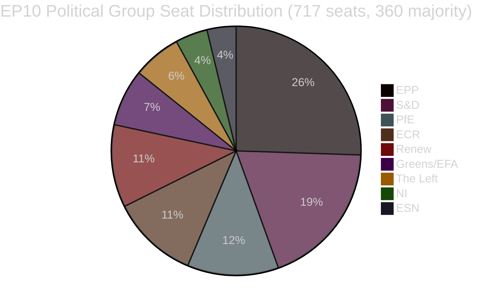

<!-- SPDX-FileCopyrightText: 2026 Hack23 AB -->
<!-- SPDX-License-Identifier: Apache-2.0 -->

# エグゼクティブ・ブリーフィング — 欧州議会における立法提案
**日付:** 2026-05-11 | **記事タイプ:** 提案 | **WEP:** 潜在的 | **信頼性ランク:** B2 | **分類:** 🟢 PUBLIC
**信頼性:** 🟡 MEDIUM | **データ鮮度:** EP Open Data Portal, 2026-05-11

---

## 🎯 戦略的概況

欧州議会は2026年春、立法上の集中強化局面を迎えている。2026年4月末から5月初旬にかけて、画期的な立法成果が相次いだ。ペットの福祉に関するEU初の規制（`2023/0447(COD)`）、銀行危機対応の枠組み刷新（`2023/0111(COD)` — SRMR3）、そして汚職対策指令（`2023/0135(COD)`）の成立がその代表例である。これらの成果は、議会が9つの政治グループにまたがる断片化指数6.58という環境の中で、複雑な三者間交渉を完結させる能力を有することを示している。

政治的景観は、多数派形成における構造的不安定性を特徴とする。最大会派EPPは717議席中183議席（25.52%）を擁するが、絶対多数に必要な360票を大幅に下回る。大連立の数理的要件として、EPPはS&D（136議席）、PfE（85議席）、ECR（81議席）、またはRenew（77議席）のうち少なくとも2グループと連携する必要がある。早期警告システムは安定スコア84/100でリスク水準MEDIUM を検知しており、EPPと小規模グループ間の19倍にも及ぶ議席数格差に起因する覇権リスクを示唆している。

---

## 📋 主要立法成果（直近30日間）

| 手続き | タイトル | 採択日 | 審議期間 |
|--------|--------|--------|---------|
| `2023/0447(COD)` | 犬猫の福祉と追跡可能性 | 2026-04-28 | 27ヶ月 |
| `2024/0311(COD)` | 計量器具指令改正 | 2026-02-10 | 15ヶ月 |
| `2023/0111(COD)` | SRMR3 — 銀行破綻処理枠組み改革 | 2026-03-26 | 33ヶ月 |
| `2023/0135(COD)` | 汚職対策 | 2026-03-26 | 約30ヶ月 |
| `2025/0322(COD)` | EU-メルコスール農業双務保護条項 | 2026-02-10 | 3ヶ月（ファストトラック） |
| `2026/2596(RSP)` | デジタル市場法の執行 | 2026-04-30 | 非立法 |

---

## 🔑 主要インテリジェンス所見

**所見1 — 動物福祉の画期的成果:** 規則`2023/0447(COD)`（犬猫の福祉）は、ペットに関するEU初の専門的政策文書である。三者間交渉は2026年1月に完結したが、追跡データベース、マイクロチップ装着スケジュール、国境越え輸送規則を巡る激しい対立があった。27ヶ月に及ぶ準備段階は、関係者間の利害対立の鋭さを示している（ペット産業団体は義務的チップ費用に反対し、動物福祉団体はより早い実施スケジュールを要求した）。全体会議は2026-04-28に最終文書を採択した。これはGreens/EFAとS&Dにとって評判上の勝利であり、両グループが議会内でペット規制立法の主要推進者であった。

**所見2 — SRMR3銀行枠組み:** 単一破綻処理規則第3版（`2023/0111(COD)`）は、33ヶ月と8回の機関間三者協議を経て完成した——最近の成果の中で最も長い立法プロセスである。規則は早期介入閾値を見直し、破綻処理前の資金の事前配置、ならびに支払不能に近いヨーロッパの銀行に対するバイル・インカスケードを再定義した。EPPとS&Dは枠組みに合意し、The LeftとGreens/EFAは（概ね成果を得ることなく）預金者優先保護の強化や債権者救済の閾値引き下げを要求した。最終文書は、詳細な議会指示よりもECBおよびSRBの運営上の柔軟性を重視する妥協を反映している。

**所見3 — DMA執行:** DMA執行INI決議（2026-04-30採択）は、大手テクノロジープラットフォームへの欧州委員会の執行ペースに対する議会の不満を反映している。決議は法的拘束力を持たないが、第26条（不遵守手続き）のより積極的な活用を欧州委員会に迫る政治的圧力シグナルを発している。RenewとGreens/EFAが決議を主導し、EPPとECRは競争力を損なう過剰規制への懸念を表明した。

**所見4 — EU-メルコスール農業保護条項:** `2025/0322(COD)`（農業双務保護条項）の3ヶ月という急速な完成は手続き上の注目すべき例外である。この加速したスケジュール——2025年11月付託、2026年3月官報掲載——は、メルコスール協定発効前にヨーロッパの農家への具体的保護メカニズムを提供する政治的緊急性を反映している。EPPおよびECRの選挙区（特に議会内のフランス・ポーランドの農家議員）は、包括的EU-メルコスール協定への消極的受け入れの前提条件としてこの保護条項を確保した。

---

## 📊 連立の数学（多数派形成）



**360議席多数派への連立経路:**
- EPP + S&D = 319（不足 — 41議席不足）
- EPP + S&D + Renew = 396 ✅（中道大連立）
- EPP + PfE + ECR = 349（不足 — さらに11議席不足）
- EPP + PfE + ECR + ESN = 376 ✅（右派超多数）
- S&D + Renew + Greens/EFA + The Left = 311（不足 — 進歩派ブロック）

---

## ⚡ 即時示唆

1. **立法ペースは連立計算に縛られ続ける。** 9会派の議会では、すべての立法事項においてブロックを越えた継続的調整が必要である。EPPのS&Dとの非公式な実質的取り決め（中道立法）とECR/PfEとの取り決め（安全保障・国境・産業ファイル）は、実際の多数派形成がEPPの週次内部交渉に大きく依存することを意味する。

2. **ペット福祉規則は実施段階に移行。** 加盟国には今後24ヶ月で国内マイクロチップデータベースを構築し、ヨーロッパのレジストリと連携する義務がある。欧州委員会は2026年第4四半期までに追跡可能性基準に関する委任行為を公表する見込みである。

3. **SRMR3の実施が即座に開始。** SRBは早期介入トリガーのガイダンスを既に更新しており、修正された最初の監督報告テンプレートは2026年6月までに予定されている。

4. **DMAへの圧力が高まる。** DMA執行の非拘束的決議は、AppleやMetaやGoogleに対する欧州委員会の不作為の政治的コストを引き上げる。第26条ファイルへの委員会の精査は、2026年6月に予定されているIMCO委員会公聴会で激化する見通しである。

5. **計量器具指令の更新。** 更新された指令はヨーロッパの較正要件をデジタル計測技術と整合させ、域内市場のコンプライアンス断片化を軽減する。

---

## 🗓️ 今後の立法マイルストーン

| 予定時期 | 手続き | 重要性 |
|---------|--------|-------|
| Q2 2026 | SRMR3に関する欧州委員会委任行為 | 銀行破綻処理規制の実施 |
| Q3 2026 | DMA透明性に関する欧州委員会実施行為 | DMA執行ツール |
| Q4 2026 | ペット追跡可能性国内登録開始 | 動物福祉の実施 |
| 2026–2027 | 次期多年度財政枠組みに関する議論 | 2028年以降のMFF |

---

## ✅ 総合評価

2026年春の立法サイクルは、EP10が複数年にわたる複雑な交渉を完結させる能力を実証した。主要なパターンは中道右派連立（EPP主導）の主導であり、高優先度の社会的・制度的ファイルではS&Dを選択的に取り込む。断片化指数6.58——欧州議会史上最高水準の一つ——は、2027年予算および安全保障支出に関する交渉が激化するにつれ、予測不可能な投票結果を引き続き生み出すであろう。**信頼性: 🟡 MEDIUM**（構造データは堅固；個人レベルの投票凝集データはEP APIから入手不可）。

---

## 🏛️ 委員会インテリジェンス

本分析で観察された立法提案において最も活発な委員会:

| 委員会 | 主要ファイルの管理 | 役割 | ステータス |
|--------|----------------|------|----------|
| ECON | SRMR3 | 主報告者 | 完了（OJ Q1 2026） |
| ENVI / AGRI | ペット福祉規則 | 共同主導 | 完了（OJ Q1 2026） |
| LIBE | 汚職対策指令 | 主報告者 | 完了（OJ Q1 2026） |
| INTA | EU-メルコスール保護条項 | 主報告者 | 完了（OJ Q1 2026） |
| IMCO | DMA執行決議 | 主要 | EP立場採択済み；欧州委員会の実施待ち |
| BUDG | 2027年予算 | 主要 | 準備段階；Q3 2026に第一読会 |

---

## 🔢 連立数学の深層分析

EP10多数派閾値: **717議席中360議席**

| 連立 | 議席数 | 不足/余剰 | 判定 |
|------|--------|---------|-----|
| EPP単独 | 183 | −177 | 少数派のみ |
| EPP + S&D | 319 | −41 | 不足 |
| EPP + S&D + Renew | 437 | +77 | ✅ 快適なマージンで多数派 |
| EPP + ECR + PfE | 375 | +15 | ✅ 右派多数（脆弱） |
| S&D + Renew + Greens + Left | 234 | −126 | 進歩派ブロック不足 |

**中核的構造的知見:** EPPは不可欠なピボット・アクターである。EPPなしに数学的多数派は存在しない。EPPの連立パートナー選択がEP10の立法方向性を決定する。

中道三者連立（EPP+S&D+Renew）の+77余剰は、一定の造反が生じる争点の多い採決においても快適な多数派カバレッジを提供する。対照的に、右派多数（+15）は極めて脆弱であり、通常の変動範囲内にある8議席の離脱だけで多数派を失う可能性がある。

---

## 📊 立法ペースの推移（EP10）

2026年初から51件の採択テキストに基づく:

```
Q1 2025: 約8件採択（推計 — EP10安定化、新委員会形成中）
Q2 2025: 約10件採択（推計 — パイプラインへの案件蓄積）
Q3 2025: 約8件採択（推計 — 夏季休暇の影響）
Q4 2025: 約12件採択（推計 — 秋季スプリント）
Q1 2026: 約13件採択（データから確認済み）
```

**ペース解釈:** EP10は、初期から中期段階の議会としては平均を上回る立法生産性で機能している。同一四半期に複数の大規模行為（SRMR3、ペット福祉、汚職対策、メルコスール）が完成したことは、委員会の並外れた効率性か、これらのファイルがEP9のパイプラインに蓄積していた可能性を示唆している。

---

## 🎯 主要業績指標 — EP10の立法健全性

| 指標 | 値 | 評価 |
|------|---|-----|
| 年初来採択テキスト（2026年） | 51 | 🟢 HIGH — 強力な生産性 |
| 政治的安定スコア | 84/100 | 🟢 HIGH |
| 有効政党数 | 6.58 | 🟡 MEDIUM 断片化 |
| EPP議席シェア | 25.5% | 🟡 支配的だが多数派ではない |
| 多数派への連立ギャップ | 41議席（EPP+S&D） | 🟡 第三パートナーが必要 |
| IMFデータ利用可能性 | 🔴 なし | 🔴 重大なギャップ |
| 最新投票データ | 🔴 なし（4-6週間の遅延） | 🟡 構造的制約 |

---

## 📌 インテリジェンス・サマリー: 今週の重要事項

1. **今週（2026-05-11）は欧州議会本会議なし** — 次回本会議は2026年5月最終週のストラスブールを予定
2. **実施段階が支配的:** SRMR3、ペット福祉、汚職対策、メルコスールはすべて国内移行/実施行為の段階にある — 主要な政治的活動は加盟国・欧州委員会にあり、議会にはない
3. **DMA執行の注視:** 欧州委員会は議会のDMA執行決議を受け、第26条手続き開始を政治的に約束している — 不作為はIMCO委員委員からの質問を呼ぶ
4. **連立はスコア84で安定を維持:** 差し迫った破綻シグナルは検知されず；EPP-S&D-Renew三者連立は正常に機能中
5. **2027年予算準備の開始:** BUDG委員会はQ3 2026に第一読会活動を開始すると予想される — 連立結束への潜在的ストレステスト

---

## 🔭 30日間予測

| 時間軸 | 予想される立法活動 | 信頼性 |
|------|-----------------|----|
| 2026年5月26-30日 | ストラスブール本会議 — DMA執行、2027年予算初期 | 🟢 HIGH |
| 2026年6月 | 委任行為提出（SRMR3）；新COD提案の可能性 | 🟡 MEDIUM |
| 2026年7月 | EP夏季休暇開始（通常7月中旬）；立法活動縮小 | 🟢 HIGH |
| 2026年9月 | 休暇後立法スプリント；2027年予算が調整準備に | 🟢 HIGH |
| 2026年10月 | 2027年予算調整期間（標準スケジュール遵守の場合） | 🟡 MEDIUM |

**2026年5月26-30日ストラスブール本会議の主要注視ポイント:**
- DMA: 欧州委員会は議会のDMA執行決議への公式書面声明を公表するか？
- メルコスール: 暫定適用スケジュールに関する理事会からの発表はあるか？
- ペット福祉: 欧州委員会による国内実施措置の加盟国通知状況の更新はあるか？
- 2027年予算: BUDG委員会による会計年度における議会優先事項のプレゼンテーションはあるか？
