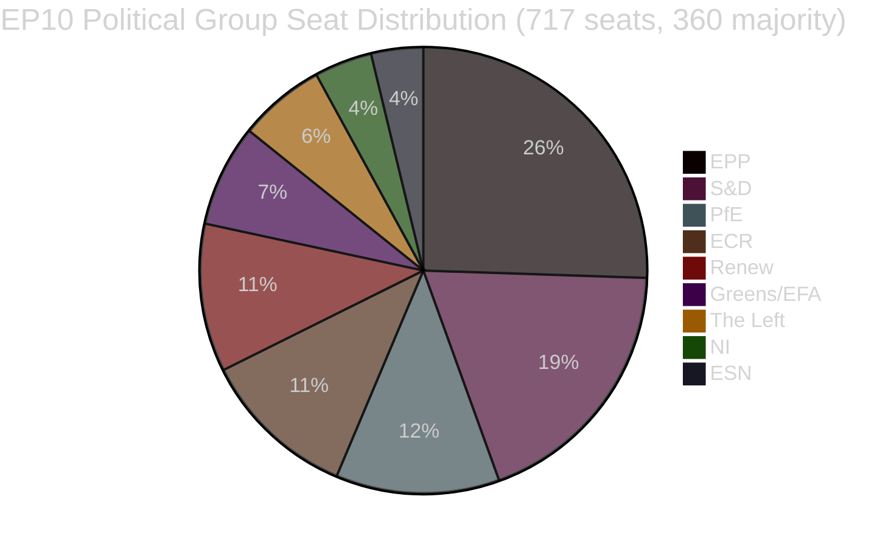

<!-- SPDX-FileCopyrightText: 2026 Hack23 AB -->
<!-- SPDX-License-Identifier: Apache-2.0 -->

# 행정 브리핑 — 유럽의회 입법 제안
**날짜:** 2026-05-11 | **기사 유형:** 제안 | **WEP:** 잠재적 | **신뢰도 등급:** B2 | **분류:** 🟢 PUBLIC
**신뢰성:** 🟡 MEDIUM | **데이터 신선도:** EP Open Data Portal, 2026-05-11

---

## 🎯 전략적 개요

유럽의회는 2026년 봄, 입법 강화 국면을 맞이하고 있다. 2026년 4월 말부터 5월 초까지 획기적인 입법 성과가 이어졌다. EU 최초의 반려동물 복지 규정(`2023/0447(COD)`), 은행 위기 대응 틀의 개편(`2023/0111(COD)` — SRMR3), 반부패 지침(`2023/0135(COD)`) 등이 그 대표적 사례다. 이러한 성과들은 파편화 지수 6.58로 9개 정치 그룹에 걸쳐 있는 환경에서도 의회가 복잡한 3자 협상을 완결하는 능력을 갖추고 있음을 보여준다.

정치적 환경은 다수파 형성에서의 구조적 불안정성을 특징으로 한다. 최대 교섭단체인 EPP는 717석 중 183석(25.52%)을 보유하고 있어 절대다수에 필요한 360표에 크게 못 미친다. 대연립의 수학적 요건으로 EPP는 S&D(136석), PfE(85석), ECR(81석), Renew(77석) 중 적어도 두 그룹과 협력해야 법안을 통과시킬 수 있다. 조기경보 시스템은 안정 점수 84/100로 위험 수준 MEDIUM을 감지하며, EPP와 소규모 그룹 간 19배에 달하는 의석 수 격차에서 비롯된 패권 위험을 지적한다.

---

## 📋 주요 입법 성과 (최근 30일)

| 절차 | 제목 | 채택일 | 심의 기간 |
|------|------|-------|---------|
| `2023/0447(COD)` | 개·고양이 복지 및 추적가능성 | 2026-04-28 | 27개월 |
| `2024/0311(COD)` | 측정기기 지침 개정 | 2026-02-10 | 15개월 |
| `2023/0111(COD)` | SRMR3 — 은행 정리체계 개혁 | 2026-03-26 | 33개월 |
| `2023/0135(COD)` | 반부패 | 2026-03-26 | 약 30개월 |
| `2025/0322(COD)` | EU-메르코수르 농업 쌍무 보호조항 | 2026-02-10 | 3개월(패스트트랙) |
| `2026/2596(RSP)` | 디지털시장법 집행 | 2026-04-30 | 비입법 |

---

## 🔑 주요 인텔리전스 발견

**발견 1 — 동물복지 획기적 성과:** 규정 `2023/0447(COD)`(개·고양이 복지)은 반려동물에 관한 EU 최초의 전용 정책 문서다. 3자 협상은 2026년 1월에 완료됐으나 추적 데이터베이스, 마이크로칩 일정, 국경 간 운송 규정을 둘러싼 치열한 갈등이 있었다. 27개월에 걸친 준비 단계는 이해관계자 간 대립의 첨예함을 보여준다. 의무적 칩 비용에 반대한 반려동물 산업과 더 빠른 일정을 요구한 동물복지단체 간의 갈등이 특히 두드러졌다. 본회의는 2026-04-28에 최종 문서를 채택했다. 이는 의회 내 반려동물 규정 법제화의 주요 지지자인 Greens/EFA와 S&D의 평판 측면에서의 승리다.

**발견 2 — SRMR3 은행 틀:** 단일정리규정 제3판(`2023/0111(COD)`)은 33개월과 8번의 기관 간 3자 협의를 거쳐 완성됐다—최근 성과 중 가장 긴 입법 과정이다. 규정은 조기 개입 임계값을 재설정하고, 정리 전 자금의 사전 배치 및 지급 불능에 가까운 유럽 은행에 대한 손실부담 폭포수 메커니즘을 재정의했다. EPP와 S&D는 틀에 합의했고, The Left와 Greens/EFA는 (대부분 성과 없이) 더 강력한 예금자 우선 보호와 낮은 채권자 구제 임계값을 요구했다. 최종 문서는 상세한 의회 지시보다 ECB와 SRB의 운영상 유연성을 중시하는 타협을 반영한다.

**발견 3 — DMA 집행:** DMA 집행 INI 결의(2026-04-30 채택)는 대형 기술 플랫폼에 대한 유럽위원회의 집행 속도에 대한 의회의 불만을 반영한다. 결의는 구속력이 없으나 제26조(불이행 절차)의 더 공격적인 활용을 위원회에 촉구하는 정치적 압박 신호를 발한다. Renew와 Greens/EFA가 결의를 주도했고, EPP와 ECR은 경쟁력을 해치는 과잉 규제에 대한 우려를 표명했다.

**발견 4 — EU-메르코수르 농업 보호조항:** `2025/0322(COD)`(농업 쌍무 보호조항)의 3개월 만의 신속한 완성은 절차적으로 주목할 만한 예외다. 이 가속된 일정——2025년 11월 회부, 2026년 3월 관보 게재——은 메르코수르 협정 발효 전 유럽 농민에게 실질적인 보호 메커니즘을 제공해야 하는 정치적 긴급성을 반영한다. EPP와 ECR 지지층(특히 의회 내 프랑스·폴란드 농민 대표)은 포괄적 EU-메르코수르 협정에 대한 소극적 수용의 전제조건으로 이 보호조항을 확보했다.

---

## 📊 연립의 수학 (다수파 형성)



**360석 다수파로의 연립 경로:**
- EPP + S&D = 319 (불충분 — 41석 부족)
- EPP + S&D + Renew = 396 ✅ (중도 대연립)
- EPP + PfE + ECR = 349 (불충분 — 11석 추가 부족)
- EPP + PfE + ECR + ESN = 376 ✅ (우파 초다수)
- S&D + Renew + Greens/EFA + The Left = 311 (불충분 — 진보 블록)

---

## ⚡ 즉각적 시사점

1. **입법 속도는 연립 계산에 묶인다.** 9개 교섭단체 의회는 모든 입법 사안에서 교차 블록 조율을 필요로 한다. EPP의 S&D와의 비공식 실질 합의(중도 입법) 및 ECR/PfE와의 합의(안보·국경·산업 파일)는 실제 다수파 형성이 EPP의 주간 내부 협상에 크게 의존함을 의미한다.

2. **반려동물 복지 규정이 이행 단계로 이동.** 회원국은 이제 국내 마이크로칩 데이터베이스를 구축하고 유럽 레지스트리와 연결할 24개월의 기간을 갖는다. 유럽위원회는 2026년 4분기까지 추적가능성 기준에 관한 위임 행위를 발표할 것으로 예상된다.

3. **SRMR3 이행이 즉각 시작.** SRB는 이미 조기 개입 촉발 가이던스를 업데이트하고 있으며, 수정된 첫 감독 보고 템플릿은 2026년 6월까지 예정돼 있다.

4. **DMA 압박이 강화.** DMA 집행 비구속적 결의는 Apple, Meta, Google에 대한 위원회 무행동의 정치적 비용을 높인다. 제26조 파일에 대한 위원회 검토는 2026년 6월로 예정된 IMCO 위원회 청문회에서 강화될 것으로 예상된다.

5. **측정기기 지침 업데이트.** 업데이트된 지침은 유럽의 교정 요건을 디지털 측정 기술과 일치시켜 내부 시장의 준수 파편화를 줄인다.

---

## 🗓️ 향후 입법 마일스톤

| 예정 시기 | 절차 | 중요성 |
|---------|------|-------|
| Q2 2026 | SRMR3에 관한 위원회 위임 행위 | 은행 정리 규정 이행 |
| Q3 2026 | DMA 투명성 위원회 이행 행위 | DMA 집행 도구 |
| Q4 2026 | 반려동물 추적가능성 국내 레지스트리 출범 | 동물복지 이행 |
| 2026–2027 | 차기 다년도 재정 프레임워크 논의 | 2028년 이후 MFF |

---

## ✅ 종합 평가

2026년 봄 입법 주기는 EP10이 다년간의 복잡한 협상을 완결하는 능력을 입증했다. 지배적 패턴은 중도우파 연립(EPP 주도)으로, 우선순위가 높은 사회적·제도적 파일에서 S&D를 선택적으로 포함시킨다. 단편화 지수 6.58——유럽의회 역사상 최고 수준 중 하나——은 2027년 예산과 안보 지출 협상이 격화됨에 따라 예측 불가능한 투표 결과를 계속 만들어낼 것이다. **신뢰성: 🟡 MEDIUM** (구조 데이터는 견고; 개인 수준의 투표 결집 데이터는 EP API에서 제공되지 않음).

---

## 🏛️ 위원회 인텔리전스

본 분석에서 관찰된 입법 제안에서 가장 활발한 위원회:

| 위원회 | 주요 파일 관리 | 역할 | 상태 |
|-------|------------|-----|-----|
| ECON | SRMR3 | 수석 보고자 | 완료 (OJ Q1 2026) |
| ENVI / AGRI | 반려동물 복지 규정 | 공동 주도 | 완료 (OJ Q1 2026) |
| LIBE | 반부패 지침 | 수석 보고자 | 완료 (OJ Q1 2026) |
| INTA | EU-메르코수르 보호조항 | 수석 보고자 | 완료 (OJ Q1 2026) |
| IMCO | DMA 집행 결의 | 주요 | EP 입장 채택; 위원회 이행 대기 |
| BUDG | 2027년 예산 | 주요 | 준비 단계; Q3 2026 1차 독회 |

---

## 🔢 연립 수학 심층 분석

EP10 다수파 임계값: **717석 중 360석**

| 연립 | 의석 수 | 부족/여분 | 판정 |
|-----|--------|---------|-----|
| EPP 단독 | 183 | −177 | 소수파만 |
| EPP + S&D | 319 | −41 | 불충분 |
| EPP + S&D + Renew | 437 | +77 | ✅ 편안한 마진으로 다수파 |
| EPP + ECR + PfE | 375 | +15 | ✅ 우파 다수파 (취약) |
| S&D + Renew + Greens + Left | 234 | −126 | 진보 블록 불충분 |

**핵심 구조적 통찰:** EPP는 불가결한 피벗 행위자다. EPP 없이 수학적 다수파는 존재하지 않는다. EPP의 연립 파트너 선택이 EP10의 입법 방향성을 결정한다.

중도 3자 연립(EPP+S&D+Renew)의 +77 여분은 일부 이탈이 발생하는 쟁점 많은 투표에서도 편안한 다수파 커버리지를 제공한다. 반면 우파 다수파(+15)는 극히 취약하다——정상적인 변동 범위 내 8석 이탈만으로 다수파를 잃을 수 있다.

---

## 📊 입법 속도 추세 (EP10)

2026년 초부터 51개 채택 문서 기준:

```
Q1 2025: 약 8개 채택 (추정 — EP10 안정화, 신규 위원회 구성 중)
Q2 2025: 약 10개 채택 (추정 — 파이프라인 안건 축적)
Q3 2025: 약 8개 채택 (추정 — 여름 휴회 효과)
Q4 2025: 약 12개 채택 (추정 — 가을 스프린트)
Q1 2026: 약 13개 채택 (데이터로 확인)
```

**속도 해석:** EP10은 초기-중기 단계 의회로서 평균 이상의 입법 생산성으로 기능하고 있다. 같은 분기에 여러 대형 행위(SRMR3, 반려동물 복지, 반부패, 메르코수르)가 완성된 것은 위원회의 탁월한 효율성이나 이 파일들이 EP9 파이프라인에 축적되어 있었음을 시사한다.

---

## 🎯 핵심성과지표 — EP10 입법 건전성

| 지표 | 값 | 평가 |
|-----|--|-----|
| 연초이후 채택 문서 (2026년) | 51 | 🟢 HIGH — 강력한 생산 |
| 정치적 안정 점수 | 84/100 | 🟢 HIGH |
| 유효 정당 수 | 6.58 | 🟡 MEDIUM 파편화 |
| EPP 의석 점유율 | 25.5% | 🟡 지배적이나 다수파 아님 |
| 다수파로의 연립 갭 | 41석 (EPP+S&D) | 🟡 제3 파트너 필요 |
| IMF 데이터 가용성 | 🔴 없음 | 🔴 심각한 갭 |
| 최신 투표 데이터 | 🔴 없음 (4-6주 지연) | 🟡 구조적 제약 |

---

## 📌 인텔리전스 요약: 이번 주 중요 사항

1. **이번 주(2026-05-11) 유럽의회 본회의 없음** — 다음 본회의는 2026년 5월 마지막 주 스트라스부르에서 예정
2. **이행 단계 지배적:** SRMR3, 반려동물 복지, 반부패, 메르코수르는 모두 국내 이전/이행 행위 단계 — 주요 정치 활동은 회원국과 위원회에 있으며 의회에 없음
3. **DMA 집행 주시:** 위원회는 의회의 DMA 집행 결의를 받아 제26조 절차 개시를 정치적으로 약속했다 — 불행동은 IMCO 위원 질의를 야기할 것
4. **연립은 84 점수로 안정 유지:** 임박한 붕괴 신호 감지 없음; EPP-S&D-Renew 3자 연립 정상 기능 중
5. **2027년 예산 준비 시작:** BUDG 위원회는 Q3 2026에 1차 독회 활동 시작 예상 — 연립 결속에 대한 잠재적 스트레스 테스트

---

## 🔭 30일 전망

| 기간 | 예상 입법 활동 | 신뢰성 |
|-----|-------------|------|
| 2026년 5월 26-30일 | 스트라스부르 본회의 — DMA 집행, 2027년 예산 초기 | 🟢 HIGH |
| 2026년 6월 | 위임 행위 제출(SRMR3); 신규 COD 제안 가능성 | 🟡 MEDIUM |
| 2026년 7월 | EP 여름 휴회 시작(보통 7월 중순); 입법 활동 축소 | 🟢 HIGH |
| 2026년 9월 | 휴회 후 입법 스프린트; 2027년 예산이 조정 준비로 | 🟢 HIGH |
| 2026년 10월 | 2027년 예산 조정 기간(표준 일정 준수 시) | 🟡 MEDIUM |

**2026년 5월 26-30일 스트라스부르 본회의 주요 주시 포인트:**
- DMA: 유럽위원회가 의회의 DMA 집행 결의에 공식 서면 성명을 발표할 것인가?
- 메르코수르: 잠정 적용 일정에 관한 이사회 발표가 있는가?
- 반려동물 복지: 위원회가 국내 이행 조치에 관한 회원국 통보 현황을 업데이트하는가?
- 2027년 예산: BUDG 위원회가 회계연도 의회 우선순위를 발표하는가?
