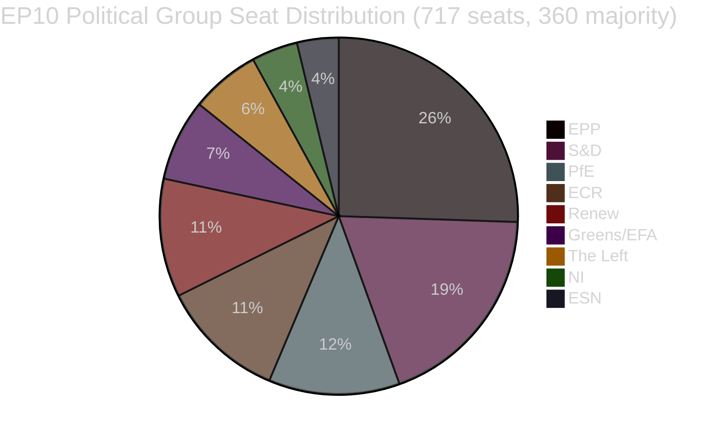

<!-- SPDX-FileCopyrightText: 2026 Hack23 AB -->
<!-- SPDX-License-Identifier: Apache-2.0 -->

# Uitvoerend rapport — Wetgevingsvoorstellen van het Europees Parlement
**Datum:** 2026-05-11 | **Artikeltype:** Voorstellen | **WEP:** Waarschijnlijk | **Admiraliteit:** B2 | **Classificatie:** 🟢 PUBLIC
**Betrouwbaarheid:** 🟡 MEDIUM | **Gegevensversheid:** EP Open Data Portal, 2026-05-11

---

## 🎯 Strategisch overzicht

Het Europees Parlement doorkruist in het voorjaar van 2026 een periode van intensieve wetgevingsconsolidatie. De weken rondom eind april en begin mei 2026 werden gekenmerkt door een dichte cluster van baanbrekende wetgevingsafrondings, waaronder de eerste grote EU-handeling inzake het welzijn van gezelschapsdieren (`2023/0447(COD)`), een herstructureerd kader voor bankenafwikkeling (`2023/0111(COD)` — SRMR3) en een nieuwe antikorruptierichtlijn (`2023/0135(COD)`). Deze verwezenlijkingen weerspiegelen het vermogen van het Parlement om complexe triloonderhandelingen tot een goed einde te brengen ondanks de hoge parlementaire fragmentatie-index van 6,58 verdeeld over negen politieke fracties.

Het politieke landschap is structureel instabiel voor de vorming van meerderheden. EPP, de grootste fractie, bezit 25,52 % van de zetels (183/717 MEP's) — ver onder de drempel van 360 die vereist is voor een absolute meerderheid. De wiskundige basis voor een grote coalitie vereist dat EPP zich verbindt met minstens twee van S&D (136), PfE (85), ECR (81) of Renew (77) om wetgeving te kunnen aannemen. Het systeem voor vroegtijdige waarschuwing signaleert een MEDIUM-risiconiveau met een stabiliteitsscore van 84/100, waarbij het dominantierisico wordt opgemerkt vanwege het negentienvoudige groottevoordeel van EPP ten opzichte van de kleinste fracties.

---

## 📋 Belangrijkste wetgevingsafrondingen (afgelopen 30 dagen)

| Procedure | Titel | Aangenomen | Duur |
|-----------|-------|-----------|------|
| `2023/0447(COD)` | Welzijn van honden en katten en hun traceerbaarheid | 2026-04-28 | 27 maanden |
| `2024/0311(COD)` | Wijziging van de Meetinstrumentenrichtlijn | 2026-02-10 | 15 maanden |
| `2023/0111(COD)` | SRMR3 — Hervorming van het kader voor bankenafwikkeling | 2026-03-26 | 33 maanden |
| `2023/0135(COD)` | Bestrijding van corruptie | 2026-03-26 | ~30 maanden |
| `2025/0322(COD)` | Bilaterale vrijwaringsclausule EU-Mercosur voor de landbouw | 2026-02-10 | 3 maanden (spoedprocedure) |
| `2026/2596(RSP)` | Handhaving van de Wet digitale markten | 2026-04-30 | Niet-legislatief |

---

## 🔑 Belangrijkste inlichtingenbevindingen

**Bevinding 1 — Mijlpaal voor dierenwelzijn:** De verordening `2023/0447(COD)` betreffende het welzijn van honden en katten vormt het eerste eigen EU-wetgevingsinstrument voor gezelschapsdieren. De definitieve triloog werd in januari 2026 afgesloten na controversiële onderhandelingen over traceerbaarheidsdatabases, tijdschema's voor microchipmarkering en regels voor grensoverschrijdend transport. De 27 maanden durende voorbereiding weerspiegelt de breedte van de belangenconflicten — van bedrijfsverenigingen in de dierensector (tegen verplichte microchipkosten) tot dierenwelzijnsorganisaties (die snellere implementatietermijnen eisten). De plenaire vergadering keurde de definitieve tekst goed op 2026-04-28 — een reputatiesucces voor Greens/EFA en S&D als voorhoede van wetgeving over gezelschapsdieren in het Parlement.

**Bevinding 2 — SRMR3-bankenkader:** De derde iteratie van de verordening betreffende het Gemeenschappelijk Afwikkelingsmechanisme (`2023/0111(COD)`) werd afgerond na 33 maanden en acht interinstitutionele trilogen — het langste wetgevingstraject onder de recente afrondingen. De verordening herziet de drempelwaarden voor vroegtijdige interventie, de voorpositionering van afwikkelingsfondsen en de aansprakelijkheidsvalsmechanismen voor Europese banken die insolvabiliteit naderen. EPP en S&D sloten zich aan bij het kader, terwijl The Left en Greens/EFA (grotendeels tevergeefs) aandrongen op sterkere depositopreferentiebescherming en lagere bail-in-drempelwaarden. De definitieve tekst weerspiegelt een compromis dat de operationele flexibiliteit van de ECB en de SRB boven parlementaire voorschriften stelt.

**Bevinding 3 — Handhaving van de Wet digitale markten:** De INI-resolutie over DMA-handhaving (aangenomen op 2026-04-30) weerspiegelt de frustratie van het Parlement over het tempo van handhaving door de Commissie ten aanzien van Big Tech-platforms. De resolutie is niet-bindend, maar signaleert politieke druk om de Commissie artikel 26 (procedures bij niet-naleving) agressiever te laten inzetten. Renew en Greens/EFA dreven de resolutie door; EPP en ECR uitten voorbehouden over regelgevingsoverdrijving die de concurrentiepositie zou belemmeren.

**Bevinding 4 — Landbouwbeschermingsclausule EU-Mercosur:** De versnelde afronding van `2025/0322(COD)` (bilaterale landbouwbeschermingsclausule) in 3 maanden springt eruit als een procedurele uitzondering. Deze versnelde tijdlijn — doorverwijzing november 2025, publicatie in het Publicatieblad maart 2026 — weerspiegelt de politieke urgentie om concrete beschermingsmechanismen te bieden aan EU-boeren vóór de inwerkingtreding van het Mercosur-akkoord. De kiesdistricts van EPP en ECR (met name Franse en Poolse landbouw-MEP's) verkregen deze vrijwaring als voorwaarde voor hun tegenstribbelende acceptatie van het bredere EU-Mercosur-akkoord.

---

## 📊 Coalitiewiskunde (meerderheidsvorming)



**Coalitiewegen naar een meerderheid van 360 zetels:**
- EPP + S&D = 319 (ONVOLDOENDE — heeft +41 nodig)
- EPP + S&D + Renew = 396 ✅ (Centristische grote coalitie)
- EPP + PfE + ECR = 349 (ONVOLDOENDE — heeft +11 meer nodig)
- EPP + PfE + ECR + ESN = 376 ✅ (Rechts-conservatieve supermeerderheid)
- S&D + Renew + Greens/EFA + The Left = 311 (ONVOLDOENDE — progressief blok)

---

## ⚡ Directe gevolgen

1. **De wetgevingssnelheid blijft beperkt door de coalitierekenkunde.** Het negen-fractieparlement vereist voor elk wetgevingsstuk een voortdurende coördinatie tussen de blokken. De informele werkafspraken van EPP met zowel S&D (centristische wetgeving) als ECR/PfE (veiligheid, grenzen, industrie) betekenen dat effectieve meerderheidsvorming sterk afhankelijk is van de wekelijkse interne onderhandelingen van EPP.

2. **De dierenwelzijnsverordening treedt in de uitvoeringsfase.** De lidstaten hebben nu 24 maanden de tijd om nationale microchipdatabases op te zetten en te koppelen aan het EU-register. De Commissie zal naar verwachting uiterlijk in kwartaal 4 van 2026 gedelegeerde handelingen inzake traceerbaarheidsnormen indienen.

3. **De uitvoering van SRMR3 begint onmiddellijk.** De Gemeenschappelijke Afwikkelingsraad is al begonnen met het actualiseren van zijn richtsnoeren voor vroegtijdige interventietriggers; de eerste herziene toezichtsnotificatiesjablonen worden uiterlijk in juni 2026 verwacht.

4. **De druk op de DMA-handhaving neemt toe.** De niet-bindende resolutie over DMA-handhaving verhoogt de politieke kosten van de inactiviteit van de Commissie ten aanzien van Apple, Meta en Google. Verwacht een verscherpte controle van de caseload van de Commissie op grond van artikel 26 bij de IMCO-commissieverhoren die gepland zijn voor juni 2026.

5. **Modernisering van de Meetinstrumentenrichtlijn.** De bijgewerkte richtlijn stemt de EU-kalibratievereisten af op digitale meettechnologieën en vermindert de nalevingsfragmentatie op de interne markt.

---

## 🗓️ Aankomende wetgevingsmijlpalen

| Verwachte datum | Procedure | Belang |
|----------------|-----------|--------|
| K2 2026 | Gedelegeerde handelingen van de Commissie over SRMR3 | Uitvoering bankenafwikkeling |
| K3 2026 | Uitvoeringshandelingen van de Commissie over DMA-transparantie | DMA-handhavingsinstrumenten |
| K4 2026 | Lancering van nationaal register voor traceerbaarheid van huisdieren | Uitvoering dierenwelzijn |
| 2026–2027 | Volgende MFK-besprekingen | Meerjarig kader voor 2028+ |

---

## ✅ Algehele beoordeling

De wetgevingscyclus van het voorjaar 2026 toont de capaciteit van EP10 om complexe meerjarige onderhandelingen af te ronden. Het dominante patroon is de dominantie van de centrum-rechtse coalitie (EPP aan het roer) met selectieve inclusie van S&D bij hoog zichtbare sociale en institutionele dossiers. De fragmentatie-index van 6,58 — een van de hoogste in de EP-geschiedenis — zal onverwachte plenaire uitkomsten blijven genereren naarmate de onderhandelingen over het budget 2027 en de veiligheidsuitgaven intensiveren. **Betrouwbaarheid: 🟡 MEDIUM** (structurele gegevens solide; gegevens over stemcohesie op individueel niveau niet beschikbaar via de EP-API).

---

## 🏛️ Commissie-inlichtingen

De volgende EP-commissies zijn het meest actief in de in deze analyse gevolgde wetgevingsvoorstellen:

| Commissie | Primair dossier | Rol | Status |
|-----------|----------------|-----|--------|
| ECON | SRMR3 | Leidende rapporteur | Afgerond (publicatie PB K1 2026) |
| ENVI / AGRI | Dierenwelzijnsverordening | Gezamenlijk leidend | Afgerond (publicatie PB K1 2026) |
| LIBE | Antikorruptierichtlijn | Leidende rapporteur | Afgerond (publicatie PB K1 2026) |
| INTA | EU-Mercosur-vrijwaring | Leidende rapporteur | Afgerond (publicatie PB K1 2026) |
| IMCO | DMA-handhavingsresolutie | Leidend | EP-standpunt aangenomen; uitvoering door Commissie in afwachting |
| BUDG | Begroting 2027 | Leidend | Voorbereidingsfase; eerste lezingen K3 2026 |

---

## 🔢 Diepgaande analyse van de coalitierekenkunde

Meerderheidsdrempel EP10: **360 van 717 MEP's**

| Coalitie | Zetels | Zetels onder meerderheid | Oordeel |
|---------|--------|------------------------|--------|
| EPP alleen | 183 | −177 | Alleen minderheid |
| EPP + S&D | 319 | −41 | Onvoldoende |
| EPP + S&D + Renew | 437 | +77 | ✅ Meerderheid met buffer |
| EPP + ECR + PfE | 375 | +15 | ✅ Rechtervleugelsmeerderheid (krap) |
| S&D + Renew + Greens + Left | 234 | −126 | Progressief blok onvoldoende |

**Cruciale structurele bevinding:** EPP is de onmisbare spilactor. Geen enkele meerderheid is wiskundig mogelijk zonder EPP. De keuze van coalitiepartners door EPP bepaalt de wetgevingsrichting van EP10.

De buffer van +77 van het centristische tripartiet (EPP+S&D+Renew) biedt een comfortabele meerderheidsdekking bij omstreden stemmingen waarbij enige afwijking optreedt. De rechtervleugelsmeerderheid (+15) is aanzienlijk fragieler — een verlies van 8 zetels (binnen normale variantie) zou de meerderheid doen verdwijnen.

---

## 📊 Trend van de wetgevingssnelheid (EP10)

Gebaseerd op 51 aangenomen teksten tot dusver in 2026:

```
K1 2025: ~8 aangenomen teksten (schatting — EP10 stabiliseert, nieuwe commissies vormen zich)
K2 2025: ~10 aangenomen teksten (schatting — pijplijn in opbouw)
K3 2025: ~8 aangenomen teksten (schatting — impact zomerreces)
K4 2025: ~12 aangenomen teksten (schatting — herfst-sprint)
K1 2026: ~13 aangenomen teksten (bevestigd uit gegevens)
```

**Interpretatie van de snelheid:** EP10 opereert met bovengemiddelde wetgevingsproductiviteit voor een vroeg-tot-midterm-parlement. De afronding van meerdere grote COD's (SRMR3, dierenwelzijn, anticorruptie, Mercosur) in hetzelfde kwartaal duidt ofwel op uitzonderlijke commissie-efficiëntie ofwel erop dat deze dossiers al in de pijplijn van EP9 zaten.

---

## 🎯 Prestatie-indicatoren — Wetgevingsgezondheid van EP10

| KPI | Waarde | Beoordeling |
|-----|--------|-----------|
| Aangenomen teksten tot nu toe (2026) | 51 | 🟢 HIGH — sterke productie |
| Politieke stabiliteitsscore | 84/100 | 🟢 HIGH |
| Effectief aantal partijen | 6,58 | 🟡 MEDIUM fragmentatie |
| EPP-zetelpercentage | 25,5 % | 🟡 Dominant maar geen meerderheid |
| Coalitietekort tot meerderheid | 41 zetels (EPP+S&D) | 🟡 Derde partij vereist |
| Beschikbaarheid IMF-gegevens | 🔴 GEEN | 🔴 Kritieke lacune |
| Recente stemgegevens | 🔴 GEEN (4–6 weken vertraging) | 🟡 Structurele beperking |

---

## 📌 Inlichtingensamenvatting: Wat er deze week het meest toe doet

1. **Geen EP-plenaire vergadering deze week** (2026-05-11) — de volgende plenaire zitting wordt verwacht in de laatste week van mei 2026 in Straatsburg
2. **De uitvoeringsfase domineert:** SRMR3, dierenwelzijn, anticorruptie en Mercosur bevinden zich allemaal in de fasen van nationale omzetting/uitvoeringshandelingen — de belangrijkste politieke activiteit vindt plaats in de lidstaten en de Commissie, niet in het Parlement
3. **DMA-handhavingstoezicht:** De Commissie heeft de politieke verplichting om nieuwe artikel-26-procedures in te leiden na de handhavingsresolutie van het Parlement — het uitblijven van actie zal vragen van IMCO-MEP's uitlokken
4. **Coalitie stabiliteit houdt stand op 84:** Geen directe breuks signalen gedetecteerd; EPP-S&D-Renew-tripartiet functioneert
5. **Begrotingsvoorbereiding 2027 begint:** Activiteiten in eerste lezing van de BUDG-commissie worden verwacht in K3 2026 — potentiële stresstest voor de coalitiecohesie

---

## 🔭 Vooruitblik van 30 dagen

| Datumbereik | Verwachte wetgevingsactiviteit | Betrouwbaarheid |
|------------|-------------------------------|----------------|
| 26–30 mei 2026 | Straatsburgs plenair — DMA-handhaving, begroting 2027 voorlopig | 🟢 HIGH |
| Juni 2026 | Gedelegeerde handelingen van de Commissie (SRMR3) ingediend; mogelijke nieuwe COD-voorstellen | 🟡 MEDIUM |
| Juli 2026 | EP-zomerreces begint (doorgaans halverwege juli); verminderde wetgevingsactiviteit | 🟢 HIGH |
| September 2026 | Wetgevingssprint na reces begint; Begroting 2027 treedt in voorbereidingsfase voor bemiddeling | 🟢 HIGH |
| Oktober 2026 | Bemiddelingsperiode voor begroting 2027 (als de standaardkalender gehandhaafd blijft) | 🟡 MEDIUM |

**Belangrijke observatiepunten voor de Straatsburgse plenaire vergadering van 26 tot 30 mei:**
- DMA-handhaving: Zal de Commissie een formele schriftelijke verklaring afleggen in reactie op de resolutie van het Parlement?
- Mercosur: Enige Raadsaankondiging over het tijdschema voor voorlopige toepassing?
- Dierenwelzijn: Update van de Commissie over de kennisgeving door lidstaten van nationale uitvoeringsmaatregelen?
- Begroting 2027: Presentatie door de BUDG-commissie van de prioriteiten van het Parlement voor het begrotingsjaar?
