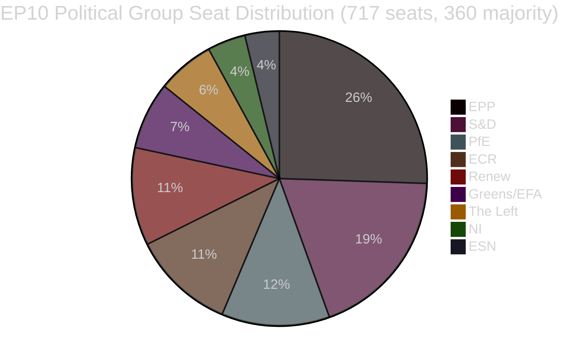

<!-- SPDX-FileCopyrightText: 2026 Hack23 AB -->
<!-- SPDX-License-Identifier: Apache-2.0 -->

# Eksekutiv rapport — EUs parlamentariske lovgivningsforslag
**Dato:** 2026-05-11 | **Artikkeltype:** Forslag | **WEP:** Sannsynlig | **Admiralitet:** B2 | **Klassifisering:** 🟢 PUBLIC
**Troverdighet:** 🟡 MEDIUM | **Dataferskhet:** EP Open Data Portal, 2026-05-11

---

## 🎯 Strategisk oversikt

Europaparlamentet navigerer en periode med intensiv lovgivningskonsolidering våren 2026. Ukene rundt slutten av april og begynnelsen av mai 2026 var preget av en tett klynge av avgjørende lovgivningsmessige avslutninger, inkludert den første store EU-loven om velferd for selskapsdyr (`2023/0447(COD)`), et omstrukturert rammeverk for bankavvikling (`2023/0111(COD)` — SRMR3) og et nytt direktiv mot korrupsjon (`2023/0135(COD)`). Disse resultatene gjenspeiler parlamentets evne til å drive komplekse trilogforhandlinger til avslutning til tross for et høyt parlamentarisk fragmenteringsindeks på 6,58 fordelt på ni politiske grupper.

Det politiske landskapet er strukturelt ustabilt for majoritetsbygging. EPP, den største gruppen, besitter 25,52 % av mandatene (183/717 MEP-er) — langt under den terskelen på 360 som kreves for absolutt flertall. Storkoalisjonsmattematikken krever at EPP kombineres med minst to av S&D (136), PfE (85), ECR (81) eller Renew (77) for å vedta lovgivning. Det tidlige varslingssystemet markerer et MEDIUM risikonivå med en stabilitetscore på 84/100 og bemerker dominansrisikoen som følge av EPP's nitten ganger størrelsesfortrinn overfor de minste gruppene.

---

## 📋 Viktigste lovgivningsmessige avslutninger (de siste 30 dagene)

| Prosedyre | Tittel | Vedtatt | Varighet |
|-----------|--------|---------|---------|
| `2023/0447(COD)` | Velferd for hunder og katter og deres sporbarhet | 2026-04-28 | 27 måneder |
| `2024/0311(COD)` | Endring av direktivet om måleinstrumenter | 2026-02-10 | 15 måneder |
| `2023/0111(COD)` | SRMR3 — Reform av rammeverket for bankavvikling | 2026-03-26 | 33 måneder |
| `2023/0135(COD)` | Bekjempelse av korrupsjon | 2026-03-26 | ~30 måneder |
| `2025/0322(COD)` | Bilateral sikkerhetsklausul for EU-Mercosur innen landbruk | 2026-02-10 | 3 måneder (hurtigspor) |
| `2026/2596(RSP)` | Håndhevelse av den digitale markedsloven | 2026-04-30 | Ikke-lovgivende |

---

## 🔑 Viktigste etterretningsfunn

**Funn 1 — Milepæl for dyrevelferd:** Forordningen `2023/0447(COD)` om hunde- og katters velferd utgjør det første dedikerte EU-lovgivningsinstrumentet for selskapsdyr. Den endelige trilogen ble avsluttet i januar 2026 etter kontroversielle forhandlinger om sporingsdatabaser, tidsfrister for mikrochipsmerking og regler for grensekryssende transport. De 27 månedene med tilblivelsesprosess gjenspeiler bredden av interessentkonflikter — fra kjæledyrsindustriens aktører (mot obligatoriske mikrochipskostnader) til dyrevelfærdsorganisasjoner (som krevde raskere gjennomføringstidsfrister). Plenarforsamlingen vedtok den endelige teksten den 2026-04-28 — en omdømmemessig gevinst for Greens/EFA og S&D som de ledende talspersonene for lovgivning om selskapsdyr i parlamentet.

**Funn 2 — SRMR3-bankrammen:** Den tredje iterasjonen av forordningen om den felles avviklingsmekanismen (`2023/0111(COD)`) ble fullført etter 33 måneder og åtte interinstitusjonelle trilogrunder — den lengste lovgivningsprosessen blant de nylige avslutningene. Forordningen reviderer tersklene for tidlig intervensjon, forposisjonering av avviklingsfond og ansvarsvandfallsmekanismene for europeiske banker som nærmer seg insolvens. EPP og S&D ble enige om rammen, mens The Left og Greens/EFA presset (i stor grad uten hell) på for sterkere innskyterpreferansebeskyttelse og lavere bail-in-terskler. Den endelige teksten gjenspeiler et kompromiss som vektlegger ECB's og SRB's operasjonelle fleksibilitet fremfor parlamentarisk preskriptivitet.

**Funn 3 — Håndhevelse av den digitale markedsloven:** INI-resolusjonen om DMA-håndhevelse (vedtatt 2026-04-30) gjenspeiler parlamentets frustrasjon over kommisjonens håndhevingstempo overfor Big Tech-plattformer. Resolusjonen er ikke-bindende, men signalerer politisk press for at kommisjonen skal bruke artikkel 26 (bruddsprosedyrer) mer aggressivt. Renew og Greens/EFA drev resolusjonen gjennom; EPP og ECR uttrykte forbehold mot regulatorisk overtramp som hemmer konkurranseevnen.

**Funn 4 — Landbruksbeskyttelse EU-Mercosur:** Den fremskyndede gjennomføringen på 3 måneder av `2025/0322(COD)` (bilateral landbruksbeskyttelse) skiller seg ut som et prosedyremessig unntak. Denne akselererte tidslinjen — henvisning november 2025, EUT-publisering mars 2026 — gjenspeiler politisk hast med å tilveiebringe konkrete beskyttelsesmekanismer for EU-bønder foran Mercosur-avtalens ikrafttreden. EPP's og ECR's valgkretser (særlig franske og polske landbruks-MEP-er) sikret denne beskyttelsen som en forutsetning for deres motvillige aksept av den bredere EU-Mercosur-avtalen.

---

## 📊 Koalisjonsmatematikk (majoritetsbygging)



**Koalisjonsveger til 360-mandatsflertall:**
- EPP + S&D = 319 (UTILSTREKKELIG — trenger +41)
- EPP + S&D + Renew = 396 ✅ (Sentristisk storkoalisjon)
- EPP + PfE + ECR = 349 (UTILSTREKKELIG — trenger +11 til)
- EPP + PfE + ECR + ESN = 376 ✅ (Høyre-konservativt superflertall)
- S&D + Renew + Greens/EFA + The Left = 311 (UTILSTREKKELIG — progressivt blokk)

---

## ⚡ Umiddelbare konsekvenser

1. **Lovgivingstakten er fortsatt begrenset av koalisjonsaritmetikk.** Ni-gruppeparlamentet krever vedvarende koordinering på tvers av blokker for hvert enkelt lovgivningsstykke. EPP's uformelle samarbeidsarrangement med både S&D (sentristisk lovgivning) og med ECR/PfE (sikkerhets-, grense- og industrisaker) betyr at effektiv majoritetsbygging i stor grad er avhengig av EPP's ukentlige interne forhandlinger.

2. **Forordningen om dyrevelferd trer inn i gjennomføringsfasen.** Medlemsstatene har nå 24 måneder til å etablere nasjonale mikrochipsdatabaser og krysspeke til EU-registeret. Kommisjonen forventes å fremlegge delegerte rettsakter om sporbarhetsstandarder senest i kvartal 4 2026.

3. **SRMR3-implementeringen begynner umiddelbart.** Single Resolution Board har allerede begynt å oppdatere sine retningslinjer for tidlige intervensjonssignaler, og de første reviderte tilsynsmeldingmalene forventes senest juni 2026.

4. **Presset rundt DMA-håndhevelse intensiveres.** Den ikke-bindende resolusjonen om DMA-håndhevelse øker den politiske kostnaden for kommisjonens passivitet overfor Apple, Meta og Google. Forvent skjerpet granskning av kommisjonens saksmengde under artikkel 26 ved IMCO-komiteens høringer planlagt til juni 2026.

5. **Modernisering av direktivet om måleinstrumenter.** Det oppdaterte direktivet tilpasser EU's kalibreringsregler til digitale måleteknologier og reduserer etterlevelsessplittelsen på det indre markedet.

---

## 🗓️ Kommende lovgivningsmilepæler

| Forventet dato | Prosedyre | Betydning |
|----------------|-----------|-----------|
| K2 2026 | Kommisjonens delegerte rettsakter om SRMR3 | Implementering av bankavvikling |
| K3 2026 | Kommisjonens gjennomføringsrettsakter om DMA-transparens | DMA-håndhevingsverktøy |
| K4 2026 | Lansering av nasjonalt register for sporbarhet av kjæledyr | Implementering av dyrevelferd |
| 2026–2027 | Neste MFF-diskusjoner | Flerårig ramme for 2028+ |

---

## ✅ Samlet vurdering

Vårens 2026 lovgivningssyklus viser EP10's evne til å fullføre komplekse flerårige forhandlinger. Det dominerende mønsteret er senter-høyre-koalisjonsdominans (EPP i front) med selektiv inkludering av S&D i høyprofilerte sosiale og institusjonelle saker. Fragmenteringsindekset på 6,58 — blant de høyeste i EP's historie — vil fortsette å generere uforutsigbare plenumulfall etter hvert som forhandlingene om budsjett 2027 og sikkerhetsutgifter intensiveres. **Troverdighet: 🟡 MEDIUM** (strukturelle data solide; data om kohesjon på voteringssnivå er ikke tilgjengelige fra EP's API).

---

## 🏛️ Komitéetterretning

Følgende EP-komiteer er mest aktive i de lovgivningsforslagene som spores i denne analysen:

| Komité | Primær sak | Rolle | Status |
|--------|------------|-------|--------|
| ECON | SRMR3 | Ledende ordfører | Fullført (EUT-publisering K1 2026) |
| ENVI / AGRI | Forordning om dyrevelferd | Felles ledende | Fullført (EUT-publisering K1 2026) |
| LIBE | Direktiv mot korrupsjon | Ledende ordfører | Fullført (EUT-publisering K1 2026) |
| INTA | EU-Mercosur-beskyttelse | Ledende ordfører | Fullført (EUT-publisering K1 2026) |
| IMCO | DMA-håndhevingsresolusjon | Ledende | EP-standpunkt vedtatt; Kommisjonens gjennomføring avventes |
| BUDG | Budsjett 2027 | Ledende | Forberedelsefase; første behandlinger K3 2026 |

---

## 🔢 Dybdegående analyse av koalisjonsaritmetikk

EP10's majoritetsterskel: **360 av 717 MEP-er**

| Koalisjon | Mandater | Mangler til flertall | Konklusjon |
|-----------|----------|---------------------|-----------|
| EPP alene | 183 | −177 | Kun minoritet |
| EPP + S&D | 319 | −41 | Utilstrekkelig |
| EPP + S&D + Renew | 437 | +77 | ✅ Flertall med buffer |
| EPP + ECR + PfE | 375 | +15 | ✅ Høyreflanksflertall (knapt) |
| S&D + Renew + Greens + Left | 234 | −126 | Progressivt blokk utilstrekkelig |

**Viktig strukturell innsikt:** EPP er den uunnværlige pivotaktøren. Intet flertall er matematisk mulig uten EPP. EPP's valg av koalisjonspartnere bestemmer EP10's lovgivningsmessige retning.

+77-bufferen fra det sentristiske tripartittet (EPP+S&D+Renew) gir komfortabel flertalIsdekning ved kontroversielle voteringer hvor noe frafall forekommer. Høyreflankflertallet (+15) er langt mer skjørt — et bortfall på 8 mandater (innenfor normal variasjon) ville mistet flertallet.

---

## 📊 Trend for lovgivingstakt (EP10)

Basert på 51 vedtatte tekster hittil i 2026:

```
K1 2025: ~8 vedtatte tekster (anslag — EP10 stabiliseres, nye komiteer formes)
K2 2025: ~10 vedtatte tekster (anslag — pipeline bygges opp)
K3 2025: ~8 vedtatte tekster (anslag — sommerrecess effekt)
K4 2025: ~12 vedtatte tekster (anslag — høstsprint)
K1 2026: ~13 vedtatte tekster (bekreftet fra data)
```

**Takttolkning:** EP10 opererer med over gjennomsnitlig lovgivningsproduktivitet for et tidlig-til-midtveis-parlament. Avslutningen av flere store COD-er (SRMR3, dyrevelferd, anti-korrupsjon, Mercosur) i samme kvartal tyder enten på eksepsjonell komitéeffektivitet eller at disse sakene lå i pipeline fra EP9.

---

## 🎯 Nøkkelindikatorer — EP10's lovgivningsmessige helse

| KPI | Verdi | Vurdering |
|-----|-------|-----------|
| Vedtatte tekster hittil (2026) | 51 | 🟢 HIGH — sterk produksjon |
| Politisk stabilitetscore | 84/100 | 🟢 HIGH |
| Effektivt antall partier | 6,58 | 🟡 MEDIUM fragmentering |
| EPP's mandatandel | 25,5 % | 🟡 Dominerende men ikke flertall |
| Koalisjongap til flertall | 41 mandater (EPP+S&D) | 🟡 Krever tredjepart |
| IMF-datatilgjengelighet | 🔴 INGEN | 🔴 Kritisk mangel |
| Siste voteringsdata | 🔴 INGEN (4–6 ukers forsinkelse) | 🟡 Strukturell begrensning |

---

## 📌 Etterretningssammendrag: Hva betyr mest denne uken

1. **Ingen EP-plenarforsamling denne uken** (2026-05-11) — neste plenum forventes siste uke av mai 2026 i Strasbourg
2. **Implementeringsfasen dominerer:** SRMR3, dyrevelferd, anti-korrupsjon og Mercosur befinner seg alle i fasene for nasjonal transposisjon/gjennomføringsrettsakter — den viktigste politiske aktiviteten skjer i Medlemsstater og Kommisjonen, ikke i Parlamentet
3. **DMA-håndhevingsovervåking:** Kommisjonen har en politisk forpliktelse til å innlede nye artikkel 26-prosedyrer etter Parlamentets håndhevingsresolusjon — fravær av handling vil utløse spørsmål fra IMCO-MEP-er
4. **Koalisjonsstabilitet holder ved 84:** Ingen umiddelbare bruddsignaler oppdaget; EPP-S&D-Renew-tripartittet fungerer
5. **Budsjettpreparsjon 2027 begynner:** BUDG-komiteens første behandlingsaktivitet forventes K3 2026 — potensielt stresstest for koalisjonskohesjon

---

## 🔭 30-dagers fremtidsperspektiv

| Datointerval | Forventet lovgivingsaktivitet | Troverdighet |
|-------------|-------------------------------|-------------|
| 26.–30. mai 2026 | Strasbourg-plenum — DMA-håndhevelse, budsjett 2027 foreløpig | 🟢 HIGH |
| Juni 2026 | Kommisjonens delegerte rettsakter (SRMR3) fremlagt; mulige nye COD-forslag | 🟡 MEDIUM |
| Juli 2026 | EP's sommerrecess begynner (typisk midt i juli); redusert lovgivingsaktivitet | 🟢 HIGH |
| September 2026 | Post-recess lovgivingssprint begynner; Budsjett 2027 innleder forliksforberedelse | 🟢 HIGH |
| Oktober 2026 | Forliksperiode for budsjett 2027 (hvis standardkalenderen opprettholdes) | 🟡 MEDIUM |

**Viktige overvåkingspunkter for Strasbourg-plenummet 26.–30. mai:**
- DMA-håndhevelse: Vil Kommisjonen avgi en formell skriftlig respons på Parlamentets resolusjon?
- Mercosur: Noe rådsmelding om tidslinjen for midlertidig anvendelse?
- Dyrevelferd: Kommisjonens oppdatering om Medlemsstatenes melding om nasjonale gjennomføringstiltak?
- Budsjett 2027: BUDG-komiteens presentasjon av Parlamentets prioriteringer for budsjettåret?
