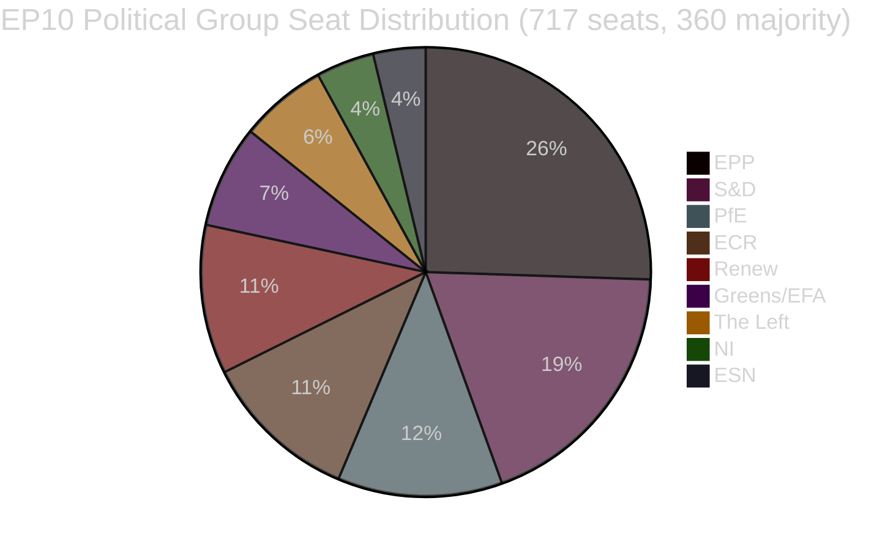

<!-- SPDX-FileCopyrightText: 2026 Hack23 AB -->
<!-- SPDX-License-Identifier: Apache-2.0 -->

# Exekutiv rapport — EU-parlamentets lagstiftningspropositioner
**Datum:** 2026-05-11 | **Artikeltyp:** Propositioner | **WEP:** Troligt | **Admiralitet:** B2 | **Klassificering:** 🟢 PUBLIC
**Tillförlitlighet:** 🟡 MEDIUM | **Datas aktualitet:** EP Open Data Portal, 2026-05-11

---

## 🎯 Strategisk översikt

Europaparlamentet navigerar en period av intensiv lagstiftningskonsolidering under våren 2026. Veckorna kring slutet av april och början av maj 2026 präglades av ett tätt kluster av epokgörande lagstiftningsavslutningar, däribland den första stora EU-förordningen om sällskapsdjursvälfärd (`2023/0447(COD)`), ett omstrukturerat ramverk för bankresolution (`2023/0111(COD)` — SRMR3) samt ett nytt direktiv mot korruption (`2023/0135(COD)`). Dessa framgångar återspeglar parlamentets förmåga att driva komplexa trialogförhandlingar till avslut trots ett högt parlamentariskt fragmenteringsindex på 6,58 fördelat på nio politiska grupper.

Det politiska landskapet är strukturellt instabilt för majoritetsbildning. EPP, den största gruppen, innehar 25,52 % av mandaten (183/717 ledamöter) — långt under det tröskelvärde på 360 som krävs för absolut majoritet. Stormkoalitionsmattematiken kräver att EPP kombineras med minst två av S&D (136), PfE (85), ECR (81) eller Renew (77) för att lagstiftning ska kunna antas. Systemet för tidig varning flaggar en MEDIUM risknivå med ett stabilitetsindex på 84/100 och noterar dominansrisken till följd av EPP:s nittondubbla storleksfördel gentemot de minsta grupperna.

---

## 📋 Viktigaste lagstiftningsavslutningar (de senaste 30 dagarna)

| Förfarande | Titel | Antagen | Varaktighet |
|------------|-------|---------|-------------|
| `2023/0447(COD)` | Välfärd för hundar och katter och deras spårbarhet | 2026-04-28 | 27 månader |
| `2024/0311(COD)` | Ändring av direktivet om mätinstrument | 2026-02-10 | 15 månader |
| `2023/0111(COD)` | SRMR3 — Reform av bankresolutionsramen | 2026-03-26 | 33 månader |
| `2023/0135(COD)` | Bekämpning av korruption | 2026-03-26 | ~30 månader |
| `2025/0322(COD)` | Bilateralt skydd för EU-Mercosur inom jordbruket | 2026-02-10 | 3 månader (snabbspår) |
| `2026/2596(RSP)` | Tillämpning av den digitala marknadslagen | 2026-04-30 | Icke-lagstiftande |

---

## 🔑 Viktigaste underrättelsefynd

**Fynd 1 — Milstolpe för djurskydd:** Förordningen `2023/0447(COD)` om hundar och katters välfärd utgör det första dedikerade EU-instrumentet för sällskapsdjur på lagstiftningsnivå. Den slutliga trialogen avslutades i januari 2026 efter kontroversiella förhandlingar om spårbarhetsdatabaser, tidsramar för mikrochipsmärkning och regler för gränsöverskridande transporter. De 27 månadernas tillblivelseprocess återspeglar den bredd av intressentkonflikter som präglade förhandlingarna — från djurindustrins aktörer (mot obligatoriska mikrochipskostnader) till djurskyddsorganisationer (som krävde snabbare genomförandetidsramar). Plenarsammanträdet antog den slutliga texten den 2026-04-28 — en reputationsmässig framgång för Greens/EFA och S&D som de ledande förespråkarna av lagstiftning om sällskapsdjur i parlamentet.

**Fynd 2 — Bankregleringen SRMR3:** Den tredje iterationen av förordningen om den gemensamma resolutionsmekanismen (`2023/0111(COD)`) slutfördes efter 33 månader och åtta interinstitutionella trialogomgångar — den längsta lagstiftningsprocessen bland de senaste avslutningarna. Förordningen reviderar tröskelvärdena för tidig intervention, förpositionering av resolutionsfonder och ansvarsordningen för europeiska banker som nalkats insolvens. EPP och S&D enades om ramverket, medan The Left och Greens/EFA (i stor utsträckning utan framgång) drev på för starkare insättarpreferensskydd och lägre bail-in-trösklar. Den slutliga texten återspeglar en kompromiss som viktar ECB:s och SRB:s operativa flexibilitet framför parlamentarisk föreskrivande kontroll.

**Fynd 3 — Tillämpning av den digitala marknadslagen:** INI-resolutionen om DMA-efterlevnad (antagen 2026-04-30) återspeglar parlamentets frustration över kommissionens tillämpningstakt gentemot Big Tech-plattformar. Resolutionen är inte bindande men signalerar politiskt tryck för att kommissionen ska använda artikel 26 (överträdelsförfaranden) mer aggressivt. Renew och Greens/EFA drev igenom resolutionen; EPP och ECR uttryckte reservationer om att reglering hämmade konkurrenskraften.

**Fynd 4 — Jordbruksskydd EU-Mercosur:** Det påskyndade genomförandet på 3 månader av `2025/0322(COD)` (bilateralt jordbruksskydd) sticker ut som ett procedurmässigt undantagsfall. Den accelererade tidslinjen — remiss november 2025, EUT-publicering mars 2026 — återspeglar politisk brådska att tillhandahålla konkreta skyddsmekanismer för EU-jordbrukare inför Mercosur-avtalets ikraftträdande. EPP:s och ECR:s valmanskår (i synnerhet franska och polska jordbruksledamöter) säkrade detta skydd som ett villkor för deras motvilliga acceptans av det bredare EU-Mercosur-avtalet.

---

## 📊 Koalitionsmatematik (majoritetsbildning)



**Koalitionsvägar till 360-mandatsmajoritet:**
- EPP + S&D = 319 (OTILLRÄCKLIGT — behöver +41)
- EPP + S&D + Renew = 396 ✅ (Centristisk storkoalition)
- EPP + PfE + ECR = 349 (OTILLRÄCKLIGT — behöver +11 till)
- EPP + PfE + ECR + ESN = 376 ✅ (Höger-konservativ supermajoritet)
- S&D + Renew + Greens/EFA + The Left = 311 (OTILLRÄCKLIGT — progressivt block)

---

## ⚡ Omedelbara konsekvenser

1. **Lagstiftningstakten begränsas fortfarande av koalitionsaritmiken.** Det nio-gruppers parlament kräver uthållig samordning mellan blocken för varje lagstiftningsakt. EPP:s informella samarbetsarrangemang med såväl S&D (centristisk lagstiftning) som ECR/PfE (säkerhets-, gräns- och industrifrågor) innebär att effektiv majoritetsbildning i hög grad är beroende av EPP:s veckovisa interna förhandlingar.

2. **Förordningen om djurskydd träder in i genomförandefasen.** Medlemsstaterna har nu 24 månader på sig att etablera nationella mikrochipsdatabaser och koppla dem till EU-registret. Kommissionen väntas lägga fram delegerade akter om spårbarhetsstandarder senast kvartal 4 2026.

3. **SRMR3-genomförandet inleds omedelbart.** Single Resolution Board har redan påbörjat uppdateringen av sina riktlinjer om tidiga interventionssignaler, och de första reviderade tillsynsmeddelandemallarna väntas senast juni 2026.

4. **Trycket kring DMA-tillämpning ökar.** Den icke-bindande resolutionen om DMA-tillämpning ökar den politiska kostnaden för kommissionens passivitet gentemot Apple, Meta och Google. Förvänta en skärpt granskning av kommissionens ärendestock enligt artikel 26 vid IMCO-utskottets utfrågningar planerade till juni 2026.

5. **Modernisering av direktivet om mätinstrument.** Det uppdaterade direktivet anpassar EU:s kalibreringskrav till digitala mätteknologier och minskar efterlevnadsfragmenteringen på den inre marknaden.

---

## 🗓️ Kommande lagstiftningsmilepålar

| Förväntat datum | Förfarande | Betydelse |
|-----------------|-----------|-----------|
| K2 2026 | Kommissionens delegerade akter om SRMR3 | Genomförande av bankresolution |
| K3 2026 | Kommissionens genomförandeakter om DMA-transparens | Verktyg för DMA-tillämpning |
| K4 2026 | Lansering av nationellt register för sällskapsdjursspårbarhet | Genomförande av djurskydd |
| 2026–2027 | Nästa MFF-diskussioner | Flerårig ram för 2028+ |

---

## ✅ Samlad bedömning

Vårens 2026 lagstiftningscykel visar EP10:s förmåga att slutföra komplexa fleråriga förhandlingar. Det dominerande mönstret är center-högerkoalitionsdominans (EPP i ledningen) med selektiv inkludering av S&D i högprofilerade sociala och institutionella ärenden. Fragmenteringsindexet på 6,58 — bland de högsta i EP:s historia — kommer att fortsätta generera oförutsägbara omröstningsresultat allteftersom förhandlingarna om budget 2027 och säkerhetsutgifter intensifieras. **Tillförlitlighet: 🟡 MEDIUM** (strukturella data starka; data om kohesion på röstningsnivå är inte tillgängliga från EP:s API).

---

## 🏛️ Utskottsunderrättelse

Följande EP-utskott är mest aktiva i de lagstiftningspropositioner som spåras i denna analys:

| Utskott | Primärt ärende | Roll | Status |
|---------|----------------|------|--------|
| ECON | SRMR3 | Ledande föredragande | Slutfört (EUT-publicering K1 2026) |
| ENVI / AGRI | Förordning om djurskydd | Gemensamt ledande | Slutfört (EUT-publicering K1 2026) |
| LIBE | Direktiv mot korruption | Ledande föredragande | Slutfört (EUT-publicering K1 2026) |
| INTA | EU-Mercosur-skydd | Ledande föredragande | Slutfört (EUT-publicering K1 2026) |
| IMCO | DMA-tillämpningsresolution | Ledande | EP-ståndpunkt antagen; kommissionens genomförande avvaktas |
| BUDG | Budget 2027 | Ledande | Förberedelsefas; första behandlingar K3 2026 |

---

## 🔢 Djupdykning i koalitionsaritmiken

EP10:s majoritetströskel: **360 av 717 ledamöter**

| Koalition | Mandat | Brist till majoritet | Slutsats |
|-----------|--------|---------------------|---------|
| EPP ensamt | 183 | −177 | Minoritet |
| EPP + S&D | 319 | −41 | Otillräckligt |
| EPP + S&D + Renew | 437 | +77 | ✅ Majoritet med marginal |
| EPP + ECR + PfE | 375 | +15 | ✅ Högerflanksmajoritet (knapp) |
| S&D + Renew + Greens + Left | 234 | −126 | Progressivt block otillräckligt |

**Viktig strukturell insikt:** EPP är den oumbärliga pivotaktören. Ingen majoritet är matematiskt möjlig utan EPP. EPP:s val av koalitionspartners bestämmer EP10:s lagstiftningsinriktning.

Den centristiska tripartitens buffert på +77 (EPP+S&D+Renew) ger bekväm majoritetstäckning vid kontroversiella omröstningar med viss avhoppsrisk. Högerflanksmajoriteten (+15) är avsevärt skörare — ett bortfall på 8 mandat (inom normal variation) skulle förlora majoriteten.

---

## 📊 Trend för lagstiftningstakt (EP10)

Baserat på 51 antagna texter hittills under 2026:

```
K1 2025: ~8 antagna texter (uppskattning — EP10 stabiliserar sig, nya utskott formas)
K2 2025: ~10 antagna texter (uppskattning — pipeline byggs upp)
K3 2025: ~8 antagna texter (uppskattning — sommaruppehållets inverkan)
K4 2025: ~12 antagna texter (uppskattning — höstsprurt)
K1 2026: ~13 antagna texter (bekräftat från data)
```

**Tolkning av takten:** EP10 opererar med ovan genomsnittlig lagstiftningsproduktivitet för ett tidig-till-medterm-parlament. Slutförandet av flera stora COD:ar (SRMR3, djurskydd, anti-korruption, Mercosur) under samma kvartal tyder antingen på exceptionell utskottseffektivitet eller att dessa ärenden låg i pipeline från EP9.

---

## 🎯 Nyckeltal — EP10:s lagstiftningshälsa

| KPI | Värde | Bedömning |
|-----|-------|-----------|
| Antagna texter hittills (2026) | 51 | 🟢 HIGH — stark produktion |
| Politisk stabilitetspoäng | 84/100 | 🟢 HIGH |
| Effektivt antal partier | 6,58 | 🟡 MEDIUM fragmentering |
| EPP:s mandatandel | 25,5 % | 🟡 Dominant men ej majoritet |
| Koalitionsgap till majoritet | 41 mandat (EPP+S&D) | 🟡 Kräver tredjepartsinkludering |
| IMF-datatillgänglighet | 🔴 INGEN | 🔴 Kritisk lucka |
| Senaste omröstningsdata | 🔴 INGEN (4–6 veckors fördröjning) | 🟡 Strukturell begränsning |

---

## 📌 Underrättelsesummering: Vad är viktigast denna vecka

1. **Inget EP-plenarsammanträde denna vecka** (2026-05-11) — nästa plenum förväntas sista veckan i maj 2026 i Strasbourg
2. **Genomförandefasen dominerar:** SRMR3, djurskydd, anti-korruption och Mercosur befinner sig alla i faserna för nationellt genomförande/genomförandeakter — den viktigaste politiska aktiviteten sker i medlemsstaterna och kommissionen, inte i parlamentet
3. **Bevakning av DMA-tillämpning:** Kommissionen har en politisk skyldighet att inleda nya förfaranden enligt artikel 26 efter parlamentets tillämpningsresolution — frånvaro av åtgärder kommer att trigga frågor från IMCO-ledamöter
4. **Koalitionsstabilitet håller vid 84:** Inga omedelbara brottssignaler detekterade; EPP-S&D-Renew-tripartiten fungerar
5. **Budgetförberedelser 2027 inleds:** BUDG-utskottets förstabehandlingsaktivitet förväntas K3 2026 — potentiellt stresstest för koalitionskohesion

---

## 🔭 Blick framåt 30 dagar

| Datumintervall | Förväntad lagstiftningsaktivitet | Tillförlitlighet |
|---------------|----------------------------------|-----------------|
| 26–30 maj 2026 | Strasbourg-plenum — DMA-tillämpning, budget 2027 preliminärt | 🟢 HIGH |
| Juni 2026 | Kommissionens delegerade akter (SRMR3) läggs fram; möjliga nya COD-förslag | 🟡 MEDIUM |
| Juli 2026 | EP:s sommaruppehåll inleds (vanligtvis i mitten av juli); minskad lagstiftningsaktivitet | 🟢 HIGH |
| September 2026 | Lagstiftningssprurten efter uppehållet inleds; Budget 2027 inleder förlikningsberedning | 🟢 HIGH |
| Oktober 2026 | Förlikningsperiod för budget 2027 (om standardkalendern följs) | 🟡 MEDIUM |

**Viktiga bevakningspunkter för Strasbourg-plenum 26–30 maj:**
- DMA-tillämpning: Kommer kommissionen att lämna ett formellt skriftligt svar på parlamentets resolution?
- Mercosur: Något rådsmeddelande om tidslinjen för provisorisk tillämpning?
- Djurskydd: Kommissionens uppdatering om medlemsstaternas anmälan av nationella genomförandeåtgärder?
- Budget 2027: BUDG-utskottets presentation av parlamentets prioriteringar för budgetåret?
