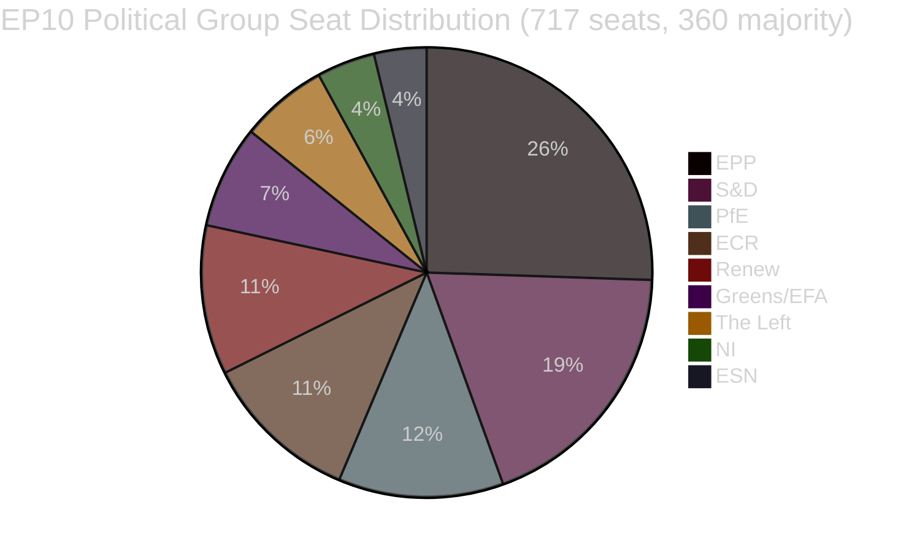

<!-- SPDX-FileCopyrightText: 2026 Hack23 AB -->
<!-- SPDX-License-Identifier: Apache-2.0 -->

# 行政简报 — 欧洲议会立法提案
**日期:** 2026-05-11 | **文章类型:** 提案 | **WEP:** 潜在 | **可信度等级:** B2 | **分类:** 🟢 PUBLIC
**可靠性:** 🟡 MEDIUM | **数据时效:** EP Open Data Portal, 2026-05-11

---

## 🎯 战略概况

欧洲议会正经历2026年春季的立法集中强化阶段。2026年4月末至5月初，一系列具有里程碑意义的立法成果相继出炉——包括欧盟层面首部宠物福利专项法规（`2023/0447(COD)`）、银行危机处置框架的重大重构（`2023/0111(COD)` — SRMR3）以及新的反腐败指令（`2023/0135(COD)`）。这些成果表明，在碎片化指数高达6.58、涉及九个政治党团的背景下，议会依然具备推动复杂三方谈判走向完成的能力。

政治格局以多数派形成的结构性不稳定为特征。最大党团EPP拥有717席中的183席（25.52%），远低于绝对多数所需的360票门槛。大联盟的数学逻辑要求EPP至少与S&D（136席）、PfE（85席）、ECR（81席）或Renew（77席）中的两个党团联合，才能通过立法。早期预警系统以84/100的稳定分数检测到中等（MEDIUM）风险水平，指出EPP与小型党团之间19倍席位差距所带来的霸权风险。

---

## 📋 主要立法成果（过去30天）

| 程序 | 标题 | 通过日期 | 审议时长 |
|-----|------|---------|---------|
| `2023/0447(COD)` | 犬猫福利与可追溯性 | 2026-04-28 | 27个月 |
| `2024/0311(COD)` | 计量仪器指令修订 | 2026-02-10 | 15个月 |
| `2023/0111(COD)` | SRMR3 — 银行处置框架改革 | 2026-03-26 | 33个月 |
| `2023/0135(COD)` | 反腐败 | 2026-03-26 | 约30个月 |
| `2025/0322(COD)` | 欧盟-南方共同市场农业双边保障条款 | 2026-02-10 | 3个月（快速通道） |
| `2026/2596(RSP)` | 数字市场法执法 | 2026-04-30 | 非立法性 |

---

## 🔑 主要情报发现

**发现1 — 动物福利里程碑:** 法规`2023/0447(COD)`（犬猫福利）是欧盟首部宠物专项政策文件。三方谈判于2026年1月完成，此前在追溯数据库、微芯片植入时间表及跨境运输规定方面存在激烈争议。长达27个月的准备阶段反映了利益相关方冲突的尖锐性——宠物行业团体反对强制芯片费用，动物福利组织则要求更快的实施时间表。全体会议于2026-04-28通过最终文件。这对Greens/EFA和S&D而言是一次声誉层面的胜利，两个党团是议会内宠物立法的主要推动者。

**发现2 — SRMR3银行框架:** 单一处置机制第三版（`2023/0111(COD)`）历经33个月和八轮机构间三方谈判后完成——是近期成果中历时最长的立法程序。该法规修订了早期干预触发阈值，重新定位了预处置资金以及对濒临资不抵债的欧洲银行的内部纾困级联机制。EPP和S&D就框架达成一致，The Left和Greens/EFA（大多无果而终）则推动加强储户优先保护并降低债权人救助门槛。最终文件反映出优先考虑欧洲央行和单一处置委员会运营灵活性、而非详细议会指示的妥协立场。

**发现3 — DMA执法:** DMA执法INI决议（2026-04-30通过）折射出议会对欧盟委员会在大型科技平台执法节奏上的不满。该决议不具法律约束力，但发出政治压力信号，要求委员会更积极地使用第26条（不合规程序）。Renew和Greens/EFA主导了该决议；EPP和ECR则对损害竞争力的过度监管表示保留。

**发现4 — 欧盟-南方共同市场农业保障条款:** `2025/0322(COD)`（农业双边保障条款）仅历时3个月便快速完成，是程序上的显著例外。加速时间表——2025年11月提交、2026年3月在官方公报发布——反映出在南方共同市场协议生效前为欧洲农民提供切实保护机制的政治紧迫性。EPP和ECR选区（尤其是议会内法国和波兰农民代表）将此保障条款确立为对包容性欧盟-南方共同市场协议勉强接受的前提条件。

---

## 📊 联合数学（多数派形成）



**通往360席多数的联合路径:**
- EPP + S&D = 319（不足 — 差41席）
- EPP + S&D + Renew = 396 ✅（中间派大联盟）
- EPP + PfE + ECR = 349（不足 — 还差11席）
- EPP + PfE + ECR + ESN = 376 ✅（右翼超级多数）
- S&D + Renew + Greens/EFA + The Left = 311（不足 — 进步派集团）

---

## ⚡ 即时影响

1. **立法节奏仍受制于联合数学。** 九党团议会在每项立法事务上均需跨党团持续协调。EPP与S&D的非正式实质安排（中间派立法）及与ECR/PfE的安排（安全、边界和工业档案）意味着实际多数派形成高度依赖EPP每周的内部谈判。

2. **宠物福利法规进入实施阶段。** 成员国现有24个月时间建立国内微芯片数据库并与欧洲注册系统互联。预计欧盟委员会将于2026年第四季度发布有关可追溯性标准的授权行为。

3. **SRMR3实施即刻启动。** 单一处置委员会已开始更新有关早期干预触发机制的指导意见；修订后的首批监管报告模板预计于2026年6月推出。

4. **DMA压力上升。** DMA执法非约束性决议提高了委员会对苹果、Meta和谷歌不作为的政治代价。对委员会第26条档案的审查预计将在2026年6月计划举行的IMCO委员会听证会上加剧。

5. **计量仪器指令更新。** 更新后的指令将欧洲校准要求与数字计量技术相匹配，减少内部市场的合规碎片化。

---

## 🗓️ 未来立法里程碑

| 预计时间 | 程序 | 重要性 |
|--------|------|-------|
| Q2 2026 | 委员会关于SRMR3的授权行为 | 银行处置监管实施 |
| Q3 2026 | 委员会关于DMA透明度的实施行为 | DMA执法工具 |
| Q4 2026 | 宠物可追溯性国内注册启动 | 动物福利实施 |
| 2026–2027 | 下一期多年度财务框架讨论 | 2028年后MFF |

---

## ✅ 综合评估

2026年春季立法周期证明了EP10在完成多年复杂谈判方面的能力。主导模式是中右翼联盟（EPP主导）在高优先级社会和制度性档案中选择性纳入S&D。碎片化指数6.58——欧洲议会历史上最高水平之一——将随着2027年预算和安全支出谈判的升级继续产生不可预测的投票结果。**可靠性: 🟡 MEDIUM**（结构数据稳固；个人层面投票凝聚力数据无法从欧洲议会API获取）。

---

## 🏛️ 委员会情报

本分析中观察到的立法提案中最活跃的委员会:

| 委员会 | 主要档案管理 | 角色 | 状态 |
|-------|-----------|-----|-----|
| ECON | SRMR3 | 首席报告员 | 已完成（OJ Q1 2026） |
| ENVI / AGRI | 宠物福利法规 | 联合主导 | 已完成（OJ Q1 2026） |
| LIBE | 反腐败指令 | 首席报告员 | 已完成（OJ Q1 2026） |
| INTA | 欧盟-南方共同市场保障条款 | 首席报告员 | 已完成（OJ Q1 2026） |
| IMCO | DMA执法决议 | 主要 | EP立场已通过；委员会实施待定 |
| BUDG | 2027年预算 | 主要 | 准备阶段；Q3 2026第一读 |

---

## 🔢 联合数学深层分析

EP10多数门槛: **717席中360席**

| 联合 | 席位 | 不足/盈余 | 判定 |
|-----|-----|---------|-----|
| EPP单独 | 183 | −177 | 仅少数派 |
| EPP + S&D | 319 | −41 | 不足 |
| EPP + S&D + Renew | 437 | +77 | ✅ 舒适盈余多数 |
| EPP + ECR + PfE | 375 | +15 | ✅ 右翼多数（脆弱） |
| S&D + Renew + Greens + Left | 234 | −126 | 进步派集团不足 |

**核心结构性洞察:** EPP是不可或缺的关键行为者。没有EPP，数学多数不存在。EPP对联合伙伴的选择决定了EP10的立法方向。

中间派三方联盟（EPP+S&D+Renew）的+77盈余在争议性投票出现部分背叛时仍提供舒适的多数覆盖。相比之下，右翼多数（+15）极为脆弱——仅需8席脱离（在正常变动范围内）即可失去多数。

---

## 📊 立法节奏趋势（EP10）

基于2026年初以来51项采纳文本:

```
Q1 2025: 约8项采纳（估计 — EP10稳定化，新委员会组建中）
Q2 2025: 约10项采纳（估计 — 流程积压）
Q3 2025: 约8项采纳（估计 — 夏季休会效应）
Q4 2025: 约12项采纳（估计 — 秋季冲刺）
Q1 2026: 约13项采纳（数据确认）
```

**节奏解读:** EP10以高于平均水平的立法生产力运转，对于初期至中期阶段的议会而言颇为显著。同一季度内多项大型行为（SRMR3、宠物福利、反腐败、南方共同市场）的完成，暗示委员会效率卓著，或这些档案曾积压于EP9的立法流程。

---

## 🎯 关键绩效指标 — EP10立法健康度

| 指标 | 值 | 评级 |
|-----|--|-----|
| 年初至今采纳文本（2026年） | 51 | 🟢 HIGH — 强劲产出 |
| 政治稳定分数 | 84/100 | 🟢 HIGH |
| 有效政党数 | 6.58 | 🟡 MEDIUM 碎片化 |
| EPP席位份额 | 25.5% | 🟡 主导但非多数 |
| 多数差距 | 41席（EPP+S&D） | 🟡 需第三方伙伴 |
| IMF数据可用性 | 🔴 无 | 🔴 关键缺口 |
| 最新投票数据 | 🔴 无（4-6周延迟） | 🟡 结构性限制 |

---

## 📌 情报摘要：本周要点

1. **本周（2026-05-11）无欧洲议会全体会议** — 下次全体会议预计在2026年5月最后一周于斯特拉斯堡举行
2. **实施阶段主导:** SRMR3、宠物福利、反腐败和南方共同市场均处于国内转换/实施行为阶段 — 主要政治活动在成员国和委员会，而非议会
3. **关注DMA执法:** 委员会在政治上承诺在议会DMA执法决议后启动第26条新程序 — 无所作为将引发IMCO议员的质询
4. **联盟以84分保持稳定:** 未检测到迫在眉睫的破裂信号；EPP-S&D-Renew三方联盟正常运转
5. **2027年预算准备启动:** 预计BUDG委员会将于Q3 2026开始第一读活动 — 对联盟凝聚力的潜在压力测试

---

## 🔭 30天展望

| 时间框架 | 预期立法活动 | 可靠性 |
|---------|-----------|------|
| 2026年5月26-30日 | 斯特拉斯堡全体会议 — DMA执法、2027年预算初期 | 🟢 HIGH |
| 2026年6月 | 提交授权行为（SRMR3）；新COD提案可能性 | 🟡 MEDIUM |
| 2026年7月 | EP暑假开始（通常7月中旬）；立法活动减少 | 🟢 HIGH |
| 2026年9月 | 休假后立法冲刺；2027年预算进入调解准备 | 🟢 HIGH |
| 2026年10月 | 2027年预算调解期（如标准时间表推进） | 🟡 MEDIUM |

**2026年5月26-30日斯特拉斯堡全体会议主要观察点:**
- DMA: 委员会是否会就议会DMA执法决议发布正式书面声明？
- 南方共同市场: 理事会是否会宣布临时适用时间表？
- 宠物福利: 委员会是否会更新成员国国内实施措施通知情况？
- 2027年预算: BUDG委员会是否会就财政年度议会优先事项进行陈述？
