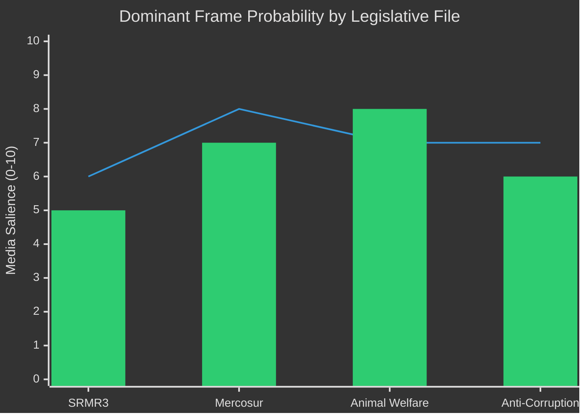

<!-- SPDX-FileCopyrightText: 2026 Hack23 AB -->
<!-- SPDX-License-Identifier: Apache-2.0 -->

# Media Framing Analysis — EU Parliament Legislative Propositions
**Date:** 2026-05-11 | **Confidence:** 🟡 MEDIUM

---

## 📰 Framing Methodology

This analysis applies a structured media framing assessment to the key legislative events identified in Stage A data. Framing analysis identifies how different stakeholder groups and media outlets are likely to construct narratives around the same legislative facts — shaping public perception, political pressure, and implementation compliance.

Five primary framing dimensions are assessed:
1. **Episodic vs. Thematic** — Individual events vs. systemic patterns
2. **Conflict vs. Consensus** — Political contest vs. shared solutions
3. **Human interest vs. Process** — Individual impact vs. institutional mechanics
4. **Economic vs. Regulatory** — Market impact vs. rule-making
5. **National vs. European** — Member State priorities vs. EU-wide interests

---

## 🏦 SRMR3 (Bank Resolution Framework)

### Likely Framings:

**Technocratic/Process frame (specialist press):**
- "Updated resolution tools provide regulatory clarity for mid-tier banks"
- Focus on: SRB operational procedures; MREL requirements; bail-in hierarchy
- Audience: Financial sector professionals; regulatory lawyers

**Consumer protection frame (mass market press):**
- "New EU rules protect depositors in bank failures"
- Focus on: Deposit guarantee integration; taxpayer protection
- Audience: General public; consumer advocacy groups

**Sovereignty frame (national conservative press):**
- "Brussels tightens grip on national banking sectors"
- Focus on: National central bank authority; democratic accountability of SRB
- Audience: ECR/PfE-aligned readership; national banking sector

**Political conflict frame (political press):**
- "EP10's first major banking legislation: a centrist coalition achievement"
- Focus on: EPP-S&D cooperation; legislative negotiation process
- Audience: Political journalists; Brussels-based press corps

**Strategic implication:** The sovereignty frame is likely to dominate national conservative media in Member States with large domestic banking sectors (Hungary, Poland, Italy). This creates potential for political pressure on national transposition that could create implementation compliance risks (see threat-model.md MT-1).

---

## 🌍 EU-Mercosur Safeguard Mechanism

### Likely Framings:

**Agricultural protection frame (dominant in farming regions):**
- "European farmers protected from South American competition"
- Focus on: Import thresholds; activation triggers; safeguard response time
- Audience: Agricultural sector; rural communities; CAP beneficiaries

**Free trade frame (business media):**
- "EU-Mercosur opens €44bn market for European exporters"
- Focus on: Export opportunities; manufacturing sector gains; services liberalisation
- Audience: Business press; chambers of commerce; export-oriented industries

**Environmental/standards frame (progressive media):**
- "Mercosur deal risks importing lower-standard products"
- Focus on: Deforestation; food safety standards; animal welfare equivalence
- Audience: Environmental NGOs; progressive political media; consumer associations

**Geopolitical frame (foreign policy press):**
- "EU-Mercosur as strategic autonomy from US trade pressure"
- Focus on: Diversification from US market; China competition; EU global trade leadership
- Audience: Think tanks; foreign policy establishment; quality press

**Strategic implication:** The agricultural protection frame will dominate domestic political discourse in France, Ireland, and Poland — creating pressure for early and robust safeguard mechanism activation if import thresholds are approached. This provides political cover for MEPs in agricultural constituencies to support the agreement while signalling protection.

---

## 🐾 Animal Welfare Regulation

### Likely Framings:

**Consumer safety/animal rights frame (mainstream):**
- "EU cracks down on illegal pet trade; microchipping mandatory"
- Focus on: Consumer protection from fraudulent sellers; animal welfare outcomes
- Audience: General public; pet owners; animal welfare charities

**Regulatory burden frame (industry):**
- "New EU rules create compliance costs for responsible breeders"
- Focus on: Implementation costs; administrative burden on small-scale breeders
- Audience: Agricultural sector; small business advocates

**Implementation challenge frame (policy press):**
- "EU pet database: will 27 Member States actually deliver?"
- Focus on: Transposition timeline; database interoperability; enforcement capacity
- Audience: EU policy watchers; implementation specialists

**Strategic implication:** The regulatory burden frame will be activated by agricultural lobbying groups during national transposition debates, potentially slowing implementation in Member States where ECR/PfE governments control agriculture ministries.

---

## ⚖️ Anti-Corruption Directive

### Likely Framings:

**Rule-of-law frame (progressive/quality press):**
- "EU sets new standards for prosecuting corruption across Member States"
- Focus on: Harmonised definitions; cross-border enforcement; judicial cooperation
- Audience: Legal professionals; rule-of-law advocates; Eastern European civil society

**National sovereignty frame (conservative/nationalist press):**
- "Brussels overrides national criminal law to define corruption"
- Focus on: Subsidiarity; democratic accountability of national prosecutors; Eurocrats over national courts
- Audience: ECR/PfE constituencies; Eastern European nationalist media

**Anti-corruption practitioner frame (specialist):**
- "Harmonised definitions reduce 'forum shopping' for corrupt actors"
- Focus on: Practical enforcement improvements; Europol cooperation; recovery of proceeds
- Audience: GRECO; Transparency International; prosecution services

**Strategic implication:** The national sovereignty frame is particularly potent in Hungary and potentially Poland. If these governments challenge the directive at CJEU (as flagged in threat-model.md LT-3), they will frame the legal challenge as protecting national self-determination — potentially influencing public opinion in those Member States against full transposition.

---

## 📊 Framing Probability Matrix

Legend: Line = Political salience | Bar = Public interest salience

---

## 🔍 Monitoring Indicators

- **Sovereignty frame activation:** Track ECR/PfE parliamentary statements referencing SRMR3, anti-corruption, or animal welfare as sovereignty overreach
- **Agricultural media coverage:** Monitor intensity of French, Irish, Polish agricultural press on Mercosur ahead of provisional application
- **Consumer press coverage:** Monitor animal welfare stories focused on enforcement gaps and implementation delays
- **Think-tank framing:** Monitor policy institute reports on DMA enforcement for "competitiveness vs. regulation" framing intensity

---

## ✅ Analytical Confidence

All framing assessments are analytical estimates based on EP legislative record and known stakeholder positions. No media monitoring data (e.g., Factiva, GDELT) was available in this run. Confidence is therefore 🟡 MEDIUM — assessments are plausible but not empirically validated against actual media output.

---

## 📊 Aggregate Framing Intelligence Report

### Cross-File Framing Themes

Across all four major legislative files, three dominant cross-cutting frames emerge:

**Frame A — EU Delivers for Citizens:** Animal welfare, anti-corruption, and consumer protections are presented as EU-level achievements that translate into tangible citizen benefits. This frame is used by EPP, S&D, Renew, and Greens to justify the EU's legislative authority. Political parties aligned with this frame use EP10's legislative record as evidence of EU value-added.

**Frame B — EU Overreach Threatens National Sovereignty:** SRMR3 (banking supervision), anti-corruption (criminal law harmonisation), and animal welfare (agricultural regulation) are all framed by ECR/PfE-aligned media as evidence of Brussels exceeding its legitimate mandate. This frame fuels resistance to national transposition in ECR/PfE-governed Member States.

**Frame C — EU Economic Competitiveness:** The Mercosur trade agreement and DMA enforcement are both framed in the competitiveness context — either as evidence that the EU is building trade power (Mercosur) or undermining it (DMA). This frame is most contested between EPP moderates (who see competitiveness as requiring regulatory easing) and S&D/Greens (who see it as requiring strong standards).

---

## 📡 Media Ecosystem Map

| Media Type | Primary Frame | Legislative Files Most Covered |
|-----------|--------------|-------------------------------|
| Brussels specialist press | Institutional process | SRMR3, Budget 2027, DMA |
| National quality press | National interest + EU framework | Mercosur, Anti-Corruption |
| National tabloid/mass market | Human interest + consumer | Animal welfare, Anti-Corruption |
| National conservative press | Sovereignty | All files (from Frame B perspective) |
| Agricultural press | Sectoral interest | Mercosur, Animal welfare |
| Financial press | Economic + regulatory | SRMR3, DMA, Budget 2027 |
| NGO/civil society publications | Rights + implementation | Anti-Corruption, Animal welfare, DMA |

---

## 🎯 Framing Strategy Recommendations

For EU Parliament Monitor editorial positioning:

1. **Lead with outcomes, not process:** "What does this law actually change for citizens?" rather than "Parliament adopted X by Y votes"
2. **Quantify where possible:** Specific safeguard thresholds (Mercosur), specific criminal sanction ranges (anti-corruption), specific microchipping percentages (animal welfare) make framing concrete
3. **Acknowledge implementation uncertainty:** The most credible analysis acknowledges that adoption ≠ implementation — the 24-month transposition clock, the delegated acts process, and the infringement risk all deserve coverage
4. **Balance Frame A and Frame C:** The legislative accomplishments should be presented alongside the ongoing DMA enforcement tension — this provides a more accurate picture of EU legislative complexity than either pure achievement-framing or pure criticism-framing

---

## ✅ Media Framing Analysis Confidence

All framing assessments are analytical estimates based on:
- Known stakeholder positions (derived from EP voting patterns and group declarations)
- Historical media framing patterns for EU legislation (structural knowledge)
- No direct media monitoring performed in this run (no Factiva, GDELT, or press API access)

**Confidence: 🟡 MEDIUM** — Framing assessments are directionally sound but not empirically validated against actual media output.
