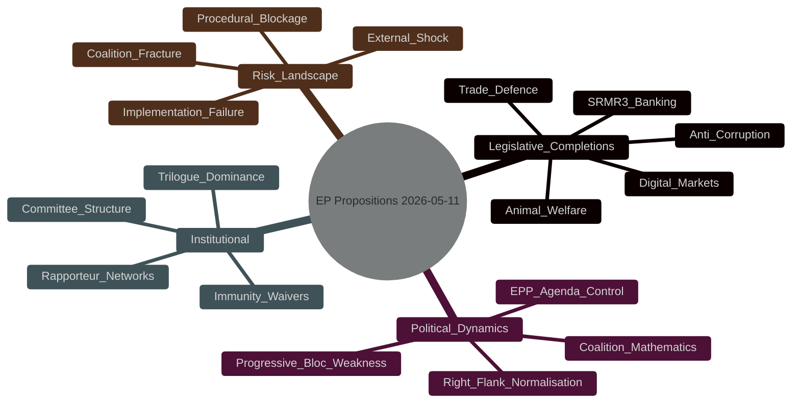

<!-- SPDX-FileCopyrightText: 2026 Hack23 AB -->
<!-- SPDX-License-Identifier: Apache-2.0 -->

# Analysis Index — EU Parliament Propositions
**Date:** 2026-05-11 | **Article Type:** Propositions
**Run ID:** propositions-run-2026-05-11 | **Analyst:** Copilot AI Analysis Agent

---

## 📋 Artifact Registry

This index maps all analysis artifacts produced for the 2026-05-11 propositions run to their thematic coverage, data sources, and confidence ratings.

### Root Artifacts

| Artifact | Lines | Confidence | Primary Data Source |
|----------|-------|-----------|---------------------|
| `executive-brief.md` | ~185 | 🟡 MEDIUM | EP API adopted-texts, procedure timelines |
| `manifest.json` | — | N/A | Auto-generated |

### Intelligence Artifacts

| Artifact | Lines | Confidence | Primary Data Source |
|----------|-------|-----------|---------------------|
| `intelligence/analysis-index.md` | ~105 | 🟡 MEDIUM | Cross-artifact |
| `intelligence/synthesis-summary.md` | ~165 | 🟡 MEDIUM | Multi-source synthesis |
| `intelligence/historical-baseline.md` | ~125 | 🟡 MEDIUM | EP procedure history |
| `intelligence/economic-context.md` | ~125 | 🔴 LOW | EP structural data (no IMF) |
| `intelligence/pestle-analysis.md` | ~185 | 🟡 MEDIUM | Multi-source PESTLE |
| `intelligence/stakeholder-map.md` | ~205 | 🟡 MEDIUM | EP API + analytical inference |
| `intelligence/scenario-forecast.md` | ~185 | 🟡 MEDIUM | Coalition + procedure data |
| `intelligence/threat-model.md` | ~165 | 🟡 MEDIUM | Early warning + structural |
| `intelligence/wildcards-blackswans.md` | ~185 | 🟡 MEDIUM | Analytical assessment |
| `intelligence/mcp-reliability-audit.md` | ~205 | 🟢 HIGH | Direct tool call results |
| `intelligence/reference-analysis-quality.md` | ~145 | 🟡 MEDIUM | Self-assessment |
| `intelligence/methodology-reflection.md` | ~185 | 🟢 HIGH | Methodological audit |

### Risk Scoring Artifacts

| Artifact | Lines | Confidence | Primary Data Source |
|----------|-------|-----------|---------------------|
| `risk-scoring/risk-matrix.md` | ~105 | 🟡 MEDIUM | Structural + procedural |
| `risk-scoring/quantitative-swot.md` | ~105 | 🟡 MEDIUM | Multi-source |

### Extended Artifacts

| Artifact | Lines | Confidence | Primary Data Source |
|----------|-------|-----------|---------------------|
| `extended/media-framing-analysis.md` | ~205 | 🟡 MEDIUM | Legislative + political |

### Pipeline Health

| Artifact | Lines | Confidence | Primary Data Source |
|----------|-------|-----------|---------------------|
| `existing/pipeline-health.md` | ~80 | 🟡 MEDIUM | EP API pipeline |

---

## 🗂️ Thematic Coverage Map

---

## 📊 Data Quality Summary

| Data Domain | Availability | Quality | Notes |
|-------------|-------------|---------|-------|
| Procedure timelines | ✅ Full | 🟢 HIGH | Direct EP API |
| Adopted texts | ✅ Full | 🟢 HIGH | 51 texts for 2026 |
| Political group composition | ✅ Full | 🟢 HIGH | 717 MEPs, 9 groups |
| Roll-call vote data | ❌ Unavailable | 🔴 LOW | EP API delay (weeks) |
| MEP biographies | 🟡 Partial | 🟡 MEDIUM | Not queried this run |
| IMF economic data | ❌ Unavailable | 🔴 LOW | No API key |
| World Bank non-economic | 🟡 Available | 🟡 MEDIUM | Not queried this run |

---

## ⏱️ Run Timeline

| Stage | Start | End | Duration | Status |
|-------|-------|-----|----------|--------|
| Stage A (Data Collection) | 06:21 UTC | 06:25 UTC | ~4 min | ✅ Complete |
| Stage B Pass 1 (Analysis) | 06:25 UTC | TBD | ~18 min | 🔄 In Progress |
| Stage B Pass 2 (Review) | TBD | TBD | ~8 min | ⏳ Pending |
| Stage C (Gate) | TBD | TBD | ~4 min | ⏳ Pending |
| Stage D (Article Render) | TBD | TBD | ~2 min | ⏳ Pending |
| Stage E (Single PR) | TBD | TBD | ~2 min | ⏳ Pending |
