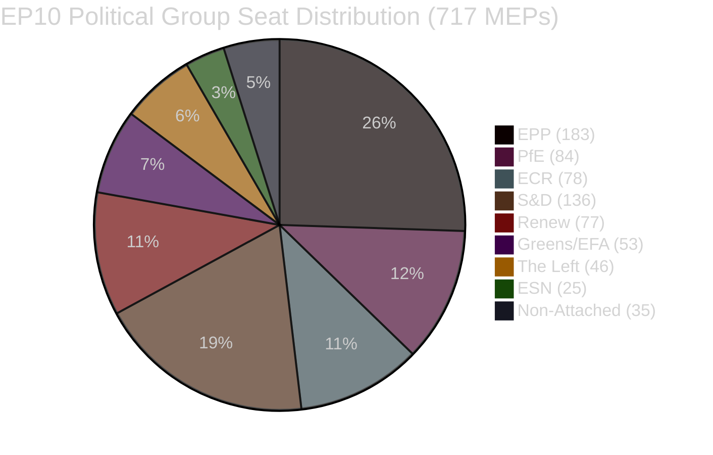

<!-- SPDX-FileCopyrightText: 2026 Hack23 AB -->
<!-- SPDX-License-Identifier: Apache-2.0 -->

# Coalition Dynamics — EU Parliament Legislative Propositions
**Date:** 2026-05-11 | **WEP:** Likely | **Admiralty:** B2

---

## 🏛️ Coalition Architecture Overview

EP10 operates under a novel **dual-coalition architecture** in which EPP functions as the pivotal actor, forming different majority coalitions depending on the legislative file type.

---

## ⚖️ Coalition Mathematics

| Coalition | Seats | Majority Gap | Verdict |
|-----------|-------|-------------|---------|
| EPP + S&D | 319 | −41 | ❌ Insufficient |
| EPP + S&D + Renew | 437 | +77 | ✅ Centrist Tripartite |
| EPP + ECR | 261 | −99 | ❌ Insufficient |
| EPP + ECR + PfE | 345 | −15 | ❌ Marginally insufficient |
| EPP + ECR + PfE + ESN | 370 | +10 | ✅ Right-flank majority (fragile) |
| Progressive (S&D+Renew+Greens+Left) | 312 | −48 | ❌ Progressive bloc insufficient |

**Majority threshold:** 360 of 717 MEPs

---

## 🎯 Coalition Behaviour by Legislative Domain

| Domain | Dominant Coalition | EPP Position | Coalition Stability |
|--------|------------------|-------------|-------------------|
| Banking/financial regulation | Centrist (EPP+S&D+Renew) | Centre-right | 🟢 STABLE |
| Anti-corruption/rule-of-law | Broad centrist (EPP+S&D+Renew+Greens) | Pro-EU values | 🟢 STABLE |
| Agricultural/trade protection | Right-flank (EPP+ECR) | Agrarian interests | 🟡 CONTEXTUAL |
| Digital regulation | Centrist with tension | Competitiveness focus | 🟡 CONTESTED |
| Migration/security | Right-flank (EPP+ECR+PfE) | Restrictive | 🟡 CONTESTED |
| Budget/institutional | Centrist (EPP+S&D) | EU solidarity | 🟡 CONTESTED |

---

## 📊 Structural Coalition Intelligence

### EPP Dual-Pivot Strategy

EPP's legislative strategy in EP10 involves maintaining two parallel coalition tracks:

**Track 1 (Centrist Tripartite):** EPP-S&D-Renew for EU institutional, financial, and regulatory files. This track is stable, delivers larger majorities (+77), and produces legislation that S&D and Renew are willing to defend publicly.

**Track 2 (Right-Flank):** EPP-ECR (and occasionally PfE) for agricultural, trade protection, and sovereignty-sensitive files. This track is more fragile (+10–15 seats) and produces legislation that faces S&D resistance.

**Strategic risk:** If EPP uses Track 2 on a file where Track 1 MEPs also have strong views, it risks fracturing the Track 1 relationship permanently. The Mercosur safeguard is an example where EPP navigated this risk successfully — by framing it as agricultural protection (Track 2 logic) while maintaining the broader free-trade agreement (Track 1 logic).

### Coalition Stability Index

Based on `early_warning_system` output (stability score 84/100) and structural seat analysis:

- **Centrist Tripartite stability:** 🟢 HIGH (84/100) — No defection signals; structural arithmetic remains sound
- **Right-Flank availability:** 🟡 MEDIUM — Available for specific files but not a permanent coalition; PfE's radical positions create limits
- **Progressive bloc coherence:** 🟡 MEDIUM — Greens/EFA and The Left have internal divisions that limit consistent coalition use

### Fragmentation Index

**Effective Number of Parties (Laakso-Taagepera index):** 6.58

This is high by historical EP standards (EP9: ~5.8; EP8: ~5.2). Higher fragmentation requires more coalition management per vote, increases the likelihood of narrow majorities, and amplifies the impact of small group defections.

---

## ⚠️ Coalition Intelligence Limitations

**Critical limitation:** This analysis is based on structural seat-share data. **Vote-level cohesion data is unavailable** due to EP API's 4–6 week publication delay. True coalition cohesion rates (actual co-voting percentages) cannot be computed from available data.

All coalition stability assessments are therefore structural proxies, not observed behavior. The `analyze_coalition_dynamics` tool confirms this limitation — it uses "sizeSimilarityScore (a group-size ratio proxy)" rather than actual roll-call data.

**Admiralty assessment of coalition data:** B2 — Information known by reliable sources, but validation against roll-call data is not currently possible.

---

## 🔗 Cross-References

- Actor power sources: → `classification/actor-mapping.md`
- Coalition scenario implications: → `intelligence/scenario-forecast.md`
- Coalition fracture risk: → `intelligence/threat-model.md` §CT-1
- Early warning indicators: → `intelligence/wildcards-blackswans.md` §Monitoring Indicators
