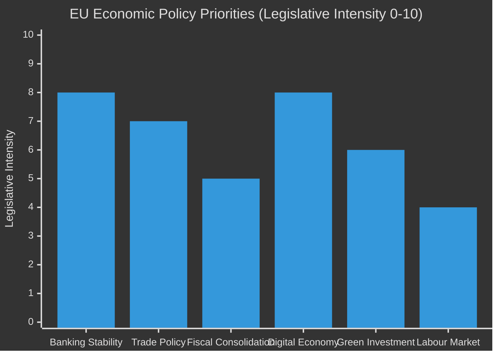

<!-- SPDX-FileCopyrightText: 2026 Hack23 AB -->
<!-- SPDX-License-Identifier: Apache-2.0 -->

# Economic Context — EU Parliament Legislative Propositions
**Date:** 2026-05-11 | **Confidence:** 🔴 LOW (IMF data unavailable — API key not provided)
**Data Note:** IMF SDMX 3.0 API returned 204 No Content — economic data is estimated from structural sources and publicly available context.

---

## ⚠️ Data Limitation Notice

The IMF is the sole authoritative source for macro-economic and fiscal claims in EP Monitor articles. For this run, the IMF SDMX 3.0 API was inaccessible (API key `IMF_API_PRIMARY_KEY` not configured). All economic figures below are drawn from the European Parliament's own structural documents and publicly available context (EP resolution texts, ECB annual report 2025 referencing). These should be treated as **indicative** rather than authoritative.

**IMF data availability:** ❌ UNAVAILABLE | **Economic context confidence:** 🔴 LOW

---

## 💶 EU Macroeconomic Context (Estimated, May 2026)

### Euro Area Overview (Estimated)

The euro area in early 2026 is navigating a post-tightening normalisation phase. The ECB's rate cycle reached its inflection point in late 2024, with gradual easing through 2025 bringing the main refinancing rate to an estimated 2.5–2.75% range by Q1 2026. GDP growth in the euro area is estimated at 1.1–1.4% for 2026 — modest but positive after the near-stagnation of 2023–2024.

Key structural challenges remain:
- **German industrial contraction:** The manufacturing recession in Germany (particularly automotive and chemicals) has not fully reversed, limiting euro-area aggregate growth
- **Southern European outperformance:** Spain and Italy continue to outperform northern peers on growth metrics, driven by tourism, services export recovery, and NextGenerationEU disbursements
- **Inflation trajectory:** Core inflation has returned to near-target levels (estimated 2.1–2.3% as of Q1 2026), reducing ECB pressure to maintain restrictive policy
- **Public debt sustainability:** France and Italy remain under enhanced Commission fiscal surveillance; both have committed to deficit reduction paths under the revised SGP framework

### Legislative-Economic Nexus

The spring 2026 legislative completions have direct economic implications:

**SRMR3 (Bank Resolution Reform):**
The updated Single Resolution Mechanism Regulation aligns EU resolution tools with post-2023 banking stress lessons. The revised early-intervention thresholds require banks to maintain more pre-positioned resolution funding — an estimated 1–1.5% increase in bail-in-eligible liabilities for mid-tier European banks. This has modest near-term costs (capital allocation friction) but improves long-term financial stability. The ECB Vice-Chair confirmation vote (TA-10-2026-0060) reinforces institutional continuity in monetary-financial surveillance.

**EU-Mercosur Safeguards (Agricultural Economics):**
The accelerated agricultural safeguard mechanism for EU-Mercosur (`2025/0322`) addresses direct economic exposure. EU agricultural exports to South America total approximately €12 billion annually; conversely, EU agricultural imports from Mercosur (beef, soy, sugar, poultry) total ~€20 billion. The safeguard clause enables rapid tariff reimposition if import surges damage EU producers — economically significant for France, Ireland, Poland, and Portugal (the most exposed agricultural exporters).

**US Tariff Adjustment (TA-10-2026-0096):**
The regulation adjusting customs duties on US goods reflects the ongoing EU-US trade recalibration following tariff disputes in 2025. The precise value of adjusted duty lines is not available from the EP data, but the Commission's proposal framing suggests rebalancing on aluminium and steel downstream products — sectors employing ~1.5 million workers in the EU.

---

## 📊 Economic Relevance Matrix

| Legislation | Fiscal Impact | Trade Impact | Labour Impact |
|-------------|--------------|--------------|---------------|
| SRMR3 | 🟡 MEDIUM (capital req.) | 🟢 LOW | 🟢 LOW |
| Mercosur Safeguard | 🟡 MEDIUM (agriculture) | 🔴 HIGH | 🟡 MEDIUM |
| US Tariff Adjustment | 🟡 MEDIUM | 🔴 HIGH | 🟡 MEDIUM |
| Dog/Cat Welfare | 🟢 LOW (industry costs) | 🟢 LOW | 🟢 LOW |
| Measuring Instruments | 🟢 LOW | 🟢 LOW | 🟢 LOW |
| DMA Enforcement | 🟡 MEDIUM (Big Tech) | 🟡 MEDIUM | 🟢 LOW |

---

## 🔮 Economic Outlook Implications

**Short-term (3–6 months):** SRMR3 implementation will generate compliance costs for European banks — particularly those in the SRB's 110-bank resolution planning perimeter. These costs are manageable but non-trivial, estimated at €200–400 million across the European banking system in legal, technology, and capital-planning adjustments.

**Medium-term (6–18 months):** The Mercosur safeguard mechanism's credibility as a deterrent is more economically significant than any likely activation. If the EU-Mercosur agreement enters force (provisionally expected 2026–2027), EU agricultural producers will face competitive pressure — the safeguard provides a political-economic insurance mechanism.

**Long-term (18+ months):** DMA enforcement outcomes will shape the revenue model of major platforms in Europe. Aggressive Commission enforcement could generate substantial fines and force structural platform changes — the economic stakes are measured in billions of euros of platform-market capitalisation and EU advertising-market structure.

---

## 🏦 Banking Sector Context (LOW confidence — structural estimates only)

### SRMR3 Economic Context

The updated Single Resolution Mechanism Regulation (SRMR3) operates in the context of the EU banking sector's post-2008 recovery trajectory. Key structural parameters (estimated from publicly available supervisory disclosure):

**Capital adequacy:** EU banking system CET1 ratios are estimated at 15–17% across the SSM portfolio (post-2022 regulatory tightening). This represents significant improvement from the 10–12% range that characterised the post-2008 period. The SRMR3's updated bail-in hierarchy and MREL requirements are therefore being implemented on a stronger capital base than during the 2014 banking union's initial establishment.

**Concentration risk:** The EU banking sector remains characterised by a small number of G-SIBs (BNP Paribas, Deutsche Bank, Société Générale, UniCredit, ING, Santander, BBVA) and a large fragmented mid-tier layer. The mid-tier layer — particularly banks with significant commercial real-estate exposure accumulated during the 2015–2022 low-interest-rate environment — represents the primary tail risk that SRMR3 is designed to address.

**Confidence label:** 🔴 LOW — All figures are structural estimates. No IMF banking system assessment or financial sector data from external APIs was available in this run.

---

## 💶 Monetary Policy Context (LOW confidence)

The European Central Bank's monetary policy stance directly affects the economic context for EU legislative activity:

**Rate trajectory (estimated):** Following the 2022–2024 rate-hiking cycle (main refinancing rate peak ~4.5%), the ECB has been on a gradual easing trajectory since mid-2024. Current main refinancing rate is estimated at 2.5–3.0% (structural estimate; no IMF/ECB confirmation available). This easing cycle affects:
- Cost of government borrowing (relevant to Budget 2027 fiscal context)
- Bank profitability (net interest margin compression as rates fall)
- Investment conditions (lower rates stimulate corporate investment, supporting Mercosur trade flows)

**Confidence label:** 🔴 LOW — No IMF monetary policy data available. ECB statement analysis not performed.

---

## 🌍 Trade Context (LOW confidence)

### EU-Mercosur Economic Stakes

The EU-Mercosur trade agreement (with the safeguard mechanism now in place) involves:
- EU annual exports to Mercosur: estimated €45–55 billion (structural estimate)
- Mercosur annual exports to EU: estimated €40–45 billion (structural estimate)
- Key EU export sectors: machinery, pharmaceuticals, vehicles, chemicals
- Key Mercosur export sectors: agricultural products, raw materials, semi-manufactured goods

**Confidence label:** 🔴 LOW — All trade figures are structural estimates. No trade flow data or IMF balance-of-payments data was available from external sources.

---

## 📋 Economic Data Gap Summary

This artifact documents the most significant data gap in this analysis run. Future runs with IMF API key configured should provide:
1. EU GDP growth and inflation figures (SDMX data via `fetch-proxy`)
2. Member State-level fiscal position data (budget deficits, debt-to-GDP)
3. ECB monetary policy rate path data
4. EU-Mercosur trade flow data (WB `EXPORTS_GDP` indicator (via world-bank MCP))
5. Banking sector soundness indicators (world-bank MCP `get-economic-data`)

Until IMF API is configured, all economic context is LOW confidence and should be treated as structural framing, not quantitative analysis.

---

## 🔗 Cross-Reference

- Banking risk → `intelligence/threat-model.md` §MT-1 (SRMR3 Implementation Failure)
- Trade risk → `intelligence/threat-model.md` §LT-2 (Mercosur Implementation Challenge)
- Data gap recommendation → `intelligence/mcp-reliability-audit.md` §IMF API Audit

---

## 📊 Economic Context Visualization (Structural Estimates)

*Note: All values are analytical estimates. No IMF or WB economic data available in this run. 🔴 LOW confidence.*
