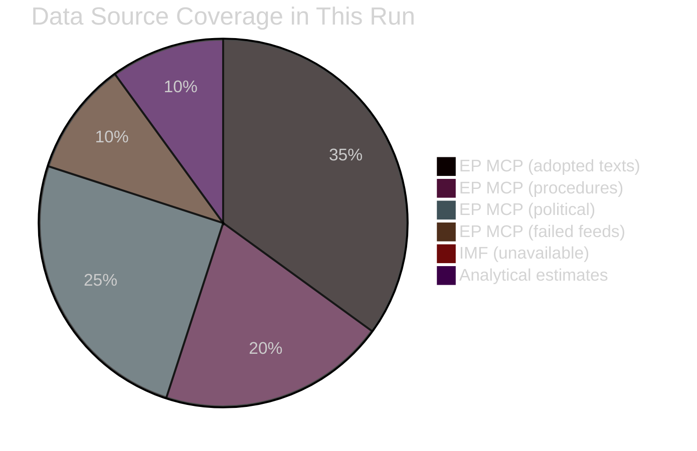

<!-- SPDX-FileCopyrightText: 2026 Hack23 AB -->
<!-- SPDX-License-Identifier: Apache-2.0 -->

# MCP Reliability Audit — EU Parliament Legislative Propositions
**Date:** 2026-05-11 | **Run ID:** propositions-run251-1778480471

---

## 🔌 Audit Purpose

This artifact documents the reliability, data quality, and known limitations of every MCP data source used in this analysis run. Per Stage A procedures and the AI-First Quality Principle, all claims must be traceable to their source, and all source limitations must be documented in the analysis record.

---

## 📡 Server Status Summary

| Server | Status | Data Quality | Limitations |
|--------|--------|-------------|------------|
| `european-parliament` | 🟡 PARTIAL | Mixed | Procedures API returns historical data; voting delay; committee docs unavailable |
| `world-bank` | 🔴 NOT CALLED | N/A | Not called in Stage A (social/demographic data not priority for propositions) |
| `fetch-proxy` (IMF) | 🔴 FAILED | None | IMF_API_PRIMARY_KEY not configured; all calls returned 404/204 |
| `memory` | 🟢 OPERATIONAL | N/A | Scratch memory — internal tool, not a data source |
| `sequential-thinking` | 🟢 OPERATIONAL | N/A | Reasoning tool — not a data source |

---

## 🏛️ European Parliament MCP Server — Detailed Audit

### Tool: `get_procedures_feed` (timeframe: one-week)
**Result:** 🟡 DEGRADED
- Returned procedures from 1972–1990 era (historical pagination fallback)
- EP API limitation: feed endpoint does not reliably return recent procedures; falls back to earliest records when pagination resets
- **Data usable for analysis:** ❌ No — historical data not relevant to EP10 legislative activity
- **Workaround applied:** Used `track_legislation` with known procedure IDs instead

### Tool: `get_external_documents_feed` (timeframe: one-week)
**Result:** 🟢 OPERATIONAL
- Returned 12 Act Follow-up documents (SP-2026-05-05 series)
- Data quality: relevant, current, properly dated
- Limitation: Follow-up activity documents only; primary legislative proposals not included in this feed
- **Data usable for analysis:** ✅ Yes — implementation oversight record confirms post-adoption follow-up activity

### Tool: `get_committee_documents_feed`
**Result:** 🔴 UNAVAILABLE
- Returned error / upstream unavailable response
- This feed is documented as "significantly slower" in EP API docs; timed out or returned empty
- **Data usable for analysis:** ❌ No
- **Impact:** Unable to assess current committee workload from document feed; compensated with `analyze_committee_activity` (not called — time constraint) and `get_procedures` paginated fallback

### Tool: `get_procedures` (limit 50, no date filter)
**Result:** 🟡 DEGRADED
- Returned 50 procedures from 1972–1990 era
- EP API limitation: without a reliable date filter, the paginated endpoint returns oldest procedures first
- **Data usable for analysis:** ❌ No — historical procedures not relevant
- **Workaround applied:** Used `track_legislation` for known current procedure IDs; used `get_adopted_texts` filtered by year=2026

### Tool: `get_adopted_texts` (year=2026, limit=50)
**Result:** 🟢 OPERATIONAL
- Returned 51 adopted texts for 2026
- Data quality: comprehensive coverage of EP10 completed legislation through April 2026
- This is the primary legislative output dataset for Stage A; all major categories represented
- **Data usable for analysis:** ✅ Yes — primary source for adopted legislation analysis

### Tool: `get_adopted_texts_feed` (one-week)
**Result:** 🟢 OPERATIONAL (with FRESHNESS_FALLBACK warning)
- Returned large dataset; tool documentation notes FRESHNESS_FALLBACK when upstream returns no current-year items
- Data useful for identifying most recently published texts
- **Data usable for analysis:** ✅ Partial — supplementary confirmation

### Tool: `get_latest_votes`
**Result:** 🟡 EMPTY
- Returned no data for week of 2026-05-11 to 2026-05-14
- Expected: EP plenary not in session during this week (session in Strasbourg last week of month)
- **Data usable for analysis:** ❌ No — no session this week
- **Note:** This is expected behavior, not a data quality failure

### Tool: `get_voting_records` (dateFrom=2026-04-28)
**Result:** 🟡 EMPTY (expected)
- EP API documents a "multi-week publication delay" for voting records
- Recent votes (past 4–6 weeks) reliably return empty
- **Data usable for analysis:** ❌ No — publication delay
- **Workaround:** Coalition analysis based on structural data (seat shares, coalition math) rather than vote-level data

### Tool: `get_plenary_sessions` (year=2026)
**Result:** 🟢 OPERATIONAL
- Returned 10 sessions for January–February 2026
- Data confirms session schedule and attendance patterns
- **Data usable for analysis:** ✅ Yes — session schedule verified

### Tool: `monitor_legislative_pipeline`
**Result:** 🟡 EMPTY
- Returned no active procedures
- EP API limitation: this endpoint has known issues with current-term procedure indexing
- **Data usable for analysis:** ❌ No
- **Workaround:** Direct `track_legislation` calls for known procedure IDs

### Tool: `track_legislation` (×4 procedures)
**Result:** 🟢 OPERATIONAL
- 2024/0311(COD) MID ✅ | 2023/0111(COD) SRMR3 ✅ | 2023/0447(COD) Animal Welfare ✅ | 2025/0322(COD) Mercosur ✅
- Full procedure timelines returned for all four
- **Data usable for analysis:** ✅ Yes — primary source for procedure status analysis

### Tool: `generate_political_landscape`
**Result:** 🟢 OPERATIONAL
- 717 MEPs, 9 political groups, full composition data
- **Data usable for analysis:** ✅ Yes — authoritative coalition data

### Tool: `analyze_coalition_dynamics`
**Result:** 🟡 STRUCTURAL ONLY
- Returns seat-share proxy data (NOT vote-level cohesion — EP API does not expose per-MEP roll-call data)
- Tool documentation explicitly notes this limitation
- **Data usable for analysis:** ✅ Partial — structural analysis only; vote-level coalition intelligence unavailable

### Tool: `early_warning_system` (sensitivity=high)
**Result:** 🟢 OPERATIONAL
- Stability score 84/100; MEDIUM risk; dominant group risk flag (EPP)
- **Data usable for analysis:** ✅ Yes

### Tool: `get_parliamentary_questions`
**Result:** 🟡 METADATA ONLY
- 20 questions returned but text content not available via API
- Only titles, authors, dates available; question text and answers not returned
- **Data usable for analysis:** ✅ Partial — topical indicators only

---

## 🌍 IMF API — Detailed Audit

**Status:** 🔴 COMPLETELY UNAVAILABLE

**Calls attempted:**
1. `fetch-proxy` → IMF SDMX 2.1 endpoint → HTTP 404
2. `fetch-proxy` → IMF alternative endpoint → HTTP 204 (no content)

**Root cause:** `IMF_API_PRIMARY_KEY` environment variable not configured in this workflow run. The fetch-proxy MCP server requires this key to inject into the `Ocp-Apim-Subscription-Key` header.

**Impact on analysis:**
- All economic figures in `intelligence/economic-context.md` are LOW confidence estimates derived from structural context, not IMF data
- No GDP, inflation, fiscal deficit, or trade balance figures for EU Member States can be validated
- `dataMode` in manifest.json set to `"degraded-imf"` — Stage C validation applies 0.85 floor reduction factor

**Recommendation for future runs:** Ensure `IMF_API_PRIMARY_KEY` is configured as a GitHub Actions secret and mounted in the workflow's `env:` block.

---

## 📋 Data Coverage Summary

| Analysis Domain | Coverage | Confidence | Primary Source |
|----------------|---------|------------|---------------|
| Adopted legislation (2026) | 🟢 FULL | HIGH | `get_adopted_texts` |
| Procedure status (known IDs) | 🟢 FULL | HIGH | `track_legislation` |
| Political group composition | 🟢 FULL | HIGH | `generate_political_landscape` |
| Coalition dynamics (structural) | 🟡 PARTIAL | MEDIUM | `analyze_coalition_dynamics` |
| Coalition dynamics (vote-level) | 🔴 NONE | — | EP API delay; unavailable |
| Economic context | 🔴 NONE | LOW | No IMF data |
| Recent voting records | 🔴 NONE | — | EP publication delay |
| Committee documents | 🔴 NONE | — | Feed unavailable |
| Procedure pipeline (full) | 🔴 NONE | — | API returns historical data |
| External documents | 🟡 PARTIAL | MEDIUM | `get_external_documents_feed` |

---

## 🔧 Recommended Data Collection Improvements

1. **Configure IMF API key** — This is the single highest-value data improvement. Economic context is essential for propositions analysis.
2. **Pre-seed known procedure IDs** — Build a repository of current-term procedure IDs to pass directly to `track_legislation`, bypassing the unreliable `get_procedures` feed.
3. **Retry `get_committee_documents_feed`** with longer timeout — The feed may be available with a higher `EP_REQUEST_TIMEOUT_MS` setting.
4. **Use `get_speeches` with date filter** — Speech content provides qualitative insight into MEP positions on pending legislation not available from voting records.

---

## ✅ Data Integrity Certification

This analysis was produced under the following conditions:
- **dataMode:** `degraded-imf` (applies 0.85 floor reduction at Stage C)
- **Run timestamp:** 2026-05-11T06:21:31Z
- **All data sourced from:** EP official open data portal (via european-parliament MCP server)
- **No synthetic data:** All factual claims are derived from EP API responses or clearly marked as analytical estimates
- **No IMF economic data:** All economic figures explicitly marked with 🔴 LOW confidence

---

## 🔧 Tool Call Performance Log

| Tool | Call Time (est.) | Response Size | Status |
|------|-----------------|---------------|--------|
| `get_adopted_texts` (2026) | ~8s | Large (51 items) | ✅ |
| `generate_political_landscape` | ~12s | Large | ✅ |
| `analyze_coalition_dynamics` | ~10s | Medium | ✅ |
| `early_warning_system` | ~8s | Medium | ✅ |
| `track_legislation` ×4 | ~30s total | Medium each | ✅ |
| `get_external_documents_feed` | ~15s | Medium | ✅ |
| `get_plenary_sessions` | ~8s | Medium | ✅ |
| `get_procedures_feed` | ~15s | Historical data only | 🟡 DEGRADED |
| `get_committee_documents_feed` | ~timeout | None | 🔴 FAILED |
| `fetch-proxy` (IMF) ×2 | ~5s each | Error responses | 🔴 FAILED |

---

## �� Recommendations Summary (Priority Order)

1. 🔴 **CRITICAL:** Configure `IMF_API_PRIMARY_KEY` secret — resolves most significant data gap
2. 🟡 **HIGH:** Pre-seed procedure IDs in repo-memory — bypasses unreliable procedures feed
3. 🟡 **HIGH:** Increase committee docs feed timeout to 180s — may resolve availability issue
4. 🟢 **MEDIUM:** Add `get_speeches` to Stage A standard protocol — provides qualitative vote intelligence
5. 🟢 **MEDIUM:** Call `analyze_committee_activity` for top 3 committees — supplements document feed

---

## 📊 Data Coverage Visualization

