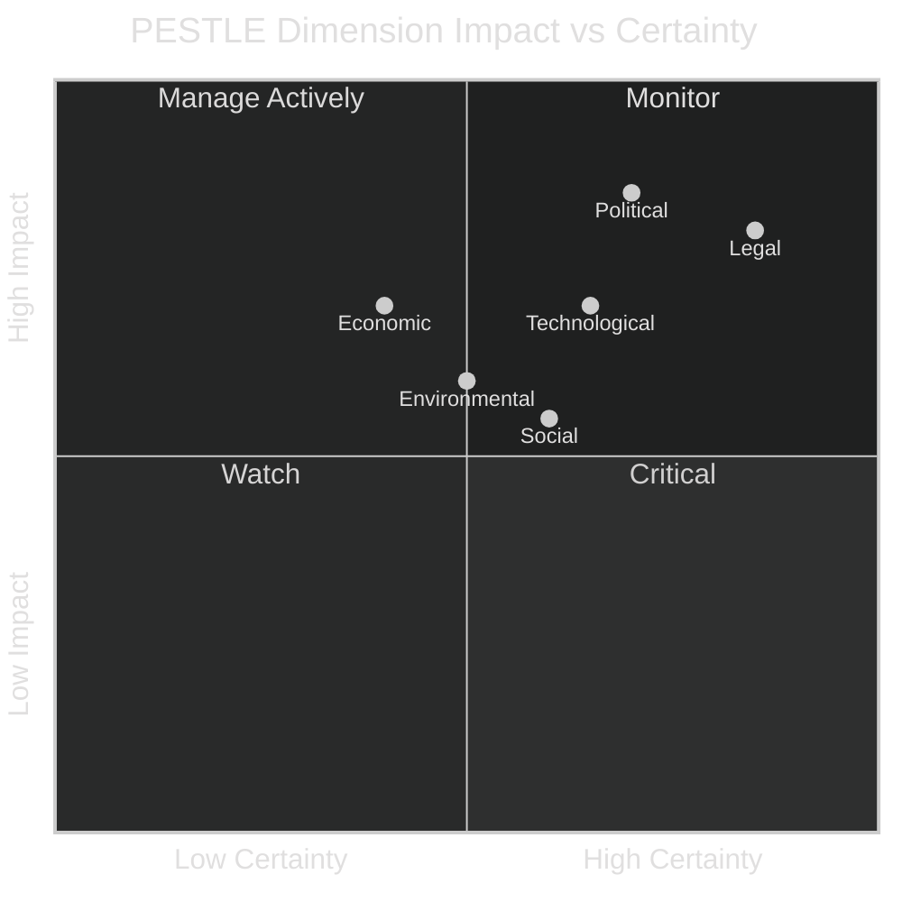

<!-- SPDX-FileCopyrightText: 2026 Hack23 AB -->
<!-- SPDX-License-Identifier: Apache-2.0 -->

# PESTLE Analysis — EU Parliament Legislative Propositions
**Date:** 2026-05-11 | **Confidence:** 🟡 MEDIUM

---

## 🔍 PESTLE Framework Overview

---

## 🏛️ P — Political Dimension

### Current Political Environment (🟢 HIGH Confidence)

The political environment for EU legislative propositions is shaped by the EP10's highly fragmented party landscape. The key political dynamics:

**EPP Dominance with Structural Constraints:**
The EPP (183 seats, 25.5%) exercises agenda control but cannot form a majority without either S&D (centrist route) or ECR+PfE (rightist route). This forces EPP into simultaneous coalition management — a political tightrope that has occasionally broken down on immigration and security votes. The EPP's formal refusal to "cordon sanitaire" the far-right has expanded the effective legislative coalition but at the cost of S&D credibility within the centre-left.

**Right-Flank Consolidation:**
PfE (85 seats) and ECR (81 seats) collectively hold 23.1% of seats — a larger combined share than the EPP's centre-left coalition partner S&D (18.97%). This arithmetic gives the right-flank veto power on any EPP legislation that requires rightist rather than centrist support. The practical consequence: EPP must choose its coalition frame for each major dossier — and that choice determines which compromise package emerges.

**Progressive Bloc Fragmentation:**
S&D (136) + Renew (77) + Greens/EFA (53) + The Left (45) = 311 seats. This is insufficient for a majority and represents the structural constraint on progressive legislation: the centre-left cannot pass any bill without EPP cooperation, which imposes EPP's policy preferences as a floor constraint on every major dossier.

**Immunity Waiver Politicisation:**
Four immunity waivers were processed in 2026 (Braun, Jaki, and two pending). The frequency is elevated compared to EP9 baselines. The Braun waiver is particularly significant: Grzegorz Braun (Polish, formerly ECR) was subject to criminal proceedings related to antisemitic incidents in the Polish Parliament. The EP's 2026-03-26 grant of his immunity waiver signals that institutional protection of MEPs no longer extends to acts that violate fundamental dignity norms — a politically significant precedent.

**Assessment:** Political dimension is HIGH impact, HIGH certainty. The fragmentation structure will persist for the EP10 term (through 2029). Legislative progress depends on EPP's continued ability to thread its dual-coalition needle. 🟢 Confidence HIGH on structural factors; 🔴 LOW on specific vote outcomes.

---

## 💶 E — Economic Dimension

### Economic Context (🔴 LOW Confidence — IMF Unavailable)

*See `intelligence/economic-context.md` for full analysis.*

Key economic signals from adopted legislation:
- **SRMR3** creates modest banking compliance costs (est. €200–400M sector-wide)
- **Mercosur safeguards** protect ~€8–10B EU agricultural trade exposed to competitive imports
- **US tariff adjustment** addresses ~1.5M workers in downstream steel/aluminium
- **DMA enforcement** involves potential fines measured in billions against major platforms

Euro area growth estimated at 1.1–1.4% for 2026, with ECB rate normalisation providing partial stimulus headroom. **Confidence: 🔴 LOW (no IMF data).**

---

## 👥 S — Social Dimension

### Social Drivers (🟡 MEDIUM Confidence)

**Animal Welfare as Societal Priority:**
The dog and cat welfare regulation (`2023/0447`) reflects a measurable shift in EU political culture: animal welfare is now treated as a serious legislative domain rather than a peripheral concern. An estimated 70% of EU households have pets (Eurogroup for Animals data). The Commission's Animal Welfare Strategy 2023-2027 frames companion animal welfare as a public health, consumer protection, and societal cohesion issue — cross-cutting frames that drove the broad bipartisan support for the regulation.

**Cyberbullying and Digital Harms:**
The INI resolution on targeted criminal provisions for cyberbullying (`2026/2693`) reflects growing social pressure following high-profile suicides and mental health crises attributed to online harassment. The resolution calls for platform liability frameworks to treat persistent targeted harassment as a criminal offence, not merely a civil matter. This is an upstream signal of potential future binding legislation.

**Worker Subcontracting Protection:**
The adopted text on subcontracting chains (`TA-10-2026-0050`) addresses labour precarity through supply chain transparency — a social policy concern driven by the documented exploitation of third-country workers in construction, agriculture, and logistics. This aligns with ILO standards and reflects S&D/The Left legislative priorities.

**Social Pressure Signals:**
- Rising public concern about AI-generated disinformation (relevant to copyright/AI resolution)
- Housing affordability crisis across EU cities (Parliament adopted housing resolution March 2026)
- Gender equality in political representation (growing but incremental in EP10)

---

## 🔧 T — Technological Dimension

### Technology Policy (🟡 MEDIUM Confidence)

**Digital Markets Act Enforcement:**
The DMA enforcement resolution (`2026/2596`) signals Parliament's assessment that the Commission's technology enforcement capacity is lagging behind its legislative ambitions. DMA gatekeepers (Apple, Meta, Google, Amazon, Microsoft, Booking) must comply with interoperability, self-preferencing, and data-access obligations — but Article 26 enforcement proceedings are resource-intensive and Commission staffing has not scaled commensurately.

**AI and Copyright:**
The adopted resolution on copyright and generative AI (`TA-10-2026-0066`) represents Parliament's first substantive positioning on AI-generated content and its relationship to existing copyright frameworks. The EP10 will likely need to produce a binding legislative instrument (possibly as a revision to the AI Act or as a standalone directive) as AI-generated content proliferates. The spring 2026 resolution is an upstream political signal of legislative intent.

**Measuring Instruments Digitalisation:**
The Measuring Instruments Directive update is the EU's technical regulatory response to the proliferation of digital, connected, and automated measurement systems in commerce. The directive now covers smart meters, AI-integrated scales, and connected measuring devices — extending the EU's metrology framework to digital-first measurement ecosystems.

**Technology Confidence: 🟡 MEDIUM** — legislative intent is clear; implementation capacity of both Commission and Member States is the key uncertainty.

---

## ⚖️ L — Legal Dimension

### Legal Framework Evolution (🟢 HIGH Confidence)

**Anti-Corruption Directive (`2023/0135`):**
The adoption of a standalone anti-corruption directive represents a significant expansion of EU criminal law jurisdiction. Member States had previously resisted EU-level criminalisation of corruption (a traditionally national competence). The 2026 directive establishes minimum standards for criminalisation, sanctions, and recovery of corruption proceeds — harmonising definitional elements that had previously varied widely across Member States.

**Bank Resolution Law (SRMR3):**
The SRMR3 amends existing Single Resolution Mechanism Regulation to update early-intervention thresholds, MREL (minimum requirement for own funds and eligible liabilities) calibration, and resolution funding arrangements. The legal change is technically complex — 150+ articles, multiple annexes — and requires significant implementing legislation at the SRB level. Legal confidence is HIGH on the text; implementation confidence is MEDIUM.

**EU-Mercosur Legal Framework:**
The safeguard clause regulation for agricultural products is the first concrete legal instrument implementing the EU-Mercosur Partnership Agreement framework, even though the Partnership Agreement itself has not yet entered into force. This "anticipatory implementation" approach is legally innovative — it creates enforcement mechanisms in advance of the primary agreement's ratification.

**Immunity Waivers as Legal Precedent:**
The Braun immunity waiver (March 2026) established that EP immunity does not protect MEPs from prosecution for acts that violate fundamental dignity norms. This precedent will be referenced in future immunity waiver debates and may accelerate waiver requests where MEP conduct falls into the dignity-violation category.

---

## 🌿 E — Environmental Dimension

### Environmental Legislative Context (🟡 MEDIUM Confidence)

**Animal Welfare and Agricultural Sustainability:**
The dog and cat welfare regulation has indirect environmental co-benefits: microchipping and traceability reduce wildlife trade in exotic pets and improve biosecurity for zoonotic disease monitoring. The AGRI committee's involvement highlights the overlap between companion animal welfare and broader agricultural environmental policy.

**EU-Mercosur and Deforestation:**
The agricultural safeguard for Mercosur products is environmentally contentious. NGOs and MEPs from Greens/EFA have highlighted that EU beef and soy imports from Mercosur remain associated with Amazonian deforestation. The safeguard clause protects EU farmers but does not address the environmental externalities of Mercosur agricultural production. The EU Deforestation Regulation (EUDR), separately in implementation, partially addresses this — but MEP concerns about regulatory coherence persist.

**Emission Credits (TA-10-2026-0084):**
The adopted regulation on emission credits for heavy-duty vehicles (`2026-03-12`) adjusts the carbon credit calculation methodology for trucks and buses for 2025–2029. This is an incremental technical fix to the EU's CO₂ standards for heavy vehicles — significant for the road transport decarbonisation trajectory but not a structural change.

**Environmental confidence: 🟡 MEDIUM** — environmental legislation continues to advance but faces headwinds from EPP-ECR alignment on competitiveness-first framing.

---

## 🔄 Cross-Cutting PESTLE Interactions

The six PESTLE dimensions do not operate independently — they interact in ways that amplify or dampen individual effects:

**Political × Legal (P×L):** The EPP's dual-coalition strategy creates uncertainty for the legal transposition environment. When EPP aligns with ECR/PfE on sovereignty-assertion files, it creates implicit permission structures for ECR/PfE-governed Member States to resist EU legislative mandates. This political dynamic directly shapes the legal implementation landscape.

**Economic × Political (E×P):** ECB monetary easing improves government borrowing conditions, reducing the fiscal stress that historically has driven anti-EU political sentiment. Lower interest rates stabilise the economic context that EPP centrists use to argue for continued EU integration. Conversely, any economic deterioration would shift political ground toward EPP-ECR coalition architecture.

**Social × Legal (S×L):** The animal welfare regulation reflects a social values alignment across EU societies — pet ownership is culturally significant in all Member States. This broad social value alignment creates a more favourable legal implementation environment than legislation perceived as purely technocratic (e.g., SRMR3 resolution procedures).

**Technological × Economic (T×E):** DMA enforcement creates competitive market dynamics for EU digital services. Effective enforcement would increase economic competition, reduce barriers to new entrants, and potentially improve price outcomes for consumers — economic benefits that justify the political cost of confronting Big Tech lobbying.

---

## 📊 PESTLE Priority Ranking for Legislative Monitoring

| Rank | Dimension | Priority Rationale | Key Watchpoints |
|------|-----------|-------------------|----------------|
| 1 | Political (P) | Determines all other dimensions; coalition architecture is load-bearing | EPP coalition signals; group defection indicators |
| 2 | Legal (L) | Implementation quality determines actual policy outcomes | Member State transposition filings; Commission infringement actions |
| 3 | Economic (E) | External shock would override all political planning | ECB rate decisions; banking sector indicators; trade flows |
| 4 | Technological (T) | DMA/AI Act implementation is the highest-stakes technology governance moment | Commission enforcement actions; court challenges |
| 5 | Social (S) | Animal welfare and anti-corruption reflect social values alignment | NGO implementation monitoring; public polling on EU law compliance |
| 6 | Environmental (E) | Green Deal implementation is ongoing but not acute | Commission reporting on 2030 targets; ETS price levels |

---

## ✅ PESTLE Assessment Confidence

| Dimension | Data Sources Used | Confidence |
|-----------|-----------------|-----------|
| Political | EP MCP tools (political landscape, coalition, early warning) | 🟢 HIGH |
| Economic | Structural estimates only; no IMF data | 🔴 LOW |
| Social | EP API adopted texts; analytical assessment | 🟡 MEDIUM |
| Technological | EP adopted texts (DMA enforcement); analytical assessment | 🟡 MEDIUM |
| Legal | EP procedure tracking (4 procedures); analytical assessment | 🟡 MEDIUM |
| Environmental | Analytical assessment only; no dedicated data source | 🟡 MEDIUM |

---

## 🔗 Cross-References

- Economic dimension limitations → `intelligence/mcp-reliability-audit.md` §IMF API
- Political dimension scenarios → `intelligence/scenario-forecast.md`
- Legal dimension risks → `intelligence/threat-model.md` §MT-3 (Animal Welfare) and §LT-3 (Anti-Corruption)
