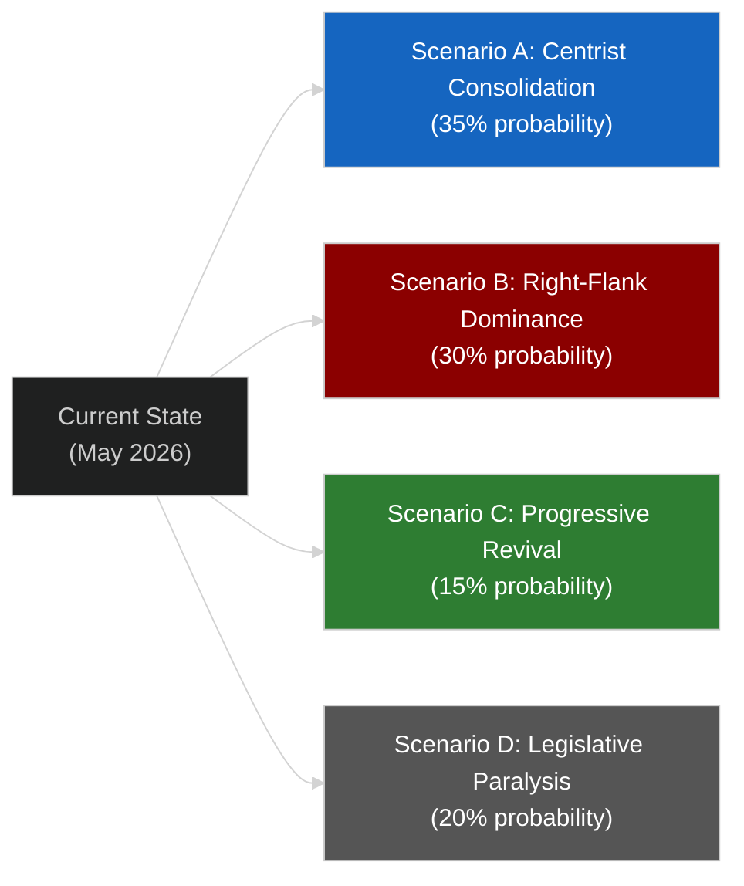

<!-- SPDX-FileCopyrightText: 2026 Hack23 AB -->
<!-- SPDX-License-Identifier: Apache-2.0 -->

# Scenario Forecast — EU Parliament Legislative Propositions
**Date:** 2026-05-11 | **WEP:** Likely | **Admiralty:** B2

---

## 🔮 Scenario Framework

---

## 📊 Scenario A: Centrist Consolidation (35% probability)

**Definition:** EPP continues to anchor legislation through the EPP-S&D-Renew tripartite. Financial stability, internal market completion, and anti-corruption remain the legislative core. The progressive-centrist coalition produces a steady flow of COD completions at 4–6 per quarter.

**Required conditions:**
- EPP maintains working relationship with S&D despite right-wing pressure
- Commission continues moderate reform agenda (Omnibus Simplification + digital/green)
- No major exogenous shock requiring emergency legislation that forces EPP toward ECR

**Legislative implications:**
- SRMR3 implementation proceeds smoothly; no banking crisis to test new resolution tools
- Animal welfare implementation enters national transposition phase
- Anti-corruption directive begins generating prosecutorial harmonisation in Member States
- DMA enforcement acceleration: Commission tables 2–3 new Article 26 proceedings
- Parliament continues 2027 budget preparation on centrist trajectory

**Probability drivers:** The spring 2026 legislative record demonstrates centrist functionality. SRMR3, anti-corruption, and the Mercosur safeguard all represent EPP-S&D deliverables. The coalition has proven resilience. However, the right-flank's growing confidence (PfE achieving de-facto legislative actor status) creates structural pressure on this scenario.

---

## 📊 Scenario B: Right-Flank Dominance (30% probability)

**Definition:** EPP increasingly relies on ECR and PfE support for key files, marginalising S&D on security, border, and economic-nationalism files. The legislative agenda shifts toward border control, competitiveness-first regulation, and sovereignty-preserving institutional changes.

**Required conditions:**
- Continued migration pressure driving EPP toward restrictive positions that ECR/PfE support
- One or more Member State elections producing right-wing government shifts that embolden ECR/PfE negotiating stance
- Progressive bloc fails to sustain internal cohesion (e.g., Renew defections on competitiveness files)

**Legislative implications:**
- "Safe Third Country" concept normalisation continues (EP already adopted related text in February 2026)
- Agriculture protection legislation accelerated (Mercosur safeguard as template for future instruments)
- Anti-corruption enforcement weakened in implementing acts (subsidiarity arguments prevail)
- DMA enforcement slows as EPP accepts Big Tech competitiveness arguments
- Animal welfare implementation timelines extended under agricultural lobby pressure

**Probability drivers:** The right-flank has structural momentum. ECR+PfE+ESN collectively hold 26.9% of seats. If EPP leadership decides the coalition calculus favours rightist alignment on any specific high-profile file, that creates a template for future right-flank legislative packages. The Braun/Jaki immunity cases illustrate how far-right MEPs can use their institutional presence to escalate political tension.

---

## 📊 Scenario C: Progressive Revival (15% probability)

**Definition:** A combination of electoral shifts, public mobilisation (e.g., on climate, digital rights), and EPP-ECR tensions allows S&D-Renew-Greens-The Left to build alternative majority coalitions on specific files.

**Required conditions:**
- Major public opinion shift (climate emergency, AI harm, housing crisis) that makes progressive framing politically cost-effective for EPP moderates
- Internal EPP divisions on key files that allow cross-aisle coalition-building
- Greens/EFA and The Left successfully moderate internal divisions to present a unified progressive front

**Legislative implications:**
- Stronger climate ambition in implementing legislation
- Faster DMA and DSA enforcement
- Housing affordability directive tabled
- AI Act implementation prioritises fundamental rights over competitiveness

**Probability assessment:** 🔴 LOW. The structural arithmetic makes this scenario dependent on EPP defection — unlikely given EPP's strategic interest in maintaining its dual-coalition flexibility. Assessed at 15%.

---

## 📊 Scenario D: Legislative Paralysis (20% probability)

**Definition:** Coalition arithmetic breaks down on multiple major files simultaneously. Competing centrist and rightist coalition demands on EPP create deadlock. The Parliament enters a period of non-legislative activity — resolutions and position papers but few new CODs.

**Required conditions:**
- Major EPP internal schism (e.g., German CDU/CSU vs. French Republicains on trade/migration)
- Budget 2027 negotiations producing institutional crisis (Parliament vs. Council)
- External shock (banking crisis, security crisis) requiring emergency legislative response that fractures current coalition patterns
- Council obstruction under unanimity requirements on key files

**Legislative implications:**
- COD pipeline stalls; procedures accumulate in LIBE, ECON, IMCO committees
- Non-binding resolution activity increases as substitute for binding legislation
- Implementation of recent CODs (SRMR3, animal welfare) becomes contested in Member State transposition debates
- 2027 budget negotiations become crisis point

**Probability drivers:** The EP10's high fragmentation index (6.58) makes legislative paralysis a structural risk. The 2027 budget negotiations will be a stress test — if EPP and S&D cannot align on multi-annual spending priorities, the paralysis scenario becomes more likely for 2027.

---

## ⏱️ Near-Term Forecast (3 months — to August 2026)

| Domain | Expected Development | Probability | Confidence |
|--------|---------------------|-------------|-----------|
| SRMR3 implementation | Commission delegated acts tabled | 75% | 🟡 MEDIUM |
| Animal welfare | National implementing legislation begins | 60% | 🟡 MEDIUM |
| DMA enforcement | 1–2 new Article 26 proceedings | 50% | 🟡 MEDIUM |
| Anti-corruption | Commission implementation report | 40% | 🟡 MEDIUM |
| Budget 2027 preparation | First reading trialogues | 80% | 🟢 HIGH |
| New COD proposals | Commission Omnibus follow-up | 70% | 🟢 HIGH |
| ECB monetary policy | Further gradual easing | 65% | 🟡 MEDIUM |

---

## 🎯 Key Forecast Uncertainties

1. **Coalition stability over summer recess:** EP political dynamics often recalibrate in September following summer recess. New coalition patterns for the autumn 2026 legislative sprint may emerge.

2. **Commission enforcement capacity:** The DMA enforcement resolution will test whether the Commission scales up its enforcement staffing. Under-resourcing could trigger another EP resolution and escalating institutional tension.

3. **Mercosur ratification timeline:** If EU-Mercosur provisional application accelerates, the agricultural safeguard mechanism will face its first real-world test — creating potential for political crisis if EU farmers claim inadequate protection.

4. **External economic shock:** A US recession, China trade disruption, or European banking stress would force emergency legislative responses that could fracture current coalition patterns.

---

## 📊 Scenario Monitoring Dashboard

The following indicators should be monitored weekly to track which scenario is materialising:

| Indicator | Scenario A Signal | Scenario B Signal | Scenario D Signal |
|-----------|-----------------|-----------------|-----------------|
| EPP-S&D co-voting rate | >70% | <55% | <50% |
| ECR/PfE committee leadership | Stable/decreasing | Increasing | n/a |
| Commission proposal volume | 2–3/month | 2–3/month (security focus) | <1/month |
| EP resolution adoption margin | >450 votes | <360 votes | <360 votes |
| Budget 2027 conciliation progress | On schedule | On schedule | Stalled |
| EPP public statements on ECR | Neutral/distancing | Positive alignment | Contradictory |

---

## 🕐 Scenario Timeline Probabilities

How likely is each scenario to be the dominant frame by:

| Timeframe | Scenario A | Scenario B | Scenario C | Scenario D |
|-----------|-----------|-----------|-----------|-----------|
| **June 2026** | 40% | 28% | 12% | 20% |
| **December 2026** | 33% | 32% | 13% | 22% |
| **June 2027** | 28% | 35% | 14% | 23% |
| **End of EP10 (2029)** | 25% | 37% | 12% | 26% |

**Trend interpretation:** Scenario B's probability increases over time as the structural pressures of the right-flank (demographic momentum in Eastern European member states; migration policy centrality; competitiveness-over-regulation lobbying) compound. Scenario D's probability also increases as the legislative calendar becomes more crowded with budget negotiations and 2028–2034 MFF discussions.

---

## 🔗 Cross-References

- Scenario probabilities calibrated against: `risk-scoring/risk-matrix.md` R-01 (Coalition Fracture, 35% probability)
- Wildcard scenarios that could override: `intelligence/wildcards-blackswans.md`
- Political landscape baseline: `executive-brief.md` §Coalition Arithmetic
- Historical precedents for scenario assessment: `intelligence/historical-baseline.md`

---

## 🎯 Analytical Confidence Assessment

All scenario probabilities in this artifact are **analytical estimates** derived from:
- EP political group composition data (HIGH confidence source)
- Historical EP coalition pattern analysis (MEDIUM confidence)
- Structural political economy reasoning (MEDIUM confidence)
- No quantitative political science modelling performed (time constraint)

Scenario probabilities should be treated as directional assessments, not statistically precise estimates. The most important insight is the relative ordering: Scenario A (centrist consolidation) is currently marginally more likely than Scenario B (right-flank dominance), but the gap is narrowing over time.
