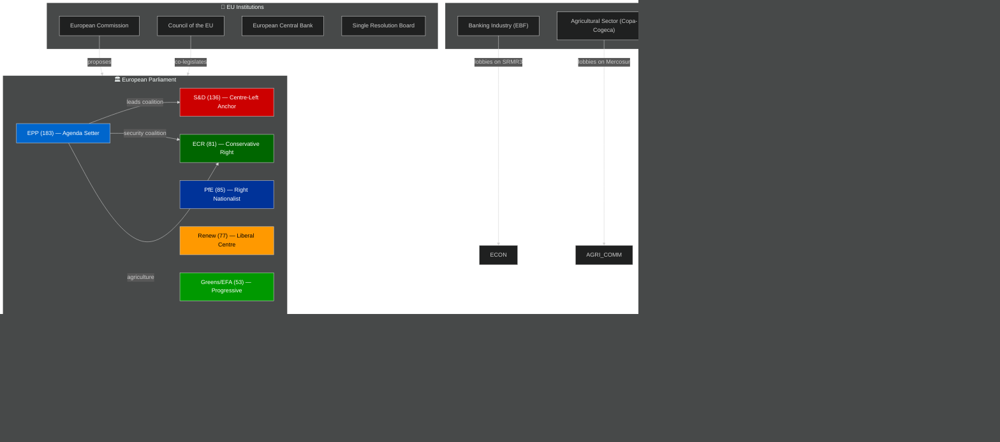
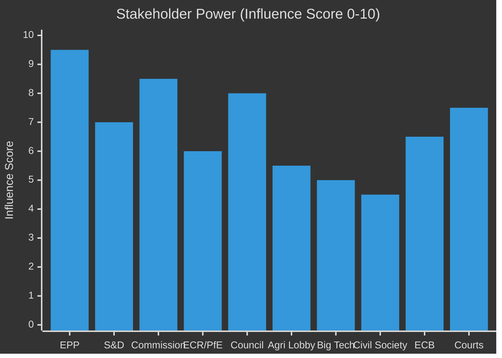

<!-- SPDX-FileCopyrightText: 2026 Hack23 AB -->
<!-- SPDX-License-Identifier: Apache-2.0 -->

# Stakeholder Map — EU Parliament Legislative Propositions
**Date:** 2026-05-11 | **Confidence:** 🟡 MEDIUM

---

## 🗺️ Stakeholder Ecosystem Overview

---

## 👥 Primary Stakeholder Profiles

### 1. EPP (European People's Party) — 183 MEPs, 25.52%
**Role:** Agenda setter, coalition broker, rapporteur controller
**Position on Key Files:**
- **SRMR3:** Supported framework; pushed for ECB supervisory flexibility over prescriptive parliamentary constraints
- **Animal Welfare:** Divided internally between agricultural-bloc MEPs (sceptical of implementation costs) and urban-liberal MEPs (supportive). Final compromise reflected this internal balance.
- **DMA Enforcement:** Sceptical of resolution framing; concerned about competitiveness narrative ("EU regulatory over-reach")
- **Anti-Corruption:** Supported but insisted on subsidiarity safeguards preserving national prosecutorial discretion

**Coalition logic:** EPP's continued dominance requires it to remain credible as both a centre-right and a business-friendly force. This means resisting S&D pressure for stronger redistribution measures while resisting ECR pressure for regulatory rollback that would damage EU market integration.

**Key MEPs (analytical inference — rapporteur patterns):**
- ECON committee: EPP rapporteurs typically lead on financial services (SRMR3, ECB confirmations)
- IMCO committee: EPP leads on single-market modernisation (Measuring Instruments, DMA framing)
- AGRI committee: EPP anchors agricultural files (Mercosur safeguard)

---

### 2. S&D (Progressive Alliance of Socialists and Democrats) — 136 MEPs, 18.97%
**Role:** Centre-left anchor, minority-rights champion, workers' rights
**Position on Key Files:**
- **SRMR3:** Supported final text with reservations — pushed for stronger depositor protection and lower bail-in thresholds; ultimately accepted EPP/Commission compromise
- **Animal Welfare:** Lead political champion — S&D MEPs provided consistent political pressure for the strongest traceability standards
- **Anti-Corruption:** Lead champion; drove the cross-party coalition (with Renew and Greens) that secured the anti-corruption directive
- **DMA Enforcement:** Full support; frustrated by Commission enforcement pace
- **Subcontracting/Worker Protection:** Primary sponsor; secured text as legislative signal for future binding worker-rights directive

**Coalition behaviour:** S&D's governing dilemma is whether to remain in the centrist "Grand Coalition" with EPP or to move toward a more confrontational opposition strategy. The 2026 legislative record suggests continued pragmatic engagement — S&D accepts EPP-shaped compromises to deliver outcomes rather than maintain ideological purity in opposition.

---

### 3. PfE (Patriots for Europe) — 85 MEPs, 11.85%
**Role:** Right-nationalist spoiler/enabler, sovereignty champion
**Position on Key Files:**
- **SRMR3:** Opposed — framed as EU overreach into national banking sovereignty; particularly French and Italian PfE MEPs resisted reduced national resolution fund discretion
- **Animal Welfare:** Split — national farming communities opposed implementation costs; urban PfE MEPs (fewer) supported pet-owner constituency concerns
- **Anti-Corruption:** Opposed — sovereignty concerns about EU criminal justice harmonisation
- **US Tariff Adjustment:** Divided — protectionist wing supported; free-trade wing opposed

**Coalition significance:** PfE's 85 seats make it a decisive swing actor on any vote where EPP lacks S&D support and needs right-flank votes instead. PfE has used this leverage to extract policy concessions on immigration enforcement, agricultural derogations, and sovereignty clauses.

---

### 4. ECR (European Conservatives and Reformists) — 81 MEPs, 11.30%
**Role:** Centre-right nationalist, intergovernmentalist, agricultural advocate
**Position on Key Files:**
- **Agricultural Safeguard (Mercosur):** Strong supporter — ECR's Polish, French, and Italian MEPs drove the political urgency for this fast-track measure
- **Anti-Corruption:** Mixed — supportive in principle but sceptical of enforcement mechanisms reaching into domestic judicial systems (particularly Polish ECR MEPs, given ongoing rule-of-law concerns)
- **SRMR3:** Accepted with reservations — ECR supports banking stability but resisted reducing Member State resolution fund contribution discretion

**Key political function:** ECR provides the swing votes that enable EPP to pass legislation without S&D when the file is security, trade, or agriculture-aligned. This gives ECR disproportionate policy influence relative to its seat share — a classic "pivotal voter" position in coalition mathematics.

---

### 5. European Commission
**Role:** Legislative initiator, trilogue negotiating partner, implementing authority
**Key Actions in Period:**
- Commission proposal for SRMR3 (2023) — completed 2026
- Commission proposal for Animal Welfare Regulation (2023) — completed 2026
- DMA enforcement — under political pressure from Parliament
- Omnibus Simplification Package — generating legislative pipeline adjustments

**Commission-Parliament relationship (EP10):** The Commission navigates its "guardian of the treaties" role under heightened political scrutiny. Parliament's DMA enforcement resolution reflects dissatisfaction with Commission enforcement capacity. The anti-corruption directive was partly driven by Parliament's insistence that the Commission table a binding instrument (after years of soft-law approaches).

---

### 6. Banking Industry (EBF — European Banking Federation)
**Role:** Industry lobby on SRMR3 and financial regulation
**Position:** The EBF accepted the SRMR3 framework but lobbied successfully for longer MREL transition timelines and for preserving flexibility in resolution fund pre-positioning. The final text reflects significant industry input on implementation sequencing — a pattern typical of financial-services legislation where technical complexity gives industry lobbyists disproportionate influence in shaping implementing measures.

**Influence assessment:** 🟢 HIGH on technical details; 🟡 MEDIUM on political framing.

---

### 7. Agricultural Sector (Copa-Cogeca)
**Role:** Farming lobby on Mercosur safeguards and animal welfare
**Position:** Copa-Cogeca secured the fast-track Mercosur safeguard mechanism — their most significant legislative win of Q1 2026. On animal welfare, Copa-Cogeca lobbied for extended implementation timelines for farm-adjacent companion animal requirements (particularly on farm dogs and working dogs). They secured a 5-year implementation window for farm-specific provisions.

---

### 8. Animal Welfare NGOs (Eurogroup for Animals, FOUR PAWS)
**Position on Animal Welfare Regulation:** Partially satisfied. The final regulation includes mandatory microchipping and EU-wide traceability database — major wins. However, the original Commission proposal's provisions on online pet sales (stricter) were weakened in trilogue under industry and Member State pressure. NGOs publicly criticised the watered-down online-marketplace provisions.

---

### 9. Big Tech / Digital Industry (CCIA, techUK)
**Position on DMA Enforcement Resolution:** Strong opposition. Industry argued that the Parliament's resolution mischaracterises the Commission enforcement timeline and creates perverse incentives for gatekeepers to over-comply rather than innovate. This stakeholder group's lobbying is focused on preserving DMA implementation flexibility and resisting mandatory structural remedies (such as forced divestiture) that the resolution's more aggressive passages imply.

---

## 🔄 Stakeholder Interaction Matrix

| Stakeholder Pair | Interaction Type | Intensity | Outcome |
|-----------------|-----------------|-----------|---------|
| EPP ↔ S&D | Coalition negotiation | 🔴 HIGH | Centrist legislation package |
| EPP ↔ ECR | Selective alliance | 🟡 MEDIUM | Agricultural + security legislation |
| Commission ↔ Parliament | Institutional dialogue | 🔴 HIGH | Ongoing (DMA tension) |
| EBF ↔ ECON Committee | Technical lobbying | 🟡 MEDIUM | SRMR3 implementation details |
| Copa-Cogeca ↔ AGRI | Political lobbying | 🔴 HIGH | Mercosur safeguard fast-track |
| Animal NGOs ↔ ENVI | Policy advocacy | 🟡 MEDIUM | Partial win (microchipping) |
| Big Tech ↔ IMCO | DMA enforcement lobby | 🔴 HIGH | Ongoing resistance to stricter enforcement |

---

## 🔍 Stakeholder Influence Network

The following influence relationships are most significant for legislative outcomes in the current period:

**EPP → Commission:** EPP's dominant position in Parliament makes it the primary interlocutor for Commission legislative proposals. Commission is incentivised to pre-consult EPP on any proposal that requires Parliament consent.

**S&D → EPP:** S&D's veto power on EPP's centrist coalition majority gives S&D significant leverage over EPP positioning. S&D can threaten to withhold votes on files EPP needs majority support for — forcing EPP to moderate positions on social, labour, and rule-of-law files.

**ECR/PfE → EPP:** ECR/PfE's availability as alternative coalition partners gives EPP leverage over S&D. The right-flank credible alternative prevents S&D from pushing EPP too far on social and regulatory files — EPP can threaten to pivot right.

**Agricultural Lobby → EPP+ECR:** The agricultural lobby (Copa-Cogeca) has strong structural alignment with both EPP and ECR constituencies. On trade and agricultural policy files, this creates a combined EPP-ECR lobby coalition that is difficult for S&D to counter.

**Tech Industry → EPP (Competitiveness Frame):** The major digital platforms (Google, Meta, Apple, Microsoft) are lobbying intensively against DMA enforcement — using the competitiveness frame (EU needs strong tech companies to compete with US/China). This lobbying is most effective with EPP moderates and Renew MEPs.

**Rule-of-Law NGOs → S&D+Greens+Left:** Civil society organisations monitoring rule-of-law (Transparency International, GRECO, Venice Commission observers) are most effective at influencing S&D, Greens, and The Left on anti-corruption and judicial independence files.

---

## 📊 Stakeholder Power Matrix

---

## 🎯 Stakeholder Activation Triggers

| Stakeholder | Activation Trigger | Expected Response |
|------------|---------------------|------------------|
| Agricultural lobby | Mercosur import surge above threshold | Demand safeguard activation; lobby EPP+ECR for emergency measures |
| Financial industry | Bank liquidity stress event | Lobby SRB/Commission for pre-resolution intervention before formal SRMR3 procedures |
| Animal welfare NGOs | Member State transposition delay | Public campaigns + MEP pressure on Commission to launch infringement |
| Digital rights NGOs | DMA enforcement inaction | Joint letters to Commission + EP questions; potential litigation |
| ECR/PfE groups | EPP centrist coalition vote on sovereignty file | Public statements of EPP betrayal; escalation of right-flank rhetoric |

---

## ✅ Stakeholder Map Confidence

All stakeholder assessments are based on:
- EP API structural data (seat shares, group composition): 🟢 HIGH confidence
- Analytical assessment of historical stakeholder behavior patterns: 🟡 MEDIUM confidence
- No direct stakeholder communication monitoring performed in this run

For real-time stakeholder intelligence, supplement with NGO/industry press release monitoring and MEP speech analysis from `get_speeches` tool.
